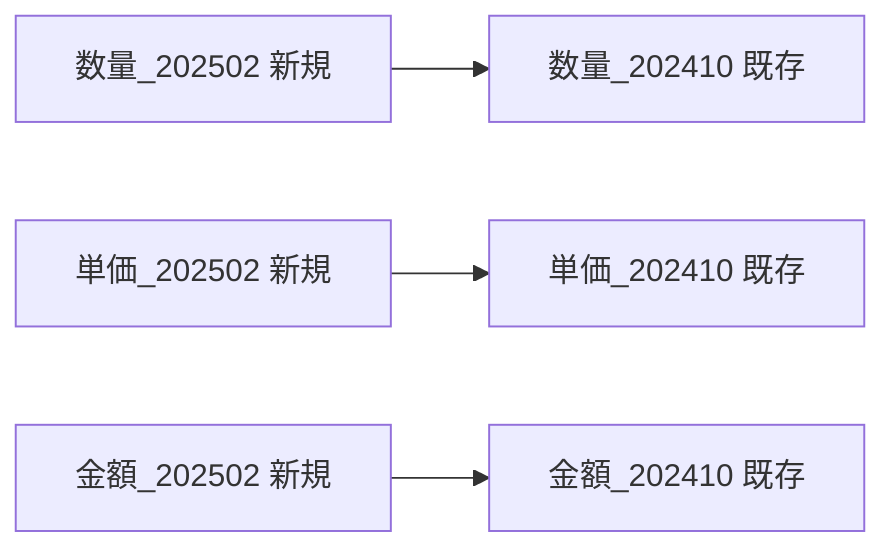
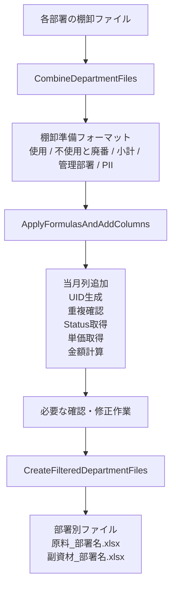
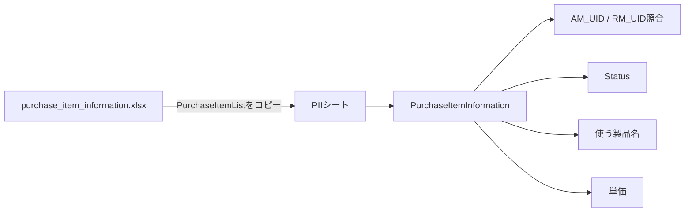
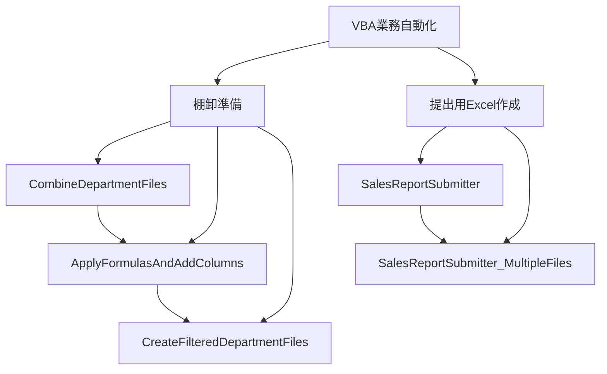

このチャットでは、Excel VBAを使った業務処理について、主に以下の4つのマクロを確認・整理した。

1. `ApplyFormulasAndAddColumns`
    - 棚卸準備ファイルに年月列・各種計算式を追加する
2. `CombineDepartmentFiles`
    - 部署別の棚卸ファイルを1つに統合する
3. `CreateFilteredDepartmentFiles`
    - 統合・加工後の棚卸ファイルを管理部署ごとに再分割する
4. `SalesReportSubmitter` / `SalesReportSubmitter_MultipleFiles`
    - Power Queryや接続を削除した「提出用」Excelファイルを作成する

これらは完全に独立したマクロではなく、特に最初の3つは**棚卸業務の一連の処理フロー**としてつながっている。


## 1. `ApplyFormulasAndAddColumns`

### 目的

`ApplyFormulasAndAddColumns` は、原料または副資材の棚卸準備ファイルを選択し、指定年月に対応する

- 数量
- 単価
- 金額

の列を追加するとともに、UIDや重複確認、Purchase Item Information参照などの計算式を自動設定するマクロである。

### メイン処理

最初にファイル選択ダイアログを表示する。

初期フォルダは以下。

```text
C:\Users\kyoupatty029\projects\kpm\dev\internal_systems\inventory_prep_macro\test_files
```

対象ファイルには、

```text
棚卸フォーマット
```

という文字列が含まれている必要がある。

さらにファイル名から、

```text
原料
```

または

```text
副資材
```

を判定する。

どちらも含まれていなければ処理を中断する。

その後、

```text
YYYYMM
```

形式で対象年月を入力する。

例：

```text
202502
```

### 対象テーブル

副資材の場合：

|シート|テーブル|
|---|---|
|使用|`棚卸表_副資材_使用`|
|不使用と廃番|`棚卸表_副資材_不使用と廃番`|

原料の場合：

|シート|テーブル|
|---|---|
|使用|`棚卸表_原料_使用`|
|不使用と廃番|`棚卸表_原料_不使用と廃番`|

使用・不使用と廃番の双方に対して同じ系統の処理を行う。

## 2. 年月列の追加

`ProcessTable` および `ProcessTableRawMaterial` では、入力された年月から4か月前を算出する。

例えば、

```text
入力年月：202502
```

なら、

```text
4か月前：202410
```

となる。

そのうえで、

```text
数量_202502
単価_202502
金額_202502
```

を、それぞれ対応する

```text
数量_202410
単価_202410
金額_202410
```

の左側へ追加する。

処理は共通関数、

```vba
AddColumnBefore
```

にまとめられている。

重要なのは、**4か月前の列が存在することを新規列追加の基準にしている**点である。



すでに対象年月の列が存在する場合は、新たには追加しない。

## 3. 副資材に設定する計算式

副資材では `AM_UID` を基準としてPurchase Item Informationとの照合を行う。

### AM_UID

```excel
=TEXTJOIN("_", FALSE, [@コード],[@発注先])
```

つまり、

```text
コード + "_" + 発注先
```

を一意識別子として使用する。

### Code_Cnt

```excel
=COUNTIF([コード],[@コード])
```

同じコードが棚卸テーブル内に何件存在するかを数える。

### AM_UID_Cnt

```excel
=COUNTIF([AM_UID],[@[AM_UID]])
```

同じ `AM_UID` が現在の棚卸表内に何件存在するかを数える。

### AM_Dup_Cnt_PII

```excel
=COUNTIF(PII!PurchaseItemInformation[AM_UID], [@[AM_UID]])
```

`PII` シートの `PurchaseItemInformation` テーブル内に、現在の `AM_UID` が何件存在するかを確認する。

### Max_Cnt

```excel
=MAX([@[Code_Cnt]:[AM_Dup_Cnt_PII]])
```

`Code_Cnt` から `AM_Dup_Cnt_PII` までの範囲で最大値を取得する。

この値によって、コード・UID・PII側のいずれかに重複や複数候補が存在するケースを検出しやすくしている。

### Current_Status

```excel
=INDEX(
    INDIRECT("PII!PurchaseItemInformation"),
    MATCH(
        [@[AM_UID]],
        INDIRECT("PII!PurchaseItemInformation[AM_UID]"),
        0
    ),
    MATCH(
        "Status",
        INDIRECT("PII!PurchaseItemInformation[#見出し]"),
        0
    )
)
```

`AM_UID` に一致する商品の `Status` を `PurchaseItemInformation` から取得する。

### Product_Reference

```excel
=INDEX(
    INDIRECT("PII!PurchaseItemInformation"),
    MATCH(
        [@[AM_UID]],
        INDIRECT("PII!PurchaseItemInformation[AM_UID]"),
        0
    ),
    MATCH(
        "使う製品名",
        INDIRECT("PII!PurchaseItemInformation[#見出し]"),
        0
    )
)
```

同じく `AM_UID` を使って、

```text
使う製品名
```

を取得する。

### 単価

対象年月の単価列には、

```excel
=INDEX(
    INDIRECT("PII!PurchaseItemInformation"),
    MATCH(
        [@[AM_UID]],
        INDIRECT("PII!PurchaseItemInformation[AM_UID]"),
        0
    ),
    MATCH(
        "単価",
        INDIRECT("PII!PurchaseItemInformation[#見出し]"),
        0
    )
)
```

を設定する。

### 金額

```excel
=[@[数量_YYYYMM]] * [@[単価_YYYYMM]]
```

例えば202502なら、

```excel
=[@[数量_202502]] * [@[単価_202502]]
```

となる。

## 4. 原料に設定する計算式

原料では基本構造は副資材と同じだが、識別子として `RM_UID` を使用する。

### RM_UID

現在のコードでは、

```excel
=TEXTJOIN("_", FALSE, [@コード],[@[入目/規格]],[@発注先])
```

となっている。

つまり、

```text
コード
＋ 入目/規格
＋ 発注先
```

を組み合わせている。

副資材との違いは以下。

|項目|副資材|原料|
|---|---|---|
|UID|`AM_UID`|`RM_UID`|
|UID構成|コード＋発注先|コード＋入目/規格＋発注先|
|UID件数|`AM_UID_Cnt`|`RM_UID_Cnt`|
|PII重複確認|`AM_Dup_Cnt_PII`|`RM_Dup_Cnt_PII`|

その他、

- `Code_Cnt`
- `Max_Cnt`
- `Current_Status`
- `Product_Reference`
- 単価
- 金額

については、`AM_UID` を `RM_UID` に置き換えた構造となっている。

## 5. `CopyFormat`

新規追加した

```text
数量_YYYYMM
単価_YYYYMM
金額_YYYYMM
```

について、右隣の既存年月列から書式をコピーする。

対象は、

```vba
Array("数量_", "単価_", "金額_")
```

で定義されている。

新規列の右側に列が存在する場合のみ、

```vba
PasteSpecial Paste:=xlPasteFormats
```

を使って書式を設定する。

## 6. `ColumnExists`

指定した列名がテーブルに存在するか確認する共通関数。

```vba
Function ColumnExists(tbl As ListObject, colName As String) As Boolean
```

これにより、

- 同じ年月列を二重追加しない
- 4か月前列がない場合は追加処理をしない

といった制御を行っている。

---

# `CombineDepartmentFiles`

## 7. 目的

`CombineDepartmentFiles` は、部署別に存在する複数の棚卸ファイルを統合し、後続処理に使用する

```text
棚卸準備フォーマット
```

を作成するマクロである。

大きく見ると、

```text
部署別ファイル
↓
一括統合
↓
棚卸準備フォーマット
```

という位置づけになる。

## 8. フォルダ選択

フォルダ選択ダイアログを表示し、選択されたフォルダについて、

```vba
selectedFolderName = GetFolderName(folderPath)
parentFolderName = GetParentFolderName(folderPath)
```

で、

- 選択フォルダ名
- 親フォルダ名

を取得する。

これらを使って出力ファイル名を作る。

```text
棚卸準備フォーマット_[選択フォルダ名]_[親フォルダ名].xlsx
```

出力先は、

```vba
ThisWorkbook.Path
```

すなわちマクロブックと同じフォルダ。

## 9. 統合先ブック

同名の統合ファイルがすでに存在する場合は開き、存在しない場合は新規作成する。

その中に、

```text
使用
不使用と廃番
```

シートを用意する。

## 10. フォルダ内ファイルの結合

対象は、

```vba
Dir(folderPath & "\*.xlsx")
```

なので、選択フォルダ直下の `.xlsx` ファイル。

各ブックについて、

```text
使用
不使用と廃番
```

を探す。

### 最初のファイル

`UsedRange` 全体をコピーするため、ヘッダーも含まれる。

```vba
wsSource.UsedRange.Copy
```

コピー方法は、

```text
値
＋
書式
```

である。

### 2ファイル目以降

ヘッダーを除外する。

```vba
wsSource.UsedRange.Offset(1, 0).Resize(wsSource.UsedRange.Rows.Count - 1)
```

その結果、

```text
ヘッダー
データ1
データ2
データ3
...
```

という1つの表へ統合される。

## 11. 統合結果のテーブル化

統合後、

```vba
CreateTable
```

によって各シートをExcelテーブル化する。

テーブル名は、

```text
棚卸表_[親フォルダ名]_使用
棚卸表_[親フォルダ名]_不使用と廃番
```

となる。

テーブルスタイルは、

```vba
TableStyleLight8
```

である。

## 12. 小計シート

マクロブック自身、

```vba
ThisWorkbook
```

の「小計」シートを、統合先ブックへコピーする。

コピー内容は、

```vba
xlPasteAll
```

なので値だけではなく、書式や数式なども含まれる。

## 13. 管理部署シート

`CopyManagementDepartmentList` によって管理部署一覧をコピーする。

選択フォルダによって参照するテーブルを切り替える。

|選択フォルダ|コピーするテーブル|
|---|---|
|本社・6丁目|`管理部署一覧表_本社・6丁目`|
|石切|`管理部署一覧表_石切`|

コピー先シート名は、

```text
管理部署
```

で固定。

値と書式をコピーした後、再度テーブル化する。

## 14. PIIシート

以下の固定ファイルを開く。

```text
C:\Users\kyoupatty029\projects\kpm\inventory\purchase_item_information.xlsx
```

その中の、

```text
PurchaseItemList
```

シートを丸ごとコピーする。

コピー後のシート名は、

```text
PII
```

へ変更する。

この `PII` シートは、先述した `ApplyFormulasAndAddColumns` の、

```text
Current_Status
Product_Reference
単価
AM_Dup_Cnt_PII
RM_Dup_Cnt_PII
```

などの計算式から参照される。

つまり両マクロは明確に連携している。

## 15. 最終シート順

処理後のブックは以下の順序に整理される。

|順番|シート|
|--:|---|
|1|小計|
|2|使用|
|3|不使用と廃番|
|4|管理部署|
|5|PII|

最後に保存して、

```text
すべてのデータが結合されました。
```

と表示する。

---

# `CreateFilteredDepartmentFiles`

## 16. 目的

`CreateFilteredDepartmentFiles` は、統合・加工済み棚卸ファイルから、

```text
管理部署
```

ごとにデータを抽出し、再度部署別Excelファイルへ分割するマクロ。

全体として、

```text
統合前：部署別
↓
CombineDepartmentFiles
↓
統合
↓
ApplyFormulasAndAddColumns
↓
加工
↓
CreateFilteredDepartmentFiles
↓
再び部署別
```

という往復構造になっている。

## 17. グループ化・非表示列の処理

ファイルを開く前に、

```text
コピー元のグループ化を再表示しますか？
```

と確認する。

「はい」の場合、

```vba
wsSourceUsage.Cells.EntireColumn.Hidden = False
wsSourceUnused.Cells.EntireColumn.Hidden = False
```

を実行する。

そのため実際には、Excelのアウトラインそのものを解除しているわけではなく、

**使用・不使用と廃番シートの非表示列をすべて表示した状態でコピーする処理**

になっている。

## 18. 管理部署一覧の取得

`管理部署` シートの、

```text
C2:C最終行
```

を対象に部署名を取得する。

`Collection` のKey機能を使い、重複する部署名を除外している。

つまりC列が部署名一覧の実体となっている。

## 19. コピー元データ

対象は、

```vba
wsSourceUsage.Range("A1").CurrentRegion
wsSourceUnused.Range("A1").CurrentRegion
```

である。

さらに1行目から、

```text
管理部署
```

という列を検索する。

この列を使って各部署をフィルターする。

## 20. 原料・副資材判定

ファイル名に、

```text
原料
```

が含まれていれば、

```vba
fileType = "原料"
```

副資材なら、

```vba
fileType = "副資材"
```

となる。

どちらも含まれていなければ処理中止。

## 21. 部署別ファイル生成

各部署について新規ブックを作り、

```text
小計
使用
不使用と廃番
```

の3シートを作成する。

### 使用

管理部署列で、

```vba
Criteria1:=departmentName
```

としてフィルター。

可視セルだけをコピーする。

その後、

```text
棚卸表_原料_使用
```

または

```text
棚卸表_副資材_使用
```

としてテーブル化する。

### 不使用と廃番

同様に、

```text
棚卸表_原料_不使用と廃番
```

または

```text
棚卸表_副資材_不使用と廃番
```

としてテーブル化する。

### 小計

コピー元の「小計」シートを全セルコピーする。

## 22. 出力ファイル名

保存先は、

```vba
ThisWorkbook.Path
```

である。

ファイル名は、

```text
原料_[部署名].xlsx
```

または、

```text
副資材_[部署名].xlsx
```

になる。

例えば、

```text
副資材_製造部.xlsx
原料_品質管理部.xlsx
```

のような形になる。

最後に元ブックのAutoFilterを解除して処理を終了する。

---

# 棚卸関連3マクロの関係

3本を一体として見ると、棚卸処理の設計は以下のようになっている。



役割を簡潔に整理すると以下。

|マクロ|役割|入力|出力|
|---|---|---|---|
|`CombineDepartmentFiles`|統合|部署別ファイル群|棚卸準備フォーマット|
|`ApplyFormulasAndAddColumns`|加工|棚卸準備フォーマット|計算・参照列追加済みファイル|
|`CreateFilteredDepartmentFiles`|分割|加工済み棚卸表|部署別ファイル|

---

# `SalesReportSubmitter`

## 23. 目的

こちらは棚卸処理とは別系統で、

**Power Queryを使ったExcelファイルからクエリと接続を削除し、データだけを残した「提出用ファイル」を作る**

ためのマクロ。

元ファイルは変更せず、コピーを作ってから加工する。

## 24. 単一ファイル版

`SalesReportSubmitter` では、ファイル選択ダイアログからExcelファイルを1つ選ぶ。

コピー先は、

```text
提出用_[元ファイル名].xlsx
```

となる。

例えば、

```text
sales_report.xlsx
```

なら、

```text
提出用_sales_report.xlsx
```

となる。

### ファイル複製

```vba
FileCopy selectedFilePath, destinationFilePath
```

によって元ファイルをそのまま複製する。

### Power Query削除

```vba
For Each pq In wb.Queries
    wb.Queries(pq.Name).Delete
Next pq
```

でブック内のPower Queryを削除する。

### Workbook接続削除

```vba
For Each conn In wb.Connections
    conn.Delete
Next conn
```

でExcel側の接続情報を削除する。

その後、

```vba
wb.Close SaveChanges:=True
```

で保存する。

重要なのは、

**クエリや接続を削除しても、既にワークシートへ出力されているデータは保持する**

という設計である。

---

# `SalesReportSubmitter_MultipleFiles`

## 25. 複数ファイル版への拡張

単一ファイル版を複数ファイル対応にしたもの。

最も重要な変更は、

```vba
fd.AllowMultiSelect = True
```

である。

選択されたすべてのファイルについて、

```vba
For Each selectedFile In fd.SelectedItems
```

で繰り返し処理する。

### 処理内容

各ファイルについて、

1. 元パスを取得
2. 拡張子取得
3. ファイル名取得
4. `提出用_` ファイル作成
5. ファイルコピー
6. コピーを開く
7. Power Query削除
8. Workbook接続削除
9. 保存して閉じる

という処理を行う。

処理中は、

```vba
Application.ScreenUpdating = False
Application.DisplayAlerts = False
```

として画面更新・警告を抑制している。

最後に元へ戻す。

## 26. 複数ファイル版のファイル名生成

複数ファイル版では元の拡張子を維持しようとしている。

概念的には、

```text
元フォルダ
└─ 元ファイル.xlsx

↓

元フォルダ
├─ 元ファイル.xlsx
└─ 提出用_元ファイル.xlsx
```

となる。

処理した各ファイルについて、

```vba
Debug.Print "処理完了: " & destinationFilePath
```

でイミディエイトウィンドウへ処理結果を出力する。

最後に、

```text
すべてのファイルを処理しました。
```

と表示する。

---

# 全マクロの役割比較

|モジュール / マクロ|主目的|主な処理|
|---|---|---|
|`CombineDepartmentFiles`|棚卸ファイル統合|部署別ファイルを使用・不使用と廃番に統合|
|`ApplyFormulasAndAddColumns`|棚卸データ加工|当月列追加、UID、重複確認、PII参照|
|`CreateFilteredDepartmentFiles`|棚卸ファイル分割|管理部署ごとにExcelを再作成|
|`SalesReportSubmitter`|提出用ファイル作成|1ファイルのPQ・接続を削除|
|`SalesReportSubmitter_MultipleFiles`|提出用ファイル一括作成|複数ファイルのPQ・接続を一括削除|

# 現在の設計から読み取れる業務構造

棚卸関連については、単純にExcelを加工しているのではなく、次のような役割分担になっている。

```text
各部署
    ↓
棚卸データ提出
    ↓
[CombineDepartmentFiles]
全社・拠点単位で統合
    ↓
[ApplyFormulasAndAddColumns]
最新年月の列追加
マスタとの照合
UID・重複チェック
Status・製品・単価取得
金額計算
    ↓
内容確認・棚卸準備
    ↓
[CreateFilteredDepartmentFiles]
管理部署単位に再分割
    ↓
各部署へ配布
```

特に重要なのが `PII` の存在である。

`CombineDepartmentFiles` が、

```text
purchase_item_information.xlsx
```

から `PurchaseItemList` をコピーして `PII` シートを作成し、

`ApplyFormulasAndAddColumns` がその `PII` 内の `PurchaseItemInformation` テーブルを参照する。

したがって、



という依存関係が存在する。

# 現時点で確認できる注意点

今回のチャットではコード修正までは行っていないが、現在の実装を読むうえで重要な点がいくつかある。

- 各マクロは、シート名・テーブル名・列名への依存が非常に強い。
- `ApplyFormulasAndAddColumns` では多数の処理を `On Error Resume Next` で囲んでいるため、列不足などが起きてもエラーが表面化しない場合がある。
- `CombineDepartmentFiles` は `UsedRange` を基準にデータを結合している。
- `CreateFilteredDepartmentFiles` は `CurrentRegion` を使用している。
- `CombineDepartmentFiles` のPII参照元ファイルは絶対パスで固定されている。
- `CreateFilteredDepartmentFiles` の部署一覧は「管理部署」シートC列に固定されている。
- `CreateFilteredDepartmentFiles` の「グループ化を再表示」は、厳密にはグループ解除ではなく全列の `Hidden=False`。
- 提出用マクロは元ファイルを直接加工せず、`FileCopy` でコピーしてからクエリ・接続を削除する設計になっている。
- `SalesReportSubmitter_MultipleFiles` は単一ファイル版の一括処理版として位置づけられる。

## 全体としての整理

現在のVBA群は、大きく2系統に分類できる。



棚卸側は**「統合 → 加工 → 再分割」**という一貫したワークフロー。

提出用側は**「元ファイルを複製 → Power Query削除 → 接続削除 → 静的な提出ファイルとして保存」**というワークフローになっている。

特に棚卸側については、3本のマクロを個別に見るよりも、

**`CombineDepartmentFiles → ApplyFormulasAndAddColumns → CreateFilteredDepartmentFiles`**

という1つの業務パイプラインとして理解するのが適切である。