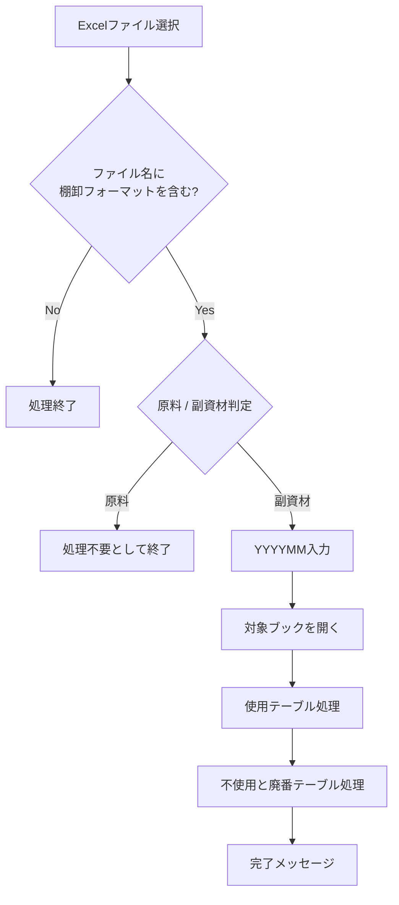
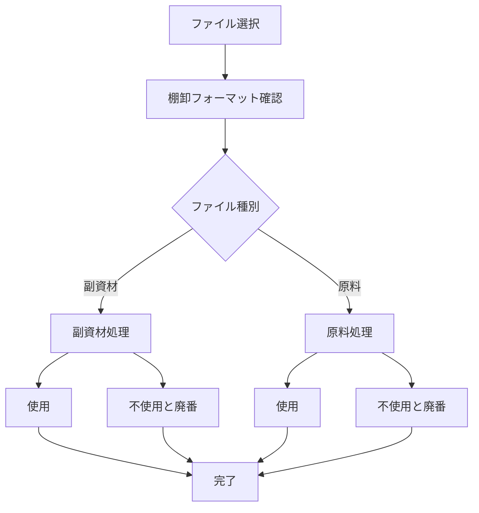

# `ApplyFormulasAndAddColumns` VBA改修まとめ — 副資材専用から原料・副資材両対応へ

このチャットでは、在庫管理用VBAマクロ `ApplyFormulasAndAddColumns` の既存コードを理解したうえで、**「副資材」のみに対応していた処理を「原料」にも対応させる** 方向で改修内容を整理・追加しました。

## 1. 元のプログラムの目的と処理内容

対象マクロは、棚卸フォーマットのExcelファイルを選択し、対象テーブルへ列追加・計算式適用・書式コピーを行うものです。

元の処理フローは概ね以下でした。



つまり、元コードでは**原料ファイルを明示的に処理対象外としていた**ことが最大の特徴です。

### 元コードの主要プロシージャ

|プロシージャ|役割|
|---|---|
|`ApplyFormulasAndAddColumns`|ファイル選択、種別判定、対象テーブル取得など全体制御|
|`ProcessTable`|副資材テーブルへの列追加・数式設定|
|`AddColumnBefore`|4か月前の対象列の直前に新しい年月列を追加|
|`CopyFormat`|新しく追加した列へ右隣列の書式をコピー|
|`ColumnExists`|指定列が既存テーブル内に存在するか確認|

## 2. 元の「副資材」処理

ファイル名に「副資材」が含まれる場合、以下の2テーブルを対象としていました。

- `使用` シート
    - `棚卸表_副資材_使用`
- `不使用と廃番` シート
    - `棚卸表_副資材_不使用と廃番`

両方に対して、

```vba
Call ProcessTable(tbl, yyyyMM)
Call CopyFormat(tbl, yyyyMM)
```

を実行する構成です。

### 追加する年月列

入力された `YYYYMM` を基準に4か月前を算出し、

```text
数量_YYYYMM
単価_YYYYMM
金額_YYYYMM
```

を、対応する4か月前の列の直前に追加します。

たとえば、

```text
入力年月: 202502
4か月前: 202410
```

なら、

```text
数量_202502
単価_202502
金額_202502
```

を、

```text
数量_202410
単価_202410
金額_202410
```

の直前に挿入します。

### 副資材で設定される主な計算式

|列|内容|
|---|---|
|`AM_UID`|コード＋発注先を結合|
|`Code_Cnt`|同一コードの件数|
|`AM_UID_Cnt`|同一AM_UIDの件数|
|`AM_Dup_Cnt_PII`|PII内でのAM_UID一致件数|
|`Max_Cnt`|重複判定関連列の最大値|
|`単価_YYYYMM`|PIIのPurchaseItemInformationから単価取得|
|`金額_YYYYMM`|数量 × 単価|
|`Current_Status`|PIIからStatus取得|

代表的なUID式は以下です。

```vba
=TEXTJOIN("_", FALSE, [@コード],[@発注先])
```

単価は `INDEX` / `MATCH` / `INDIRECT` を組み合わせて `PII!PurchaseItemInformation` から取得しています。

## 3. 今回の最初の改修依頼

要望は、現在副資材専用となっているマクロを**原料にも対応させること**でした。

指定された要件は以下です。

- 今までのステップ6を「副資材の場合の処理」として扱う。
- 同様の処理を「原料」にも追加する。
- 原料の計算式は副資材をベースにする。
- 原料では以下を変更する。
    - `AM_UID` → `RM_UID`
    - `AM_UID_Cnt` → `RM_UID_Cnt`

これを受けて、ファイル種別判定を以下のような考え方へ変更しました。

```vba
isRawMaterial = (InStr(fileName, "原料") > 0)
isSubMaterial = (InStr(fileName, "副資材") > 0)
```

従来あった、

```vba
If InStr(fileName, "原料") > 0 Then
    MsgBox "原料ファイルのため処理不要", vbInformation
    Exit Sub
End If
```

という「原料なら終了」のロジックを廃止し、原料・副資材をそれぞれ処理対象として分岐する方向へ変更しました。

## 4. 副資材と原料の処理分離

全体の考え方は次の構成になりました。



副資材は従来どおり `ProcessTable` を使用し、原料については新たに、

```vba
ProcessTableRawMaterial
```

という専用処理を設ける案になりました。

## 5. 原料用 `ProcessTableRawMaterial`

原料処理については、副資材の `ProcessTable` をベースに、一部の列名・参照キーをRM系へ置き換える構成にしました。

### 副資材と原料の対応関係

|用途|副資材|原料|
|---|---|---|
|UID|`AM_UID`|`RM_UID`|
|UID件数|`AM_UID_Cnt`|`RM_UID_Cnt`|
|PII側重複数|`AM_Dup_Cnt_PII`|`RM_Dup_Cnt_PII`|
|使用テーブル|`棚卸表_副資材_使用`|`棚卸表_原料_使用`|
|不使用テーブル|`棚卸表_副資材_不使用と廃番`|`棚卸表_原料_不使用と廃番`|

原料側では例えば次のような式になります。

```vba
Set rng = tbl.ListColumns("RM_UID").DataBodyRange
If Not rng Is Nothing Then
    rng.Formula = "=TEXTJOIN(""_"", FALSE, [@コード],[@発注先])"
End If
```

UID件数は、

```vba
Set rng = tbl.ListColumns("RM_UID_Cnt").DataBodyRange
If Not rng Is Nothing Then
    rng.Formula = "=COUNTIF([RM_UID],[@[RM_UID]])"
End If
```

とする構成です。

PII参照も `AM_UID` ではなく `RM_UID` を利用します。

```vba
=COUNTIF(PII!PurchaseItemInformation[RM_UID], [@[RM_UID]])
```

単価取得も同様です。

```vba
=INDEX(
    INDIRECT("PII!PurchaseItemInformation"),
    MATCH(
        [@[RM_UID]],
        INDIRECT("PII!PurchaseItemInformation[RM_UID]"),
        0
    ),
    MATCH(
        "単価",
        INDIRECT("PII!PurchaseItemInformation[#見出し]"),
        0
    )
)
```

## 6. 最初の原料対応案で発生していた不足

最初に提示した改修案では、原料について次のテーブルしか処理していませんでした。

```text
棚卸表_原料_使用
```

つまり、副資材では、

```text
使用
不使用と廃番
```

の両方を処理していたにもかかわらず、原料では「使用」しか実装されていない状態でした。

この点をユーザーから指摘され、

> 「ステップ6: 原料の処理にて、不使用と廃番に関する処理が記述されていない」

という修正依頼がありました。

## 7. 「原料・不使用と廃番」処理の追加

修正後は、副資材と同じ構造で原料についても2テーブル処理する形にしました。

### 原料・使用

```vba
Set wsUsage = ActiveWorkbook.Sheets("使用")
Set tblUsage = wsUsage.ListObjects("棚卸表_原料_使用")

If Not tblUsage Is Nothing Then
    Call ProcessTableRawMaterial(tblUsage, yyyyMM)
    Call CopyFormat(tblUsage, yyyyMM)
Else
    MsgBox "テーブル '棚卸表_原料_使用' が見つかりません", vbExclamation
End If
```

### 原料・不使用と廃番

追加した処理は以下の構造です。

```vba
Set wsUnused = ActiveWorkbook.Sheets("不使用と廃番")
Set tblUnused = wsUnused.ListObjects("棚卸表_原料_不使用と廃番")

If Not tblUnused Is Nothing Then
    Call ProcessTableRawMaterial(tblUnused, yyyyMM)
    Call CopyFormat(tblUnused, yyyyMM)
Else
    MsgBox "テーブル '棚卸表_原料_不使用と廃番' が見つかりません", vbExclamation
End If
```

これにより最終的な対象は4テーブルとなります。

|種別|状態|テーブル|
|---|---|---|
|副資材|使用|`棚卸表_副資材_使用`|
|副資材|不使用と廃番|`棚卸表_副資材_不使用と廃番`|
|原料|使用|`棚卸表_原料_使用`|
|原料|不使用と廃番|`棚卸表_原料_不使用と廃番`|

## 8. 最終的な処理構成

現在までの改修方針をまとめると、プログラムは以下の構造です。

```text
ApplyFormulasAndAddColumns
│
├─ ファイル選択
├─ 「棚卸フォーマット」確認
├─ 原料 / 副資材判定
├─ YYYYMM取得
├─ 対象Excelブックを開く
│
├─ 副資材の場合
│   ├─ 使用
│   │   ├─ ProcessTable
│   │   └─ CopyFormat
│   └─ 不使用と廃番
│       ├─ ProcessTable
│       └─ CopyFormat
│
└─ 原料の場合
    ├─ 使用
    │   ├─ ProcessTableRawMaterial
    │   └─ CopyFormat
    └─ 不使用と廃番
        ├─ ProcessTableRawMaterial
        └─ CopyFormat
```

`AddColumnBefore`、`CopyFormat`、`ColumnExists` は原料・副資材で共通利用できます。

## 9. 現時点で注意すべき点

今回のチャットで決定・実装した内容とは別に、コード上ではいくつか確認した方がよい点が残っています。

特に重要なのは、**原料の `RM_UID` の構成要素**です。

今回の依頼では、

> 「副資材で使われていた計算式を代用し、一部変更する」
> 
> `AM_UID` → `RM_UID`

という指定だったため、提示コードでは副資材同様、

```vba
=TEXTJOIN("_", FALSE, [@コード],[@発注先])
```

としています。

ただし、原料のUID仕様として別途、

```text
コード
発注先
入目/規格
```

などを含める必要がある設計であれば、ここは修正対象になります。

また、原料処理の例では `Current_Status` の式が省略された版も提示されているため、最終コード化する場合は**副資材と完全に同じ処理をRM_UIDへ置換するのかを統一しておく必要があります**。

## 10. このチャットで確定したこと・未確定事項

**確定した方向性**

- `ApplyFormulasAndAddColumns` を副資材専用から原料・副資材両対応へ変更する。
- ファイル名から原料・副資材を判定する。
- 副資材は既存 `ProcessTable` を利用する。
- 原料には `ProcessTableRawMaterial` を設ける。
- 原料では少なくとも以下をRM系へ変更する。
    - `AM_UID` → `RM_UID`
    - `AM_UID_Cnt` → `RM_UID_Cnt`
- 原料も副資材同様、
    - 「使用」
    - 「不使用と廃番」
    の両テーブルを処理する。
- `CopyFormat` や年月列追加処理は原料・副資材で共用する。

**今後確認・改善できる事項**

- 原料の `RM_UID` を本当に「コード＋発注先」の2項目で構成するのか。
- `RM_Dup_Cnt_PII` を正式採用するか。
- 原料にも `Current_Status` を必ず設定するか。
- `Max_Cnt` の式が「不使用と廃番」テーブルでも `棚卸表_原料_使用` / `棚卸表_副資材_使用` を参照してよい設計なのか。
- 原料・副資材でかなり重複するため、将来的には `ProcessTable` を1本化して「AM/RM」を引数として渡すリファクタリングも可能。

今回の到達点は、**「副資材の使用／不使用と廃番」という既存2系統を維持したまま、「原料の使用／不使用と廃番」を対称的に追加する設計へ変更した**、というものです。