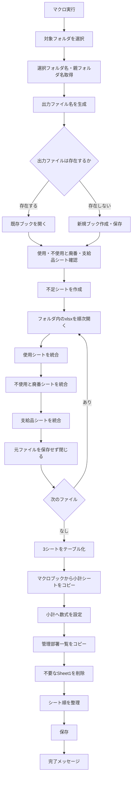
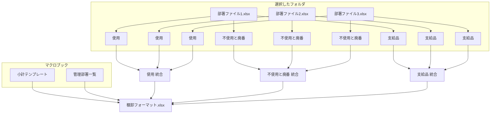

# `CombineDepartmentFiles` VBAの理解・整理まとめ

このチャットでは、VBAモジュール `CombineDepartmentFiles` のコード全体を確認し、その処理内容と構造を整理した。目的は、**部署ごと・拠点ごとに分かれている棚卸Excelファイルを1つの棚卸フォーマットへ統合し、後続処理に使える形へ整形すること**である。

## VBA全体の目的

対象マクロは、ユーザーが選択したフォルダ内の複数の `.xlsx` ファイルから、以下の3シートを収集・結合する。

|対象シート|処理|
|---|---|
|`使用`|各ファイルのデータを縦方向に統合|
|`不使用と廃番`|各ファイルのデータを縦方向に統合|
|`支給品`|各ファイルのデータを縦方向に統合|

その後、統合した各データをExcelテーブル化し、マクロブック側から以下も追加する。

- `小計`シート
- `管理部署`シート
- `小計`シート内の集計数式
- 所定のシート順

最終的には、選択フォルダ名と親フォルダ名を利用した名前で統合ファイルを保存する。

```text
棚卸フォーマット_<選択フォルダ名>_<親フォルダ名>.xlsx
```

たとえば、

```text
棚卸フォーマット_本社・6丁目_副資材.xlsx
```

のような構成になることを想定したコードである。

---

## 全体の処理フロー



# メイン処理 `CombineDepartmentFiles`

## 1. 変数宣言

冒頭では、処理対象となるブック・シート・ファイル名・最終行・制御フラグなどを宣言している。

主な変数は以下。

|変数|用途|
|---|---|
|`sourceWorkbook`|統合元の各Excelブック|
|`destWorkbook`|統合結果を書き込む出力ブック|
|`folderPath`|ユーザーが選択したフォルダ|
|`selectedFolderName`|選択フォルダそのものの名前|
|`parentFolderName`|選択フォルダの親フォルダ名|
|`destFileName`|出力ファイルのフルパス|
|`fileName`|`Dir`で取得する各Excelファイル名|
|`wsUsage`|出力側の`使用`シート|
|`wsUnused`|出力側の`不使用と廃番`シート|
|`wsSupplies`|出力側の`支給品`シート|
|`wsSubtotal`|出力側の`小計`シート|
|`firstCopyUsage`|`使用`の初回コピー判定|
|`firstCopyUnused`|`不使用と廃番`の初回コピー判定|
|`firstCopySupplies`|`支給品`の初回コピー判定|

`firstCopy...` の3つは、**最初のファイルだけヘッダーを含め、それ以降はヘッダーを除外する**ために使われている。

---

## 2. フォルダ選択

```vba
Set fileDialog = Application.fileDialog(msoFileDialogFolderPicker)
```

フォルダ選択ダイアログを表示する。

選択された場合、

```vba
folderPath = fileDialog.SelectedItems(1)
selectedFolderName = GetFolderName(folderPath)
parentFolderName = GetParentFolderName(folderPath)
```

によって、

- フォルダのフルパス
- 選択フォルダ名
- 親フォルダ名

を取得する。

キャンセルされた場合は、

```vba
MsgBox "フォルダが選択されませんでした。処理を中止します。"
Exit Sub
```

で終了する。

---

## 3. 出力ファイル名の生成

```vba
destFileName = ThisWorkbook.Path & _
    "\棚卸フォーマット_" & _
    selectedFolderName & "_" & _
    parentFolderName & ".xlsx"
```

出力先は、**マクロブックと同じフォルダ**になる。

フォルダ構造そのものを意味情報として利用している点が特徴である。

たとえば、

```text
副資材
└─ 本社・6丁目
```

という構成の `本社・6丁目` を選択した場合、

```text
selectedFolderName = 本社・6丁目
parentFolderName   = 副資材
```

となる。

この `parentFolderName` は、後でテーブル名にも使われる。

---

## 4. 出力ブックを開く、または新規作成

まず既存ファイルを開こうとする。

```vba
On Error Resume Next
Set destWorkbook = Workbooks.Open(destFileName)
On Error GoTo 0
```

存在しなければ、

```vba
Set destWorkbook = Workbooks.Add
destWorkbook.SaveAs destFileName, FileFormat:=xlOpenXMLWorkbook
```

で新規作成する。

したがって、このコードは、

- 出力ファイルがなければ新規作成
- あれば既存ファイルを開く

という設計になっている。

---

## 5. 統合先シートの取得・作成

出力ブックで、

- `使用`
- `不使用と廃番`
- `支給品`

を探す。

存在しないシートだけ新規作成する。

```vba
If wsUsage Is Nothing Then
    Set wsUsage = destWorkbook.Sheets.Add(...)
    wsUsage.Name = "使用"
End If
```

他2シートも同様である。

---

# 各Excelファイルの結合処理

## ファイル列挙

```vba
fileName = Dir(folderPath & "\*.xlsx")
```

によって、選択フォルダ直下の `.xlsx` ファイルを取得する。

その後、

```vba
Do While fileName <> ""
```

で各ファイルを順番に処理する。

サブフォルダの中までは検索しない。

---

## 各ソースブックを開く

```vba
Set sourceWorkbook = Workbooks.Open(folderPath & "\" & fileName)
```

各Excelファイルを通常のWorkbookとして開く。

その後、3種類のシートを順番に処理する。

---

# `使用`シートの結合

まず、

```vba
Set wsSource = sourceWorkbook.Sheets("使用")
```

を試みる。

対象シートがなければ、そのファイルについてはスキップする。

### 初回コピー

```vba
If firstCopyUsage Then
```

最初の`使用`シートは、

```vba
wsSource.UsedRange.Copy
```

で使用範囲全体をコピーする。

貼り付けは、

```vba
wsUsage.Range("A1").PasteSpecial Paste:=xlPasteValues
wsUsage.Range("A1").PasteSpecial Paste:=xlPasteFormats
```

で、

- 値
- 書式

を別々にコピーする。

したがって、数式そのものは持ち込まず、結果値が保存される。

コピー後、

```vba
firstCopyUsage = False
```

として、以降は追加コピーに切り替える。

### 2ファイル目以降

既存データの末尾をA列基準で取得する。

```vba
lastRowUsage = wsUsage.Cells(wsUsage.Rows.Count, "A").End(xlUp).Row + 1
```

そして、

```vba
wsSource.UsedRange.Offset(1, 0) _
    .Resize(wsSource.UsedRange.Rows.Count - 1).Copy
```

によって、先頭行を除外してコピーする。

つまり、

```text
1ファイル目
ヘッダー
データ
データ

2ファイル目
データ
データ

3ファイル目
データ
...
```

という形で縦方向に連結される。

---

# `不使用と廃番`・`支給品`

基本ロジックは`使用`と完全に同じである。

それぞれ独立した、

- 初回コピー判定
- 最終行
- 出力シート

を持っている。

|シート|初回判定変数|最終行変数|
|---|---|---|
|使用|`firstCopyUsage`|`lastRowUsage`|
|不使用と廃番|`firstCopyUnused`|`lastRowUnused`|
|支給品|`firstCopySupplies`|`lastRowSupplies`|

したがって、あるExcelファイルに`支給品`がなくても、他の2シートの処理には影響しない。

---

## ソースブックを閉じる

各ファイルの処理終了後、

```vba
Application.DisplayAlerts = False
sourceWorkbook.Close SaveChanges:=False
Application.DisplayAlerts = True
```

とする。

元ファイルには何も保存しない。

---

# 統合後のテーブル化

全ファイルを読み終えた後、

```vba
CreateTable wsUsage, "棚卸表_" & parentFolderName & "_使用"
CreateTable wsUnused, "棚卸表_" & parentFolderName & "_不使用と廃番"
CreateTable wsSupplies, "棚卸表_" & parentFolderName & "_支給品"
```

を実行する。

例えば、

```text
parentFolderName = 副資材
```

なら、

|シート|テーブル名|
|---|---|
|使用|`棚卸表_副資材_使用`|
|不使用と廃番|`棚卸表_副資材_不使用と廃番`|
|支給品|`棚卸表_副資材_支給品`|

となる。

原料なら、

```text
棚卸表_原料_使用
棚卸表_原料_不使用と廃番
棚卸表_原料_支給品
```

となる設計である。

---

# `CreateTable`

```vba
Sub CreateTable(ws As Worksheet, tableName As String)
```

では、

```vba
Set tblRange = ws.Range("A1").CurrentRegion
```

によってA1を起点とした連続範囲をテーブル対象とする。

その後、

```vba
Set tbl = ws.ListObjects.Add(xlSrcRange, tblRange, , xlYes)
```

でExcelテーブル化する。

ヘッダーありとして処理し、

```vba
tbl.Name = tableName
tbl.TableStyle = "TableStyleLight8"
```

でテーブル名とスタイルを設定する。

---

# `小計`シートの追加

マクロブック自身、

```vba
ThisWorkbook
```

の`小計`シートを検索する。

```vba
Set sourceSubtotalSheet = ThisWorkbook.Sheets("小計")
```

存在すれば、新規シートを作成して、

```vba
sourceSubtotalSheet.Cells.Copy
wsSubtotal.Cells.PasteSpecial Paste:=xlPasteAll
```

で全内容をコピーする。

コピー後、新シートを、

```text
小計
```

に変更する。

つまりこの`小計`は、各部署ファイル側から統合するものではなく、**マクロファイル側に用意されたテンプレート**である。

---

# `AddFormulasToSubtotal`

`小計`シートには、統合した棚卸表を参照する数式を追加する。

大きく2種類ある。

## 数量が0より大きい行数

たとえば、

```vba
.Range("D4").Formula = _
    "=COUNTIF(棚卸表_" & parentFolderName & "_使用[数量_202406], "">0"")"
```

これは、

```text
棚卸表_原料_使用[数量_202406]
```

または

```text
棚卸表_副資材_使用[数量_202406]
```

に対して、0より大きいデータ件数をカウントする。

対象月は現在コード内に固定されている。

```text
202406
202402
202310
202306
202302
202210
```

### 行構成

|行|内容|
|---|---|
|4|使用|
|5|不使用と廃番|
|6|上記2行の合計|

D～I列で6期間を参照している。

---

## 金額合計

D10～I11では、

```vba
=SUM(テーブル名[金額_YYYYMM])
```

で金額列を集計する。

行構成は、

|行|内容|
|---|---|
|10|使用|
|11|不使用と廃番|
|12|上記2行の合計|

となっている。

なお、`支給品`についてはこの小計数式からは参照されていない。

---

# `管理部署`シート

`CopyManagementDepartmentList` では、選択したフォルダ名によってコピー元テーブルを切り替えている。

```vba
If selectedFolderName = "本社・6丁目" Then
    sourceTableName = "管理部署一覧表_本社・6丁目"
ElseIf selectedFolderName = "石切" Then
    sourceTableName = "管理部署一覧表_石切"
```

現在対応しているのは、

- `本社・6丁目`
- `石切`

のみ。

それ以外のフォルダの場合、

```text
選択したフォルダ名に対応する管理部署一覧表がありません。
```

と表示して、このサブルーチンを終了する。

---

## 管理部署一覧のコピー元

コピー元は、

```vba
ThisWorkbook.Sheets("管理部署")
```

つまりマクロブック内の`管理部署`シートである。

その中から、

```vba
wsSource.ListObjects(sourceTableName)
```

で目的のExcelテーブルを取得する。

---

## 出力先

出力ブックに新しいシートを作り、

```text
管理部署
```

と命名する。

元テーブルの、

- 値
- 書式

をコピーする。

その後、

```vba
CreateTable wsDest, sourceTableName
```

によってテーブル化し、元と同じテーブル名を付与する。

---

# フォルダ名取得関数

## `GetFolderName`

```vba
Function GetFolderName(folderPath As String) As String
```

`FileSystemObject`を使って、指定フォルダ自身の名称を取得する。

---

## `GetParentFolderName`

```vba
Function GetParentFolderName(folderPath As String) As String
```

同じく`FileSystemObject`を利用し、1階層上のフォルダ名を返す。

これにより、フォルダ階層を、

```text
データ種別
└─ 拠点
```

のような業務上の分類として利用できる。

---

# 最終シート構成

途中で新規ブックに自動作成された `Sheet1` が残っている場合は削除する。

その後、シートを以下の順に並び替える。

```text
1. 小計
2. 使用
3. 不使用と廃番
4. 支給品
5. 管理部署
```

Mermaidで表すと、


となる。

---

# 入力・出力の関係

このVBAの構造をまとめると、以下の関係になる。



---

# このVBAの設計上の特徴

今回確認したコードには、次のような設計思想がある。

- **フォルダ単位で部署別ファイルを一括処理する**
- 各ファイルに共通する3シートを縦結合する
- 1ファイル目だけヘッダーを含める
- 元ファイルからは数式ではなく値と書式だけを取得する
- 統合結果をExcelテーブルとして利用できる状態にする
- 親フォルダ名から「原料」「副資材」などのデータ種別を判定し、テーブル名に反映する
- 選択フォルダ名から拠点を判定し、その拠点用の管理部署一覧を付加する
- `小計`はテンプレートをコピーし、統合テーブルを参照する数式を後から設定する
- 出力ブックは、その後の棚卸処理に利用できる完成形に近い構造で保存する

---

# 現コードを読むうえで注意しておく点

今回のチャットではコード変更までは行っていないが、今後改修する際に重要になるポイントも読み取れる。

|項目|現在の仕様|
|---|---|
|対象ファイル|選択フォルダ直下の`.xlsx`のみ|
|サブフォルダ|検索しない|
|初回ファイル|ヘッダー込み|
|2件目以降|先頭行を除外|
|最終行判定|A列基準|
|コピー対象|`UsedRange`|
|コピー内容|値＋書式|
|数式|コピーしない|
|小計対象年月|VBA内に固定|
|拠点判定|`本社・6丁目` / `石切`|
|出力先|マクロブックと同じフォルダ|
|出力形式|`.xlsx`|
|テーブル基準範囲|`A1.CurrentRegion`|

特に、以前の棚卸マクロ関連で問題になった**A列が空白の場合の最終行判定**や、ヘッダーしか存在しないシートに対する、

```vba
.Resize(wsSource.UsedRange.Rows.Count - 1)
```

の扱いは、今後の堅牢化を検討する際の重要ポイントになる。

---

# 今回のチャットで確認されたこと

今回のやり取りでは、コードそのものの修正は行わず、まずこのVBAが何をしているのかを理解・整理した。

結論として、この `CombineDepartmentFiles` は単なるファイル結合マクロではなく、

> **部署・拠点単位に分散している棚卸データを、「原料／副資材」などの分類を保ちながら統合し、小計・管理部署情報まで含む棚卸作業用の統合ブックを生成するマクロ**

と捉えるのが最も正確である。

また、このマクロは棚卸業務全体の中では、**部署別ファイルをまとめる「統合工程」**を担当しており、後続の列追加・数式付与や再分割処理へつながる基礎データを作成する役割を持つ。