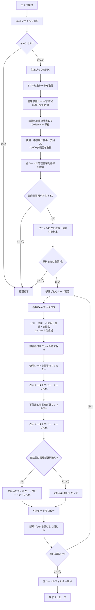
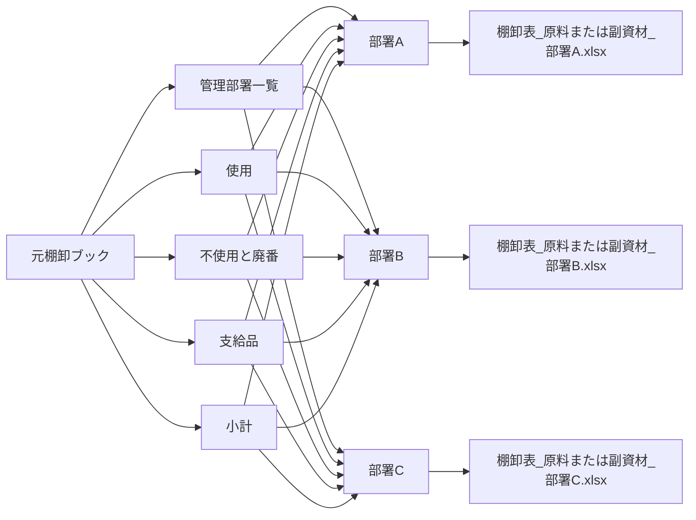

以下に、このチャットで扱った内容を、VBAの目的・処理構造・各変数の役割・注意点まで含めて整理します。

# `CreateFilteredDepartmentFiles` VBAの整理・詳細まとめ

## 1. このVBAの目的

今回確認した `CreateFilteredDepartmentFiles` マクロは、棚卸用の元Excelファイルを選択し、その中にある「管理部署」情報を基準として、**部署ごとにデータを分割したExcelファイルを自動生成する処理**です。

対象となる主なシートは次の5つです。

|シート名|役割|
|---|---|
|管理部署|分割対象となる部署名の一覧を取得する|
|使用|使用中の棚卸データ|
|不使用と廃番|不使用品・廃番品の棚卸データ|
|支給品|支給品の棚卸データ|
|小計|各部署ファイルにそのままコピーする小計用シート|

元ファイルから「管理部署」ごとにデータを抽出し、最終的に次のようなファイルを部署単位で作成します。

```text
棚卸表_原料_○○部.xlsx
棚卸表_副資材_○○部.xlsx
```

ファイルが「原料」か「副資材」かは、ユーザーが選択した元ファイルのファイル名から自動判定します。

---

## 2. 全体の処理フロー

マクロ全体は、概ね次の順番で処理されています。



---

## 3. ファイル選択と対象ブックの取得

最初に、次のコードでExcelファイルをユーザーに選択させます。

```vba
selectedFile = Application.GetOpenFilename( _
    "Excel Files (*.xlsx), *.xlsx", , _
    "エクセルファイルを選択してください")
```

キャンセルした場合は `"False"` が返るため、処理を終了します。

```vba
If selectedFile = "False" Then
    MsgBox "ファイルが選択されませんでした。処理を終了します。", vbExclamation
    Exit Sub
End If
```

選択したファイルは次のコードで開きます。

```vba
Set selectedWorkbook = Workbooks.Open(selectedFile)
```

---

## 4. 対象シートの設定

開いたブックから、次の5シートを取得しています。

```vba
Set wsMngDept = selectedWorkbook.Sheets("管理部署")
Set wsSourceUsage = selectedWorkbook.Sheets("使用")
Set wsSourceUnused = selectedWorkbook.Sheets("不使用と廃番")
Set wsSourceSupplies = selectedWorkbook.Sheets("支給品")
Set wsSourceSubtotal = selectedWorkbook.Sheets("小計")
```

したがって、このVBAを実行する対象ブックには、これらのシート名が正確に存在することが前提です。

---

## 5. 部署一覧の取得

部署一覧は「管理部署」シートの **C列** から取得しています。

```vba
Set rng = wsMngDept.Range( _
    "C2:C" & wsMngDept.Cells(wsMngDept.Rows.Count, "C").End(xlUp).Row)
```

つまり、

```text
C1：ヘッダー
C2以降：部署名
```

という構造を前提としています。

### 重複部署の除外

部署名は `Collection` に格納しています。

```vba
Set departmentList = New Collection
```

その際、部署名自身をキーとして登録します。

```vba
departmentList.Add cell.Value, CStr(cell.Value)
```

`Collection` では同じキーを重複登録できません。

そのエラーを、

```vba
On Error Resume Next
```

で無視することで、結果的に**ユニークな部署名だけを取得する仕組み**になっています。

イメージとして、

```text
営業部
製造部
営業部
品質保証部
製造部
```

というデータがあれば、最終的な `departmentList` は、

```text
営業部
製造部
品質保証部
```

となります。

---

## 6. 出力先フォルダ

出力先は、選択した元ファイルの場所ではありません。

次のコードになっています。

```vba
currentDirectory = ThisWorkbook.Path
```

`ThisWorkbook` は、**このVBAコードが保存されているマクロブック**を意味します。

したがって、生成される棚卸表は、

> マクロブックが保存されているフォルダ

に作成されます。

---

## 7. 元データ範囲の取得

「使用」「不使用と廃番」「支給品」のデータ範囲は、それぞれ `A1.CurrentRegion` で取得しています。

```vba
Set sourceDataUsage = wsSourceUsage.Range("A1").CurrentRegion
Set sourceDataUnused = wsSourceUnused.Range("A1").CurrentRegion
Set sourceDataSupplies = wsSourceSupplies.Range("A1").CurrentRegion
```

`CurrentRegion` は、A1を含む連続した表形式の範囲を取得する機能です。

そのため、途中に完全な空白行・空白列が存在すると、そこでデータ範囲が途切れる可能性があります。

---

## 8. 「管理部署」列の検索

各データシートの1行目から、

```text
管理部署
```

という見出しを検索しています。

```vba
colNumUsage = wsSourceUsage.Rows(1).Find( _
    What:="管理部署", _
    LookIn:=xlValues, _
    LookAt:=xlWhole).Column
```

同様に、

- 使用
- 不使用と廃番
- 支給品

について列番号を取得しています。

### 初期値

検索前に、

```vba
colNumUsage = 0
colNumUnused = 0
colNumSupplies = 0
```

としています。

検索できなかった場合は `0` のまま残ります。

---

## 9. 管理部署列の存在チェック

現在のコードでは、

```vba
If colNumUsage = 0 Or colNumUnused = 0 Then
```

となっているため、

- 使用
- 不使用と廃番

のどちらかに「管理部署」列がなければ処理終了します。

一方で、

```text
支給品
```

については必須扱いではありません。

これは後段で、

```vba
If colNumSupplies > 0 Then
```

としているためです。

つまり設計上、

|シート|管理部署列|
|---|---|
|使用|必須|
|不使用と廃番|必須|
|支給品|任意|

となっています。

---

## 10. 原料・副資材の判定

選択されたファイルのパス文字列に、

```text
原料
副資材
```

のどちらが含まれているかを `InStr` で調べています。

```vba
posGenryo = InStr(selectedFile, "原料")
posFukushizai = InStr(selectedFile, "副資材")
```

その結果、

```vba
If posGenryo > 0 Then
    fileType = "原料"
ElseIf posFukushizai > 0 Then
    fileType = "副資材"
```

としています。

どちらも含まれていなければ、

```text
選択されたファイル名に「原料」または「副資材」が含まれていません。
```

というメッセージを表示して処理終了します。

厳密には `selectedFile` にはフルパスが入るため、判定対象はファイル名だけでなくパス全体です。

---

## 11. 部署ごとの新規ブック作成

取得した部署一覧を、

```vba
For Each departmentName In departmentList
```

で順番に処理します。

部署ごとに、

```vba
Set newWorkbook = Workbooks.Add
```

として新規Excelブックを作ります。

作成するシートは4枚です。

```text
小計
使用
不使用と廃番
支給品
```

順番もこの順序です。

```vba
.Sheets(1).Name = "小計"
.Sheets.Add(After:=.Sheets("小計")).Name = "使用"
.Sheets.Add(After:=.Sheets("使用")).Name = "不使用と廃番"
.Sheets.Add(After:=.Sheets("不使用と廃番")).Name = "支給品"
```

---

## 12. 出力ファイル名

新規ブックは次の形式で保存します。

```vba
.SaveAs fileName:= _
    currentDirectory & _
    "\棚卸表_" & _
    fileType & "_" & _
    departmentName & ".xlsx"
```

例えば、

```text
fileType = 副資材
departmentName = 製造部
```

なら、

```text
棚卸表_副資材_製造部.xlsx
```

になります。

---

## 13. 「使用」シートの処理

まず元の「使用」データを、対象部署でAutoFilterします。

```vba
sourceDataUsage.AutoFilter _
    Field:=colNumUsage, _
    Criteria1:=departmentName
```

その後、フィルター後に表示されているセルだけをコピーします。

```vba
sourceDataUsage.SpecialCells(xlCellTypeVisible).Copy _
    Destination:=newWorkbook.Sheets("使用").Range("A1")
```

コピー後は元シートのフィルターを解除します。

```vba
wsSourceUsage.AutoFilterMode = False
```

---

## 14. コピー後のテーブル化

コピーしたデータはExcelテーブル、すなわち `ListObject` に変換しています。

```vba
Set tblUsage = .ListObjects.Add( _
    xlSrcRange, _
    .Range("A1").CurrentRegion, _
    , xlYes)
```

テーブル名は、

```vba
tblUsage.Name = "棚卸表_" & fileType & "_使用"
```

となります。

例えば副資材なら、

```text
棚卸表_副資材_使用
```

です。

---

## 15. 「不使用と廃番」シートの処理

処理方法は「使用」と同じです。

### フィルター

```vba
sourceDataUnused.AutoFilter _
    Field:=colNumUnused, _
    Criteria1:=departmentName
```

### コピー

```vba
sourceDataUnused.SpecialCells(xlCellTypeVisible).Copy _
    Destination:=newWorkbook.Sheets("不使用と廃番").Range("A1")
```

### テーブル化

テーブル名は、

```text
棚卸表_原料_不使用と廃番
```

または、

```text
棚卸表_副資材_不使用と廃番
```

となります。

---

## 16. 「支給品」シートの処理

今回のコードでは「支給品」処理が追加されています。

ただし、

```vba
If colNumSupplies > 0 Then
```

となっているため、「支給品」に「管理部署」列が存在する場合だけ処理します。

処理内容は、

1. 部署でフィルター
2. 表示データをコピー
3. Excelテーブル化

という流れです。

テーブル名は、

```vba
tblSupplies.Name = "棚卸表_" & fileType & "_支給品"
```

となるため、例えば、

```text
棚卸表_副資材_支給品
```

です。

---

## 17. 「小計」シートのコピー

「小計」だけは部署でフィルターせず、元シート全体をそのままコピーします。

```vba
wsSourceSubtotal.Cells.Copy _
    Destination:=newWorkbook.Sheets("小計").Cells
```

そのため、すべての部署ファイルに同じ「小計」シート内容が入ります。

---

## 18. 部署ファイルの保存・終了

1部署分の処理が終了すると、

```vba
newWorkbook.Close SaveChanges:=True
```

によって保存して閉じます。

その後、

```vba
Next departmentName
```

で次の部署に移ります。

したがって、部署が5つ存在すれば5ファイルが作られます。

---

## 19. 最終的なフィルター解除

すべての部署処理終了後、元データ側にフィルター状態が残っていた場合に備えて、

```vba
If wsSourceUsage.FilterMode Then wsSourceUsage.ShowAllData
If wsSourceUnused.FilterMode Then wsSourceUnused.ShowAllData
If wsSourceSupplies.FilterMode Then wsSourceSupplies.ShowAllData
```

を実行しています。

この部分は、

```vba
On Error Resume Next
```

でエラーを無視する構造です。

---

## 20. 完了通知

最後に、

```vba
MsgBox "すべての部署のフィルタリングされたデータが現在のディレクトリに作成されました。"
```

と表示して終了します。

---

## 21. 主要変数の整理

|変数|型|用途|
|---|---|---|
|`selectedFile`|String|ユーザーが選択したファイルパス|
|`selectedWorkbook`|Workbook|選択した元ブック|
|`wsMngDept`|Worksheet|管理部署シート|
|`wsSourceUsage`|Worksheet|使用シート|
|`wsSourceUnused`|Worksheet|不使用と廃番シート|
|`wsSourceSupplies`|Worksheet|支給品シート|
|`wsSourceSubtotal`|Worksheet|小計シート|
|`rng`|Range|管理部署一覧の範囲|
|`cell`|Range|部署一覧を走査する各セル|
|`departmentList`|Collection|重複を除いた部署一覧|
|`departmentName`|Variant|現在処理中の部署名|
|`newWorkbook`|Workbook|部署別出力ブック|
|`currentDirectory`|String|出力先フォルダ|
|`sourceDataUsage`|Range|使用データ全体|
|`sourceDataUnused`|Range|不使用と廃番データ全体|
|`sourceDataSupplies`|Range|支給品データ全体|
|`colNumUsage`|Long|使用の管理部署列番号|
|`colNumUnused`|Long|不使用と廃番の管理部署列番号|
|`colNumSupplies`|Long|支給品の管理部署列番号|
|`fileType`|String|原料／副資材|
|`posGenryo`|Long|「原料」の検索位置|
|`posFukushizai`|Long|「副資材」の検索位置|
|`tblUsage`|ListObject|使用シートのExcelテーブル|
|`tblUnused`|ListObject|不使用と廃番のExcelテーブル|
|`tblSupplies`|ListObject|支給品のExcelテーブル|

---

## 22. このVBAの入力と出力

構造を単純化すると、次のようになります。



つまり、このVBAの本質は、

> **1つの棚卸マスターファイルを、「管理部署」をキーとして複数の部署別棚卸ファイルへ分割する処理**

です。

---

## 23. 現在のコードで確認できる注意点

コードを理解するうえで、いくつか留意すべき点があります。

### 支給品のフィルター解除先

支給品をコピーした直後に、

```vba
wsSourceUnused.AutoFilterMode = False
```

となっています。

しかし、直前にフィルターしているのは、

```vba
sourceDataSupplies.AutoFilter
```

です。

したがって、意図としては、

```vba
wsSourceSupplies.AutoFilterMode = False
```

である可能性が高い箇所です。

これはコードの動作確認・修正を行う場合に確認すべきポイントです。

### 「支給品」シート自体は必須

「管理部署」列については任意扱いですが、

```vba
Set wsSourceSupplies = selectedWorkbook.Sheets("支給品")
```

を無条件で実行しています。

そのため、「支給品」シートそのものが存在しない場合は、その時点で実行時エラーになります。

つまり現在のコードは、

- 支給品シート：必須
- 支給品の「管理部署」列：任意

という構造です。

### 元ブックを閉じていない

最後まで、

```vba
selectedWorkbook.Close
```

は実行していません。

したがって、処理終了後も元の選択ブックは開いたままになります。

### 同名ファイルが既に存在する場合

`.SaveAs` の前に同名ファイルの存在確認を行っていません。

そのため既存ファイルがある場合、Excel側の上書き確認やエラー等が発生する可能性があります。

### 部署名がファイル名として使用される

部署名をそのまま、

```text
棚卸表_○○_部署名.xlsx
```

に利用します。

したがって部署名に、

```text
\
/
:
*
?
"
<
>
|
```

などWindowsファイル名で使用できない文字が含まれている場合は問題になります。

---

## 24. このチャットで確認した結論

今回のチャットでは、このVBAを変更するのではなく、まず既存コードの処理内容を理解することを目的として確認しました。

理解した処理は次の通りです。

1. ユーザーが棚卸用Excelファイルを選択する。
2. 「管理部署」シートC列からユニークな部署一覧を作る。
3. 「使用」「不使用と廃番」「支給品」の各データから「管理部署」列を探す。
4. 選択ファイルのパスに含まれる「原料」「副資材」からファイル種別を判定する。
5. 部署ごとに新規Excelブックを作る。
6. 新規ブックには「小計」「使用」「不使用と廃番」「支給品」の4シートを用意する。
7. 「使用」「不使用と廃番」「支給品」は各部署でフィルタリングしてコピーする。
8. コピーした各データをExcelテーブル化する。
9. 「小計」はフィルタせず、そのままコピーする。
10. `棚卸表_原料または副資材_部署名.xlsx` という名称でマクロブックと同じフォルダへ保存する。
11. 全部署分のファイルを作成して処理を終了する。

現時点では**コードの理解・構造整理までを行っており、コード自体の修正・リファクタリングはまだ実施していません**。

特に今後コードを修正する場合は、`支給品` のフィルター解除先が `wsSourceUnused` になっている点は最初に確認すべき箇所です。