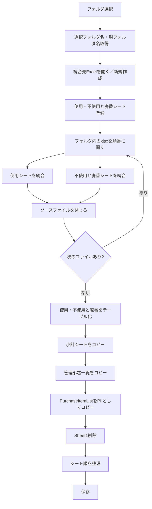

このチャットでは、棚卸関連の複数Excelファイルを1つに統合するVBAマクロ `CombineDepartmentFiles` の処理内容を確認し、その後、統合後のシートをテーブル化する際に発生した **実行時エラー 1004** の原因を特定し、**A列に空白があっても動作するようにする修正方法**を検討した。

### 1. 対象VBAの目的と全体フロー

対象マクロ `CombineDepartmentFiles` は、ユーザーが指定したフォルダ配下にある複数の `.xlsx` ファイルを読み込み、それぞれの `"使用"` シートと `"不使用と廃番"` シートを1つのExcelブックに統合する処理である。

処理全体は次の流れになっている。



統合先ファイル名は以下の規則で生成される。

```text
棚卸フォーマット_<選択フォルダ名>_<親フォルダ名>.xlsx
```

保存場所はマクロブック `ThisWorkbook` と同じフォルダである。

---

### 2. `"使用"`・`"不使用と廃番"` の統合方法

フォルダ内の `.xlsx` ファイルを `Dir` で取得し、1ファイルずつ開いて処理する。

```vba
fileName = Dir(folderPath & "\*.xlsx")
Do While fileName <> ""
```

各ファイルについて、

- `"使用"`
- `"不使用と廃番"`

のシートを探し、存在すれば統合する。

最初のファイルのみヘッダー込みでコピーするために、

```vba
firstCopyUsage = True
firstCopyUnused = True
```

というフラグを使用している。

2ファイル目以降は、

```vba
wsSource.UsedRange.Offset(1, 0)
```

によって先頭行を除外し、ヘッダーを重複させずに追加する構造になっている。

コピーされるのは、

- 値
- 書式

である。

```vba
.PasteSpecial Paste:=xlPasteValues
.PasteSpecial Paste:=xlPasteFormats
```

---

### 3. 統合後に追加されるシート

最終的な統合ブックには、以下のシートが作成・コピーされる。

|順序|シート名|内容|
|--:|---|---|
|1|小計|マクロブックの `"小計"` シート|
|2|使用|各部署ファイルの `"使用"` シート統合結果|
|3|不使用と廃番|各部署ファイルの `"不使用と廃番"` 統合結果|
|4|管理部署|対象拠点に応じた管理部署一覧|
|5|PII|`purchase_item_information.xlsx` の `PurchaseItemList`|

`管理部署` については選択フォルダ名によってコピー対象テーブルが変わる。

|選択フォルダ|コピー元テーブル|
|---|---|
|本社・6丁目|`管理部署一覧表_本社・6丁目`|
|石切|`管理部署一覧表_石切`|

また、次の固定ファイルから `PurchaseItemList` を取得している。

```text
C:\Users\kyoupatty029\projects\kpm\inventory\purchase_item_information.xlsx
```

コピー後のシート名は、

```text
PII
```

に変更される。

---

### 4. 発生したエラー

問題となったのは、統合後のシートをExcelテーブル化する `CreateTable` である。

元のコードは次の形だった。

```vba
Sub CreateTable(ws As Worksheet, tableName As String)
    Dim tbl As ListObject
    Dim tblRange As Range

    Set tblRange = ws.Range("A1").CurrentRegion

    Set tbl = ws.ListObjects.Add(xlSrcRange, tblRange, , xlYes)
    tbl.Name = tableName
    tbl.TableStyle = "TableStyleLight8"
End Sub
```

エラー発生箇所は以下。

```vba
Set tbl = ws.ListObjects.Add(xlSrcRange, tblRange, , xlYes)
```

発生したエラーは、

```text
実行時エラー 1004
```

だった。

---

### 5. 原因の切り分け

ユーザーが確認した結果、**A列にデータを入れると正常に動作する**ことが判明した。

この結果から、問題の中心は `ListObjects.Add` そのものよりも、テーブル化対象範囲の取得方法にあることが分かった。

特に問題になるのが、

```vba
ws.Range("A1").CurrentRegion
```

である。

`CurrentRegion` は、A1を起点として「空白行・空白列で囲まれた連続領域」を取得する。

そのため、A列が空白であったり、データ配置によって連続領域が正しく形成されていない場合、期待する表全体を取得できない可能性がある。

概念的には次のような違いになる。

```text
A列が埋まっている場合

A        B        C
コード   品名     数量
001      商品A    10
002      商品B    20

→ A1.CurrentRegion で表全体を取得しやすい
```

一方、

```text
A        B        C
         品名     数量
         商品A    10
         商品B    20
```

のような状態では、A1基準の `CurrentRegion` に依存する設計は不安定になる。

---

## 6. 採用候補となった解決方法

A列に依存せず、**シート上で実際にデータが存在する最後の行と最後の列を探してテーブル範囲を作る**方法を提案した。

基本方針は以下。


範囲取得には次を利用する。

```vba
lastRow = ws.Cells.Find("*", _
    SearchOrder:=xlByRows, _
    SearchDirection:=xlPrevious).Row
```

最終列は、

```vba
lastCol = ws.Cells.Find("*", _
    SearchOrder:=xlByColumns, _
    SearchDirection:=xlPrevious).Column
```

そして、

```vba
Set tblRange = ws.Range(ws.Cells(1, 1), ws.Cells(lastRow, lastCol))
```

とする。

この方法であれば、**A列そのものに値が存在するかどうかに依存せず、B列以降のデータも含めてシート全体のデータ範囲を判定できる**。

---

## 7. 提案した `CreateTable` 改良版

チャット内では、最終的に次のような方向を提示した。

```vba
Sub CreateTable(ws As Worksheet, tableName As String)
    Dim tbl As ListObject
    Dim tblRange As Range
    Dim lastRow As Long
    Dim lastCol As Long

    ' データ範囲の特定
    On Error Resume Next
    lastRow = ws.Cells.Find("*", SearchOrder:=xlByRows, _
                                 SearchDirection:=xlPrevious).Row

    lastCol = ws.Cells.Find("*", SearchOrder:=xlByColumns, _
                                 SearchDirection:=xlPrevious).Column
    On Error GoTo 0

    ' シートが完全に空の場合
    If lastRow = 0 Or lastCol = 0 Then
        MsgBox "シート " & ws.Name & _
               " にデータがありません。テーブル作成をスキップします。", _
               vbExclamation
        Exit Sub
    End If

    ' A1～最終データセルまでをテーブル範囲とする
    Set tblRange = ws.Range( _
        ws.Cells(1, 1), _
        ws.Cells(lastRow, lastCol) _
    )

    ' 完全に空なら処理しない
    If Application.WorksheetFunction.CountA(tblRange) = 0 Then
        MsgBox "シート " & ws.Name & _
               " にデータがありません。テーブル作成をスキップします。", _
               vbExclamation
        Exit Sub
    End If

    ' 既存テーブル確認
    On Error Resume Next
    Set tbl = ws.ListObjects(tableName)

    If Not tbl Is Nothing Then
        tbl.Delete
    End If
    On Error GoTo 0

    ' テーブル作成
    Set tbl = ws.ListObjects.Add( _
        xlSrcRange, _
        tblRange, _
        , _
        xlYes _
    )

    tbl.Name = tableName
    tbl.TableStyle = "TableStyleLight8"
End Sub
```

---

## 8. この修正によって改善される点

元の実装と修正版の違いを整理すると以下になる。

|項目|元の実装|修正版|
|---|---|---|
|範囲取得|`A1.CurrentRegion`|`Find("*")` で最終行・列を取得|
|A列への依存|強い|ほぼない|
|A列空白への耐性|低い|高い|
|表内の空白行|範囲が分断される可能性あり|基本的に含められる|
|表内の空白列|範囲が分断される可能性あり|基本的に含められる|
|完全な空シート|エラーの可能性|スキップ可能|
|同名テーブル|状況によって問題|事前確認可能|

---

## 9. 補足：今回の問題で重要な点

今回判明した問題は、単純に「A列に空白セルが1つでもあればテーブル化できない」というものではない。

正確には、

> **表範囲の決定を `A1.CurrentRegion` とA列に強く依存させているため、A列のデータ状態によって意図した表範囲を取得できなくなる**

という問題である。

したがって、今後の処理でも、

```vba
Cells(Rows.Count, "A").End(xlUp)
```

のように**A列を基準として最終行を取得している箇所**には注意が必要である。

実際、元コードには次の処理も存在する。

```vba
lastRowUsage = wsUsage.Cells(wsUsage.Rows.Count, "A").End(xlUp).Row + 1
```

```vba
lastRowUnused = wsUnused.Cells(wsUnused.Rows.Count, "A").End(xlUp).Row + 1
```

ここもA列が完全に空白になる可能性があるデータ構造なら、将来的には同様に不安定になる。

より堅牢にするなら、追加行の判定についても、

```vba
Find("*", SearchOrder:=xlByRows, SearchDirection:=xlPrevious)
```

を利用し、**特定列ではなくシート全体から最終行を求める設計**に統一するのが望ましい。

---

## 現時点での結論

今回のエラーについては、

1. `ListObjects.Add` で実行時エラー1004が発生した
2. A列にデータを入力すると正常動作した
3. その結果、`A1.CurrentRegion` による範囲判定が主要因と判断した
4. `CurrentRegion` をやめ、`Find("*")` を使って最終行・最終列を取得する方法を提示した
5. これにより、A列に空白があってもテーブル化できる構造へ変更可能

というところまで整理できている。

なお、**完全に堅牢化するなら `CreateTable` だけでなく、統合処理中の `lastRowUsage` / `lastRowUnused` のA列依存も合わせて修正対象にするべき**である。今回のエラー箇所とは別だが、同じ設計上の弱点を持っている。