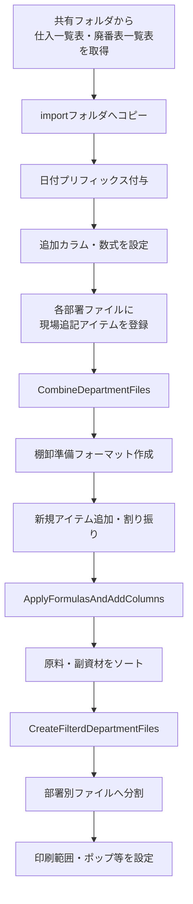
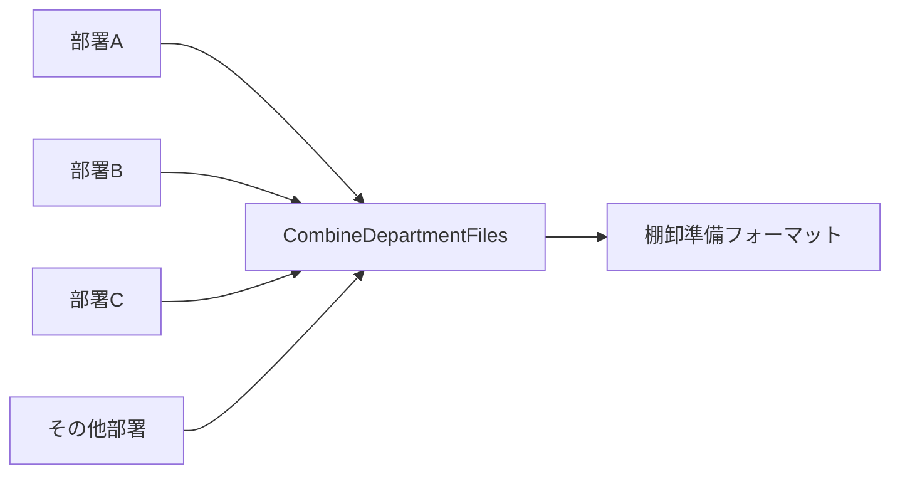
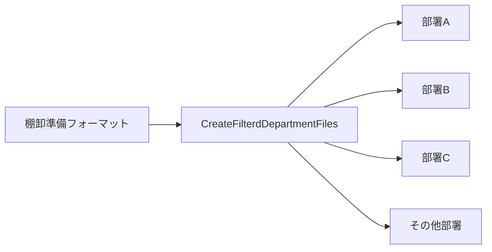

以下に、今回のチャット全体を「在庫処理フローの整理」という観点で、内容・修正経緯・最終形が分かるようにまとめます。

# 在庫処理フロー整理

今回のチャットでは、棚卸業務における「一覧表の取得・加工 → 部署別ファイルの結合 → 棚卸準備フォーマットの加工 → 部署別ファイルへの再分割」という一連の処理手順を、Markdown形式で整理した。

当初のメモは作業内容が断片的に記載されていたため、工程単位に再構成し、ファイル操作・Excel関数・VBAマクロ・ソート条件などを明確化した。

## 全体フロー



## 1. 一覧表の取得と加工

### 1.1. 最新ファイルの取得

共有フォルダ `\仕入` から、最新の以下2種類の一覧表を取得する。

- 仕入一覧表
- 廃番表一覧表

取得したファイルを以下のフォルダへコピーする。

`...kpm\inventory\import\purchase_item_records`

### 1.2. ファイル名の変更

コピーしたファイルには、プリフィックスとしてコピー実施日を `YYYYMMDD` 形式で付与し、その後ろに `_` を付ける。

例：

`20260902_元ファイル名.xlsx`

これにより、いつ取得した一覧表であるかをファイル名から識別できるようにする。

### 1.3. カラムの追加

各一覧表に、少なくとも以下のカラムを追加する。

|カラム|用途|
|---|---|
|`Cells Color Number`|品名セルの色番号を取得|
|`Status`|セル色から商品の状態を判定|
|`RM_UID`|原料用の一意識別子|
|`AM_UID`|副資材用の一意識別子|
|`Duplicate Code Count`|コード重複数の確認|

`Cells Color Number` は T列、`Status` は U列として追加する想定。

### 1.4. Cells Color Number の算出

`Cells Color Number` カラムには、以下のExcel関数を設定する。

```excel
=colorindexcell([@品名])
```

品名セルの背景色等からColorIndexを取得し、後続の `Status` 判定に使用する。

### 1.5. Status の算出

`Status` カラムには、取得したColorIndexに応じて状態を分類するため、以下の数式を設定する。

```excel
=IFS(
 $T2=-4142, "標準",
 OR($T2=33, $T2=37), "新規",
 $T2=43, "価格改定",
 $T2=6, "次回廃番",
 OR($T2=15, $T2=16,$T2=48), "廃番",
 OR($T2=24, $T2=44), "松下さんも知らない"
)
```

判定ルールは以下のとおり。

|ColorIndex|Status|
|--:|---|
|`-4142`|標準|
|`33`, `37`|新規|
|`43`|価格改定|
|`6`|次回廃番|
|`15`, `16`, `48`|廃番|
|`24`, `44`|松下さんも知らない|

この工程では、元ファイル上で使用されている色分け情報を、後工程で扱いやすい文字列情報へ変換することが目的となる。

## 2. データの結合

棚卸準備では、各部署ごとに存在するファイルを一度まとめ、全体を加工できる「棚卸準備フォーマット」を作成する。

### 2.1. 各部署ファイルの事前準備

マクロで結合する前に、現場から追加されたアイテムを各部署ファイルのテーブルへ登録しておく。

特に以下の情報を事前に補完する。

- A列のコード
- 部署ID
- 管理地区
- 管理部署

コードについては、状態に応じて以下のルールを使用する。

|状態|入力内容|
|---|---|
|コードが判明している|正式なコードを入力|
|コードが分からない|`?` を追加|
|コード自体が存在しない|`-` を入力|

コードが不明だからといって空欄のままにせず、状態を明示しておくことがポイントとなる。

### 2.2. InventoryPrepMacro の実行準備

`InventoryPrepMacro.xlsm` を起動する。

続いて、「小計」シートに存在する以下のテーブルへ、新しい棚卸年月を追加する。

- 在庫件数テーブル
- 小計テーブル

その後、マクロ `CombineDepartmentFiles` を実行する。

### 2.3. CombineDepartmentFiles の役割

`CombineDepartmentFiles` は、各部署ファイルに分かれている棚卸データを一つにまとめるためのマクロとして使用する。

処理後、`InventoryPrepMacro.xlsm` と同じ場所に、結合済みの「棚卸準備フォーマット」が作成される。



## 3. 棚卸準備フォーマットの加工

結合しただけでは棚卸用データとして完成していないため、新規アイテムの追加、各種計算式の設定、アイテムの割り振りなどを行う。

### 3.1. 新規アイテムの追加

結合後の棚卸準備フォーマットへ、今回新たに必要となったアイテムを追加する。

この工程では、部署ファイル上で追加された現場由来のアイテムだけでなく、仕入一覧表等から判明した新規アイテムも整理対象となる。

### 3.2. ApplyFormulasAndAddColumns の実行

`InventoryPrepMacro.xlsm` から、以下のマクロを実行する。

`ApplyFormulasAndAddColumns`

このマクロによって、棚卸準備フォーマットへ必要なカラムや計算式を追加・設定する。

今回の作業フローでは、結合処理と分割処理の間に位置する「加工工程」を担当するマクロとして整理された。

### 3.3. 前回コメントを基にしたアイテム割り振り

前回棚卸時に記録されたコメント等を確認し、今回のアイテムを適切な部署へ割り振る。

単純な自動処理だけではなく、人による判断を伴う確認工程として位置付けられる。

## 4. 分割前のソート処理

棚卸準備フォーマットを各部署へ再分割する前に、原料・副資材それぞれについて並び順を整える。

### 原料

以下の1条件でソートする。

1. `棚卸業務_品名`：昇順

### 副資材

以下の優先順位で複数キーソートを行う。

1. `分類1`：降順
2. `分類2`：昇順
3. `棚卸業務_品名`：昇順

表にすると以下の構成となる。

|種別|優先順位|カラム|順序|
|---|--:|---|---|
|原料|1|棚卸業務_品名|昇順|
|副資材|1|分類1|降順|
|副資材|2|分類2|昇順|
|副資材|3|棚卸業務_品名|昇順|

この段階でソートしておくことで、分割後の各部署ファイルでも一定の並び順を維持できる。

## 5. 各部署ファイルへの分割

ソート・加工が完了した棚卸準備フォーマットを、再び部署単位のファイルへ分割する。

### 5.1. CreateFilterdDepartmentFiles の実行

`InventoryPrepMacro.xlsm` から以下のマクロを実行する。

`CreateFilterdDepartmentFiles`

棚卸準備フォーマットを選択し、各部署ごとのファイルへ分割する。



今回のチャットでは、文章中に「計算式を入力」と記載されていたが、処理フロー上は `CreateFilterdDepartmentFiles` の主目的は、加工済みの棚卸準備フォーマットを部署ごとに再分割することと整理できる。

## 6. 分割後の仕上げ

部署ごとのファイルが完成した後、個別に帳票として使用できる状態へ整える。

現在明示されている仕上げ作業は以下。

- 印刷範囲の設定
- 「ポップ」の付与

「ポップ」が具体的に何を指すかは今回のチャットでは定義されていないため、現時点では元メモの表現を維持している。

## マクロと処理工程の対応

今回登場した3つの主要マクロは、それぞれ役割が明確に分かれている。

|マクロ|処理段階|主な役割|
|---|---|---|
|`CombineDepartmentFiles`|結合|各部署の棚卸ファイルを1つへまとめる|
|`ApplyFormulasAndAddColumns`|加工|必要なカラムや計算式を追加する|
|`CreateFilterdDepartmentFiles`|分割|棚卸準備フォーマットを各部署へ再分割する|

処理順としては、次の関係になる。

`CombineDepartmentFiles`  
↓  
`ApplyFormulasAndAddColumns`  
↓  
`CreateFilterdDepartmentFiles`

これは「結合 → 加工 → 分割」という棚卸準備作業全体の基本構造と一致する。

## 今回のチャットで発生したMarkdown整形上の問題

当初、全体を1つのMarkdownコードブロックとして提示したが、その内部にさらに `excel` のコードブロックを入れたため、Markdownのコードフェンスが途中で閉じてしまった。

その結果、コピーした際に以下のようなUI由来の文字列が混入した。

- `excel`
- `コピーする`
- `編集する`

また、「2. データの結合」以降がMarkdownコードブロックの外へ出てしまい、まとめてコピーできない状態になった。

そこで後続の回答では、「2. データの結合」以降だけを独立したMarkdownコードブロックとして再提示した。

この問題を避ける場合、Markdownそのものをコピー用コードブロックとして提示し、その内部にもコードフェンスを含めたいときは、外側を4連バッククォート等にする必要がある。

例：

````markdown
```excel
=SUM(A1:A10)
```
````

これにより、内側の3連バッククォートで外側のMarkdownコードブロックが終了することを防げる。

## 最終的な作業構造

今回整理した処理を大きく分類すると、以下の5段階となる。

1. **マスタ情報の取得・加工**
    - 仕入一覧表
    - 廃番表一覧表
    - ファイル名変更
    - ColorIndex・Status等の追加
2. **部署ファイルの事前整備**
    - 現場追記アイテム
    - コード
    - 部署ID
    - 管理地区
    - 管理部署
3. **結合・棚卸準備**
    - `CombineDepartmentFiles`
    - 棚卸準備フォーマット作成
    - 新規アイテム追加
    - `ApplyFormulasAndAddColumns`
    - アイテム割り振り
4. **並び順の整理・部署別再分割**
    - 原料ソート
    - 副資材ソート
    - `CreateFilterdDepartmentFiles`
5. **帳票としての最終調整**
    - 印刷範囲
    - ポップ等の個別設定

全体としては、各部署に分散している棚卸情報を一度中央に集約し、必要な加工・確認・補完を行った後、再び現場単位へ配布する「集約 → 加工 → 再配布」のワークフローとして整理できる。

なお、今回の整理で確認すべき点として残っているのは、**「ポップ」が具体的に何を意味するか**と、マクロ名 `CreateFilterdDepartmentFiles` の `Filterd` が意図した正式名称なのか、それとも `Filtered` の綴りに統一するのか、の2点です。