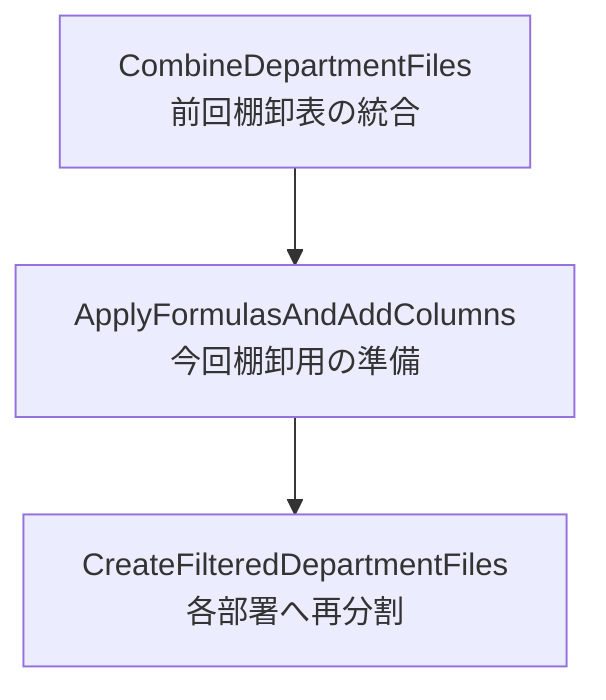

# 棚卸し業務用VBAの構成・処理分離・計算式入力・命名方針まとめ

このチャットでは、棚卸し業務で使用している既存VBA `CombineDepartmentFiles` の役割を確認したうえで、今後追加したい処理である「PurchaseItemListシートのコピー」「テーブル列への計算式入力」「新規列追加」の扱い方、さらにそれらを既存マクロへ組み込むか別マクロへ分離するか、モジュール名をどうするかまで整理した。

## 1. 棚卸し業務全体の処理フロー

前提となる棚卸し業務は、次の3段階で構成されている。


具体的には以下の流れ。

|段階|処理|主な役割|
|---|---|---|
|1|`CombineDepartmentFiles`|前回分の各部署の棚卸表を1つに統合|
|2|今回分の準備処理|新規列追加、既存列への計算式入力・値から数式への置換など|
|3|`CreateFilteredDepartmentFiles`|管理部署ごとに棚卸表を再分割し、各担当者向けファイルを作成|

このうち、特に「2. 今回分の準備処理」をどこに持たせるかが主要な検討テーマとなった。

---

## 2. 既存マクロ `CombineDepartmentFiles` の役割

提供されたVBAの中心は、標準モジュール：

```text
CombineDepartmentFiles
```

であり、主プロシージャも同名の：

```vba
Sub CombineDepartmentFiles()
```

となっている。

### 主な処理内容

`CombineDepartmentFiles` は次の処理を順番に実施する。

1. ユーザーにフォルダを選択させる
2. 選択したフォルダ名と親フォルダ名を取得
3. 出力先ファイル名を生成
4. 既存出力ファイルを開く、または新規作成
5. コピー先に以下のシートを準備
    - 使用
    - 不使用と廃番
    - 支給品
6. 選択フォルダ内の `*.xlsx` を順番に開く
7. 各ファイルから以下のシートを結合
    - 使用
    - 不使用と廃番
    - 支給品
8. 最初のファイルだけヘッダー込みでコピー
9. 2ファイル目以降はヘッダーを除いて追記
10. 各結合結果をExcelテーブル化
11. マクロブック内の「小計」シートをコピー
12. 小計シートへ集計用数式を追加
13. 「管理部署」シート内の対象テーブルをコピー
14. 不要な `Sheet1` を削除
15. シート順を調整
16. 出力ファイルを保存
17. 完了メッセージを表示

### 作成されるテーブル

親フォルダ名を利用して、次のようなテーブル名を作成している。

```text
棚卸表_原料_使用
棚卸表_原料_不使用と廃番
棚卸表_原料_支給品
```

または親フォルダが副資材なら：

```text
棚卸表_副資材_使用
棚卸表_副資材_不使用と廃番
棚卸表_副資材_支給品
```

---

## 3. `PurchaseItemList` シートをコピー先へ丸ごと複製する

マクロを実行しているブック、つまり：

```vba
ThisWorkbook
```

内に、

```text
PurchaseItemList
```

というシートが存在しており、これを結合後の出力ブック `destWorkbook` へ丸ごとコピーしたいという要件が追加された。

この場合、セル範囲をコピーするのではなく、ワークシート自体をコピーできる。

```vba
ThisWorkbook.Sheets("PurchaseItemList").Copy _
    After:=destWorkbook.Sheets(destWorkbook.Sheets.Count)
```

これにより、シート全体がコピーされる。

対象には一般的に、

- セル値
- 数式
- 書式
- 列幅
- 行高
- テーブル
- その他シート内オブジェクト

なども含まれる。

したがって、単純な `Cells.Copy` よりも、「シートをそのまま複製する」という目的には `.Copy` の方が適している。

---

## 4. VBAからExcelテーブルを操作するときのシート指定

話題になったのが、

> 特定のテーブル列へ数式を入力するとき、そのテーブルが存在するシート名は必要なのか

という点。

### 基本構造

ExcelのテーブルはVBA上では：

```vba
ListObject
```

として扱う。

通常は、

```vba
Set ws = destWorkbook.Sheets("使用")
Set tbl = ws.ListObjects("棚卸表_原料_使用")
```

のように、まずシートからテーブルを取得する。

その後は、`tbl` が取得済みであればシート名は不要になる。

```vba
tbl.ListColumns("RM_UID").DataBodyRange.Formula = ...
```

つまり、

```text
Workbook
  ↓
Worksheet
  ↓
ListObject
  ↓
ListColumn
  ↓
DataBodyRange
```

というオブジェクト階層になっている。

### 「シート名が絶対必要」というより「テーブルを取得するための入口」

厳密には、

> 数式入力そのものにシート名が必要なのではなく、テーブルオブジェクトを取得するために通常シートを経由する

という理解が適切。

一度：

```vba
Set tbl = ...
```

まで済めば、それ以降はテーブルそのものを操作できる。

### シートが1枚しかない場合

シートが1枚しかない場合には、

```vba
ActiveSheet.ListObjects("棚卸表_原料_使用")
```

などでも取得できる。

ただし、アクティブシート依存になるため、保守性や安全性を考えると明示的に指定する方が望ましい。

特に今回の棚卸しブックは最終的に、

- 小計
- 使用
- 不使用と廃番
- 支給品
- 管理部署
- PurchaseItemList

など複数シートを持つため、シートを明示しておく構成が適している。

---

## 5. 複数テーブルへ計算式を適用する考え方

対象として挙がったのが：

```text
棚卸表_原料_使用
棚卸表_原料_不使用と廃番
```

の2テーブル。

それぞれ別シートに存在するため、概念的には：

```vba
Set wsUsage = destWorkbook.Sheets("使用")
Set tblUsage = wsUsage.ListObjects("棚卸表_原料_使用")

Set wsUnused = destWorkbook.Sheets("不使用と廃番")
Set tblUnused = wsUnused.ListObjects("棚卸表_原料_不使用と廃番")
```

のように取得し、それぞれの `ListColumns` を操作する。

この考え方は、後に副資材にもそのまま展開可能。

---

## 6. テーブル列へ計算式を入力するとどこまで適用されるか

次のように：

```vba
tbl.ListColumns("対象列").DataBodyRange.Formula = "..."
```

とした場合、その計算式は原則として**そのテーブル列のデータ行全体**へ適用される。

例えば：

```vba
tbl.ListColumns("RM_UID").DataBodyRange.Formula = "..."
```

なら、`RM_UID` 列のヘッダーを除いた全データ行が対象になる。

`DataBodyRange` は：

```text
テーブル列
├─ ヘッダー ← 対象外
├─ データ行 ← 対象
├─ データ行 ← 対象
├─ データ行 ← 対象
└─ 合計行 ← 通常対象外
```

という範囲を意味する。

したがって、1セルずつループして入力する必要は基本的にない。

---

## 7. VBA文字列内でExcel数式を書く際のダブルクオーテーション

例として、Excel上で入力したい数式：

```excel
=CONCAT([@コード], "_", [@発注先], "_", [@[入目/規格]])
```

をVBA文字列として書く場合、そのまま：

```vba
"=CONCAT([@コード], "_", [@発注先], "_", [@[入目/規格]])"
```

とは書けない。

VBAでは文字列自体を `"` で囲むため、数式内部で使用する `"` は：

```text
" → ""
```

と2個連続で記述する必要がある。

したがって正しいVBA表記は：

```vba
"=CONCAT([@コード], ""_"", [@発注先], ""_"", [@[入目/規格]])"
```

となる。

Excelセル上では最終的に：

```excel
=CONCAT([@コード], "_", [@発注先], "_", [@[入目/規格]])
```

として入力される。

---

## 8. 「今回分の準備処理」を既存マクロへ統合するか分離するか

棚卸しフローの第2段階では、

- 新規列を追加する
- 既存列の値を計算式へ置き換える
- 特定列に計算式を入力する
- 今回棚卸用の数値列などを準備する

といった処理を予定している。

これを：

```text
CombineDepartmentFiles
```

へ含めるか、新しいマクロとして独立させるかを検討した。

### 案1：`CombineDepartmentFiles` に統合

処理：


メリットはマクロ実行回数が少ないこと。

一方で、`CombineDepartmentFiles` が、

- ファイル結合
- テーブル化
- 小計作成
- 管理部署コピー
- PurchaseItemListコピー
- 新規列追加
- 計算式入力

まで担当することになり、責務が大きくなりすぎる。

### 案2：独立したマクロを作成

こちらでは、


となる。

実行回数は：

```text
2回 → 3回
```

へ増える。

しかし、それぞれの責務が明確になる。

|マクロ|責務|
|---|---|
|`CombineDepartmentFiles`|前回の部署別棚卸表を統合|
|新規マクロ|今回棚卸用の列・計算式を準備|
|`CreateFilteredDepartmentFiles`|今回の棚卸表を部署別に分割|

この構成を推奨する方向となった。

理由は、単なる実行回数よりも、

- 処理目的の明確化
- 保守性
- 修正時の影響範囲
- デバッグのしやすさ
- 将来的な仕様変更への対応

を優先した方が良いため。

特に「結合」と「今回用データ構造の生成」は業務上も異なる工程である。

---

## 9. 新規モジュール名の検討

第2段階を独立させるにあたり、モジュール名・プロシージャ名について複数候補を検討した。

### 最初の候補：`AddFormulation`

当初：

```text
AddFormulation
```

が候補となった。

ただし、この処理は単純に数式を「追加」するだけではなく、

- 新しい列を追加する
- 既存列に計算式を入力する
- 既存の値を計算式へ置き換える

ことも含む。

そのため `AddFormulation` では処理内容を十分に表しにくいという問題が出た。

さらに英語としても、`formulation` は通常「処方・定式化・構想」といった意味が強く、Excelの「数式」を意味するなら：

```text
Formula / Formulas
```

の方が自然。

---

## 10. 検討された命名候補

既存列への計算式適用だけなら：

```text
UpdateColumnWithFormulas
ApplyFormulasToColumns
ReplaceValuesWithFormulas
```

などが候補となった。

しかし新規列の追加も含むため、さらに：

```text
AddAndUpdateColumnsWithFormulas
UpdateAndAddColumnsWithFormulas
ManageColumnsAndFormulas
ApplyFormulasAndAddColumns
```

などを検討した。

最終的にユーザーが比較的良いと感じたのが：

```text
ApplyFormulasAndAddColumns
```

だった。

この名前は、

```text
ApplyFormulas
+
AddColumns
```

という2つの処理をそのまま表現しており、実際の処理内容とも合っている。

---

## 11. `And` を抜くべきか

その後、

```text
ApplyFormulasAndAddColumns
```

の `And` が少し冗長に感じるという話になった。

候補として：

```text
ApplyFormulasAddColumns
```

も考えられた。

しかし、命名としての自然さを考えると、`And` を抜くことは必ずしも推奨されない。

### 比較

|名前|可読性|英語としての自然さ|意味の明確さ|
|---|--:|--:|--:|
|`ApplyFormulasAndAddColumns`|高い|高い|高い|
|`ApplyFormulasAddColumns`|やや低い|やや不自然|理解は可能|
|`ManageColumnsAndFormulas`|高い|高い|やや抽象的|
|`PrepareInventoryColumns`|高い|高い|業務特化|

`ApplyFormulasAddColumns` でもVBA上はもちろん問題なく使えるが、識別子は単なる短縮文字列ではなく、後からコードを読む際の説明でもある。

したがって、複数の動作を並列で表す場合には：

```text
Verb + Object + And + Verb + Object
```

の形はかなり自然。

今回であれば：

```text
ApplyFormulasAndAddColumns
```

の方が可読性と明確性では優れている。

---

## 12. 現時点での設計方針

ここまでの議論を整理すると、棚卸しマクロは次の3責務へ分割する構成が最も整理しやすい。



### 各処理の担当範囲

#### `CombineDepartmentFiles`

担当するもの：

- 部署別ファイルの読み込み
- 使用データ結合
- 不使用と廃番データ結合
- 支給品データ結合
- テーブル化
- 小計シート作成
- 管理部署コピー
- `PurchaseItemList` コピー
- シート順調整
- 保存

#### `ApplyFormulasAndAddColumns`

担当予定：

- 今回棚卸用の新規列追加
- 既存列への計算式適用
- 既存値から計算式への置換
- 原料・副資材それぞれに必要な計算列設定

#### `CreateFilteredDepartmentFiles`

担当：

- 統合・準備済みの棚卸表を管理部署単位に抽出
- 各部署の担当者が使用するファイルへ分割

---

## 13. 技術的に確認できた重要ポイント

今回の会話で確定・確認した内容は以下。

- ExcelテーブルはVBAでは `ListObject`
- 特定列は `ListColumns("列名")`
- 列のデータ部分全体は `DataBodyRange`
- `DataBodyRange.Formula` で列の全データ行へ一括で数式を設定可能
- テーブル取得時は通常その所属シートを経由する
- 一度 `ListObject` を取得すれば以後シート名は不要
- ActiveSheet依存でも可能だが、今回の用途では明示指定が安全
- VBA文字列内の `"` は `""` と記述する
- `PurchaseItemList` はシート単位で `.Copy` 可能
- `CombineDepartmentFiles` と「今回分準備処理」は責務を分離した方が保守しやすい
- 新規モジュール名としては `ApplyFormulasAndAddColumns` が処理内容を比較的正確に表している
- `And` を省略しても技術的には問題ないが、英語としての自然さ・可読性では残した方がよい

## 現時点の結論

棚卸し業務のマクロ構成は、以下の3段階に分けるのが適切。

```text
CombineDepartmentFiles
↓
ApplyFormulasAndAddColumns
↓
CreateFilteredDepartmentFiles
```

実行回数は2回から3回に増えるが、その代わりに**「結合」「今回用準備」「部署別分割」という業務工程とVBAの責務が一致する**。

今回のように今後、

- UID列
- 重複確認列
- 単価
- 金額
- Status
- 新しい年月の数量列

などが増えていく可能性を考えると、`CombineDepartmentFiles` にすべて詰め込むよりも、第2工程を独立させる設計の方が拡張しやすい。