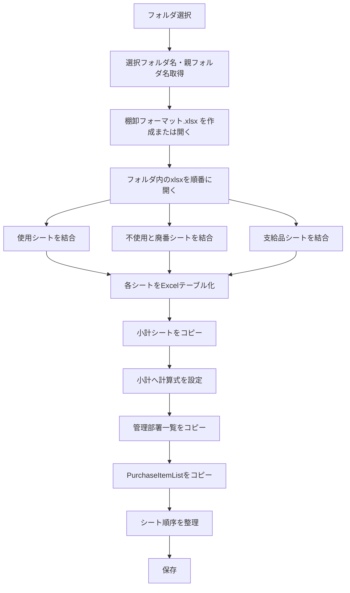
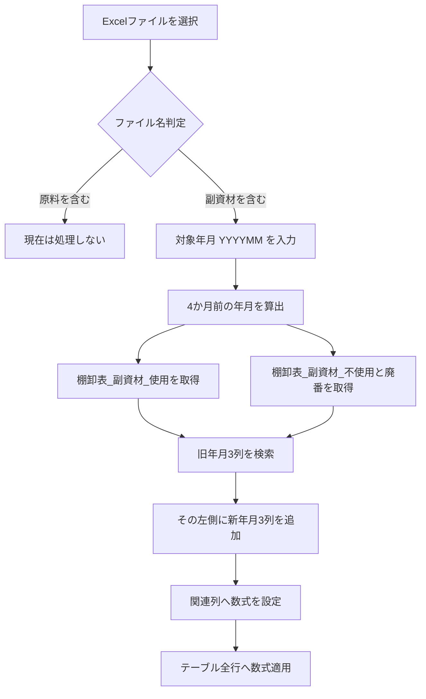
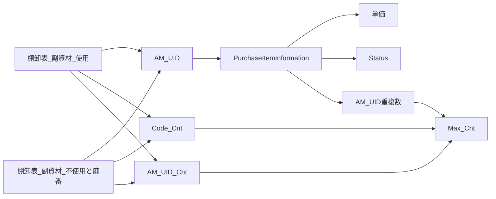
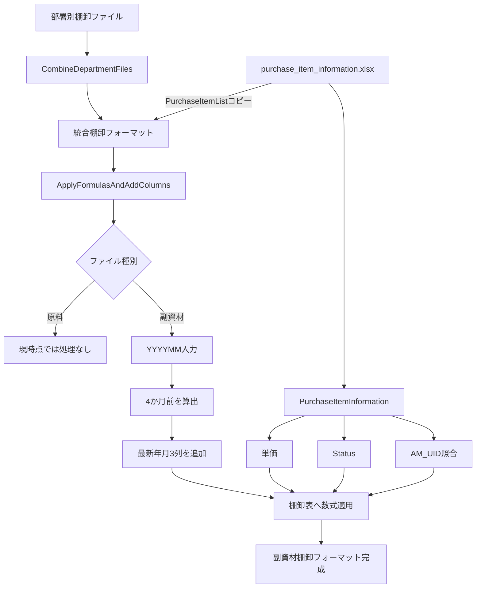

# 棚卸フォーマット統合VBA・Purchase Item Information連携・数式追加処理の整理

このチャットでは、既存の棚卸用VBA `CombineDepartmentFiles` の理解から始まり、外部ブックにある購買品目情報の取り込み方法、命名方針、さらに棚卸表へ年月別カラムと数式を追加する処理について整理・検討した。

## 1. 既存VBA `CombineDepartmentFiles` の役割

最初に提示された `CombineDepartmentFiles` は、部署ごとなどに分割されている棚卸Excelファイルを1つの棚卸フォーマットへ統合するマクロである。

大まかな処理は以下。



### 結合対象

|シート|作成されるテーブル名|
|---|---|
|使用|`棚卸表_<親フォルダ名>_使用`|
|不使用と廃番|`棚卸表_<親フォルダ名>_不使用と廃番`|
|支給品|`棚卸表_<親フォルダ名>_支給品`|

例として親フォルダ名が `副資材` の場合、

- `棚卸表_副資材_使用`
- `棚卸表_副資材_不使用と廃番`
- `棚卸表_副資材_支給品`

となる。

### その他の処理

`CombineDepartmentFiles` ではさらに、

- `ThisWorkbook` の「小計」シートをコピー
- `AddFormulasToSubtotal` で過去年月の数量・金額を集計
- 「管理部署」シートから対象事業所の管理部署一覧をコピー
- `PurchaseItemList` シートをコピー
- シート順序を調整

という処理も行っている。

最終的なシート順は、

1. 小計
2. 使用
3. 不使用と廃番
4. 支給品
5. 管理部署
6. PurchaseItemList

という設計になっている。

---

## 2. `PurchaseItemList` のコピー元変更

当初のコードでは、マクロブック `ThisWorkbook` 内の `PurchaseItemList` をコピーしていた。

### 変更前

```vba
' "PurchaseItemList"シート全体をコピー
On Error Resume Next
ThisWorkbook.Sheets("PurchaseItemList").Copy After:=destWorkbook.Sheets(destWorkbook.Sheets.Count)
On Error GoTo 0
```

これを、外部ブック

```text
C:\Users\kyoupatty029\projects\kpm\inventory\purchase_item_information.xlsx
```

から取得する仕様に変更する方針となった。

コピー対象は、

```text
PurchaseItemList
```

シート。

重要な要件は、

- コピー先シート名はコピー元と同じ
- コピー元シート内のExcelテーブルもそのままコピー
- テーブル名もコピー元と同じ

というもの。

シート単位で `.Copy` すれば、セルだけでなく、そのシートに存在する `ListObject` も含めてコピーされるため、この要件と相性がよい。

### 外部ブックからコピーする基本形

```vba
Dim purchaseItemWorkbook As Workbook
Dim purchaseItemSheet As Worksheet
Dim sourceFilePath As String

sourceFilePath = _
    "C:\Users\kyoupatty029\projects\kpm\inventory\purchase_item_information.xlsx"

Set purchaseItemWorkbook = Workbooks.Open(sourceFilePath, ReadOnly:=True)

Set purchaseItemSheet = purchaseItemWorkbook.Sheets("PurchaseItemList")

purchaseItemSheet.Copy _
    After:=destWorkbook.Sheets(destWorkbook.Sheets.Count)

purchaseItemWorkbook.Close SaveChanges:=False
```

この方法であれば、コピー元の `PurchaseItemList` シートを構造ごと `destWorkbook` に移植できる。

---

## 3. `ApplyFormulasAndAddColumns` の意味

マクロ名候補として使用されている

```text
ApplyFormulasAndAddColumns
```

について確認した。

直訳すると、

> **数式を適用し、列を追加する**

となる。

単語単位では以下。

|英語|意味|
|---|---|
|Apply|適用する|
|Formulas|数式|
|And|そして|
|Add|追加する|
|Columns|列|

実際に予定している処理も、

- 新しい年月カラムを追加
- 既存カラムへ数式を設定

という内容なので、機能を比較的正確に表している名称である。

---

## 4. `Purchase Item List` と `Purchase Item Information`

購買関連データの名称として、

- `Purchase Item List`
- `Purchase Item Information`

のどちらが適切か検討した。

対象データには、

- 発注先
- 発注単位
- 価格
- 担当部署
- 管理部署
- 使用製品

などが含まれている。

そのため、単なる「品目一覧」というよりも、各購買品目に付随するマスタ情報を保持している。

### 意味の違い

|名称|ニュアンス|今回との適合度|
|---|---|--:|
|Purchase Item List|購買品目の一覧|△|
|Purchase Item Information|購買品目に関する詳細情報|◎|

したがって、データセットやマスタ全体の名称としては、

```text
Purchase Item Information
```

の方が適切と判断した。

一方、表示用の一覧シートとして `PurchaseItemList` という名称を使用すること自体は矛盾しない。

例えば、

```text
purchase_item_information.xlsx
└─ PurchaseItemList
   └─ PurchaseItemInformation
```

のように、

- ファイル：情報管理単位
- シート：一覧表示
- テーブル：実データ

という階層で使い分ける設計も可能。

---

# 5. 新たに検討した `ApplyFormulasAndAddColumns` の処理仕様

次に、棚卸ファイルへ新しい年月列と計算式を設定するマクロの要件を整理した。

基本フローは以下。



---

## 6. ファイル種別判定

選択したExcelファイルの**ファイル名**に含まれる文字列で判定する。

### 原料

ファイル名に

```text
原料
```

が含まれている場合。

現時点では、

> 処理不要

としている。

### 副資材

ファイル名に

```text
副資材
```

が含まれている場合のみ、その後の処理を実行する。

---

# 7. 年月入力

ユーザーが処理対象年月を入力する。

提示された例は、

```text
202502
```

なので、実際に必要なのは `YYMMMM` ではなく、

```text
YYYYMM
```

の6桁形式である。

例：

|入力年月|4か月前|
|--:|--:|
|202502|202410|
|202506|202502|
|202401|202309|
|202311|202307|

VBAでは `DateAdd("m", -4, ...)` を利用すれば、年跨ぎも自動処理できる。

---

# 8. 対象テーブル

副資材ファイル内から次の2テーブルを検索する。

```text
棚卸表_副資材_使用
棚卸表_副資材_不使用と廃番
```

シート名に依存せず、ブック内の `ListObjects` からテーブル名で取得する設計が適している。

---

# 9. 年月別3カラムの追加

入力年月が

```text
202502
```

の場合、4か月前は

```text
202410
```

になる。

既存テーブルから、

```text
数量_202410
単価_202410
金額_202410
```

を探す。

その**左側**に、

```text
数量_202502
単価_202502
金額_202502
```

を追加する。

列配置のイメージは以下。

### 変更前

```text
… | 数量_202410 | 単価_202410 | 金額_202410 | …
```

### 変更後

```text
… | 数量_202502 | 単価_202502 | 金額_202502 |
    数量_202410 | 単価_202410 | 金額_202410 | …
```

つまり新しい年月ほど左側になる構造。

これは棚卸履歴を、

```text
最新 → 過去
```

の順で横方向に並べる設計になっている。

---

# 10. 設定する計算式

年月追加だけでなく、既存の管理用カラムにも計算式を設定する。

## 単価

入力年月が `202502` の場合、

```excel
=INDEX(
    PurchaseItemInformation,
    MATCH([@[AM_UID]], PurchaseItemInformation[AM_UID], 0),
    MATCH("単価", PurchaseItemInformation[#見出し], 0)
)
```

役割は、

1. 現在行の `AM_UID` を取得
2. `PurchaseItemInformation[AM_UID]` から一致する行を検索
3. `単価` 列を検索
4. 該当単価を取得

というもの。

---

## 金額

提示された式は、

```excel
=[@[数量_202410]]*[@[単価_202410]]
```

だった。

ただし、今回追加するカラムが

```text
金額_202502
```

であることを考えると、通常は

```excel
=[@[数量_202502]]*[@[単価_202502]]
```

とする方が自然である。

ここは実装時に明確にする必要がある重要ポイント。

---

## AM_UID

```excel
=TEXTJOIN("_", FALSE, [@コード], [@発注先])
```

生成例：

```text
123456_株式会社ABC
```

`コード` と `発注先` の組み合わせを一意識別子として利用する。

---

## Code_Cnt

```excel
=COUNTIF([コード],[@コード])
```

同じコードが現在の棚卸テーブル内に何件存在するかをカウントする。

---

## AM_UID_Cnt

```excel
=COUNTIF([AM_UID],[@[AM_UID]])
```

同一 `AM_UID` が棚卸表内に何件あるかを判定する。

---

## AM_Dup_Cnt_PII

```excel
=COUNTIF(PurchaseItemInformation[AM_UID], [@[AM_UID]])
```

`PurchaseItemInformation` 側に同じ `AM_UID` が何件存在するか確認する。

つまり、

```text
棚卸表側
      ↓ AM_UID
PurchaseItemInformation側
```

の対応重複チェックに利用する。

---

## Max_Cnt

提示された式：

```excel
=MAX(棚卸表_副資材_使用[@[Code_Cnt]:[AM_Dup_Cnt_PII]])
```

`Code_Cnt` から `AM_Dup_Cnt_PII` までの複数の重複判定値の最大値を取得する。

例えば、

|Code_Cnt|AM_UID_Cnt|AM_Dup_Cnt_PII|Max_Cnt|
|--:|--:|--:|--:|
|1|1|1|1|
|2|1|1|2|
|1|2|1|2|
|1|1|3|3|

という形で、何らかの重複問題があれば `Max_Cnt > 1` になる。

### 注意点

式には、

```text
棚卸表_副資材_使用
```

が固定で含まれている。

したがって `棚卸表_副資材_不使用と廃番` に同じ式を入れる場合、そのままでよいのか、それとも、

```text
棚卸表_副資材_不使用と廃番
```

へ変更するのかは確認が必要。

以前の要件では「使用」テーブル用として固定していたため、この点は今後の実装で区別する必要がある。

---

## Current Status

```excel
=INDEX(
    PurchaseItemInformation,
    MATCH([@[AM_UID]], PurchaseItemInformation[AM_UID], 0),
    MATCH("Status", PurchaseItemInformation[#見出し], 0)
)
```

現在の `AM_UID` に対応する `Status` を `PurchaseItemInformation` から取得する。

---

# 11. 各データの関係

今回の構造を整理すると以下になる。



つまり `PurchaseItemInformation` が、副資材棚卸データに対する**マスターデータ**として機能する。

---

# 12. 現時点で想定されるマスタ構成

データの性質から考えると、次の構成が整理しやすい。

|対象|名称|
|---|---|
|Excelファイル|`purchase_item_information.xlsx`|
|Excelシート|`PurchaseItemList`|
|Excelテーブル|`PurchaseItemInformation`|
|主な照合キー|`AM_UID`|

`PurchaseItemInformation` には少なくとも、

```text
コード
発注先
発注単位
単価
担当部署
管理部署
使用製品
AM_UID
Status
```

などが存在する想定。

---

# 13. 先に提示されたVBAコードについての注意点

チャット途中で `ProcessInventoryFile` / `ProcessTable` のコード案を提示したが、そのまま完成版として利用するには修正が必要な点がある。

特に重要なのは以下。

|箇所|問題|
|---|---|
|年月入力|コードでは4桁 `YYMM` を想定していたが、要件は `YYYYMM`|
|新規列位置|要件は「4か月前3列の左側」だが、提示コードは位置計算が不適切|
|数量列|数量は入力欄と考えられるため、旧数量を数式コピーするかは未確定|
|単価式|`FormulaR1C1` と構造化参照式の扱いが混在|
|金額式|要件上の年月との整合性確認が必要|
|`Max_Cnt`|「使用」テーブル名固定でよいか未確定|
|既存列|`AM_UID` 等が存在しない場合の処理が未実装|
|保存|元ファイルを上書きする設計なので、運用上注意が必要|

したがって、途中で提示したコードは**仕様を具体化するための初期案**として扱い、最終実装時には整理し直した方がよい。

---

# 14. 現時点で確定している仕様

今回の会話から確定度の高い内容をまとめると、次のようになる。

- `CombineDepartmentFiles` は部署別棚卸ファイルを統合する。
- `PurchaseItemList` は今後 `ThisWorkbook` ではなく `purchase_item_information.xlsx` からコピーする。
- コピー元ファイル：  
    `C:\Users\kyoupatty029\projects\kpm\inventory\purchase_item_information.xlsx`
- コピー元シート：  
    `PurchaseItemList`
- コピー先でもシート名・テーブル名はコピー元を維持する。
- 購買マスタ全体の概念名は `Purchase Item Information` が適切。
- 棚卸後処理マクロ名として `ApplyFormulasAndAddColumns` を使用する方向。
- 選択ファイル名から `原料` / `副資材` を判定する。
- 現時点では原料処理は実装しない。
- 副資材のみ処理する。
- 対象年月は `YYYYMM`。
- 4か月前の年月を自動算出する。
- 対象テーブルは、
    - `棚卸表_副資材_使用`
    - `棚卸表_副資材_不使用と廃番`
- 4か月前の数量・単価・金額列の左側に最新年月3列を追加する。
- `AM_UID` を `コード + 発注先` で生成する。
- `PurchaseItemInformation` から単価・Statusを取得する。
- `Code_Cnt`、`AM_UID_Cnt`、`AM_Dup_Cnt_PII` を重複確認に利用する。
- `Max_Cnt` で重複判定値を集約する。

## 現時点の処理全体像



### 今後実装前に確定させるべき点

最終コードを作る前に特に重要なのは次の4点である。

1. `金額_202502` は `数量_202502 × 単価_202502` でよいか。
2. `数量_202502` は空欄の入力列として作るのか、旧数量をコピーするのか。
3. `Max_Cnt` は「不使用と廃番」テーブルでも自身のテーブルを参照するのか。
4. `AM_UID`、`Code_Cnt` などの管理列が存在しない場合、マクロ側で新規作成するのか。

ここを確定すれば、`ApplyFormulasAndAddColumns` の最終仕様をかなり明確に固定できる。