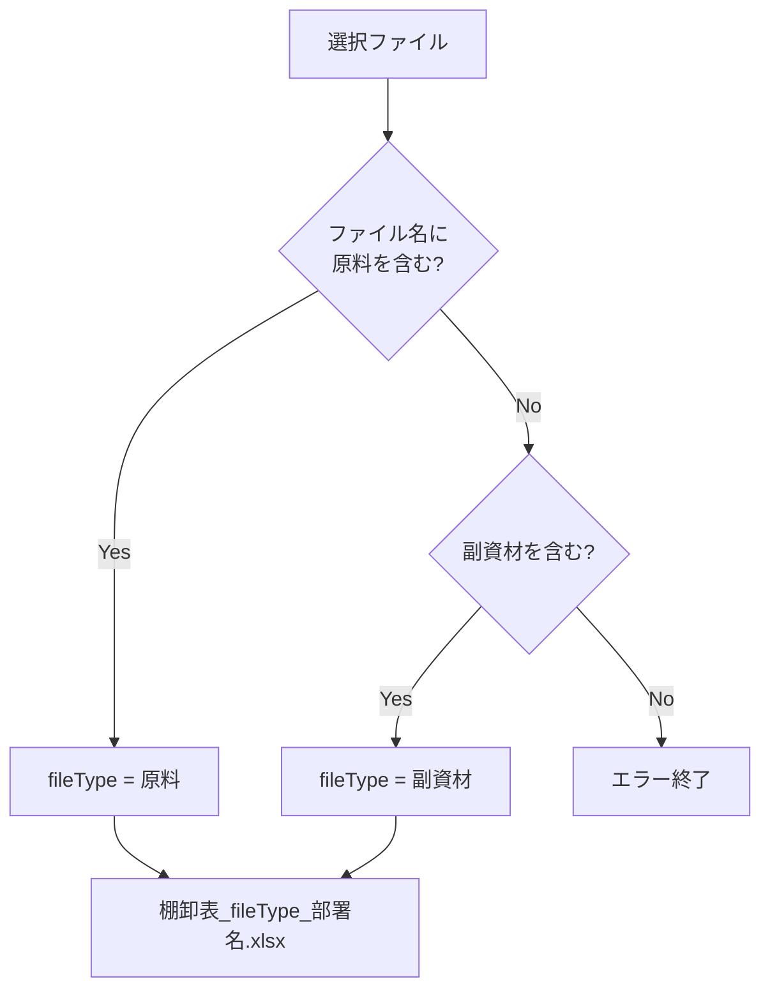
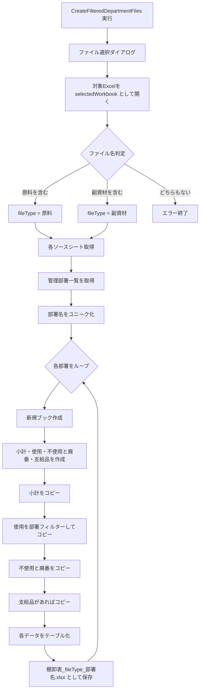

# 棚卸準備用VBAの整理まとめ

このチャットでは、棚卸業務の準備に使用するVBAについて、既存の部署別分割マクロを起点に、**外部Excelファイルを選択して処理する構成への変更、原料／副資材の判定、出力ファイル名の組み立て、シートコピー、テーブル化、命名方針**までを整理した。

全体としては、各部署の棚卸ファイルを一度結合し、必要な加工を行った後、再び各部署別ファイルへ分割するためのマクロ群を、1つのマクロブックにまとめる方向で検討している。

## 全体の目的と業務フロー

棚卸準備では、主に次の2つのマクロを使用する。

|マクロ名|役割|
|---|---|
|`CombineDepartmentFiles`|各部署ごとの棚卸ファイルを1つのファイルへ結合する|
|`CreateFilteredDepartmentFiles`|結合済みデータを「管理部署」でフィルターし、各部署ごとのExcelファイルへ再分割する|

これらを1つのマクロファイルにまとめる方針とした。


マクロファイル名については複数案を検討したが、最終的に機能を直接表現する

`InventoryDataCombinerSplitter`

という名称を採用した。

「Inventory Data」を「Combine」と「Split」するマクロであることが分かりやすく、用途にも合っている。

## 元となった `CreateFilteredDepartmentFiles`

最初に提示されたマクロは、マクロブック自身である `ThisWorkbook` の以下のシートを使用する構成だった。

- `管理部署一覧`
- `使用`
- `不使用と廃番`

処理は次の流れ。

1. `管理部署一覧` シートのA列から部署名を取得
2. `Collection` を使って部署名をユニーク化
3. `使用`、`不使用と廃番` シートのデータ範囲を取得
4. 各シートから「管理部署」列を検索
5. 部署ごとに新規Excelブックを作成
6. `AutoFilter` で対象部署だけに絞り込む
7. 可視セルを新規ブックへコピー
8. `棚卸表_原料_部署名.xlsx` の形式で保存

部署名のユニーク化では、次の仕組みを使用していた。

```vba
On Error Resume Next

For Each cell In rng
    If cell.Value <> "" Then
        departmentList.Add cell.Value, CStr(cell.Value)
    End If
Next cell

On Error GoTo 0
```

`Collection.Add` のキーに部署名を指定し、重複キーによるエラーを `On Error Resume Next` で無視することで、ユニークな部署一覧を作成している。

## 外部Excelファイルを選択して処理する構成

当初のコードでは、

```vba
ThisWorkbook.Sheets(...)
```

を参照していたが、実際にはマクロブックとは別にあるExcelファイルを選択し、そのファイルを基に分割処理したいという要件になった。

そのため、`Application.GetOpenFilename` を使う構成を検討した。

基本形は次のとおり。

```vba
Dim selectedFile As String
Dim selectedWorkbook As Workbook

selectedFile = Application.GetOpenFilename( _
    "Excel Files (*.xlsx), *.xlsx", _
    , _
    "エクセルファイルを選択してください")

If selectedFile = "False" Then
    MsgBox "ファイルが選択されませんでした。処理を終了します。", vbExclamation
    Exit Sub
End If

Set selectedWorkbook = Workbooks.Open(selectedFile)
```

以降は、

```vba
Set wsSourceUsage = selectedWorkbook.Sheets("使用")
Set wsSourceUnused = selectedWorkbook.Sheets("不使用と廃番")
```

のように、`selectedWorkbook` をデータソースとして使用する。

この変更によって、`InventoryDataCombinerSplitter.xlsm` 自体には実データを持たせず、処理対象ファイルを都度選択できる構成にできる。

## 「原料」「副資材」の自動判別

選択対象となるファイルは、例えば次の4種類。

|ファイル名|
|---|
|`棚卸フォーマット_石切_原料.xlsx`|
|`棚卸フォーマット_石切_副資材.xlsx`|
|`棚卸フォーマット_本社・６丁目_原料.xlsx`|
|`棚卸フォーマット_本社・６丁目_副資材.xlsx`|

ファイル名に必ず、

- `原料`
- `副資材`

のどちらかが含まれるため、その文字列からファイル種別を判定する方針とした。

判定結果は後で出力ファイル名に使うため、`fileType` に保存する。

```vba
Dim fileType As String
Dim posGenryo As Long
Dim posFukushizai As Long

posGenryo = InStr(selectedFile, "原料")
posFukushizai = InStr(selectedFile, "副資材")

If posGenryo > 0 Then
    fileType = "原料"

ElseIf posFukushizai > 0 Then
    fileType = "副資材"

Else
    MsgBox "選択されたファイル名に「原料」または「副資材」が含まれていません。", vbCritical
    Exit Sub
End If
```

`InStr` は、対象文字列の中で指定文字列が何文字目に存在するかを返す。

存在しない場合は `0`。

そのため、

```vba
If InStr(selectedFile, "原料") > 0 Then
```

のような判定も可能。

### `posGenryo` の `pos`

`pos` は、

**position**

の略。

つまり、

```text
posGenryo
```

は「原料という文字列が存在する位置」という意味になる。

ただし、今回の目的は「位置そのもの」を後で使うわけではなく、存在判定だけなので、さらに簡略化して直接 `InStr` を条件式に書くこともできる。

例えば、

```vba
If InStr(selectedFile, "原料") > 0 Then
    fileType = "原料"
ElseIf InStr(selectedFile, "副資材") > 0 Then
    fileType = "副資材"
End If
```

でも成立する。

## 出力ファイル名への `fileType` 利用

判定した `fileType` は、部署別ファイルを保存するときに利用する。

```vba
.SaveAs fileName:=currentDirectory _
    & "\棚卸表_" _
    & fileType _
    & "_" _
    & departmentName _
    & ".xlsx"
```

例えば、

```text
fileType = 原料
departmentName = 石切
```

なら、

```text
棚卸表_原料_石切.xlsx
```

になる。

副資材なら、

```text
棚卸表_副資材_石切.xlsx
```

となる。



## `.xlsm` と `.xlsx` の `SaveAs`

次のコードは、マクロ有効ブック `.xlsm` 用。

```vba
destWorkbook.SaveAs destFileName, _
    FileFormat:=xlOpenXMLWorkbookMacroEnabled
```

通常の `.xlsx` として保存する場合は、

```vba
destWorkbook.SaveAs destFileName, _
    FileFormat:=xlOpenXMLWorkbook
```

とする。

対応関係は以下。

|保存形式|VBA定数|
|---|---|
|`.xlsx`|`xlOpenXMLWorkbook`|
|`.xlsm`|`xlOpenXMLWorkbookMacroEnabled`|

今回、部署ごとに生成する棚卸ファイルにはマクロを含める必要がないため、基本的には `.xlsx` が適切。

## 「管理部署」の英語名と変数名

「管理部署」の英訳として、

**Managing Department**

を候補とした。

ワークシート変数名について、

```vba
ws
```

だけでは意味が分かりにくい一方、

```vba
wsManagingDepartment
```

は少し長いのではないか、という検討を行った。

結論として、`wsManagingDepartment` 程度の長さは十分許容範囲。

VBAでは、短さよりも「何を示す変数なのか」が分かるほうが保守性が高い。

短縮する場合は、

```vba
wsDept
wsMngDept
```

なども候補。

ただし、現在のコードのように複数シートを扱う場合、

```vba
wsSourceUsage
wsSourceUnused
wsSourceSubtotal
```

といった明示的な名前のほうが、後からコードを読み返したときに理解しやすい。

## 「小計」シートのコピー

処理対象ブックから、

```vba
Set wsSourceSubtotal = selectedWorkbook.Sheets("小計")
```

として元の「小計」シートを取得する。

新規ブックにはすでに、

```vba
With newWorkbook
    .Sheets(1).Name = "小計"
    .Sheets.Add(After:=.Sheets("小計")).Name = "使用"
    .Sheets.Add(After:=.Sheets("使用")).Name = "不使用と廃番"
    .Sheets.Add(After:=.Sheets("不使用と廃番")).Name = "支給品"
End With
```

という構造を作る方針。

このとき、

```vba
newWorkbook.Sheet("小計") = wsSourceSubtotal
```

のような代入はVBAではできない。

既に存在する「小計」シートへ元シートの内容をコピーする場合は、

```vba
wsSourceSubtotal.Cells.Copy _
    Destination:=newWorkbook.Sheets("小計").Cells
```

とする。

全体では、

```vba
Set wsSourceSubtotal = selectedWorkbook.Sheets("小計")

With newWorkbook
    .Sheets(1).Name = "小計"

    wsSourceSubtotal.Cells.Copy _
        Destination:=.Sheets("小計").Cells

    .Sheets.Add(After:=.Sheets("小計")).Name = "使用"
    .Sheets.Add(After:=.Sheets("使用")).Name = "不使用と廃番"
    .Sheets.Add(After:=.Sheets("不使用と廃番")).Name = "支給品"

    .SaveAs fileName:=currentDirectory _
        & "\棚卸表_" _
        & fileType _
        & "_" _
        & departmentName _
        & ".xlsx"
End With
```

という形になる。

ただし、この方法は**セル内容をコピーする方法**であり、シートそのものを完全コピーする場合とは意味が異なる。

シートのタブ色、ページ設定、図形なども含めて完全に複製したい場合は、

```vba
wsSourceSubtotal.Copy
```

系の処理を使う必要がある。

今回の会話では、既に作成した「小計」シートへ中身を丸ごと移す方針として `Cells.Copy` を検討した。

## 部署別データのコピー

部署別分割では、各シートの「管理部署」列を `AutoFilter` で絞り込み、可視セルだけをコピーする。

### 使用

```vba
sourceDataUsage.AutoFilter _
    Field:=colNumUsage, _
    Criteria1:=departmentName

sourceDataUsage.SpecialCells(xlCellTypeVisible).Copy _
    Destination:=newWorkbook.Sheets("使用").Range("A1")

wsSourceUsage.AutoFilterMode = False
```

### 不使用と廃番

```vba
sourceDataUnused.AutoFilter _
    Field:=colNumUnused, _
    Criteria1:=departmentName

sourceDataUnused.SpecialCells(xlCellTypeVisible).Copy _
    Destination:=newWorkbook.Sheets("不使用と廃番").Range("A1")

wsSourceUnused.AutoFilterMode = False
```

### 支給品

「支給品」については、該当列が存在する場合だけ処理する構成。

```vba
If colNumSupplies > 0 Then

    sourceDataSupplies.AutoFilter _
        Field:=colNumSupplies, _
        Criteria1:=departmentName

    sourceDataSupplies.SpecialCells(xlCellTypeVisible).Copy _
        Destination:=newWorkbook.Sheets("支給品").Range("A1")

End If
```

元コードではここで、

```vba
wsSourceUnused.AutoFilterMode = False
```

となっていたが、「支給品」をフィルターしているのであれば、本来は支給品側のシート変数、

```vba
wsSourceSupplies.AutoFilterMode = False
```

にするのが自然。

これは今後コードを完成させる際に修正したほうがよい箇所。

## コピーしたデータのテーブル化

コピーした各シートのデータを、通常のセル範囲ではなくExcelテーブル、つまり `ListObject` に変換する方法も検討した。

基本形は、

```vba
Set tblUsage = .ListObjects.Add( _
    xlSrcRange, _
    .Range("A1").CurrentRegion, _
    , _
    xlYes)
```

となる。

`xlYes` は「1行目をヘッダーとして扱う」という指定。

### 使用

```vba
With newWorkbook.Sheets("使用")
    Dim tblUsage As ListObject

    Set tblUsage = .ListObjects.Add( _
        xlSrcRange, _
        .Range("A1").CurrentRegion, _
        , _
        xlYes)

    tblUsage.Name = "Table_Usage"
End With
```

### 不使用と廃番

```vba
With newWorkbook.Sheets("不使用と廃番")
    Dim tblUnused As ListObject

    Set tblUnused = .ListObjects.Add( _
        xlSrcRange, _
        .Range("A1").CurrentRegion, _
        , _
        xlYes)

    tblUnused.Name = "Table_Unused"
End With
```

### 支給品

```vba
With newWorkbook.Sheets("支給品")
    Dim tblSupplies As ListObject

    Set tblSupplies = .ListObjects.Add( _
        xlSrcRange, _
        .Range("A1").CurrentRegion, _
        , _
        xlYes)

    tblSupplies.Name = "Table_Supplies"
End With
```

## ヘッダーしかない場合の扱い

部署によっては、

```text
ヘッダーのみ
データ行なし
```

というケースが発生する可能性がある。

この場合でもExcelテーブル自体は作成可能だが、`CurrentRegion` やコピー後の範囲判定との組み合わせで想定外の挙動が起きないように注意する必要がある。

会話では、一旦「データ行が存在するときだけテーブル化する」案を検討した。

例えば、

```vba
If Application.WorksheetFunction.CountA( _
    .Range("A2:A" & .Cells(.Rows.Count, "A").End(xlUp).Row)) > 0 Then

    Set tblUsage = .ListObjects.Add( _
        xlSrcRange, _
        .Range("A1").CurrentRegion, _
        , _
        xlYes)

End If
```

ただし、この方式では**ヘッダーしかない場合はテーブル化しない**。

ユーザーの元の要望は、

> ヘッダーしかない1行の状態でもテーブル化したい

という方向なので、最終実装ではここを再検討する必要がある。

つまり、現在の論点は次の2案。

|方針|結果|
|---|---|
|データ行がある場合のみテーブル化|安全だが、ヘッダーだけの部署はテーブルにならない|
|ヘッダーだけでもテーブル化|出力形式を統一できるが、範囲指定を慎重に設計する必要あり|

棚卸ファイルとして構造を統一するなら、後者のほうが扱いやすい可能性が高い。

## `inventory_prep_macro` という名称

フォルダ名またはファイル名として、

```text
inventory_prep_macro
```

も検討した。

この名前からは、

- `inventory` = 在庫・棚卸
- `prep` = preparation、準備
- `macro` = マクロ

と読み取れるため、

**棚卸業務の事前準備を自動化するマクロ**

という意味に解釈できる。

特に、今回行っている、

- 部署別ファイルの結合
- データ加工
- 部署別ファイルへの再分割
- 棚卸用ファイル生成

といった作業をまとめるフォルダ名としては自然。

一方、

```text
InventoryDataCombinerSplitter.xlsm
```

は具体的なマクロブック名として適しており、

```text
inventory_prep_macro
```

はプロジェクトフォルダ名として使い分ける構成も分かりやすい。

例えば、

```text
inventory_prep_macro/
├─ InventoryDataCombinerSplitter.xlsm
├─ input/
├─ output/
└─ archive/
```

のような構成にできる。

## 現時点の構成イメージ

ここまでの内容をまとめると、`CreateFilteredDepartmentFiles` は最終的に次のような処理になる。



## 現時点で確定していること

- `CombineDepartmentFiles` と `CreateFilteredDepartmentFiles` を1つのマクロブックにまとめる。
- マクロブック名は **`InventoryDataCombinerSplitter`** を採用。
- 処理対象はマクロブック自身ではなく、ファイル選択ダイアログからExcelファイルを選ぶ構成にする。
- 選択ファイル名から `原料` / `副資材` を自動判別し、`fileType` に格納する。
- 出力ファイル名は概ね次の形式。
    - `棚卸表_原料_部署名.xlsx`
    - `棚卸表_副資材_部署名.xlsx`
- 出力形式は通常の `.xlsx` とし、`FileFormat:=xlOpenXMLWorkbook` を使用する。
- 出力ブックには少なくとも、
    - `小計`
    - `使用`
    - `不使用と廃番`
    - `支給品`  
        を用意する方向。
- 「小計」は元ファイルの `小計` シートをコピーする。
- 「使用」「不使用と廃番」「支給品」は管理部署でフィルターしてコピーする。
- コピー後のデータはExcelテーブル化する方向。

## 今後詰めたほうがよい点

現時点で未確定または修正候補なのは次の点。

- ヘッダーしか存在しない部署データも、必ずテーブルとして出力するか。
- テーブル名を、
    - `Table_Usage`
    - `Table_Unused`
    - `Table_Supplies`  
        のような英語名にするか、元の棚卸テーブル名に合わせるか。
- `小計` シートについて、単純に `Cells.Copy` するのか、シートそのものを完全コピーするのか。
- `支給品` のフィルター解除部分にある
    ```vba
    wsSourceUnused.AutoFilterMode = False
    ```
    は、`wsSourceSupplies` に修正する必要がある可能性が高い。
- 保存先を `ThisWorkbook.Path` とするのか、選択したファイルと同じフォルダにするのか。
- 既存ファイルと同名になった場合の上書き制御。
- `原料` と `副資材` でシート構成やテーブル名が異なる場合の分岐設計。

今回の設計は、単なる「部署別ファイル分割マクロ」から、**棚卸準備全体を担う `InventoryDataCombinerSplitter` という独立したマクロツール**へ発展している。今後は、この内容を基準に `CreateFilteredDepartmentFiles` の完成版コードへ整理していくのが自然です。