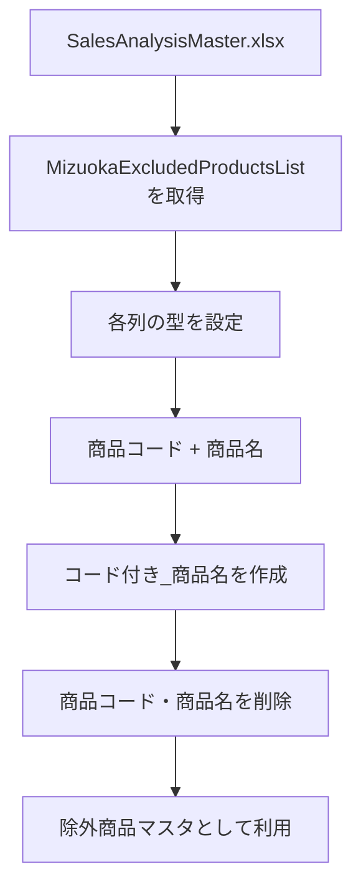

# Power Query 詳細コードのリファクタリング方針まとめ

このチャットでは、Power Query の詳細エディターに記述する M コードについて、主に**ステップ名の命名規則・コメントの付け方・カラム名の扱い**を整理しながら、複数のクエリをリファクタリングしました。

最終的な方針は、次のように整理できます。

- ステップ名は英語の **PascalCase**
- カラム名は**元の日本語名を維持**
- コメントは**日本語**
- コメントは各ステップすべてではなく、**要所にだけ付ける**
- Power Query の処理内容そのものは極力変更せず、可読性と命名を改善する
- Excel テーブル名や既存のクエリ名・関数名は、既存仕様を尊重してそのまま使う


## 確定したリファクタリングルール

今回のやり取りを通じて、コード整形時のルールがかなり明確になりました。

|項目|方針|例|
|---|---|---|
|ステップ名|英語 + PascalCase|`ソース` → `Source`|
|型変更|`ChangedType`|`変更された型` → `ChangedType`|
|列選択|`SelectedColumns`|`削除された他の列` → `SelectedColumns`|
|列削除|`RemovedColumns`|`削除された列` → `RemovedColumns`|
|カスタム列追加|`AddedCustomColumn`|`追加されたカスタム` → `AddedCustomColumn`|
|展開|`Expanded...`|`#"展開された GetColumnDetails"` → `ExpandedGetColumnDetails`|
|カラム名|原則変更しない|`"商品名"` は `"商品名"` のまま|
|コメント|日本語|`// 必要な列のみを選択`|
|コメント量|要所のみ|全ステップへの逐語的コメントは避ける|

途中、一度カラム名まで英語化する案を提示しましたが、これはユーザーの意図と異なっていました。その後、**カラム名は元のまま保持する**方針に修正しました。

またコメントについても、最初は各ステップへ細かく付けていましたが、最終的には**大きな処理単位だけに日本語コメントを付ける**スタイルへ調整しました。

## `GetColumnDetails` を使った列情報取得クエリ

最初に扱ったコードは、`ReadCleanedDataTbl` の列情報を `GetColumnDetails` カスタム関数によって取得するクエリでした。

元コードでは、日本語の自動生成ステップ名が使われていました。

```powerquery
let
    ソース = ReadCleanedDataTbl,
    保存された先頭行 = Table.FirstN(ソース,1),
    呼び出されたカスタム関数 = Table.AddColumn(保存された先頭行, "GetColumnDetails", each GetColumnDetails(ReadCleanedDataTbl)),
    削除された他の列 = Table.SelectColumns(呼び出されたカスタム関数,{"GetColumnDetails"}),
    #"展開された GetColumnDetails" = Table.ExpandTableColumn(削除された他の列, "GetColumnDetails", {"ColumnName", "ColumnType"}, {"ColumnName", "ColumnType"})
in
    #"展開された GetColumnDetails"
```

リファクタリング後は次の構成になりました。

```powerquery
let
    Source = ReadCleanedDataTbl,

    // 先頭行を抽出して操作対象を最小限にする
    FirstRow = Table.FirstN(Source, 1),

    // カスタム関数から列情報を取得
    InvokedCustomFunction = Table.AddColumn(
        FirstRow,
        "GetColumnDetails",
        each GetColumnDetails(ReadCleanedDataTbl)
    ),

    SelectedColumns = Table.SelectColumns(
        InvokedCustomFunction,
        {"GetColumnDetails"}
    ),

    ExpandedGetColumnDetails = Table.ExpandTableColumn(
        SelectedColumns,
        "GetColumnDetails",
        {"ColumnName", "ColumnType"},
        {"ColumnName", "ColumnType"}
    )
in
    ExpandedGetColumnDetails
```

ここで確立した主な命名は以下です。

|元ステップ|リファクタリング後|
|---|---|
|`ソース`|`Source`|
|`保存された先頭行`|`FirstRow`|
|`呼び出されたカスタム関数`|`InvokedCustomFunction`|
|`削除された他の列`|`SelectedColumns`|
|`#"展開された GetColumnDetails"`|`ExpandedGetColumnDetails`|

なお、`削除された他の列` は実際には「他の列を削除」というより、`Table.SelectColumns` で必要な列だけを選択している処理なので、`RemovedOtherColumns` よりも **`SelectedColumns` の方が処理内容を正確に表現する**という整理になっています。

## `ProductClassificationList` のクエリ

次に、Excel ブック内の `ProductClassificationList` テーブルを読み込むクエリを扱いました。

元コードは以下です。

```powerquery
let
    ソース = Excel.CurrentWorkbook(){[Name="ProductClassificationList"]}[Content],
    変更された型 = Table.TransformColumnTypes(ソース,{{"ID", type text}, {"分類", type text}}),
    追加されたカスタム = Table.AddColumn(変更された型, "ID付き_分類", each [ID]&"："&[分類], type text)
in
    追加されたカスタム
```

このコードでは、ステップ名のみを PascalCase に変更するのが基本方針です。

```powerquery
let
    // ブック内の分類マスタを取得
    Source = Excel.CurrentWorkbook(){[Name="ProductClassificationList"]}[Content],

    ChangedType = Table.TransformColumnTypes(
        Source,
        {
            {"ID", type text},
            {"分類", type text}
        }
    ),

    // IDと分類を連結した識別用カラムを追加
    AddedCustomColumn = Table.AddColumn(
        ChangedType,
        "ID付き_分類",
        each [ID] & "：" & [分類],
        type text
    )
in
    AddedCustomColumn
```

途中の提案では `"分類"` を `"Classification"` に、`"ID付き_分類"` を `"IDWithClassification"` に変更していましたが、後の方針からするとこれは行わず、**列名は既存のまま保持する**のが正しい形です。

## `SalesAnalysisProductCategories_Old.xlsx` の商品カテゴリーマスタ

続いて、旧商品カテゴリーマスタファイルを読み込むクエリを扱いました。

元コード：

```powerquery
let
    ソース = Excel.Workbook(File.Contents("C:\Users\kyoupatty029\data_repository\master_data\SalesAnalysisProductCategories_Old.xlsx"), null, true),
    ProductCategoryList_Table = ソース{[Item="ProductCategoryList",Kind="Table"]}[Data],
    変更された型 = Table.TransformColumnTypes(ProductCategoryList_Table,{{"売上明細商品コード", type text}, {"売上明細商品名", type text}, {"コード付き商品名", type text}, {"カテゴリー", type text}, {"チェック日", type any}, {"備考", Int64.Type}, {"重複", Int64.Type}}),
    削除された他の列 = Table.SelectColumns(変更された型,{"コード付き商品名", "カテゴリー"})
in
    削除された他の列
```

リファクタリング後は、テーブル取得ステップから `_Table` を外し、PascalCase に揃える形にしました。

```powerquery
let
    // 商品カテゴリーマスタを読み込む
    Source = Excel.Workbook(
        File.Contents(
            "C:\Users\kyoupatty029\data_repository\master_data\SalesAnalysisProductCategories_Old.xlsx"
        ),
        null,
        true
    ),

    ProductCategoryListTable = Source{
        [Item = "ProductCategoryList", Kind = "Table"]
    }[Data],

    ChangedType = Table.TransformColumnTypes(
        ProductCategoryListTable,
        {
            {"売上明細商品コード", type text},
            {"売上明細商品名", type text},
            {"コード付き商品名", type text},
            {"カテゴリー", type text},
            {"チェック日", type any},
            {"備考", Int64.Type},
            {"重複", Int64.Type}
        }
    ),

    // 分析に必要な列だけを残す
    SelectedColumns = Table.SelectColumns(
        ChangedType,
        {"コード付き商品名", "カテゴリー"}
    )
in
    SelectedColumns
```

このやり取りの途中で、カラム名まで英語化する案を提示しました。

たとえば、

- `"売上明細商品コード"` → `"SalesDetailProductCode"`
- `"カテゴリー"` → `"Category"`

などです。

しかし、ユーザーから「**カラム名は元のままにしておいて**」との指定があり、この方針は撤回されました。

以降は、**ステップ名のみ英語 PascalCase、カラム名は日本語のまま**というルールが確定しています。

## `OrgExcludedCompaniesList` の除外得意先マスタ

次に、`SalesAnalysisMaster.xlsx` 内の `OrgExcludedCompaniesList` を取得するクエリを扱いました。

元コード：

```powerquery
let
    ソース = Excel.Workbook(File.Contents("C:\Users\kyoupatty029\data_repository\master_data\SalesAnalysisMaster.xlsx"), null, true),
    OrgExcludedCompaniesList_Table = ソース{[Item="OrgExcludedCompaniesList",Kind="Table"]}[Data],
    変更された型 = Table.TransformColumnTypes(OrgExcludedCompaniesList_Table,{{"得意先コード", type text}, {"得意先名称", type text}, {"分析対象", type text}, {"データ追加日", type date}})
in
    変更された型
```

リファクタリング後の形は次の通りです。

```powerquery
let
    // 売上分析マスタを読み込む
    Source = Excel.Workbook(
        File.Contents(
            "C:\Users\kyoupatty029\data_repository\master_data\SalesAnalysisMaster.xlsx"
        ),
        null,
        true
    ),

    OrgExcludedCompaniesListTable = Source{
        [Item = "OrgExcludedCompaniesList", Kind = "Table"]
    }[Data],

    ChangedType = Table.TransformColumnTypes(
        OrgExcludedCompaniesListTable,
        {
            {"得意先コード", type text},
            {"得意先名称", type text},
            {"分析対象", type text},
            {"データ追加日", type date}
        }
    )
in
    ChangedType
```

このコードでは、実質的な処理は「ファイル読込 → テーブル抽出 → 型変換」の3段階です。

そのため、コメントも細かく全行へ付けるより、ファイル読込などの意味の大きい箇所だけに置く方針が適しています。

## `MizuokaExcludedProductsList` の除外商品マスタ

最後に扱ったのが、`MizuokaExcludedProductsList` のクエリです。

元コード：

```powerquery
let
    ソース = Excel.Workbook(File.Contents("C:\Users\kyoupatty029\data_repository\master_data\SalesAnalysisMaster.xlsx"), null, true),
    MizuokaExcludedProductsList_Table = ソース{[Item="MizuokaExcludedProductsList",Kind="Table"]}[Data],
    変更された型 = Table.TransformColumnTypes(MizuokaExcludedProductsList_Table,{{"商品コード", type text}, {"商品名", type text}, {"担当者名", type text}, {"データ更新日", type date}}),
    追加されたカスタム = Table.AddColumn(変更された型, "コード付き_商品名", each [商品コード]&"_"&[商品名], type text),
    削除された列 = Table.RemoveColumns(追加されたカスタム,{"商品コード", "商品名"})
in
    削除された列
```

リファクタリング後の形は次のようになります。

```powerquery
let
    // 売上分析マスタを読み込む
    Source = Excel.Workbook(
        File.Contents(
            "C:\Users\kyoupatty029\data_repository\master_data\SalesAnalysisMaster.xlsx"
        ),
        null,
        true
    ),

    MizuokaExcludedProductsListTable = Source{
        [Item = "MizuokaExcludedProductsList", Kind = "Table"]
    }[Data],

    ChangedType = Table.TransformColumnTypes(
        MizuokaExcludedProductsListTable,
        {
            {"商品コード", type text},
            {"商品名", type text},
            {"担当者名", type text},
            {"データ更新日", type date}
        }
    ),

    // 商品コードと商品名から照合用キーを作成
    AddedCustomColumn = Table.AddColumn(
        ChangedType,
        "コード付き_商品名",
        each [商品コード] & "_" & [商品名],
        type text
    ),

    RemovedColumns = Table.RemoveColumns(
        AddedCustomColumn,
        {"商品コード", "商品名"}
    )
in
    RemovedColumns
```

処理フローは以下です。



ここでも、`"商品コード"`、`"商品名"`、`"担当者名"`、`"データ更新日"`、`"コード付き_商品名"` といった既存カラム名は変更しません。

## 命名パターンとして整理できたもの

今回扱ったクエリから、今後流用できるステップ命名パターンをまとめると次のようになります。

|Power Query の処理|推奨ステップ名|
|---|---|
|ソース取得|`Source`|
|テーブル取得|`[TableName]Table`|
|先頭行取得|`FirstRow`|
|型変換|`ChangedType`|
|カスタム列追加|`AddedCustomColumn`|
|必要列だけ選択|`SelectedColumns`|
|列削除|`RemovedColumns`|
|カスタム関数呼出|`InvokedCustomFunction`|
|テーブル列展開|`Expanded[ColumnName]`|

重要なのは、**Power Query が自動生成する日本語ステップ名をそのまま英訳するのではなく、実際の処理内容に即した名前を付ける**ことです。

たとえば、

```text
削除された他の列
```

を単純に

```text
RemovedOtherColumns
```

とするのではなく、実際には `Table.SelectColumns` を使っているので、

```text
SelectedColumns
```

とした方がコードの意味が明確になります。

## コメントの最終方針

コメントについては、会話の中で次のように調整されました。

当初は、

```powerquery
// データのソースを取得
Source = ...

// テーブルの先頭行を取得
FirstRow = ...

// カスタム関数を呼び出し...
InvokedCustomFunction = ...
```

のように、ほぼすべてのステップへコメントを付けていました。

しかし、最終的には「**要所にだけコメントをつける**」方針となりました。

したがって、単純な型変換や明白な列削除まで毎回説明するのではなく、次のような箇所を優先します。

- 何のデータを読み込んでいるか
- なぜ先頭行だけに絞っているか
- なぜ結合キーを作成しているか
- カスタム関数を何のために呼んでいるか
- 後続処理上の意味が分かりにくい処理

たとえば以下のようなコメント量が適切です。

```powerquery
let
    // 売上分析マスタを読み込む
    Source = ...,

    MizuokaExcludedProductsListTable = ...,

    ChangedType = ...,

    // 商品コードと商品名から照合用キーを作成
    AddedCustomColumn = ...,

    RemovedColumns = ...
in
    RemovedColumns
```

このスタイルであれば、コメントがコードを圧迫せず、処理の意図だけを補足できます。

## 今回の到達点

このチャットを通じて、Power Query コードを今後リファクタリングするときの標準形は、ほぼ次の形に固まりました。

```powerquery
let
    // 大きな処理単位だけ日本語でコメント
    Source = ...,

    SomeTable = ...,

    ChangedType = ...,

    AddedCustomColumn = ...,

    SelectedColumns = ...
in
    SelectedColumns
```

要するに、**コード内部の処理名は英語 PascalCase、業務データとしてのカラム名は既存の日本語を維持し、コメントは日本語で必要な箇所だけ補う**、という方針です。

このルールであれば、Power Query 標準の M コードらしい読みやすさを保ちながら、業務上の日本語カラムとの対応関係も崩れません。