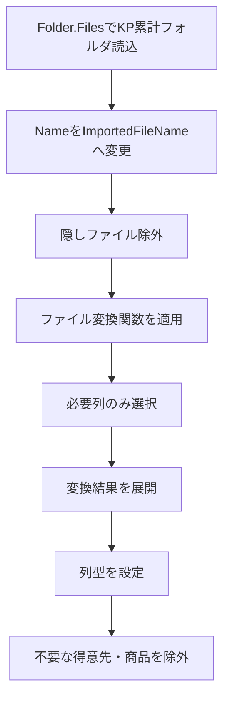
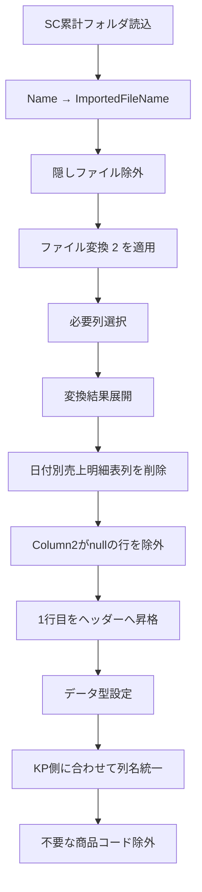
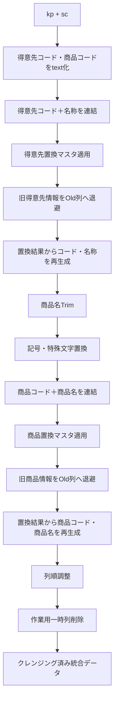
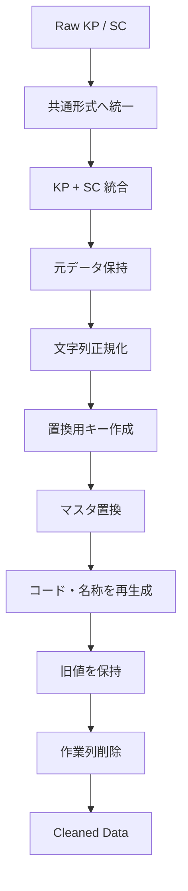

# Power Queryコードの視認性向上リファクタリングまとめ

このチャットでは、売上分析で使用している複数のPower Queryコードについて、**処理内容そのものは極力変えず、視認性・可読性・保守性を高めること**を目的としてリファクタリングを行った。

対象となったのは大きく次の3種類である。

- KP側の累計売上ファイル読込クエリ
- SC側の累計売上ファイル読込クエリ
- KP＋SCを統合し、得意先・商品情報をクレンジング／置換するクエリ

特に3つ目については、こちらから提案したリファクタリング案をベースに、ユーザー側でさらに命名を修正し、`CustomerCodeNameConcat`／`ProductCodeNameConcat` という名称を採用した。

---

## 1. 全体として採用したリファクタリング方針

元コードはPower QueryのGUI操作によって自動生成されたステップ名が多く、

```powerquery
#"Renamed Columns"
#"Filtered Hidden Files1"
#"Invoke Custom Function1"
#"Added Custom1"
#"Inserted Text Before Delimiter1"
```

のように、**「何をしたか」は分かっても「何のための処理か」がコードだけでは読み取りにくい状態**だった。

そこで、基本方針として以下を採用した。

|項目|元コード|リファクタリング後|
|---|---|---|
|ステップ名|GUI自動生成名|PascalCaseの意味のある英語名|
|コメント|ほぼなし|処理ブロック単位で追加|
|インデント|1行に長く記述|引数ごとに改行|
|型定義|横長|列ごとに縦方向へ配置|
|フィルタ条件|1行|条件単位で改行|
|一時列|GUI由来の名称|処理内容が分かる名称|
|処理構造|ステップを追わないと分からない|顧客処理・商品処理など意味単位で整理|

最終的には、単純にコードを短くするよりも、

> **後から見たときに「今どの処理をしているか」を追いやすいコード**

を優先する方向となった。

---

# 2. KP累計売上データ読込クエリ

最初の対象は、KP側の累計売上ファイルをフォルダから読み込むクエリだった。

元のソースフォルダは以下。

```text
C:\Users\kyoupatty029\projects\kpm\analysis_inspection\sales_analysis\import\org\kp\cumulative
```

処理の流れは次のとおり。



リファクタリングでは、例えば以下のようにステップ名を変更した。

|GUI生成名|リファクタリング名|意味|
|---|---|---|
|`#"Renamed Columns"`|`RenamedColumns`|列名変更|
|`#"Filtered Hidden Files1"`|`FilteredHiddenFiles`|隠しファイル除外|
|`#"Invoke Custom Function1"`|`TransformedFiles`|ファイル変換|
|`#"Removed Other Columns1"`|`SelectedColumns`|必要列選択|
|`#"Expanded Table Column1"`|`ExpandedTable`|テーブル展開|
|`#"Changed Type"`|`ChangedColumnTypes`|データ型設定|
|`#"Filtered Rows"`|`FilteredRows`|行フィルタリング|

### KP側の最終フィルタ条件

以下のデータを除外している。

```powerquery
each ([得意先コード] <> "402070")
    and ([売上明細商品コード] <> ""
        and [売上明細商品コード] <> "888888")
```

つまり、

- 得意先コード `402070`
- 商品コードが空文字
- 商品コード `888888`

を対象外としている。

---

# 3. SC累計売上データ読込クエリ

次にSC側の累計売上データ読込クエリを同様の方針で整理した。

ソースフォルダは以下。

```text
C:\Users\kyoupatty029\projects\kpm\analysis_inspection\sales_analysis\import\org\sc\cumulative
```

SC側はKP側よりも元Excelの構造に前処理が必要であり、次のような流れになっている。



SC側で特に重要なのが、**KPと共通化できる列名へ変換している点**である。

主な列名変換は以下。

|SC元列|共通列名|
|---|---|
|売上日|売上日付|
|伝票番号|売上伝票番号|
|商品コード|売上明細商品コード|
|商品名/摘要|売上明細商品名|
|単位|売上明細入数単位|
|入数|売上明細入数|
|数量|売上明細バラ総数符号付|
|単価|売上明細単価|
|金額|売上明細金額符号付|
|得意先名|得意先名称|
|納入先名|納入先名称|

この処理によって、後段の

```powerquery
Table.Combine({kp, sc})
```

で、KPとSCを同一データ構造として扱えるようにしている。

### SC側の商品除外条件

```powerquery
each (
    [売上明細商品コード] <> null
    and [売上明細商品コード] <> 888888
)
```

商品コードが、

- `null`
- `888888`

の場合は除外する。

---

# 4. KP＋SC統合後のデータクレンジング

チャットの中心となったのが、この統合・クレンジングクエリである。

最初に、

```powerquery
Source = Table.Combine({kp, sc})
```

によってKPとSCを統合する。

その後、

1. 得意先情報の正規化
2. 商品名の文字クレンジング
3. 商品情報の正規化
4. 元データ保持
5. 一時列削除

という処理を行っている。

全体構造は次のようになる。



---

## 5. 得意先データの置換処理

まず得意先コードを文字列へ変換する。

```powerquery
ChangedColumnTypes = Table.TransformColumnTypes(
    Source,
    {
        {"得意先コード", type text},
        {"売上明細商品コード", type text}
    }
)
```

これは、後続の文字列連結・置換処理を安定して行うための処理。

続いて、

```text
得意先コード_得意先名称
```

という形式の文字列を作る。

ユーザー側の最終修正では、一時列名として以下を採用した。

```powerquery
CustomerCodeNameConcat
```

実際の処理は、

```powerquery
AddedConcatenatedCustomer = Table.AddColumn(
    ChangedColumnTypes,
    "CustomerCodeNameConcat",
    each [得意先コード] & "_" & [得意先名称],
    type text
)
```

となっている。

---

## 6. 得意先置換マスタの適用

得意先情報の置換には、

```powerquery
List.Accumulate
```

を使用している。

```powerquery
each List.Accumulate(
    Table.ToRows(得意先置換マスタ),
    [CustomerCodeNameConcat],
    (x, y) => Text.Replace(x, y{0}, y{1})
)
```

処理の意味は、

1. `得意先置換マスタ` を行リストへ変換
2. `CustomerCodeNameConcat` を初期値とする
3. マスタの各行について
4. `y{0}` を `y{1}` へ順次置換する

というもの。

したがって、

```text
旧得意先コード_旧得意先名
```

を

```text
新得意先コード_新得意先名
```

へまとめて変換できる。

この結果は一時列、

```text
ReplacementCustomData
```

へ格納している。

なお、名称としては `Custom` より `Customer` の方が意味的には自然だが、このチャット時点では `ReplacementCustomData` の名称は維持している。

---

# 7. 元の得意先情報を保存する

置換前の情報を失わないよう、

```powerquery
{"得意先コード", "OldCustomerCode"},
{"得意先名称", "OldCustomerName"}
```

へ変更する。

その後、置換済みの

```text
ReplacementCustomData
```

を `_` で分割し、

```powerquery
Text.BeforeDelimiter(...)
```

で得意先コード、

```powerquery
Text.AfterDelimiter(...)
```

で得意先名称を再生成している。

これにより、同じテーブル内に、

|種類|列|
|---|---|
|クレンジング後|得意先コード|
|クレンジング後|得意先名称|
|元データ|OldCustomerCode|
|元データ|OldCustomerName|

を保持できる。

この設計は、置換結果の検証やトレーサビリティの確保にも有効。

---

# 8. 商品名の文字クレンジング

得意先処理後、商品情報のクレンジングを行う。

最初に、

```powerquery
Text.Trim([売上明細商品名])
```

で商品名の前後空白を除去する。

一時列は、

```text
TrimedProductName
```

となっている。

ただし英語としては、

```text
TrimmedProductName
```

が正しい綴りである。

現在コードでは列名が `TrimedProductName`、ステップ名が `TrimmedProductName` となっているため、将来的に名称を整理する場合は統一候補となる。

---

# 9. 記号・特殊文字置換

続いて、

```text
記号特殊文字置換用
```

マスタを利用して商品名の文字を正規化する。

処理方式は得意先置換と同じ `List.Accumulate`。

```powerquery
each List.Accumulate(
    Table.ToRows(記号特殊文字置換用),
    [TrimedProductName],
    (x, y) => Text.Replace(x, y{0}, y{1})
)
```

結果は、

```text
SymbolReplacementProductName
```

へ格納される。

つまり商品名は、


という段階を踏む。

---

# 10. 商品コード＋商品名の連結

記号置換後の商品名と商品コードを、

```text
商品コード_商品名
```

形式に連結する。

最初の提案では、

```text
ConcatenatedProduct
```

だったが、ユーザー側で、

```text
ProductCodeNameConcat
```

へ修正した。

最終形は、

```powerquery
ConcatenatedProduct = Table.AddColumn(
    ReplacedProductSymbols,
    "ProductCodeNameConcat",
    each [売上明細商品コード] & "_" & [SymbolReplacementProductName],
    type text
)
```

となっている。

これは得意先側の、

```text
CustomerCodeNameConcat
```

と命名規則が対称になっている。

|対象|採用名|
|---|---|
|得意先コード＋名称|`CustomerCodeNameConcat`|
|商品コード＋名称|`ProductCodeNameConcat`|

この命名は今後のコードでも統一しやすい。

---

# 11. 商品置換マスタの適用

商品についても、

```text
商品置換マスタ
```

を `List.Accumulate` で順次適用する。

```powerquery
each List.Accumulate(
    Table.ToRows(商品置換マスタ),
    [ProductCodeNameConcat],
    (x, y) => Text.Replace(x, y{0}, y{1})
)
```

結果は、

```text
ReplacementProductData
```

へ格納する。

この方式により、商品コードと商品名をセットとして置換できる。

---

# 12. 元商品情報を保持して新しい商品情報を再生成

得意先処理と同様に、元の列を、

```text
OldProductCode
OldProductName
```

へ退避する。

```powerquery
RenamedProductColumns = Table.RenameColumns(
    ReplacedProductData,
    {
        {"売上明細商品コード", "OldProductCode"},
        {"売上明細商品名", "OldProductName"}
    }
)
```

そのうえで、

```powerquery
Text.BeforeDelimiter(
    [ReplacementProductData],
    "_"
)
```

から新しい商品コード、

```powerquery
Text.AfterDelimiter(
    [ReplacementProductData],
    "_"
)
```

から新しい商品名を取得する。

結果として、

|元データ|クレンジング後|
|---|---|
|OldProductCode|売上明細商品コード|
|OldProductName|売上明細商品名|

という対応になる。

---

# 13. 最終列順

処理後は `Table.ReorderColumns` により、業務上使用する主要列を先頭へ配置し、旧データや一時列を後方へ移動している。

概ね次の構成。

```text
ファイル情報
↓
売上・伝票情報
↓
得意先情報
↓
納入先情報
↓
商品情報
↓
数量・単価・金額
↓
SC固有情報
↓
OldCustomer*
↓
OldProduct*
↓
処理用一時列
```

実際には次の一時列も並び順へ含めた後、

```text
CustomerCodeNameConcat
ReplacementCustomData
TrimedProductName
SymbolReplacementProductName
ProductCodeNameConcat
ReplacementProductData
```

最後に削除している。

---

# 14. 一時列の削除

最終ステップでは、クレンジング処理だけに必要だった一時列を削除する。

```powerquery
RemovedColumns = Table.RemoveColumns(
    ReorderedColumns,
    {
        "CustomerCodeNameConcat",
        "ReplacementCustomData",
        "TrimedProductName",
        "SymbolReplacementProductName",
        "ProductCodeNameConcat",
        "ReplacementProductData"
    }
)
```

一方、

```text
OldCustomerCode
OldCustomerName
OldProductCode
OldProductName
```

は削除していない。

つまりこれらは一時列ではなく、

> **置換前データを追跡するために意図的に残している列**

という位置づけになる。

---

# 15. ユーザー側で行った重要な修正

こちらの最初のリファクタリング案に対して、ユーザー側で次の名称へ変更した。

|当初案|ユーザー修正後|
|---|---|
|`ConcatenatedCustomer`|`CustomerCodeNameConcat`|
|`ConcatenatedProduct`|`ProductCodeNameConcat`|

この変更により、

```text
Customer + Code + Name + Concat
Product + Code + Name + Concat
```

という構造が明確になり、得意先・商品の一時キーであることを名称から判断しやすくなった。

特に今後Power Query全体で命名規則を揃える場合、

```text
CustomerCodeNameConcat
ProductCodeNameConcat
```

は対になる名称として扱える。

---

# 16. 最終的なコード設計思想

今回のコードは単なる「列置換」ではなく、次の考え方で構成されている。



特に重要なのは、**旧値を直接上書きして消してしまうのではなく、`Old*` 列として退避してからクレンジング後の列を作り直していること**。

これにより、

- 元データ確認
- マスタ置換の検証
- 異常値調査
- 修正前後比較
- 後からの置換ルール見直し

がしやすくなる。

---

# 17. 今回確立された命名・整形ルール

今回のリファクタリングから、今後のPower Queryでも流用できる規則が整理できる。

|用途|命名例|
|---|---|
|ソース|`Source`|
|型変更|`ChangedColumnTypes`|
|列追加|処理内容を含める|
|得意先連結値|`CustomerCodeNameConcat`|
|商品連結値|`ProductCodeNameConcat`|
|置換結果|`ReplacedCustomerData` / `ReplacedProductData`|
|元得意先|`OldCustomerCode`, `OldCustomerName`|
|元商品|`OldProductCode`, `OldProductName`|
|コード抽出|`ExtractedCustomerCode` 等|
|列並べ替え|`ReorderedColumns`|
|不要列削除|`RemovedColumns`|

ステップ名は原則として**PascalCase**で統一し、

```powerquery
#"Added Custom1"
```

のようなGUI由来名称は可能な限り残さない方向となった。

---

## 現時点の整理

今回のチャットで行ったことを一言で整理すると、

> **KP・SCの生データを共通形式で読み込み、統合後に得意先・商品情報をマスタベースで正規化するPower Queryについて、処理構造を維持したまま、ステップ名・インデント・コメント・一時列名を整理して読みやすいコードへ変更した。**

特に最終的には、ユーザー側で `CustomerCodeNameConcat` と `ProductCodeNameConcat` を採用したことで、得意先処理と商品処理の対称性も明確になった。

なお、今後さらに整理するなら、`TrimedProductName` → `TrimmedProductName`、`ReplacementCustomData` → `ReplacementCustomerData` など、**列名・ステップ名の英語表現を完全に統一する余地**は残っている。ただし、今回の主目的である視認性向上という点では、すでに大幅に改善された状態になっている。