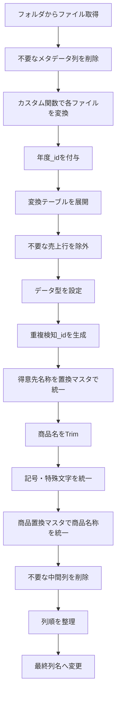
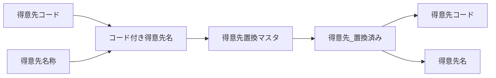

# Power Queryコードの視認性改善に関するチャットまとめ

## 目的

このチャットでは、既存の **Power Query（M言語）コードの処理内容自体は変更せず、コードをそのまま維持したうえで視認性を改善する**ことを目的として整理を行った。

対象コードは、売上分析用のデータをフォルダから読み込み、不要データの除外、型変換、得意先・商品の名称統一、重複検知用IDの生成、最終列整理までを行うクエリである。

今回の依頼では、ロジックの変更や高速化、ステップ名の変更ではなく、主に以下を実施した。

- 適切な空行の追加
- インデントの統一
- 長い関数呼び出しの複数行化
- 処理単位ごとのコメント追加
- 既存コメントの意味を分かりやすく整理

---

## 対象Power Queryの全体像

対象クエリは、大きく分けると次の処理を行っている。



---

## 処理内容の詳細

|処理|主なステップ|内容|
|---|---|---|
|ファイル取得|`ソース`|指定フォルダ内のファイルを `Folder.Files` で取得|
|メタデータ整理|`削除された列`|Extension、更新日時、Folder Pathなどを削除|
|ファイル変換|`カスタム関数の呼び出し1`|`ファイルの変換([Content])` を各ファイルに適用|
|年度識別|`カラムの追加：年度_id`|Indexを追加し、年度を識別|
|必要列抽出|`削除された他の列`|Name、変換結果、年度_idのみ残す|
|テーブル展開|`展開された ファイルの変換`|各売上項目を展開|
|不要行削除|`フィルタ：不要な行の削除`|運賃コードと一括消費税行を除外|
|型設定|`型変更：初期化`|日付、文字列、整数などの型を指定|
|重複検知|`カラムの追加：重複検知_id`|年度・伝票番号・行番号を連結|
|得意先統一|`置換マスタ処理：得意先`|得意先置換マスタを使って名称を統一|
|商品名前処理|`トリム：商品名`|商品名の先頭・末尾スペースを削除|
|記号統一|`置換マスタ処理：記号特殊文字`|記号特殊文字置換マスタを適用|
|商品名称統一|`置換処理マスタ：商品`|商品置換マスタを使って商品名称を統一|
|中間列削除|`カラムの削除：置換処理用2`|置換処理用の一時列を削除|
|列順整理|`カラムのソート：最終`|出力列を所定の順序に変更|
|列名整理|`カラム名の変更：最終`|最終的な日本語列名へ変更|

---

## ファイル読み込みと年度ID

最初に、以下のフォルダを読み込んでいる。

```text
C:\Users\kyoupatty029\myproject\analysis_inspection\sales_analysis\load_files\org_kpk
```

`Folder.Files` の結果にはファイル情報のメタデータが多数含まれるため、次の列を削除する。

- `Extension`
- `Date accessed`
- `Date modified`
- `Date created`
- `Attributes`
- `Folder Path`

その後、各ファイルの `Content` に対してカスタム関数、

```powerquery
ファイルの変換([Content])
```

を適用する。

### 年度_id

変換後、Index列として `年度_id` を追加している。

元コード上のコメントは以下。

```powerquery
// 0：昨年度
// 1：本年度
```

コード自体は、

```powerquery
Table.AddIndexColumn(
    カスタム関数の呼び出し1,
    "年度_id",
    0,
    1,
    Int64.Type
)
```

となっている。

つまりファイルの並び順を利用し、

- `0` → 昨年度
- `1` → 本年度

として識別する設計である。

---

## 売上データの展開

カスタム関数から返されたテーブルについて、次の10項目を展開する。

|列|
|---|
|売上日付|
|売上発生部門コード|
|売上伝票番号|
|売上明細伝票行番号|
|得意先コード|
|得意先名称|
|売上明細商品コード|
|売上明細商品名|
|売上明細バラ総数符号付|
|売上明細金額符号付|

---

## 不要な売上データの除外

次の2条件に該当する行を対象外にしている。

### 商品コード `888888`

```text
888888 = 運賃
```

したがって、

```powerquery
[売上明細商品コード] <> "888888"
```

という条件で除外する。

### 部門コード空欄

元コードでは、

```text
部門コード："" = 一括消費税
```

としている。

そのため、

```powerquery
[売上発生部門コード] <> ""
```

を条件としている。

最終的なフィルタ条件は、

```powerquery
each
    ([売上明細商品コード] <> "888888")
    and
    ([売上発生部門コード] <> "")
```

となる。

---

## データ型の初期設定

フィルタ後に、各カラムのデータ型を明示的に設定している。

|列|型|
|---|---|
|売上日付|`type date`|
|売上発生部門コード|`type text`|
|売上伝票番号|`type text`|
|売上明細伝票行番号|`type text`|
|得意先コード|`type text`|
|得意先名称|`type text`|
|売上明細商品コード|`type text`|
|売上明細商品名|`type text`|
|売上明細バラ総数符号付|`Int64.Type`|
|売上明細金額符号付|`Int64.Type`|
|年度_id|`type text`|

---

## 重複検知用IDの生成

売上明細の重複を識別するため、

```text
年度_id
+
売上伝票番号
+
売上明細伝票行番号
```

を `_` で連結している。

形式は、

```text
年度_id_売上伝票番号_売上明細伝票行番号
```

となる。

Power Queryでは、

```powerquery
[年度_id]
    & "_"
    & [売上伝票番号]
    & "_"
    & [売上明細伝票行番号]
```

としている。

生成後、元の

- 売上伝票番号
- 売上明細伝票行番号

は不要になるため削除する。

---

## 得意先名称の統一処理

得意先については、まず、

```text
得意先コード_得意先名称
```

という文字列を作成する。

例として概念的には、

```text
123456_株式会社ABC
```

のようになる。

この値を `コード付き得意先名` として保持する。

### 得意先置換マスタ

その後、

```powerquery
List.Accumulate(
    Table.ToRows(得意先置換マスタ),
    [コード付き得意先名],
    (x, y) => Text.Replace(x, y{0}, y{1})
)
```

を使用する。

処理イメージは、



となる。

置換後の値から、

```powerquery
Text.BeforeDelimiter([得意先_置換済み], "_")
```

で得意先コードを取得し、

```powerquery
Text.AfterDelimiter([得意先_置換済み], "_")
```

で得意先名を取得する。

処理終了後、

- `コード付き得意先名`
- `得意先_置換済み`

は中間処理用列として削除する。

---

## 商品名称の統一処理

商品については、得意先よりも一段階多い前処理を行っている。

### 1. 商品名のTrim

元コードのコメントでは、

> 商品名の置換は、事前に商品名の頭と尻に存在するスペースを全て取り除く。

という方針になっている。

処理は、

```powerquery
Text.Trim
```

を使用する。

なお、元コードには、

> 商品名内に混在する半角・全角スペースは記号特殊文字マスタで対応する予定

という設計メモも残されている。

### 2. 記号・特殊文字の統一

`記号特殊文字置換マスタ` を利用し、

```powerquery
List.Accumulate(
    Table.ToRows(記号特殊文字置換マスタ),
    [売上明細商品名],
    (x, y) => Text.Replace(x, y{0}, y{1})
)
```

を実行する。

結果を、

```text
商品名_記号修正済み
```

として保持する。

### 3. コード付き商品名を生成

次に、

```text
売上明細商品コード_商品名
```

を作る。

```powerquery
[売上明細商品コード]
    & "_"
    & [商品名_記号修正済み]
```

結果は、

```text
コード付き商品名
```

となる。

### 4. 商品置換マスタ

さらに、`商品置換マスタ` を順番に適用する。

```powerquery
List.Accumulate(
    Table.ToRows(商品置換マスタ),
    [コード付き商品名],
    (x, y) => Text.Replace(x, y{0}, y{1})
)
```

結果を、

```text
商品名_置換済み
```

として保持する。

### 5. 商品コード・商品名へ再分割

得意先と同様に `_` を区切り文字として、

```powerquery
Text.BeforeDelimiter(...)
```

で商品コード、

```powerquery
Text.AfterDelimiter(...)
```

で商品名を取得する。

---

## 中間列の削除

商品名称統一が完了した段階で、次の一時列を削除する。

- `売上明細商品コード`
- `売上明細商品名`
- `商品名_記号修正済み`
- `コード付き商品名`
- `商品名_置換済み`

これにより、最終テーブルには統一済みの商品コード・商品名だけが残る。

---

## 最終的な列順

最終出力前に、列を以下の順番へ並べ替える。

|順番|列|
|--:|---|
|1|売上日付|
|2|売上発生部門コード|
|3|得意先コード|
|4|得意先名|
|5|商品コード|
|6|商品名|
|7|売上明細バラ総数符号付|
|8|売上明細金額符号付|
|9|年度_id|
|10|重複検知_id|

その後、最終的な列名へ変更する。

|変更前|変更後|
|---|---|
|売上日付|売上日|
|売上発生部門コード|部門コード|
|売上明細バラ総数符号付|売上バラ数量_符号付|
|売上明細金額符号付|売上金額_符号付|

---

## 今回行った「視認性改善」

ユーザーからの依頼は、

> コードそのままに視認性をよくして。

というものであり、処理ロジックそのものは変更していない。

主に次の整形を行った。

- 処理のまとまりごとに空行を配置
- 各ステップの前に説明コメントを追加
- `Table.TransformColumnTypes` など長い処理を複数行へ分割
- `Table.ExpandTableColumn` の列リストを見やすく整形
- `List.Accumulate` の処理を複数行化
- `Table.ReorderColumns` や `Table.RenameColumns` の配列を整形
- コメント内容を処理実態に合わせて読みやすくした

一方で、以下については変更していない。

- ステップ名
- カラム名
- ファイルパス
- マスタ名
- フィルタ条件
- 置換処理
- データ型
- 列順
- 最終出力
- クエリのロジック

つまり、今回の変更は**リファクタリングではなく、コードフォーマットとコメントによる可読性向上**に限定されている。

---

## 整形後コード

```powerquery
let
    // ソースファイルの取得
    ソース = Folder.Files("C:\Users\kyoupatty029\myproject\analysis_inspection\sales_analysis\load_files\org_kpk"),
    // 不要な列の削除
    削除された列 = Table.RemoveColumns(
        ソース,
        {"Extension", "Date accessed", "Date modified", "Date created", "Attributes", "Folder Path"}
    ),

    // カスタム関数「ファイルの変換」の呼び出し
    カスタム関数の呼び出し1 = Table.AddColumn(
        削除された列,
        "ファイルの変換",
        each ファイルの変換([Content])
    ),
    // 年度IDの追加（0：昨年度, 1：本年度）
    #"カラムの追加：年度_id" = Table.AddIndexColumn(
        カスタム関数の呼び出し1,
        "年度_id",
        0,
        1,
        Int64.Type
    ),
    // 必要な列だけを残す
    削除された他の列 = Table.SelectColumns(
        #"カラムの追加：年度_id",
        {"Name", "ファイルの変換", "年度_id"}
    ),

    // ファイルの変換列を展開
    #"展開された ファイルの変換" = Table.ExpandTableColumn(
        削除された他の列,
        "ファイルの変換",
        {
            "売上日付",
            "売上発生部門コード",
            "売上伝票番号",
            "売上明細伝票行番号",
            "得意先コード",
            "得意先名称",
            "売上明細商品コード",
            "売上明細商品名",
            "売上明細バラ総数符号付",
            "売上明細金額符号付"
        },
        {
            "売上日付",
            "売上発生部門コード",
            "売上伝票番号",
            "売上明細伝票行番号",
            "得意先コード",
            "得意先名称",
            "売上明細商品コード",
            "売上明細商品名",
            "売上明細バラ総数符号付",
            "売上明細金額符号付"
        }
    ),

    // 不要な行のフィルタリング
    // ① 888888：運賃
    // ② 部門コード空欄：一括消費税
    #"フィルタ：不要な行の削除" = Table.SelectRows(
        #"展開された ファイルの変換",
        each
            ([売上明細商品コード] <> "888888")
            and ([売上発生部門コード] <> "")
    ),

    // データ型の初期化
    #"型変更：初期化" = Table.TransformColumnTypes(
        #"フィルタ：不要な行の削除",
        {
            {"売上発生部門コード", type text},
            {"得意先コード", type text},
            {"得意先名称", type text},
            {"売上明細商品コード", type text},
            {"売上明細商品名", type text},
            {"売上明細バラ総数符号付", Int64.Type},
            {"売上明細金額符号付", Int64.Type},
            {"売上日付", type date},
            {"売上伝票番号", type text},
            {"売上明細伝票行番号", type text},
            {"年度_id", type text}
        }
    ),

    // 重複検知用IDの追加
    #"カラムの追加：重複検知_id" = Table.AddColumn(
        #"型変更：初期化",
        "重複検知_id",
        each
            [年度_id]
            & "_"
            & [売上伝票番号]
            & "_"
            & [売上明細伝票行番号]
    ),

    #"型変更：重複検知_id" = Table.TransformColumnTypes(
        #"カラムの追加：重複検知_id",
        {{"重複検知_id", type text}}
    ),

    // 伝票関連の列を削除
    #"カラムの削除：伝票" = Table.RemoveColumns(
        #"型変更：重複検知_id",
        {"売上伝票番号", "売上明細伝票行番号"}
    ),

    // コード付き得意先名の追加
    #"カラムの追加：コード付き得意先名" = Table.AddColumn(
        #"カラムの削除：伝票",
        "コード付き得意先名",
        each [得意先コード] & "_" & [得意先名称]
    ),

    #"型変更：コード付き得意先名" = Table.TransformColumnTypes(
        #"カラムの追加：コード付き得意先名",
        {{"コード付き得意先名", type text}}
    ),

    // 得意先置換マスタによる置換処理
    #"置換マスタ処理：得意先" = Table.AddColumn(
        #"型変更：コード付き得意先名",
        "得意先_置換済み",
        each
            List.Accumulate(
                Table.ToRows(得意先置換マスタ),
                [コード付き得意先名],
                (x, y) => Text.Replace(x, y{0}, y{1})
            )
    ),

    // 得意先関連の中間列削除と抽出
    #"カラムの削除：得意先" = Table.RemoveColumns(
        #"置換マスタ処理：得意先",
        {"得意先コード", "得意先名称"}
    ),

    #"カラムの追加：抽出：得意先コード" = Table.AddColumn(
        #"カラムの削除：得意先",
        "得意先コード",
        each Text.BeforeDelimiter([得意先_置換済み], "_"),
        type text
    ),

    #"カラムの追加：抽出：得意先名" = Table.AddColumn(
        #"カラムの追加：抽出：得意先コード",
        "得意先名",
        each Text.AfterDelimiter([得意先_置換済み], "_"),
        type text
    ),

    #"カラムの削除：置換処理用1" = Table.RemoveColumns(
        #"カラムの追加：抽出：得意先名",
        {"コード付き得意先名", "得意先_置換済み"}
    ),

    // ① 商品名の置換前に、先頭・末尾のスペースを除去
    // ② 商品名内の半角・全角スペース等は記号特殊文字マスタで対応予定
    #"トリム：商品名" = Table.TransformColumns(
        #"カラムの削除：置換処理用1",
        {{"売上明細商品名", Text.Trim, type text}}
    ),

    // 記号特殊文字置換
    #"置換マスタ処理：記号特殊文字" = Table.AddColumn(
        #"トリム：商品名",
        "商品名_記号修正済み",
        each
            List.Accumulate(
                Table.ToRows(記号特殊文字置換マスタ),
                [売上明細商品名],
                (x, y) => Text.Replace(x, y{0}, y{1})
            )
    ),

    // コード付き商品名の追加
    #"カラムの追加：コード付き商品名" = Table.AddColumn(
        #"置換マスタ処理：記号特殊文字",
        "コード付き商品名",
        each [売上明細商品コード] & "_" & [商品名_記号修正済み]
    ),

    #"型変更：コード付き商品名" = Table.TransformColumnTypes(
        #"カラムの追加：コード付き商品名",
        {{"コード付き商品名", type text}}
    ),

    // 商品置換マスタによる置換処理
    #"置換処理マスタ：商品" = Table.AddColumn(
        #"型変更：コード付き商品名",
        "商品名_置換済み",
        each
            List.Accumulate(
                Table.ToRows(商品置換マスタ),
                [コード付き商品名],
                (x, y) => Text.Replace(x, y{0}, y{1})
            )
    ),

    // 商品コードと商品名の抽出
    #"カラムの追加：抽出：商品コード" = Table.AddColumn(
        #"置換処理マスタ：商品",
        "商品コード",
        each Text.BeforeDelimiter([商品名_置換済み], "_"),
        type text
    ),

    #"カラムの追加：抽出：商品名" = Table.AddColumn(
        #"カラムの追加：抽出：商品コード",
        "商品名",
        each Text.AfterDelimiter([商品名_置換済み], "_"),
        type text
    ),

    #"カラムの削除：置換処理用2" = Table.RemoveColumns(
        #"カラムの追加：抽出：商品名",
        {
            "売上明細商品コード",
            "売上明細商品名",
            "商品名_記号修正済み",
            "コード付き商品名",
            "商品名_置換済み"
        }
    ),

    // 列の並び替え（最終）
    #"カラムのソート：最終" = Table.ReorderColumns(
        #"カラムの削除：置換処理用2",
        {
            "売上日付",
            "売上発生部門コード",
            "得意先コード",
            "得意先名",
            "商品コード",
            "商品名",
            "売上明細バラ総数符号付",
            "売上明細金額符号付",
            "年度_id",
            "重複検知_id"
        }
    ),

    // 列名の変更（最終）
    #"カラム名の変更：最終" = Table.RenameColumns(
        #"カラムのソート：最終",
        {
            {"売上発生部門コード", "部門コード"},
            {"売上明細バラ総数符号付", "売上バラ数量_符号付"},
            {"売上明細金額符号付", "売上金額_符号付"},
            {"売上日付", "売上日"}
        }
    )

in
    #"カラム名の変更：最終"
```

## このチャットで確定したこと

今回のやり取りでは、Power Queryの処理設計そのものを変更するのではなく、**既存コードを維持しながら読みやすく整形する**方針で対応した。

特に、売上分析クエリは現在、

**読込 → 不要データ除外 → 型設定 → 重複検知 → 得意先統一 → 商品名正規化 → 商品統一 → 最終整形**

という一連のデータクレンジング処理として構成されている。

未解決の仕様変更や新規実装事項は、このチャット内では発生していない。