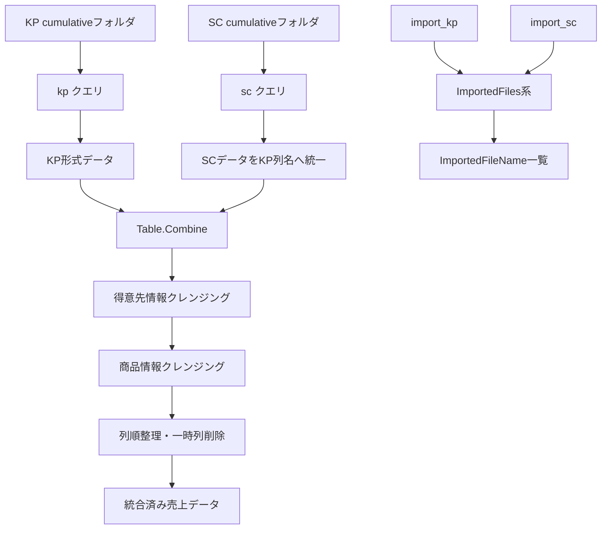
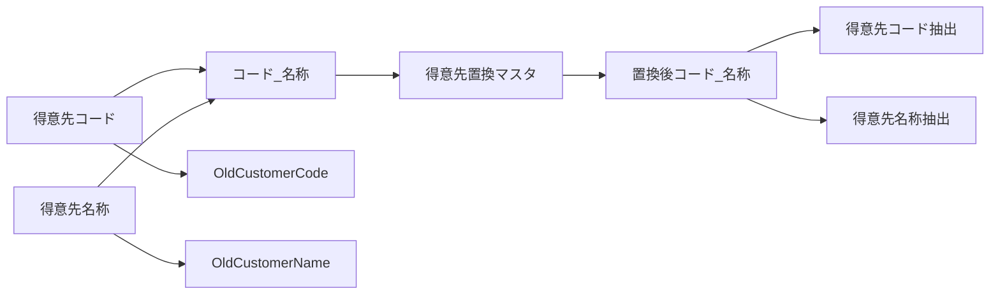
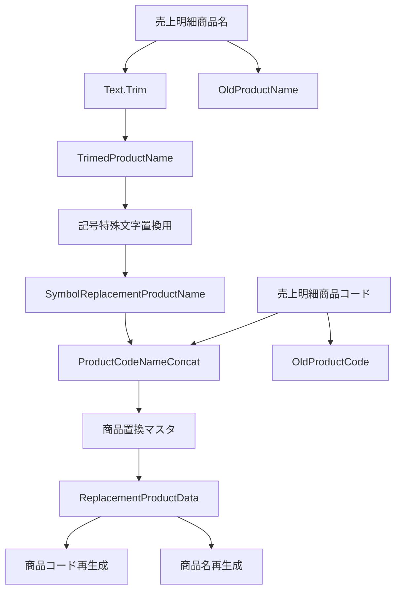
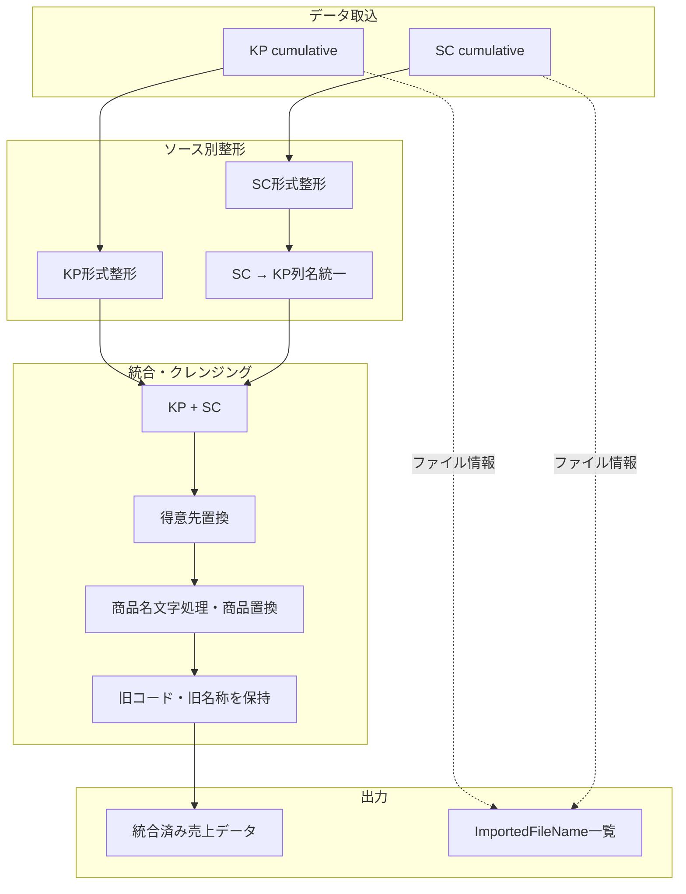

# Power Queryコードの視認性改善リファクタリングまとめ

このチャットでは、売上分析で使用している複数のPower Queryコードについて、**処理内容やロジックを大きく変更せず、視認性・可読性を高めること**を目的としてリファクタリングを行った。

対象となったのは、主に以下の4つのクエリである。

|対象|主な役割|
|---|---|
|`kp`|KP売上ファイルの取込・整形|
|`sc`|SC売上ファイルの取込・KP形式への統一|
|KP＋SC統合／クレンジング|KP・SCを結合し、得意先・商品情報を統一|
|ImportedFiles系|KP・SCのインポート対象ファイル名一覧を作成|

リファクタリングでは、ステップ名を英語のPascalCase系へ整理し、複数行の関数呼び出しを適切にインデントし、処理単位でコメントと空行を配置する方針を採った。

---

## 全体の処理構造



---

# 1. KP売上データ取込クエリ

KP側では、以下のフォルダをデータソースとして使用している。

```text
C:\Users\kyoupatty029\projects\kpm\analysis_inspection\sales_analysis\import\org\kp\cumulative
```

処理フローは次の通り。

1. `Folder.Files` でファイル一覧取得
2. 隠しファイルを除外
3. `ファイルの変換` 関数で各ファイルを変換
4. 変換済みテーブルのみ残す
5. サンプルファイルを基準に列を展開
6. 各列の型を設定
7. `SourceType = "KP"` を追加
8. 不要な得意先・商品を除外

リファクタリング後のコードは以下。

```powerquery
let
    // フォルダからファイルを取得
    Source = Folder.Files("C:\Users\kyoupatty029\projects\kpm\analysis_inspection\sales_analysis\import\org\kp\cumulative"),

    // 隠しファイルを除外
    FilteredHiddenFiles = Table.SelectRows(
        Source,
        each [Attributes]?[Hidden]? <> true
    ),

    // カスタム関数でファイル内容を変換
    TransformedFiles = Table.AddColumn(
        FilteredHiddenFiles,
        "TransformedFile",
        each ファイルの変換([Content])
    ),

    // 必要な列のみを残す
    SelectedColumns = Table.SelectColumns(
        TransformedFiles,
        {"TransformedFile"}
    ),

    // サンプルファイルから展開する列を動的に取得
    ExpandedTable = Table.ExpandTableColumn(
        SelectedColumns,
        "TransformedFile",
        Table.ColumnNames(ファイルの変換(#"サンプル ファイル"))
    ),

    // 列のデータ型を適切に設定
    ChangedColumnTypes = Table.TransformColumnTypes(
        ExpandedTable,
        {
            {"売上日付", type date},
            {"売上発生部門コード", Int64.Type},
            {"発生部門M部門名", type text},
            {"売上伝票番号", Int64.Type},
            {"売上明細伝票行番号", Int64.Type},
            {"売上伝票区分", Int64.Type},
            {"得意先コード", type text},
            {"得意先名称", type text},
            {"得意先名称２", type text},
            {"得意先住所１", type text},
            {"得意先住所２", type text},
            {"得意先住所３", type any},
            {"納入先コード", Int64.Type},
            {"納入先名称", type text},
            {"納入先名称２", type text},
            {"納入先住所１", type text},
            {"納入先住所２", type text},
            {"納入先住所３", type any},
            {"売上明細商品コード", type text},
            {"売上明細商品名", type text},
            {"売上明細荷姿区分", Int64.Type},
            {"売上明細入数", Int64.Type},
            {"売上明細入数単位", type text},
            {"売上明細荷姿数符号付", Int64.Type},
            {"売上明細荷姿単位", type any},
            {"売上明細バラ総数符号付", Int64.Type},
            {"売上明細単価", type number},
            {"売上明細金額符号付", Int64.Type},
            {"売上明細外税消費税符号付", Int64.Type},
            {"税率", Int64.Type}
        }
    ),

    // データソース種別を追加
    AddedCustomColumn = Table.AddColumn(
        ChangedColumnTypes,
        "SourceType",
        each "KP",
        type text
    ),

    // 不要な行をフィルタリング
    FilteredRows = Table.SelectRows(
        AddedCustomColumn,
        each ([得意先コード] <> "402070")
            and ([売上明細商品コード] <> "" and [売上明細商品コード] <> "888888")
    )
in
    FilteredRows
```

### KP側の除外条件

|対象|除外値|
|---|---|
|得意先コード|`"402070"`|
|商品コード|空文字 `""`|
|商品コード|`"888888"`|

また、元コードの自動生成的なステップ名であった

```powerquery
#"Added Custom"
```

を

```powerquery
AddedCustomColumn
```

へ変更し、他ステップと命名方法を統一した。

---

# 2. SC売上データ取込クエリ

SC側では以下をデータソースとしている。

```text
C:\Users\kyoupatty029\projects\kpm\analysis_inspection\sales_analysis\import\org\sc\cumulative
```

SCは元データの構造がKPと異なるため、読み込んだ後に**KPのカラム名へ統一する処理**が入っている。

処理フローは以下。


リファクタリング後は以下。

```powerquery
let
    // フォルダからファイルを取得
    Source = Folder.Files("C:\Users\kyoupatty029\projects\kpm\analysis_inspection\sales_analysis\import\org\sc\cumulative"),

    // 隠しファイルを除外
    FilteredHiddenFiles = Table.SelectRows(
        Source,
        each [Attributes]?[Hidden]? <> true
    ),

    // カスタム関数でファイル内容を変換
    TransformedFiles = Table.AddColumn(
        FilteredHiddenFiles,
        "TransformedFile",
        each #"ファイルの変換 (2)"([Content])
    ),

    // 必要な列のみを残す
    SelectedColumns = Table.SelectColumns(
        TransformedFiles,
        {"TransformedFile"}
    ),

    // サンプルファイルから展開する列を動的に取得
    ExpandedTable = Table.ExpandTableColumn(
        SelectedColumns,
        "TransformedFile",
        Table.ColumnNames(#"ファイルの変換 (2)"(#"サンプル ファイル (2)"))
    ),

    // 不要な列を削除
    RemovedColumns = Table.RemoveColumns(
        ExpandedTable,
        {"日付別売上明細表"}
    ),

    // 必要な行のみを残す
    FilteredRows = Table.SelectRows(
        RemovedColumns,
        each [Column2] <> null
    ),

    // ヘッダーを昇格
    PromotedHeaders = Table.PromoteHeaders(
        FilteredRows,
        [PromoteAllScalars = true]
    ),

    // 列のデータ型を適切に設定
    ChangedColumnTypes = Table.TransformColumnTypes(
        PromotedHeaders,
        {
            {"売上日", type date},
            {"伝票番号", Int64.Type},
            {"取引区分", type text},
            {"締切", type text},
            {"得意先コード", Int64.Type},
            {"得意先名", type text},
            {"税転嫁", type text},
            {"納入先コード", type text},
            {"納入先名", type text},
            {"担当者コード", type text},
            {"担当者名", type text},
            {"内訳", type text},
            {"出荷", type text},
            {"商品コード", Int64.Type},
            {"商品名/摘要", type text},
            {"単位", type text},
            {"入数", Int64.Type},
            {"ケース", Int64.Type},
            {"倉庫コード", Int64.Type},
            {"倉庫名", type text},
            {"数量", Int64.Type},
            {"原単価", Int64.Type},
            {"単価", Int64.Type},
            {"粗利益", Int64.Type},
            {"金額", Int64.Type},
            {"主プロジェクトコード", type text},
            {"副プロジェクトコード", type text},
            {"プロジェクト名", type text},
            {"課税区分", type text},
            {"備考", type text},
            {"見積番号", type text},
            {"受注番号", type text}
        }
    ),

    // データソース種別を追加
    AddedCustomColumn = Table.AddColumn(
        ChangedColumnTypes,
        "SourceType",
        each "SC",
        type text
    ),

    // KPのカラム名に統一
    RenamedColumnsFinal = Table.RenameColumns(
        AddedCustomColumn,
        {
            {"売上日", "売上日付"},
            {"伝票番号", "売上伝票番号"},
            {"商品コード", "売上明細商品コード"},
            {"商品名/摘要", "売上明細商品名"},
            {"単位", "売上明細入数単位"},
            {"入数", "売上明細入数"},
            {"数量", "売上明細バラ総数符号付"},
            {"単価", "売上明細単価"},
            {"金額", "売上明細金額符号付"},
            {"得意先名", "得意先名称"},
            {"納入先名", "納入先名称"}
        }
    ),

    // 不要な行をフィルタリング
    FilteredRowsFinal = Table.SelectRows(
        RenamedColumnsFinal,
        each [売上明細商品コード] <> null
            and [売上明細商品コード] <> 888888
    )
in
    FilteredRowsFinal
```

### SC → KP列名変換

|SC|KP統一後|
|---|---|
|売上日|売上日付|
|伝票番号|売上伝票番号|
|商品コード|売上明細商品コード|
|商品名/摘要|売上明細商品名|
|単位|売上明細入数単位|
|入数|売上明細入数|
|数量|売上明細バラ総数符号付|
|単価|売上明細単価|
|金額|売上明細金額符号付|
|得意先名|得意先名称|
|納入先名|納入先名称|

さらに

```powerquery
SourceType = "SC"
```

を付与することで、KPとSCを統合した後でも元のデータソースを判別できる構造としている。

---

# 3. KP＋SC統合後の得意先・商品クレンジング

次に、整形済みの

```powerquery
kp
sc
```

を

```powerquery
Table.Combine({kp, sc})
```

で統合する。

このクエリでは単純な結合だけではなく、**得意先情報と商品情報の表記統一・置換**を行う。

## 得意先情報の処理

基本構造は次の通り。



まず、

```powerquery
CustomerCodeNameConcat
```

として

```text
得意先コード_得意先名称
```

を作成する。

その値に対して、

```powerquery
得意先置換マスタ
```

を

```powerquery
List.Accumulate
```

で順番に適用する。

```powerquery
each List.Accumulate(
    Table.ToRows(得意先置換マスタ),
    [CustomerCodeNameConcat],
    (x, y) => Text.Replace(x, y{0}, y{1})
)
```

置換結果は

```powerquery
ReplacementCustomData
```

へ格納する。

その前に元の列を

```text
得意先コード → OldCustomerCode
得意先名称   → OldCustomerName
```

へ退避する。

その後、

```powerquery
Text.BeforeDelimiter([ReplacementCustomData], "_")
```

から新しい得意先コード、

```powerquery
Text.AfterDelimiter([ReplacementCustomData], "_")
```

から新しい得意先名称を再生成する。

---

## 商品情報の処理

商品についても同様に、コードと名称を連結してからマスタ置換している。ただし、商品名はその前に追加の文字列クレンジングを行う。



商品名はまず

```powerquery
Text.Trim([売上明細商品名])
```

によって前後の空白を除去する。

結果は

```powerquery
TrimedProductName
```

へ格納。

その後、

```powerquery
記号特殊文字置換用
```

を用いて、

```powerquery
List.Accumulate
```

による特殊記号・文字の置換を実行する。

結果を

```powerquery
SymbolReplacementProductName
```

とする。

さらに、

```text
商品コード_商品名
```

形式の

```powerquery
ProductCodeNameConcat
```

を作り、

```powerquery
商品置換マスタ
```

による置換を実行。

結果を

```powerquery
ReplacementProductData
```

へ格納する。

元の商品情報は

```text
売上明細商品コード → OldProductCode
売上明細商品名     → OldProductName
```

として退避。

その後、

```powerquery
Text.BeforeDelimiter
Text.AfterDelimiter
```

を使い、置換後の商品コード・商品名を復元する。

---

## リファクタリング後の統合クエリ

```powerquery
let
    // 複数のテーブルを結合
    Source = Table.Combine({kp, sc}),

    // 必要な列のデータ型を変更
    ChangedColumnTypes = Table.TransformColumnTypes(
        Source,
        {
            {"得意先コード", type text},
            {"売上明細商品コード", type text}
        }
    ),

    // 顧客コードと名前を結合
    AddedConcatenatedCustomer = Table.AddColumn(
        ChangedColumnTypes,
        "CustomerCodeNameConcat",
        each [得意先コード] & "_" & [得意先名称],
        type text
    ),

    // 得意先マスタによる置換処理
    ReplacedCustomerData = Table.AddColumn(
        AddedConcatenatedCustomer,
        "ReplacementCustomData",
        each List.Accumulate(
            Table.ToRows(得意先置換マスタ),
            [CustomerCodeNameConcat],
            (x, y) => Text.Replace(x, y{0}, y{1})
        )
    ),

    // 元の得意先情報を保持
    RenamedCustomerColumns = Table.RenameColumns(
        ReplacedCustomerData,
        {
            {"得意先コード", "OldCustomerCode"},
            {"得意先名称", "OldCustomerName"}
        }
    ),

    // 置換後の得意先コードを抽出
    ExtractedCustomerCode = Table.AddColumn(
        RenamedCustomerColumns,
        "得意先コード",
        each Text.BeforeDelimiter([ReplacementCustomData], "_"),
        type text
    ),

    // 置換後の得意先名称を抽出
    ExtractedCustomerName = Table.AddColumn(
        ExtractedCustomerCode,
        "得意先名称",
        each Text.AfterDelimiter([ReplacementCustomData], "_"),
        type text
    ),

    // 商品名をトリミング
    TrimmedProductName = Table.AddColumn(
        ExtractedCustomerName,
        "TrimedProductName",
        each Text.Trim([売上明細商品名]),
        type text
    ),

    // 特殊記号を置換
    ReplacedProductSymbols = Table.AddColumn(
        TrimmedProductName,
        "SymbolReplacementProductName",
        each List.Accumulate(
            Table.ToRows(記号特殊文字置換用),
            [TrimedProductName],
            (x, y) => Text.Replace(x, y{0}, y{1})
        ),
        type text
    ),

    // 商品コードと商品名を結合
    ConcatenatedProduct = Table.AddColumn(
        ReplacedProductSymbols,
        "ProductCodeNameConcat",
        each [売上明細商品コード] & "_" & [SymbolReplacementProductName],
        type text
    ),

    // 商品置換マスタによる置換処理
    ReplacedProductData = Table.AddColumn(
        ConcatenatedProduct,
        "ReplacementProductData",
        each List.Accumulate(
            Table.ToRows(商品置換マスタ),
            [ProductCodeNameConcat],
            (x, y) => Text.Replace(x, y{0}, y{1})
        ),
        type text
    ),

    // 元の商品情報を保持
    RenamedProductColumns = Table.RenameColumns(
        ReplacedProductData,
        {
            {"売上明細商品コード", "OldProductCode"},
            {"売上明細商品名", "OldProductName"}
        }
    ),

    // 置換後の商品コードを抽出
    ExtractedProductCode = Table.AddColumn(
        RenamedProductColumns,
        "売上明細商品コード",
        each Text.BeforeDelimiter([ReplacementProductData], "_"),
        type text
    ),

    // 置換後の商品名を抽出
    ExtractedProductName = Table.AddColumn(
        ExtractedProductCode,
        "売上明細商品名",
        each Text.AfterDelimiter([ReplacementProductData], "_"),
        type text
    ),

    // 列の並び順を調整
    ReorderedColumns = Table.ReorderColumns(
        ExtractedProductName,
        {
            "SourceType", "売上日付", "売上発生部門コード", "発生部門M部門名",
            "売上伝票番号", "売上明細伝票行番号", "売上伝票区分", "得意先コード",
            "得意先名称", "得意先名称２", "得意先住所１", "得意先住所２",
            "得意先住所３", "納入先コード", "納入先名称", "納入先名称２",
            "納入先住所１", "納入先住所２", "納入先住所３", "売上明細商品コード",
            "売上明細商品名", "売上明細荷姿区分", "売上明細入数", "売上明細入数単位",
            "売上明細荷姿数符号付", "売上明細荷姿単位", "売上明細バラ総数符号付",
            "売上明細単価", "売上明細金額符号付", "売上明細外税消費税符号付",
            "税率", "取引区分", "締切", "税転嫁", "担当者コード", "担当者名",
            "内訳", "出荷", "ケース", "倉庫コード", "倉庫名", "原単価",
            "粗利益", "主プロジェクトコード", "副プロジェクトコード",
            "プロジェクト名", "課税区分", "備考", "見積番号", "受注番号",
            "OldCustomerCode", "OldCustomerName", "OldProductCode", "OldProductName",
            "CustomerCodeNameConcat", "ReplacementCustomData", "TrimedProductName",
            "SymbolReplacementProductName", "ProductCodeNameConcat", "ReplacementProductData"
        }
    ),

    // 処理用の一時列を削除
    RemovedColumns = Table.RemoveColumns(
        ReorderedColumns,
        {
            "CustomerCodeNameConcat",
            "ReplacementCustomData",
            "TrimedProductName",
            "SymbolReplacementProductName",
            "ProductCodeNameConcat",
            "ReplacementProductData"
        }
    )
in
    RemovedColumns
```

最終的には、置換処理に使用した一時列だけを削除し、

```text
OldCustomerCode
OldCustomerName
OldProductCode
OldProductName
```

は残している。

したがって、**置換前と置換後を追跡可能な設計**になっている。

---

# 4. インポートファイル名一覧クエリ

最後に、

```powerquery
import_kp
import_sc
```

を結合し、読み込み対象となっているファイル名を一覧化するクエリを整理した。

元コードでは、Power QueryのGUIが自動生成した以下のようなステップ名が使用されていた。

```text
#"Filtered Hidden Files1"
#"Invoke Custom Function1"
#"Removed Other Columns1"
#"Renamed Columns"
```

これを他のクエリと同じ命名方式へ統一した。

```powerquery
let
    // 複数のテーブルを結合
    Source = Table.Combine({import_kp, import_sc}),

    // 隠しファイルを除外
    FilteredHiddenFiles = Table.SelectRows(
        Source,
        each [Attributes]?[Hidden]? <> true
    ),

    // カスタム関数でファイル内容を変換
    InvokedCustomFunction = Table.AddColumn(
        FilteredHiddenFiles,
        "ファイルの変換 (3)",
        each #"ファイルの変換 (3)"([Content])
    ),

    // 必要な列のみを選択
    SelectedColumns = Table.SelectColumns(
        InvokedCustomFunction,
        {"Name"}
    ),

    // ファイル名列を変更
    RenamedColumns = Table.RenameColumns(
        SelectedColumns,
        {
            {"Name", "ImportedFileName"}
        }
    )
in
    RenamedColumns
```

最終出力は基本的に

|ImportedFileName|
|---|
|ファイル名1|
|ファイル名2|
|…|

という単一列のテーブルとなる。

なお、現在のロジックでは

```powerquery
#"ファイルの変換 (3)"
```

を実行して列を追加した後、その列を使用せず `Name` のみを残している。この処理は今回の「視認性改善」では変更せず、そのまま維持している。

---

# リファクタリングで統一した考え方

今回の一連の修正では、特に以下を共通ルールとした。

|項目|方針|
|---|---|
|ステップ名|PascalCase系の英語名|
|GUI自動生成名|可能な範囲で意味のある名前へ変更|
|コメント|処理内容を説明する短い日本語|
|空行|論理的な処理単位ごとに配置|
|長い関数|引数を複数行へ展開|
|型定義|1列1行にして一覧性を確保|
|RenameColumns|対応関係が分かるよう縦並び|
|RemoveColumns|削除対象を縦並び|
|ロジック|原則変更しない|
|一時列|最終段階でまとめて削除|
|元データ|`Old...` 列として必要に応じて保持|

特に、Power Query GUIが作成する

```powerquery
#"Added Custom"
#"Filtered Hidden Files1"
#"Invoke Custom Function1"
```

のような名前を、

```powerquery
AddedCustomColumn
FilteredHiddenFiles
InvokedCustomFunction
```

へ変更することで、コード全体の統一感を高めている。

---

# 現在のデータ処理設計

一連のクエリを整理すると、現在の売上分析データは以下の構造になっている。



重要なのは、KPとSCを直接同じデータとして扱うのではなく、

**「各ソースを先に正規化 → 共通フォーマット化 → 統合 → 共通クレンジング」**

という構造になっている点である。

これは売上分析用データのメンテナンスという観点でも比較的理解しやすい構成になっている。

---

## 今回までに確立したコードスタイル

このチャットを通して、Power Queryコードについては次のスタイルが事実上の基準となった。

```text
Source
↓
入力データの整理
↓
必要列の選択・展開
↓
型設定
↓
補助列追加
↓
クレンジング・置換
↓
列名統一
↓
フィルタリング
↓
列順整理
↓
一時列削除
↓
最終出力
```

ステップ名は処理内容を表す英語名を使用し、コメントは日本語で説明する方式で統一されている。

また、今回の目的はあくまで**視認性改善のためのリファクタリング**であり、処理そのものを積極的に短縮・高速化・設計変更するリファクタリングまでは行っていない。

今後さらに整理する場合は、次の段階として「コードの見た目」だけでなく、`List.Accumulate` 用のマスタテーブルを変数化する、一時列名の命名規則を統一する、不要な処理を除去するといった**構造的リファクタリング**を別途検討できる状態になっている。