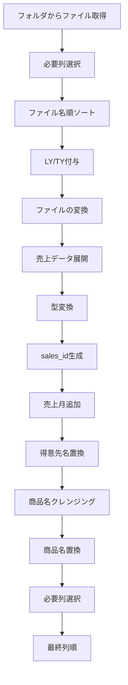
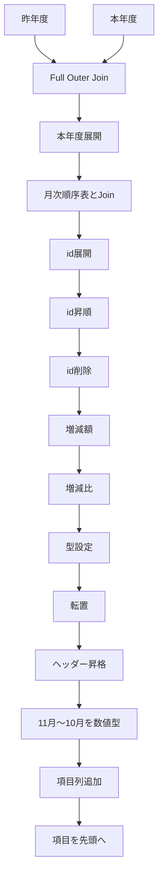
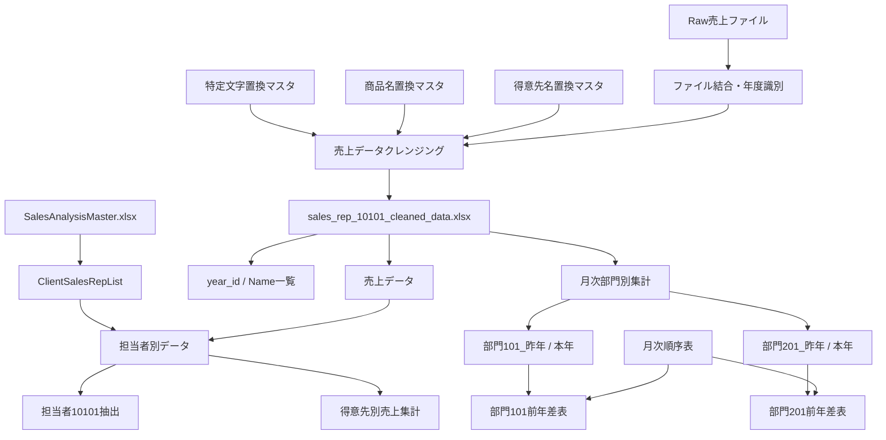

このチャットでは、売上分析関連の複数のPower Queryコードについて、**処理ロジックそのものは極力変えず、主に視認性・可読性・メンテナンス性を高めるためのリファクタリング**を繰り返し行った。

対象となった処理は、ファイル読み込み、年度識別、売上データ展開、得意先・商品マスタ置換、担当者マスタ結合、月次集計、前年・本年比較、月次順序制御など。全体を通して、Power Queryの自動生成的なステップ名や曖昧な名称を、処理内容が分かる名称へ置き換える方向で整理している。

## 全体方針

今回一貫して行ったリファクタリング方針は次の通り。

- `#"Changed Type"`、`グループ化された行`、`削除された列` のような自動生成名を、処理内容が分かる名前へ変更する。
- 長いPower Query関数は複数行に展開し、引数を縦方向に揃える。
- コメントは処理単位にまとめ、コードの流れを追いやすくする。
- `ソース`だけでは意味が弱い場合は、`データソース`、`売上データテーブル`、`中間データテーブル`などへ具体化する。
- マージ→展開、追加→変換、集計→並べ替え、という処理のまとまりが分かるようステップ名を揃える。
- コードの意味を変える最適化ではなく、基本的には**可読性改善を優先**する。

特に今回のコード群では、以下のような命名が多く採用された。

|元の傾向|リファクタリング後の傾向|
|---|---|
|`変更された型`|`データ型を変換`|
|`削除された列`|`不要列を削除`|
|`並べ替えられた行`|`行を並べ替え`|
|`グループ化された行`|`売上をグループ化`|
|`Expanded {0}`|`担当者コードを展開`|
|`名前が変更された列`|`列名を変更`|
|`ソース`|`データソース` ※文脈次第|
|`intermediate_mizuoka_Table`|`中間データテーブル`|

---

## 売上ファイル取得と年度識別

最初に扱ったコードでは、指定フォルダから売上ファイルを取得し、ファイル名順に並べ、インデックスを使って年度識別子を付与していた。

元の処理は概ね次の流れ。


改善後は、以下のようなステップ名へ整理した。

- `必要列を選択`
- `ファイル名でソート`
- `年度識別子を追加`
- `年度識別子を置換`
- `ナビゲーション用コンテンツ`

年度識別については、

```powerquery
if [year_id] = 0 then "LY"
else if [year_id] = 1 then "TY"
else ""
```

という既存ロジックを維持した。

---

## 売上データの読み込み・展開・クレンジング

最も長いコードでは、担当者 `10101` 用フォルダから複数の売上ファイルを読み込み、ヘルパークエリで展開した後、得意先名・商品名を各種マスタを使って正規化していた。

処理全体は次の構造。



### 展開対象となっていた売上列

主な列は以下。

- `売上日付`
- `売上発生部門コード`
- `売上伝票番号`
- `売上明細伝票行番号`
- `得意先コード`
- `得意先名称`
- `売上明細商品コード`
- `売上明細商品名`
- `売上明細金額符号付`

### `sales_id` の生成

伝票行番号を2桁に整形してから、

```text
year_id-売上伝票番号-売上明細伝票行番号
```

の形式で `sales_id` を作成していた。

例：

```text
LY-123456-01
```

この処理については、

- 伝票行番号へ `"00"` を前置
- `Text.End(_, 2)` で末尾2桁取得
- `sales_id` 作成
- 元の伝票番号関連列を削除

という順序を維持した。

### 得意先名称の置換

得意先については、

```text
得意先コード_得意先名称
```

の連結キーを作成し、`得意先名置換マスタ` を `List.Accumulate` で順次適用していた。

その後、

- `_` より前 → `得意先コード`
- `_` より後 → `得意先名`

として再分解する構成。

既存コードでは旧得意先コードを一時退避する処理も含まれていた。

### 商品名の置換

商品名については複数段階のクレンジングを行っていた。

1. `UnifiedSpaceSalesName` によるスペース統一
2. `特定文字置換マスタ` による文字置換
3. `商品コード_商品名` の連結
4. `商品名置換マスタ` による置換
5. 商品コードと商品名へ再分解

この処理も基本ロジックは変更せず、ステップ名を明確化する方針で整理した。

---

## Cleaned Dataファイルの読み込み

複数のクエリで、以下のCleaned Dataファイルを参照していた。

```text
C:\Users\kyoupatty029\projects\kpm\analysis_inspection\sales_analysis\cleaned_data\sales_rep_10101_cleaned_data.xlsx
```

参照テーブルは共通して、

```text
sales_intermediate_file
```

だった。

主な型設定は以下。

|列|型|
|---|---|
|売上日付|`type date`|
|売上月|`type text`|
|売上発生部門コード|`type text` または一部コードで `Int64.Type`|
|得意先コード|`type text`|
|得意先名|`type text`|
|商品コード|`type text`|
|商品名|`type text`|
|売上明細金額符号付|`Int64.Type`|
|year_id|`type text`|
|sales_id|`type text`|

リファクタリング後は、

```powerquery
データソース
中間データテーブル
データ型を変換
```

などの名称に統一する方向で整理した。

---

## ファイル名と年度の対応一覧作成

Cleaned Data内の `Name` 列から、重複しないファイル一覧を作り、ファイル名順に `LY` / `TY` を割り当てるクエリも扱った。

処理内容は、

1. `Name` 列のみ選択
2. 重複削除
3. `Name` 昇順
4. インデックス追加
5. `0 → LY`
6. その他 → `TY`
7. インデックス削除
8. `year_id`, `Name` の順に並べ替え

という構成。

ここでは元コードの

```powerquery
if [index] = 0 then "LY" else "TY"
```

をそのまま維持した。

---

## 担当者マスタとの結合

売上データと得意先別担当者一覧を結合する処理も複数回扱った。

基本構造は、


### 未登録得意先の担当者補完

あるクエリでは、担当者コードが `null` の場合、

```text
10101
```

を設定していた。

元コメントには「担当者名が null の場合に水岡を設定」と記載されていたが、実際に操作しているのは**担当者コード**だったため、リファクタリングではコメントを

> 担当者コードが null の場合にデフォルト値 `"10101"` を設定

のように実処理に合わせて修正した。

### 得意先単位の集計

その後、

```text
得意先コード
得意先名
担当者コード
```

でグループ化し、

```powerquery
List.Sum([売上明細金額符号付])
```

によって得意先売上を集計。

最後に、

1. `担当者コード` 降順
2. `売上明細金額` 降順

で並べ替えていた。

---

## `ClientSalesRepList` マスタ

共有マスタとして以下のファイルを使用していた。

```text
C:\Users\kyoupatty029\projects\kpm\analysis_inspection\shared_master\SalesAnalysisMaster.xlsx
```

使用テーブル：

```text
ClientSalesRepList
```

主なカラムは以下。

|列|内容|
|---|---|
|`client_code`|得意先コード|
|`client_name`|得意先名称|
|`division_code`|部門コード|
|`sales_rep_code`|担当者コード|
|`updated_date`|更新日|

2種類のクエリを扱った。

### 必要列だけ取得する版

最終的に、

```text
client_code
client_name
sales_rep_code
```

だけを残すクエリ。

### マスタ全体を型設定して取得する版

こちらは5列すべてを保持。

自動生成名だった、

```powerquery
#"Changed Type"
```

は、

```powerquery
データ型を変換
```

へ変更した。

---

## 担当者10101の売上抽出

Cleaned Dataへ `ClientSalesRepList` を結合し、担当者コード `"10101"` のデータだけ抽出するクエリも整理した。

処理は次の通り。

1. Cleaned Dataを読み込み
2. 型変換
3. 売上日付昇順
4. 不要商品コードを除外
5. 得意先コードで `ClientSalesRepList` とLeft Join
6. `sales_rep_code` を `担当者コード` として展開
7. `担当者コード = "10101"` だけ残す
8. 列順を調整

除外条件は、

```powerquery
[商品コード] <> ""
and [商品コード] <> "888888"
```

だった。

コメント上では、

- 運賃
- 一括消費税

の除外として扱っていた。

---

## 売上集計クエリ

短い集計クエリについても、命名を整理した。

### 大塚刷毛売上の集計

ソース：

```powerquery
売上データ_大塚刷毛
```

グループキー：

```text
year_id
売上発生部門コード
売上月
得意先コード
```

集計：

```powerquery
{{"売上", each List.Sum([売上明細金額符号付]), type nullable number}}
```

リファクタリング後は、

```powerquery
データソース
売上をグループ化
```

のようにした。

---

## 部門別・年度別データ抽出

`売上データ` から、

```text
売上発生部門コード = "101"
year_id = "LY"
```

の行だけを抽出し、不要な識別列を削除して、

```text
売上明細金額符号付 → 昨年度
```

へ変更するクエリも整理した。

処理フローは単純で、


となる。

---

## 昨年度・本年度比較表

部門101および部門201について、ほぼ同一構造の前年比較クエリを扱った。

入力クエリはそれぞれ、

```text
部門101_昨年
部門101_本年
```

または、

```text
部門201_昨年
部門201_本年
```

だった。

処理構造は共通。



### 増減額

```powerquery
[本年度] - [昨年度]
```

### 増減比

```powerquery
if [昨年度] = 0
then null
else [本年度] / [昨年度]
```

その後、

```powerquery
{"増減額", Int64.Type}
{"増減比", Percentage.Type}
```

を設定。

### 月の並び

会計年度に合わせ、

```text
11月
12月
1月
2月
3月
4月
5月
6月
7月
8月
9月
10月
```

の順序を維持していた。

### 転置後の項目列

転置後に、

```powerquery
項目リスト = {"昨年度", "本年度", "増減額", "増減比"}
```

を作り、

```powerquery
Table.PositionOf(...)
```

を使って各行へ対応する項目名を設定していた。

部門101と201のコード差は、入力クエリ名だけで、ロジックは同一だった。

---

## 売上月別集計

Cleaned Dataから対象部門のデータだけ抽出し、売上月単位で集計するクエリも整理した。

対象部門：

```text
101
201
```

除外条件：

```powerquery
[商品コード] <> ""
```

元コメントでは「一括消費税の除外」とされていた。

グループキー：

```text
売上月
売上発生部門コード
year_id
```

集計対象：

```powerquery
売上明細金額符号付
```

処理結果は、

```text
月 × 部門 × 年度
```

単位の売上集計となる。

---

## 月次順序表

Excelブック内のテーブル、

```text
月次順序表
```

を読み込むだけのシンプルなクエリもリファクタリングした。

構成は、

```powerquery
Excel.CurrentWorkbook(){[Name="月次順序表"]}[Content]
```

から取得し、

```text
id       → Int64.Type
売上月   → type text
```

に設定。

このクエリは、11月始まりの月順制御に使用されている。

リファクタリング後の名称例：

```powerquery
月次順序データ
データ型を変換
```

---

## `year_id` とファイル名一覧の抽出

最後に扱ったクエリでは、Cleaned Dataから、

```text
year_id
Name
```

の組み合わせだけを抽出していた。

元コードは一旦、

```powerquery
Table.Group(
    中間テーブル,
    {"year_id", "Name"},
    {{"カウント", each Table.RowCount(_), Int64.Type}}
)
```

でグループ化し、その直後に `カウント` 列を削除する構成。

つまり実質的には、

> `year_id` と `Name` のユニークな組み合わせ一覧

を作成している。

リファクタリングでは、

```powerquery
グループ化データ
必要な列のみ保持
```

という名称にした。

ただし、処理目的だけを見ると、将来的には `Table.Distinct` を使う方が意図は明確になる余地がある。ただし今回の作業では、原則として**元の処理ロジックを変更せず、視認性改善だけを実施**した。

---

## 今回のコード群の関係

今回登場したクエリを全体で見ると、概ね次のような構造になっている。



---

## このチャットで固まったリファクタリングスタイル

今回のやり取りを通じて、Power Queryコードについては次のスタイルが一貫して適している。

```powerquery
let
    // 大きな処理単位のコメント
    データソース = ...,
    対象テーブル = ...,

    // データ型の設定
    データ型を変換 = Table.TransformColumnTypes(
        対象テーブル,
        {
            ...
        }
    ),

    // データの抽出
    対象データを抽出 = Table.SelectRows(
        データ型を変換,
        each ...
    ),

    // 集計
    売上をグループ化 = Table.Group(
        対象データを抽出,
        {...},
        {...}
    )
in
    売上をグループ化
```

特に、自動生成される日本語ステップ名や英語ステップ名をそのまま使わず、

> **何をしたかが読めば分かるステップ名**

へ変更することが、このチャット全体の中心的な改善方針だった。

## 今後整理すると効果が大きい点

今回の範囲では主に視認性改善に留めたが、コード群全体を見ると、次の部分は今後さらに整理する余地がある。

- 部門101と201の前年差表はほぼ完全に同一ロジックなので、関数化できる可能性が高い。
- Cleaned Dataファイルのパスが複数クエリへ直接記述されており、パラメータ化の余地がある。
- `10101`、`101`、`201` などのコード値が複数箇所へ直接記載されており、将来的には管理方法を検討できる。
- `Table.Group` → カウント削除でユニーク行を取得している処理は、目的上は `Table.Distinct` の方が簡潔。
- `year_id` の `LY` / `TY` 判定がファイル名順に依存するため、ファイル命名規則との依存関係を明文化すると安全。
- 一部コメントと実際の処理内容にズレがあったため、今後も「コメントではなくコードを正」として確認する必要がある。
- ステップ名の日本語表記について、今回のような自然文形式に統一するか、既存の `動詞_対象` 形式へ寄せるかは、プロジェクト全体で統一するとさらに読みやすくなる。

今回のやり取りでは、**機能変更よりも「読みやすく、意図が追いやすく、後から修正しやすいPower Query」へ整えること**を中心に進めた。