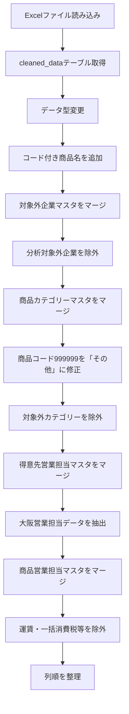

# Power Queryコード整形と年度ファイル名の命名方針まとめ

このチャットでは、主に次の2点について検討しました。

1. **Power Queryコードの処理内容を変えずに、視認性だけを高めるリファクタリング**
2. **11月開始の年度データにおけるファイル名の年度表記**

なお、Power Queryのリファクタリングについては、当初の依頼が「内容そのまま」であったのに対し、提示された修正版には一部で**処理内容まで変更されている箇所**があります。そこは後半で明確に整理します。

## 1. 元のPower Queryが行っている処理

対象コードは、地域別売上実績データを読み込み、対象外企業・対象外カテゴリーなどを除外し、大阪営業担当分を抽出する処理です。

全体の処理フローは次のとおりです。



### データソース

読み込み元は次のExcelファイルです。

```text
C:\Users\kyoupatty029\projects\kpm\analysis_inspection\sales_analysis\cleaned_data\org_region_monthly_data.xlsx
```

Excel内のテーブル：

```text
cleaned_data
```

をPower Queryへ読み込んでいます。

### データ型の設定

次の型を明示しています。

|カラム|型|
|---|---|
|売上日|date|
|部門コード|text|
|得意先コード|text|
|得意先名|text|
|商品コード|text|
|商品名|text|
|売上バラ数量_符号付|Int64|
|売上金額_符号付|Int64|
|年度_id|Int64|
|重複検知_id|text|

コードやID類について、数値ではなく `text` として扱うものと、集計用IDとして `Int64.Type` にするものを分けています。

## 2. コード付き商品名の生成

商品コードと商品名を連結し、

```text
商品コード_商品名
```

という形式の新しい列、

```text
コード付き商品名
```

を作成しています。

元コード：

```powerquery
each [商品コード]&"_"&[商品名]
```

この列は、その後の商品カテゴリーマスタや商品営業担当マスタとの照合キーとして使用されています。

元コードでは追加後に別ステップで、

```powerquery
Table.TransformColumnTypes
```

を使って `type text` を設定しています。

## 3. 分析対象外企業の除外

得意先コードをキーとして、

```text
OrgExcludedClientList
```

をLeft Outer Joinしています。

対応関係は、

|売上データ|マスタ|
|---|---|
|得意先コード|client_code|

です。

マージ後、

```text
analysis_target
```

を展開し、

```powerquery
[analysis_target] <> "対象外"
```

という条件で対象外企業を削除しています。

つまり、

```text
analysis_target = 対象外
```

の企業は分析対象から外れます。

## 4. 商品カテゴリーの付与と補正

次に、

```text
ProductCategoryList
```

をコード付き商品名でマージします。

対応関係：

|売上データ|マスタ|
|---|---|
|コード付き商品名|コード付き商品名|

マスタから、

```text
カテゴリー
```

を取得します。

### 商品コード999999の特別処理

通常はマスタ側のカテゴリーを使用しますが、

```text
商品コード = "999999"
```

の場合のみ、強制的に

```text
その他
```

へ変更します。

元コードでは、

1. `修正後カテゴリー` を追加
2. 元のカテゴリー列を削除
3. `修正後カテゴリー` → `カテゴリー` にリネーム

という3段階で処理しています。

その後、

```powerquery
[カテゴリー] <> "対象外"
```

として、商品カテゴリーとして分析対象外になっているレコードも除去します。

## 5. 得意先営業担当マスタとの結合

次に、

```text
ClientSalesRepList
```

を得意先コードでマージしています。

対応関係：

|売上データ|マスタ|
|---|---|
|得意先コード|client_code|

マスタから、

```text
sales_rep_code
```

を取得します。

これは大阪営業担当の抽出条件の一部として使われています。

## 6. 大阪営業担当データの抽出

抽出条件は元コードでは次のとおりです。

```powerquery
each
    [部門コード] = "101"
    or [部門コード] = "104"
    or [部門コード] = "201"
    or [sales_rep_code] = "10101"
```

したがって、

```text
部門コード = 101
または
部門コード = 104
または
部門コード = 201
または
sales_rep_code = 10101
```

のいずれかを満たすレコードを残します。

これは「部門コード」と「担当者コード」という**異なる2種類のカラムを使った条件**です。

## 7. 商品営業担当マスタとの結合

その後、

```text
ProductSalesRepList
```

をマージします。

対応関係は、

|売上データ|マスタ|
|---|---|
|コード付き商品名|product_code_name_concat|

です。

ここから、

```text
sales_rep_code
```

を取得します。

得意先営業担当マスタですでに同名列が存在するため、Power Queryでは展開後、

```text
sales_rep_code.1
```

という列名になっています。

## 8. 運賃・一括消費税等の除外

最後のフィルタリングでは、

```powerquery
[商品コード] <> "888888"
and
[商品コード] <> ""
```

を条件にしています。

したがって、

- 商品コード `888888`
- 商品コードが空文字

を除外しています。

コメント上は、

```text
運賃と一括消費税の除外
```

となっています。

## 9. 最終的な列順

最後に次の順序へ並べ替えています。

|順番|カラム|
|--:|---|
|1|売上日|
|2|部門コード|
|3|得意先コード|
|4|得意先名|
|5|商品コード|
|6|商品名|
|7|売上バラ数量_符号付|
|8|売上金額_符号付|
|9|コード付き商品名|
|10|カテゴリー|
|11|年度_id|

したがって、このクエリは最終的にはかなり絞った売上分析用データセットを出力する構造になっています。

---

## 10. 今回求めていたリファクタリングの方向性

依頼内容は、

> 内容そのままに視認性を上げるためだけのリファクタリング

でした。

したがって、本来変更してよいのは次のような部分です。

- インデント
- 改行位置
- コメント位置
- ステップ名の分かりやすさ
- `#"Expanded {0}"` や `#"Merged Queries"` のようなPower Query自動生成名の整理
- 引数の縦方向への整列

一方で、

- フィルター条件
- マージ条件
- カラム名
- データ型
- 処理順序
- 出力される列
- nullの扱い

などは変更しない、というのが条件です。

### ステップ名について

特に次のPower Query自動生成名は、視認性の観点から変更する価値があります。

```text
#"Expanded {0}"
#"Merged Queries"
#"Expanded {0}1"
#"Merged Queries1"
#"Expanded {0}2"
```

例えば、

```text
展開_対象外マスタ
マージ_得意先営業担当マスタ
展開_得意先営業担当マスタ
マージ_商品営業担当マスタ
展開_商品営業担当マスタ
```

などとすると、処理内容を追いやすくなります。

これは**ステップ名を変えているだけなので、処理結果には影響しません。**

---

## 11. 先に提示されたリファクタリング版の問題点

先の回答では、「視認性だけを変更する」という条件を超えて、一部で処理内容まで変更していました。

この点は修正が必要です。

代表的には以下です。

|箇所|元コード|リファクタリング版|問題|
|---|---|---|---|
|コード付き商品名の型|後続ステップで型変更|`Table.AddColumn` 内で型指定|結果はほぼ同じでも処理構造変更|
|カテゴリー展開|`ProductCategoryList.カテゴリー`|`カテゴリー`|列名・処理構造変更|
|カテゴリー修正|一時列→削除→Rename|直接 `カテゴリー` 追加|同名列競合等を含め処理変更|
|大阪抽出|部門コード3種 OR sales_rep_code=10101|`List.Contains` に変更|書き方だけなら許容だが条件の組み替えあり|
|商品担当展開|`sales_rep_code.1`|`sales_rep_code`|既存列との衝突可能性あり|

特にカテゴリー部分については、元コードにはすでにカテゴリー相当の列が存在するため、

```powerquery
Table.AddColumn(
    展開_ProductCategoryList,
    "カテゴリー",
    ...
)
```

のように直接同名列を追加する方式は、単なる整形とはいえません。

したがって、**「完全に同じ処理結果を保証したい」場合は、元コードのステップ構造を維持したまま整形するべき**です。

今回の依頼条件であれば、処理の短縮や最適化は別途行うべき作業です。

---

## 12. ファイル名の年度表記について

次に、11月開始の年度データについて、以下のファイル名を検討しました。

```text
北九州実績_25年度11月-12月_累計
```

比較対象は、

```text
25年度
```

と

```text
24年
```

でした。

結論としては、

```text
25年度
```

を維持する方が適切です。

### 理由

11月開始の年度であれば、暦年と年度が一致しません。

例えば25年度が、

```text
2024年11月 ～ 2025年10月
```

を意味する運用であれば、11月・12月の実データの日付は2024年です。

そのため暦年だけを見ると、

```text
24年11月-12月
```

とも表現できます。

しかし、

```text
24年
```

という表記は「2024暦年」の意味に見えます。

一方で、

```text
25年度
```

であれば、業務上管理している会計年度・事業年度であることが明確です。

整理すると次の違いがあります。

|表記|意味|評価|
|---|---|---|
|`25年度11月-12月`|FY25に属する11～12月|**推奨**|
|`24年11月-12月`|2024年11～12月|暦年としては正しいが年度管理では曖昧|
|`2024年11月-12月`|実際の日付|日付管理用途なら明確|
|`FY25_11-12`|FY25の11～12月|英語命名なら明確|

売上分析を年度単位で管理するのであれば、

```text
北九州実績_25年度11月-12月_累計
```

の方が整合しています。

### 11月開始年度との対応

今回の年度ルールを図にすると、

```text
25年度
├─ 2024年11月
├─ 2024年12月
├─ 2025年01月
├─ 2025年02月
│  ...
└─ 2025年10月
```

となります。

つまり、

```text
25年度11月-12月
```

は、

```text
暦上：2024年11月～12月
年度上：25年度11月～12月
```

という関係になります。

売上分析のファイル群が年度ベースで管理されているなら、ファイル名にも年度表記を採用する方が一貫します。

## 現時点での整理

今回のチャットでの結論をまとめると、次のとおりです。

- Power Queryについては、**処理内容を変更せず、フォーマットとステップ名だけを整理する**のが今回の適切なリファクタリング。
- `#"Merged Queries"` や `#"Expanded {0}"` といった自動生成ステップ名は、日本語で処理内容が分かる名称へ変更してよい。
- 先に提示されたリファクタリング版には、一部で処理ロジックまで変更した箇所があり、「内容そのまま」という依頼条件からは外れていた。
- 売上実績ファイルは11月開始の年度管理であるため、暦年の「24年」よりも**「25年度」表記を優先する**。
- 現在のファイル名、

```text
北九州実績_25年度11月-12月_累計
```

は、年度基準でデータを管理する前提なら、そのままで問題ありません。