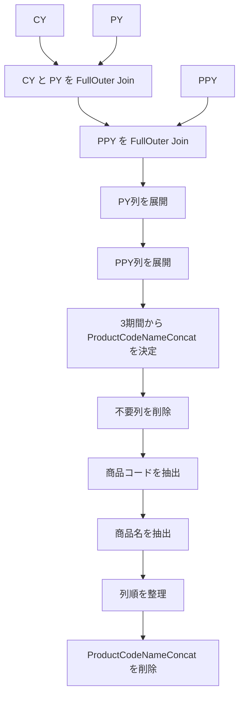

このチャットでは、**既存のPower Queryコードについて、ステップ名や処理内容を変更せず、可読性だけを高める**ことが目的でした。

## 1. 元の依頼

提示されたPower Queryコードは、`CY`・`PY`・`PPY` の3期間の商品別売上データを結合し、商品コード・商品名・各年度の売上金額／売上個数を整理する処理です。

依頼条件は明確に、

> **「ステップ名など変更せずに見やすくして」**

というものでした。

つまり、本来変更してよいのは主に以下です。

- インデント
- 改行
- 引数の配置
- コメントの追加
- 空白の整理

一方、以下は変更しないことが条件でした。

- ステップ名
- カラム名
- 処理順序
- 処理内容
- `in` で返すステップ

## 2. 元コードの処理内容

全体の処理フローは次のとおりです。



### 各ステップの役割

|ステップ名|処理|
|---|---|
|`Source`|`CY` と `PY` を商品コード＋商品名の連結キーでFull Outer Join|
|`#"Merged Queries"`|上記結果と `PPY` をFull Outer Join|
|`#"Expanded {0}"`|`PY` の連結キー・売上金額・売上個数を展開|
|`#"Expanded {0}1"`|`PPY` の連結キー・売上金額・売上個数を展開|
|`#"Added Conditional Column"`|CY → PY → PPY の優先順位で `ProductCodeNameConcat` を確定|
|`#"Removed Columns"`|元の商品情報や期間別連結キーを削除|
|`#"Inserted Text Before Delimiter"`|`_` より前を「商品コード」として抽出|
|`#"Inserted Text After Delimiter"`|`_` より後を「商品名」として抽出|
|`#"Reordered Columns"`|最終出力に合わせて列順を整理|
|`#"Removed Columns1"`|一時的に使用した `ProductCodeNameConcat` を削除|

## 3. 3期間データの統合ロジック

このクエリの重要な部分は、`CY`・`PY`・`PPY` を **Full Outer Join** している点です。

### Full Outer Joinを使う理由

例えば、ある商品について、

|商品|CY|PY|PPY|
|---|--:|--:|--:|
|商品A|○|○|○|
|商品B|○|○|×|
|商品C|×|○|○|
|商品D|×|×|○|

という状態でも、すべての商品を残せます。

Inner Joinでは複数年度すべてに存在する商品しか残らないため、この用途ではFull Outer Joinのほうが適しています。

## 4. `ProductCodeNameConcat` の決定方法

結合後には、

- `CY_ProductCodeNameConcat`
- `PY_ProductCodeNameConcat`
- `PPY_ProductCodeNameConcat`

という3種類のキーが存在します。

そこで、

```powerquery
each
    if [CY_ProductCodeNameConcat] <> null then
        [CY_ProductCodeNameConcat]
    else if [PY_ProductCodeNameConcat] <> null then
        [PY_ProductCodeNameConcat]
    else
        [PPY_ProductCodeNameConcat]
```

という条件で統一キーを作っています。

優先順位は、

```text
CY
 ↓ nullなら
PY
 ↓ nullなら
PPY
```

です。

したがって、CYに存在する商品はCYのキーを使用し、CYに存在しない過年度商品についてはPY、それもなければPPYのキーを使用します。

## 5. 商品コードと商品名への再分割

`ProductCodeNameConcat` は、例えば次のような形式を想定しています。

```text
123456_商品ABC
```

これを `_` を区切り文字として分解しています。

### 商品コード

```powerquery
Text.BeforeDelimiter(
    Text.From([ProductCodeNameConcat], "ja-JP"),
    "_"
)
```

結果：

```text
123456
```

### 商品名

```powerquery
Text.AfterDelimiter(
    [ProductCodeNameConcat],
    "_"
)
```

結果：

```text
商品ABC
```

最終的には連結キー自体は不要になるため、`#"Removed Columns1"` で削除します。

## 6. 最終的な出力構成

最終的な列構成は次の順序です。

|順番|列|
|--:|---|
|1|商品コード|
|2|商品名|
|3|CY_売上金額|
|4|CY_売上個数|
|5|PY_売上金額|
|6|PY_売上個数|
|7|PPY_売上金額|
|8|PPY_売上個数|

つまり、**商品単位で当年・前年・前々年の売上金額と売上個数を横並び比較できるテーブル**を作っています。

## 7. このチャットで発生した問題点

前回の回答では、可読性向上を目的として次のようにステップ名を変更してしまいました。

|元のステップ名|前回答で変更した名前|
|---|---|
|`#"Expanded {0}"`|`#"Expanded PY"`|
|`#"Expanded {0}1"`|`#"Expanded PPY"`|
|`#"Removed Columns"`|`#"Removed Unnecessary Columns"`|
|`#"Inserted Text Before Delimiter"`|`#"Inserted 商品コード"`|
|`#"Inserted Text After Delimiter"`|`#"Inserted 商品名"`|
|`#"Removed Columns1"`|`#"Removed Final Unnecessary Columns"`|

これは、依頼条件である**「ステップ名など変更せずに」**に反しています。

したがって、前回答の「変数名の調整」は今回の要件では改善ではなく、不要な変更でした。

この種の依頼では、

> **ロジックと識別子には触れず、フォーマットだけを整える**

のが正しい対応です。

## 8. 要件どおりに整形する場合の完成形

ステップ名・列名・ロジックを一切変更せず、可読性だけを改善するなら次の形になります。

```powerquery
let
    // CY と PY を商品単位で結合
    Source = Table.NestedJoin(
        CY,
        {"CY_ProductCodeNameConcat"},
        PY,
        {"PY_ProductCodeNameConcat"},
        "PY",
        JoinKind.FullOuter
    ),

    // PPY を追加で結合
    #"Merged Queries" = Table.NestedJoin(
        Source,
        {"CY_ProductCodeNameConcat"},
        PPY,
        {"PPY_ProductCodeNameConcat"},
        "PPY",
        JoinKind.FullOuter
    ),

    // PY の必要列を展開
    #"Expanded {0}" = Table.ExpandTableColumn(
        #"Merged Queries",
        "PY",
        {
            "PY_ProductCodeNameConcat",
            "PY_売上金額",
            "PY_売上個数"
        },
        {
            "PY_ProductCodeNameConcat",
            "PY_売上金額",
            "PY_売上個数"
        }
    ),

    // PPY の必要列を展開
    #"Expanded {0}1" = Table.ExpandTableColumn(
        #"Expanded {0}",
        "PPY",
        {
            "PPY_ProductCodeNameConcat",
            "PPY_売上金額",
            "PPY_売上個数"
        },
        {
            "PPY_ProductCodeNameConcat",
            "PPY_売上金額",
            "PPY_売上個数"
        }
    ),

    // CY → PY → PPY の優先順位で商品キーを統一
    #"Added Conditional Column" = Table.AddColumn(
        #"Expanded {0}1",
        "ProductCodeNameConcat",
        each
            if [CY_ProductCodeNameConcat] <> null then
                [CY_ProductCodeNameConcat]
            else if [PY_ProductCodeNameConcat] <> null then
                [PY_ProductCodeNameConcat]
            else
                [PPY_ProductCodeNameConcat]
    ),

    // 不要な商品情報・期間別キーを削除
    #"Removed Columns" = Table.RemoveColumns(
        #"Added Conditional Column",
        {
            "売上明細商品コード",
            "売上明細商品名",
            "CY_ProductCodeNameConcat",
            "PY_ProductCodeNameConcat",
            "PPY_ProductCodeNameConcat"
        }
    ),

    // 統一キーから商品コードを取得
    #"Inserted Text Before Delimiter" = Table.AddColumn(
        #"Removed Columns",
        "商品コード",
        each Text.BeforeDelimiter(
            Text.From([ProductCodeNameConcat], "ja-JP"),
            "_"
        ),
        type text
    ),

    // 統一キーから商品名を取得
    #"Inserted Text After Delimiter" = Table.AddColumn(
        #"Inserted Text Before Delimiter",
        "商品名",
        each Text.AfterDelimiter(
            [ProductCodeNameConcat],
            "_"
        ),
        type text
    ),

    // 出力列の順序を整理
    #"Reordered Columns" = Table.ReorderColumns(
        #"Inserted Text After Delimiter",
        {
            "商品コード",
            "商品名",
            "CY_売上金額",
            "CY_売上個数",
            "PY_売上金額",
            "PY_売上個数",
            "PPY_売上金額",
            "PPY_売上個数",
            "ProductCodeNameConcat"
        }
    ),

    // 一時的に使用した統一キーを削除
    #"Removed Columns1" = Table.RemoveColumns(
        #"Reordered Columns",
        {"ProductCodeNameConcat"}
    )
in
    #"Removed Columns1"
```

## 9. 今回の結論

今回のPower Queryは、処理ロジック自体を変更する話ではなく、**既存コードの意味を維持したまま読みやすく整形すること**が主題でした。

特に重要なのは次の点です。

- `CY`・`PY`・`PPY` をFull Outer Joinして3期間の商品を欠落なく統合する。
- 商品キーは `CY → PY → PPY` の順で採用する。
- 統一した `ProductCodeNameConcat` から商品コード・商品名を再生成する。
- 最終的に3年間の売上金額・売上個数を横並びにする。
- **既存ステップ名は変更しない。**
- 可読性向上は、改行・インデント・コメント・引数配置の整理に限定する。

今回の要件に照らすと、**最後に示した整形版が意図に沿った形**です。