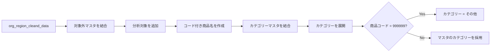
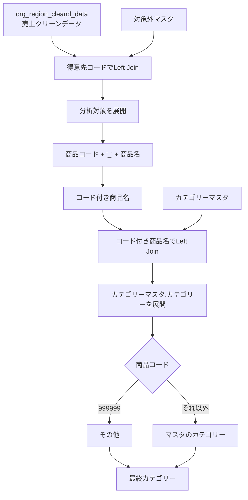

# Power Queryリファクタリングと処理内容の整理

このチャットでは、Power Query（M言語）のコードについて、主に以下の観点で整理・リファクタリングを行った。

- ステップ名を日本語に統一する
- 「コード」に該当するカラムは `type text` とする
- 視認性を上げるため、関数呼び出しや引数を適宜改行する
- 元コードの処理意図を保ったまま、読みやすくする
- 後半では、リファクタリング対象のクエリが何をしているのか、処理内容そのものを確認した

---

## 1. 最初のPower Query：Excelファイルからクリーンデータを読み込む処理

最初に提示されたコードは、Excelファイル

`organization_region_cumulative_data.xlsx`

から `cleaned_data` テーブルを読み込み、各カラムのデータ型を設定するものだった。

元コードでは以下のように、「コード」に該当するカラムが `Int64.Type` になっていた。

- `部門コード`
- `得意先コード`
- `商品コード`

ユーザーからの条件は次のとおり。

- ステップ名は日本語
- コードに該当するカラムの型は `type text`

この条件に基づき、コード系カラムを数値型ではなく文字列型へ変更した。

### リファクタリング後のコード

```pq
let
    ソース = 
        Excel.Workbook(
            File.Contents(
                "C:\Users\kyoupatty029\myproject\analysis_inspection\sales_analysis\cleaned_data\organization_region_cumulative_data.xlsx"
            ),
            null,
            true
        ),

    データテーブル = 
        ソース{
            [
                Item = "cleaned_data",
                Kind = "Table"
            ]
        }[Data],

    型を変更 = 
        Table.TransformColumnTypes(
            データテーブル,
            {
                {"売上日", type date},
                {"部門コード", type text},
                {"得意先コード", type text},
                {"得意先名", type text},
                {"商品コード", type text},
                {"商品名", type text},
                {"売上バラ数量_符号付", Int64.Type},
                {"売上金額_符号付", Int64.Type},
                {"年度_id", Int64.Type},
                {"重複検知_id", type text}
            }
        )
in
    型を変更
```

その後、ユーザーから「視認性を上げるため適宜改行してほしい」と追加要望があり、それ以降はPower Queryコードについて、関数・引数・カラム指定などを複数行へ分けるスタイルを採用した。

### この段階で固まったリファクタリング方針

|項目|方針|
|---|---|
|ステップ名|日本語|
|コード列|`type text`|
|文字列列|`type text`|
|日付|`type date`|
|数値|必要に応じ `Int64.Type`|
|改行|関数・引数・カラム定義を適宜分割|
|目的|ロジックを変えず、読みやすさを上げる|

---

## 2. 次のPower Query：対象外マスタとカテゴリーマスタを結合する処理

次に提示されたコードは、クリーンデータに対して2つのマスタを結合し、分析対象フラグとカテゴリー情報を追加する処理だった。

元データは以下。

```pq
org_region_cleand_data
```

これに対して、

- `対象外マスタ`
- `カテゴリーマスタ`

を順番にマージする。

ユーザーからは「条件は同じ」と指定されたため、前述のルールをそのまま適用した。

---

## 3. リファクタリングしたコード

整理後のコードは以下の形となった。

```pq
let
    ソース = 
        org_region_cleand_data,

    マージ_対象外マスタ = 
        Table.NestedJoin(
            ソース,
            {"得意先コード"},
            対象外マスタ,
            {"得意先コード"},
            "対象外マスタ",
            JoinKind.LeftOuter
        ),

    展開_対象外フラグ = 
        Table.ExpandTableColumn(
            マージ_対象外マスタ,
            "対象外マスタ",
            {"分析対象"},
            {"分析対象"}
        ),

    カラムの追加_コード付き商品名 = 
        Table.AddColumn(
            展開_対象外フラグ,
            "コード付き商品名",
            each [商品コード] & "_" & [商品名]
        ),

    型変更_文字列_コード付き商品名 = 
        Table.TransformColumnTypes(
            カラムの追加_コード付き商品名,
            {
                {"コード付き商品名", type text}
            }
        ),

    マージ_カテゴリーマスタ = 
        Table.NestedJoin(
            型変更_文字列_コード付き商品名,
            {"コード付き商品名"},
            カテゴリーマスタ,
            {"コード付き商品名"},
            "カテゴリーマスタ",
            JoinKind.LeftOuter
        ),

    マージの展開_カテゴリーマスタ_カテゴリー = 
        Table.ExpandTableColumn(
            マージ_カテゴリーマスタ,
            "カテゴリーマスタ",
            {"カテゴリー"},
            {"カテゴリーマスタ.カテゴリー"}
        ),

    条件列の追加_999コードをその他に = 
        Table.AddColumn(
            マージの展開_カテゴリーマスタ_カテゴリー,
            "カテゴリー",
            each
                if [商品コード] = "999999" then
                    "その他"
                else
                    [カテゴリーマスタ.カテゴリー]
        )
in
    条件列の追加_999コードをその他に
```

なお、このクエリでは `商品コード` をすでに前段で `type text` にしている前提であり、条件判定でも

```pq
[商品コード] = "999999"
```

と文字列として扱っている。

---

## 4. このクエリ全体が行っていること

後半では、「ここに書かれているプログラム内容を理解できるか」という確認があり、このPower Query全体の意味を整理した。

このクエリの役割は、簡潔に言うと以下である。

> 売上クリーンデータに、得意先単位の分析対象情報と、商品単位のカテゴリー情報を付加し、特定の商品コード `999999` だけはカテゴリーマスタの内容にかかわらず「その他」と分類する。

処理は大きく3段階に分けられる。



---

## 5. 各ステップの詳細

### ソース

```pq
ソース = org_region_cleand_data
```

すでに別クエリなどで作成された `org_region_cleand_data` を、このクエリの元データとして使用する。

---

### 対象外マスタとのマージ

```pq
Table.NestedJoin(
    ソース,
    {"得意先コード"},
    対象外マスタ,
    {"得意先コード"},
    "対象外マスタ",
    JoinKind.LeftOuter
)
```

`得意先コード` をキーとして、元データと `対象外マスタ` を左外部結合する。

`JoinKind.LeftOuter` なので、基準になるのは `org_region_cleand_data` 側であり、対象外マスタに該当データがなくても売上データの行自体は残る。

概念的には以下。

|売上データ|対象外マスタ|結果|
|---|---|---|
|得意先コードあり|一致あり|マスタ情報を付加|
|得意先コードあり|一致なし|元の行は残る|
|マスタだけに存在|売上側になし|出力されない|

---

### 「分析対象」カラムを展開

マージ結果には、一時的にテーブル型の `対象外マスタ` カラムが作成される。

そこから

```pq
{"分析対象"}
```

だけを取り出して通常のカラムへ展開する。

その結果、売上データに「この得意先を分析対象とするかどうか」を示す情報が追加される。

---

### コード付き商品名の作成

```pq
each [商品コード] & "_" & [商品名]
```

`商品コード` と `商品名` をアンダースコアで結合し、

```text
商品コード_商品名
```

形式の `コード付き商品名` を作成する。

例：

```text
001234_サロモン
```

この複合キーを後続のカテゴリーマスタとの結合に使用する。

商品コードだけではなく商品名も含めることで、カテゴリーマスタ側のキー設計と揃えている。

---

### コード付き商品名を文字列型へ変更

```pq
{"コード付き商品名", type text}
```

作成した `コード付き商品名` を明示的に文字列型へ変更する。

この列はマージキーとして使用するため、参照先の `カテゴリーマスタ` 側と型を合わせておくことが重要となる。

---

### カテゴリーマスタとのマージ

```pq
Table.NestedJoin(
    型変更_文字列_コード付き商品名,
    {"コード付き商品名"},
    カテゴリーマスタ,
    {"コード付き商品名"},
    "カテゴリーマスタ",
    JoinKind.LeftOuter
)
```

今度は `コード付き商品名` をキーにして `カテゴリーマスタ` と左外部結合する。

これによって、各商品に対応するカテゴリーを元データへ付加できるようになる。

---

### カテゴリーを展開

マージした `カテゴリーマスタ` の中から、

```pq
{"カテゴリー"}
```

だけを取り出す。

この時点では元データ側へ、

```text
カテゴリーマスタ.カテゴリー
```

という一時的な列名で追加される。

この列は最終カテゴリーを決めるための中間列として扱っている。

---

### 商品コード「999999」の特別処理

最終ステップは以下。

```pq
each
    if [商品コード] = "999999" then
        "その他"
    else
        [カテゴリーマスタ.カテゴリー]
```

通常の商品についてはカテゴリーマスタの値を採用する。

ただし、

```text
商品コード = 999999
```

の場合は、カテゴリーマスタの値を使わず、強制的に

```text
その他
```

を設定する。

判定結果は、新しい `カテゴリー` カラムへ出力される。

---

## 6. 最終的に追加される主なカラム

このクエリを通すことで、元の `org_region_cleand_data` に対して主に以下の情報が追加される。

|カラム|内容|作成元|
|---|---|---|
|分析対象|得意先が分析対象かどうか|対象外マスタ|
|コード付き商品名|`商品コード_商品名`|計算列|
|カテゴリーマスタ.カテゴリー|マスタから取得したカテゴリー|カテゴリーマスタ|
|カテゴリー|最終的に使用するカテゴリー|条件列|

最終の `カテゴリー` は以下のルールになる。

```text
商品コード = 999999
    ↓
カテゴリー = その他

それ以外
    ↓
カテゴリーマスタ.カテゴリー
```

---

## 7. データの流れ

処理の関係をもう少し具体的にすると次のようになる。



---

## 8. このチャットで確認されたコード記述方針

今回のやり取りから、Power Queryのリファクタリングでは以下の書式を基本とする方向が確認された。

- ステップ名は日本語にする
- ステップの目的が名前から分かるようにする
- `コード` に該当するカラムは原則 `type text`
- コード値の比較も文字列として行う
    - 例：`"999999"`
- `Table.NestedJoin` や `Table.AddColumn` など、引数の多い関数は複数行へ分ける
- 型指定のリストも1カラム1行を基本とする
- `if ... then ... else ...` も複数行にして条件分岐を読みやすくする
- 処理ロジックそのものは勝手に変更せず、まずは可読性を改善する

今回のクエリについては、単なる書式整理だけでなく、「対象外判定」「商品カテゴリー付与」「999999の商品をその他扱い」という業務ロジックまで確認できている。