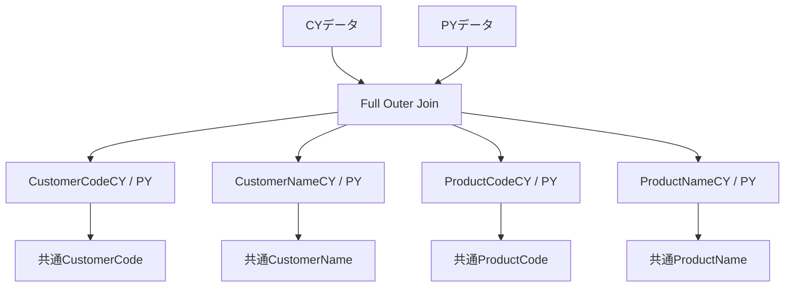
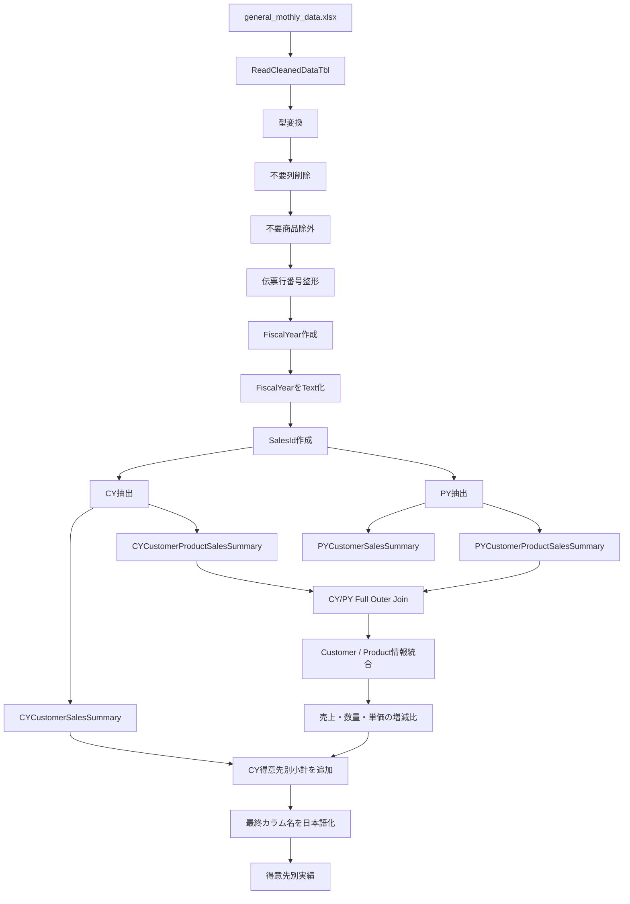

# Power Queryリファクタリング・命名規則・年度別売上分析の整理

このチャットでは、既存の売上分析用Power Queryを整理しながら、**コードの命名規則、処理順序、年度表現、仮カラム名と最終カラム名の扱い、CY/PY比較用クエリの構成**を固めていった。

最終的な方向性としては、単にコードを短くするのではなく、今後の分析クエリ全体で再利用できるように、次の考え方へ整理されている。

- Power Queryのステップ名は**英語・PascalCase**
- コメントは日本語でよい
- 中間処理中のカラム名は基本的に英語
- 提出・表示用の日本語カラム名への変換は**最終段階でまとめて行う**
- 年度比較は `CY` / `PY` を標準表記とする
- 元データの共通読み込みクエリとして `ReadCleanedDataTbl` を利用する
- 不要な行・列は、後続処理に必要ないと確定しているものから早めに削減する
- 集計やID生成などの加工処理は、不要データを除外した後に行う

---

## 1. `ReadCleanedDataTbl` のリファクタリング

最初に扱ったのは、クレンジング済みExcelデータをPower Queryへ読み込むクエリだった。

元コードでは日本語のステップ名や、自動生成されたようなステップ名が混在していたため、Power Query内部の処理名を英語へ統一した。

最終的には次のような構成となった。

```m
let
    // ソースの取得
    Source = Excel.Workbook(
        File.Contents(
            "C:\Users\kyoupatty029\projects\kpm\analysis_inspection\sales_analysis\cleaned_data\general_mothly_data.xlsx"
        ),
        null,
        true
    ),

    // テーブルデータの選択と列の型変換
    TransformedTable = Table.TransformColumnTypes(
        Source{[Item="CleanedDataTbl", Kind="Table"]}[Data],
        {
            {"売上発生部門コード", type text},
            {"売上日付", type date},
            {"売上伝票番号", type text},
            {"売上明細伝票行番号", type text},
            {"得意先コード", type text},
            {"得意先名称", type text},
            {"売上明細商品コード", type text},
            {"売上明細商品名", type text},
            {"売上明細金額符号付", Int64.Type},
            {"売上明細バラ総数符号付", Int64.Type},
            {"売上明細単価", Int64.Type},
            {"AnalysisPeriod", type text}
        }
    ),

    // 不要な列を削除
    SelectedColumns = Table.SelectColumns(
        TransformedTable,
        {
            "売上日付",
            "売上伝票番号",
            "売上明細伝票行番号",
            "得意先コード",
            "得意先名称",
            "売上明細商品コード",
            "売上明細商品名",
            "売上明細バラ総数符号付",
            "売上明細単価",
            "売上明細金額符号付",
            "AnalysisPeriod"
        }
    ),

    // 商品コードが空白または "888888" ではない行をフィルタリング
    FilteredTable = Table.SelectRows(
        SelectedColumns,
        each [売上明細商品コード] <> ""
            and [売上明細商品コード] <> "888888"
    ),

    // 伝票行番号を2桁に整形
    TransformedRows = Table.TransformColumns(
        FilteredTable,
        {
            {
                "売上明細伝票行番号",
                each Text.End("0" & _, 2),
                type text
            }
        }
    ),

    // FiscalYear列の追加
    AddedFiscalYear = Table.AddColumn(
        TransformedRows,
        "FiscalYear",
        each
            if Date.Month([売上日付]) = 11
                or Date.Month([売上日付]) = 12
            then Date.Year([売上日付]) + 1
            else Date.Year([売上日付])
    ),

    // FiscalYearをテキスト型へ変換
    FiscalYearAsText = Table.TransformColumnTypes(
        AddedFiscalYear,
        {
            {"FiscalYear", type text}
        }
    ),

    // SalesId列の追加
    AddedSalesId = Table.AddColumn(
        FiscalYearAsText,
        "SalesId",
        each
            Text.From([FiscalYear])
            & "-"
            & Text.From([売上伝票番号])
            & "-"
            & Text.From([売上明細伝票行番号]),
        type text
    ),

    // SalesId生成用の一時列を削除
    FinalTable = Table.RemoveColumns(
        AddedSalesId,
        {
            "売上伝票番号",
            "売上明細伝票行番号",
            "FiscalYear"
        }
    )
in
    FinalTable
```

このクエリを後続処理から参照する名称として、**`ReadCleanedDataTbl`** を使用している。

---

## 2. FiscalYearとSalesId作成時に発生した問題

FiscalYear作成では、当初次のような形にしていた。

```m
Table.AddColumn(
    ...,
    "FiscalYear",
    each ...,
    type text
)
```

しかし、FiscalYearの式自体は、

```m
Date.Year([売上日付]) + 1
```

などの**数値を返している**。

そのため、ユーザー側で「表示はされるがテキストらしく左寄せされていない」「SalesId作成時にエラーになる」という問題が発生した。

最終的に採用した考え方は、処理を横着して一度に済ませず、明確に3段階へ分ける方法だった。


つまり、

1. FiscalYearを作成
2. FiscalYearを明示的に `type text` へ変換
3. その後でSalesIdを作成

という順序である。

これは、このチャットで重要な設計判断の一つとなった。

---

## 3. FiscalYearの考え方

年度は `FiscalYear` と表現することを確認した。

現在のロジックでは、会計年度開始月が11月であるため、

- 11月 → 翌年をFiscalYearとする
- 12月 → 翌年をFiscalYearとする
- 1〜10月 → 暦年をそのままFiscalYearとする

という処理になっている。

例えば、

|売上日付|FiscalYear|
|---|--:|
|2023-10-31|2023|
|2023-11-01|2024|
|2023-12-31|2024|
|2024-01-01|2024|
|2024-10-31|2024|

となる。

---

## 4. 不要な列・行を処理するタイミング

Power Queryで不要なカラムを削除する時期について検討した。

基本方針としては、

> **後続処理に絶対必要ないと確定している列は、できるだけ早めに削除する。**

となった。

理由は、不要なデータを後続処理へ持ち回らないためである。

同様に、

- 不要行のフィルタリング
- ユニークIDの作成

のどちらを先に行うかについても整理した。

基本的には、


とし、**フィルタリングを先に行う**。

理由は単純で、後から除外する行に対してID生成などの計算を行う必要がないためである。

---

## 5. Power Queryの命名規則

チャットを通じて、Power Query内部のステップ名については次の方向へ統一した。

### ステップ名

**PascalCase** を採用する。

例：

|処理|推奨ステップ名|
|---|---|
|ソース取得|`Source`|
|型変換|`TransformedTable`|
|必要列選択|`SelectedColumns`|
|行フィルタ|`FilteredTable`|
|FiscalYear追加|`AddedFiscalYear`|
|FiscalYear型変換|`FiscalYearAsText`|
|SalesId追加|`AddedSalesId`|
|最終データ|`FinalTable`|

Power Queryが自動生成する、

```m
#"Added Custom"
#"Changed Type"
#"Expanded {0}"
```

のような名前は、処理内容が分かりにくいため、可能な範囲で意味のある英語名へ変更する。

---

## 6. CY・PYの年度表記

年度比較の呼称についても整理した。

以前使用していた、

- TY = This Year
- LY = Last Year

に相当するものとして、現在は、

|表記|意味|
|---|---|
|`CY`|Current Year|
|`PY`|Previous Year|

を使用する。

したがって、

```text
TY → CY
LY → PY
```

へ統一する。

例：

```text
SalesAmountCY
SalesAmountPY
QuantityCY
QuantityPY
UnitPriceCY
UnitPricePY
```

また、元データ側の年度判定カラムとして、

```text
AnalysisPeriod
```

を使用し、

```m
[AnalysisPeriod] = "CY"
```

などで年度を抽出する。

---

## 7. 本年度の得意先別売上小計

`ReadCleanedDataTbl` から本年度データだけを抽出し、得意先別に売上を集計するクエリを作成した。

基本構成は次の通り。

```m
let
    // クレンジングされたデータの読み込み
    Source = ReadCleanedDataTbl,

    // 本年度データを抽出
    FilteredCurrentYear = Table.SelectRows(
        Source,
        each [AnalysisPeriod] = "CY"
    ),

    // 得意先別に売上を集計
    GroupedByCustomerSales = Table.Group(
        FilteredCurrentYear,
        {
            "得意先コード",
            "得意先名称"
        },
        {
            {
                "CustomerSalesAmount",
                each List.Sum([売上明細金額符号付]),
                type nullable number
            }
        }
    ),

    // 売上額順
    SortedFinalData = Table.Sort(
        GroupedByCustomerSales,
        {
            {"CustomerSalesAmount", Order.Descending}
        }
    )
in
    SortedFinalData
```

このクエリは、

> **本年度の得意先ごとの売上小計**

を表す。

クエリ名候補として、

```text
CurrentYearCustomerSalesSummary
```

を検討し、その後短縮版として、

```text
CYCustomerSalesSummary
```

を採用候補とした。

こちらの方が、他のCY/PY系クエリとの整合性も高い。

---

## 8. `type nullable number` の意味

`Table.Group` の集計結果で使用していた、

```m
type nullable number
```

について確認した。

これは、

> **number型だが、nullも許容する**

という意味である。

つまり、

```text
number
または
null
```

を持てる型である。

Power Queryの集計結果では、データ欠損などを考慮して `nullable` を使用するケースがある。

---

## 9. 本年度の「得意先 × 商品」別売上集計

次に、得意先ごとの各商品の売上金額・数量・単価を集計するクエリを整理した。

このクエリの意味は、

> **本年度の得意先別・商品別売上小計**

である。

クエリ名として最初に、

```text
CurrentYearCustomerProductSalesSummary
```

を提示したが、長いため短縮し、

```text
CYCustomerProductSalesSummary
```

とする方向になった。

PY側については対称的に、

```text
PYCustomerProductSalesSummary
```

とする。

これにより、

```text
CYCustomerSalesSummary
CYCustomerProductSalesSummary

PYCustomerSalesSummary
PYCustomerProductSalesSummary
```

のように規則的に並べられる。

---

## 10. CYとPYの商品別売上をFull Outer Joinする処理

ユーザー自身で、次の部分を修正していた。

```m
Source = Table.NestedJoin(
    PYCustomerProductSalesSummary,
    {
        "CustomerCodePY",
        "CustomerNamePY",
        "ProductCodePY",
        "ProductNamePY"
    },
    CYCustomerProductSalesSummary,
    {
        "CustomerCodeCY",
        "CustomerNameCY",
        "ProductCodeCY",
        "ProductNameCY"
    },
    "CYCustomerProductSalesSummary",
    JoinKind.FullOuter
),
```

そしてCY側を展開する。

```m
ExpandedCY = Table.ExpandTableColumn(
    Source,
    "CYCustomerProductSalesSummary",
    {
        "CustomerCodeCY",
        "CustomerNameCY",
        "ProductCodeCY",
        "ProductNameCY",
        "SalesAmountCY",
        "QuantityCY",
        "UnitPriceCY"
    }
)
```

ここでは `FullOuter` を使用しているため、

- CYだけ存在
- PYだけ存在
- CY/PY両方存在

のすべての商品を残せる。

---

## 11. CYとPYのキー情報統合

Full Outer Join後は、CYまたはPYのどちらか一方しか存在しない可能性がある。

そのため、

```text
CustomerCodeCY
CustomerCodePY
```

などを最終的な共通カラムへまとめる。

例：

```m
AddedCustomerCode = Table.AddColumn(
    ExpandedCY,
    "CustomerCode",
    each
        if [CustomerCodeCY] <> null
        then [CustomerCodeCY]
        else [CustomerCodePY],
    type text
)
```

同様に、

```text
CustomerName
ProductCode
ProductName
```

も統合する。

構造としては、



となる。

---

## 12. CY/PYの増減比

CYとPYについて、

- 売上金額
- 数量
- 単価

の増減比を計算する処理も整理した。

例：

```m
AddedSalesChangeRatio = Table.AddColumn(
    RemovedUnusedColumns,
    "SalesChangeRatio",
    each
        if [SalesAmountCY] = 0 and [SalesAmountPY] = 0 then ""
        else if [SalesAmountPY] = 0 then ""
        else [SalesAmountCY] / [SalesAmountPY],
    Percentage.Type
)
```

同様に、

```text
QuantityChangeRatio
UnitPriceChangeRatio
```

を作成する。

ここではPYを分母として、

```text
CY / PY
```

を算出する。

---

## 13. 得意先別小計との結合

商品単位のCY/PY比較結果へ、

```text
CYCustomerSalesSummary
```

をマージし、得意先全体の本年度売上小計を追加する。

これは、最終表を、

1. 得意先の売上規模
2. 得意先内の商品売上規模

の順で並べるために利用する。

イメージとしては、

```text
得意先A  小計 10,000,000
 ├ 商品A 3,000,000
 ├ 商品B 2,500,000
 └ 商品C 1,800,000

得意先B  小計 8,000,000
 ├ 商品D 4,000,000
 └ 商品E 2,000,000
```

という構造を作るためのもの。

最終的には、

```m
Table.Sort(
    ReorderedColumns,
    {
        {"Subtotal", Order.Descending},
        {"SalesAmountCY", Order.Descending}
    }
)
```

のような考え方でソートする。

---

## 14. 仮カラム名と最終カラム名

途中で、

> カラム名は早いうちに最終名称へ変更すべきか

を検討した。

最初は「可能なら早めに最終名称へ変更する」という案もあったが、その後ユーザーから、

> 最後に修正した方が英語と日本語が混ざらなくてよいのではないか

という指摘があり、こちらの方針へ整理された。

### 現在の方針

**中間処理**

```text
CustomerCode
CustomerName
ProductCode
ProductName
SalesAmountCY
QuantityCY
UnitPriceCY
SalesAmountPY
QuantityPY
UnitPricePY
SalesChangeRatio
QuantityChangeRatio
UnitPriceChangeRatio
```

のように英語で統一する。

**最終出力直前**

```text
得意先コード
得意先名
商品コード
商品名
売上金額（本年度）
数量（本年度）
単価（本年度）
売上金額（昨年度）
数量（昨年度）
単価（昨年度）
増減比（売上金額）
増減比（数量）
増減比（単価）
```

などの提出用日本語へ一括変更する。

この方式なら、

```text
英語 → 日本語 → 英語 → 日本語
```

という途中混在がなくなる。

したがって現在は、

> **Power Query内部では英語を維持し、出力直前にまとめて日本語化する**

という方針が適している。

---

## 15. 仮名称について

どうしても処理途中でしか意味が確定しないカラムについては、仮名称を使用してよい。

ただし、このチャットの方針では、仮名称も可能な限り英語にする。

例えば、

```text
TempCustomerCode
IntermediateProductName
MergedCustomerCode
```

など。

ただし `Temp` を乱用するのではなく、その処理の意味が分かる場合は、

```text
CustomerCodeCY
CustomerCodePY
MergedCustomerCode
```

のような意味ベースの名前の方が望ましい。

---

## 16. 「得意先別実績」の英語名称

「得意先別実績」という名称に対応するPower Queryの名前として、

```text
CustomerPerformanceSummary
```

が候補として挙がった。

意味としては、

- `Customer` = 得意先
- `Performance` = 実績
- `Summary` = 集計・要約

となる。

ただし、今回構築している具体的な売上分析系クエリについては、

```text
CYCustomerSalesSummary
CYCustomerProductSalesSummary
```

のように、**何を集計しているのかをSalesまで明示する名称の方が具体的**である。

そのため、「得意先別実績」が広い意味の成果・実績表なら、

```text
CustomerPerformanceSummary
```

売上実績そのものなら、

```text
CustomerSalesSummary
```

の方が意味は限定的で明確になる。

---

# 現在の命名体系

現時点の整理をまとめると、次のような体系になる。

|用途|名称|
|---|---|
|クレンジング済みデータ読み込み|`ReadCleanedDataTbl`|
|本年度|`CY`|
|昨年度|`PY`|
|本年度 得意先別売上小計|`CYCustomerSalesSummary`|
|昨年度 得意先別売上小計|`PYCustomerSalesSummary`|
|本年度 得意先×商品別売上小計|`CYCustomerProductSalesSummary`|
|昨年度 得意先×商品別売上小計|`PYCustomerProductSalesSummary`|
|得意先別実績|`CustomerPerformanceSummary`|
|会計年度|`FiscalYear`|
|売上明細単位の識別子|`SalesId`|

カラムについても、

|意味|中間処理名|
|---|---|
|得意先コード|`CustomerCode`|
|得意先名|`CustomerName`|
|商品コード|`ProductCode`|
|商品名|`ProductName`|
|CY売上金額|`SalesAmountCY`|
|PY売上金額|`SalesAmountPY`|
|CY数量|`QuantityCY`|
|PY数量|`QuantityPY`|
|CY単価|`UnitPriceCY`|
|PY単価|`UnitPricePY`|
|売上増減比|`SalesChangeRatio`|
|数量増減比|`QuantityChangeRatio`|
|単価増減比|`UnitPriceChangeRatio`|

という体系へ整理できる。

---

# 全体の処理フロー

今回の売上分析処理全体を簡略化すると、次のようになる。



---

# このチャットで固まった主要判断

- Power Queryの**ステップ名はPascalCaseの英語**とする。
- コメントは日本語で問題ない。
- `ReadCleanedDataTbl` を共通のクレンジング済みデータソースとして使用する。
- 不要な列や行は、必要性がなくなった時点でなるべく早く除外する。
- ID生成より不要行フィルタリングを先に行う。
- `FiscalYear` は、作成と型変換を別ステップにする。
- FiscalYearをテキスト化した後に `SalesId` を作成する。
- 年度表記は `TY/LY` ではなく **`CY/PY`** に統一する。
- CY/PY比較では `FullOuter` を使用し、どちらか一方にしか存在しない得意先・商品も残す。
- 中間処理のカラム名は英語で統一する。
- 提出用の日本語カラム名への変更は**処理の最後で一括して行う**。
- 本年度得意先別小計は `CYCustomerSalesSummary`。
- 本年度得意先×商品別小計は `CYCustomerProductSalesSummary`。
- 「得意先別実績」の一般名称候補は `CustomerPerformanceSummary`。

この時点で、単発のPower Queryコード修正というより、**売上分析プロジェクト全体で使用するPower Queryの命名・年度比較・中間データ設計の基本ルール**まで整理された状態になっている。