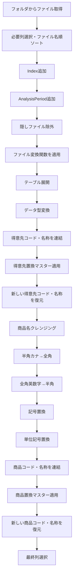
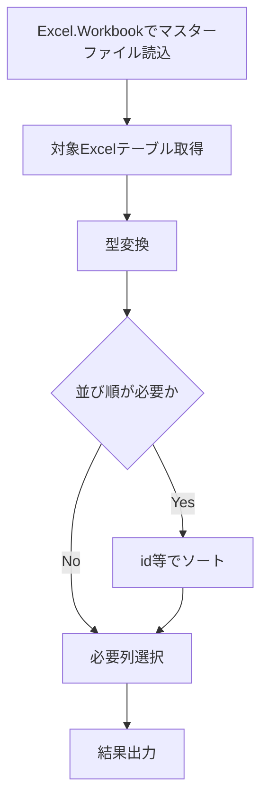
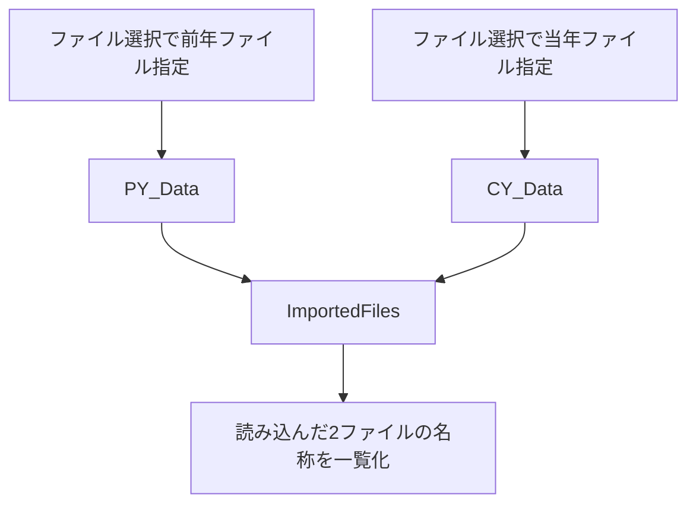
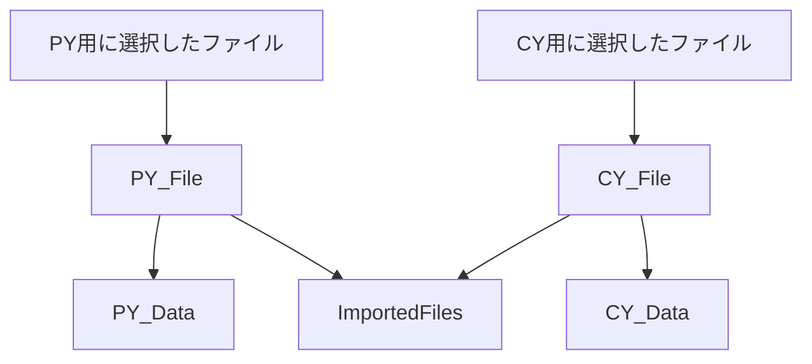
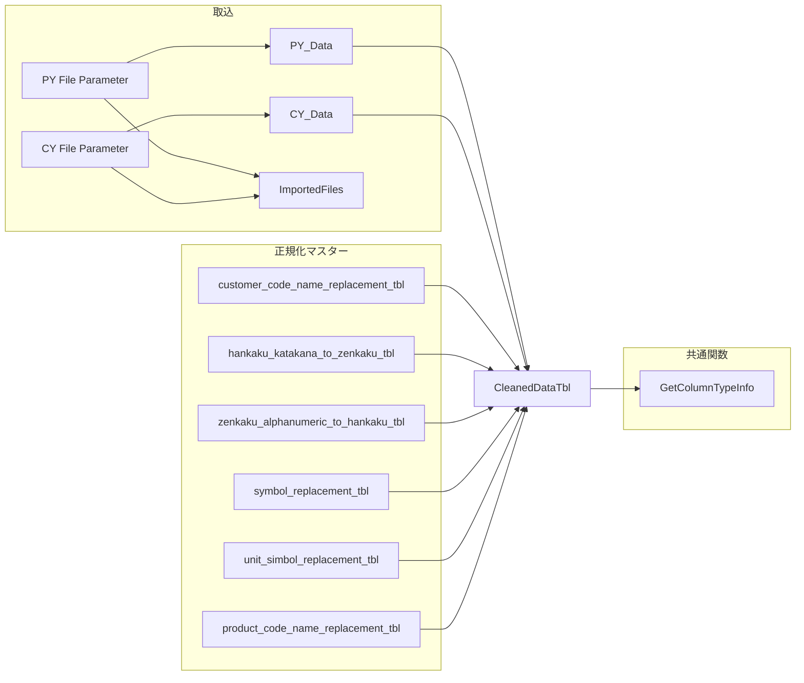

# Power Queryリファクタリング・型情報取得・マスター参照・取込ファイル管理の整理

このチャットでは、売上分析用のPower Queryについて、既存処理をなるべく変えずに可読性を上げるリファクタリング、列型情報を取得する関数の命名と利用方法、各種置換マスターのクエリ整理、売上レコード識別用の列名、さらに`PY_Data`・`CY_Data`で読み込んだファイル名を`ImportedFiles`側で一覧化する設計について検討した。

大きな方向性としては、**Power Queryの処理内容は維持しつつ、ステップ名・変数名・コメント・改行を整理すること**、そして**クエリ間の責務を明確に分けること**が一貫したテーマになっている。

## 1. 売上データ取込クエリの視認性改善

最初に、売上ファイルをフォルダから取得してクレンジングするPower Queryについて、**プログラムのロジックそのものは変更せず、視認性だけを向上させる**整理を行った。

元の処理フローは概ね次のとおり。



視認性改善では、主に以下を行った。

- 長い関数呼び出しは引数単位で改行
- ネストした`Table.AddColumn`や`List.Accumulate`はインデントを揃える
- 処理ブロックごとに空行を入れる
- コメントは各処理の直前に配置
- 処理内容自体は変更しない

この方針は、その後の各マスタークエリのリファクタリングにも継続して適用した。

## 2. Power Query更新時にExcel側の列幅を維持する方法

Power Queryを更新した際に、Excelシートへ読み込まれたテーブルの列幅が勝手に変わらないようにしたい、という話も扱った。

基本方針は、Power Queryではなく**Excel側のテーブル設定で制御する**こと。

Excelのテーブルプロパティにある、更新時の列幅自動調整に関する設定を無効化する方法を案内した。

また、必要であればVBAで以下のような制御も可能という話をした。

- 更新前に列幅を保存
- Power Query更新
- 更新後に元の列幅へ戻す

ただし、この場合は単純に`RefreshAll`直後へ処理を書くだけでは、非同期更新との兼ね合いがあるため、実際の運用では更新完了待ちを考慮する必要がある。

## 3. `GetColumnTypeInfo`関数の命名

テーブルの各カラムについて、**カラム名とデータ型の一覧を取得する関数**について命名を検討した。

元の関数は次のような処理。

```powerquery
let
    GetColumnDetails = (tableName as table) as table =>
    let
        Schema = Table.Schema(tableName),
        SelectedColumns = Table.SelectColumns(
            Schema,
            {"Name", "TypeName"}
        ),
        RenamedColumns = Table.RenameColumns(
            SelectedColumns,
            {
                {"Name", "ColumnName"},
                {"TypeName", "ColumnType"}
            }
        )
    in
        RenamedColumns
in
    GetColumnDetails
```

候補として以下が挙がった。

|候補|評価|
|---|---|
|`GetColumnType`|単数形で、複数列の一覧を返す関数としてはやや曖昧|
|`GetColumnTypes`|型一覧を取得することは伝わる|
|`GetColumnDetails`|広義で、何の詳細かが少し弱い|
|`GetColumnInfo`|汎用的|
|`GetColumnTypeDetails`|意味は明確だが長め|
|`GetColumnTypeInfo`|型情報を中心に、列名も返す関数としてバランスが良い|
|`GetTableSchema`|`Table.Schema`全体を返すように受け取られるため広すぎる|

特に`Schema`については、ユーザーから「カラム名や型以外の情報も含むのでは」と指摘があり、その認識で整理した。

最終的に、関数名は

```text
GetColumnTypeInfo
```

を採用した。

これは、現在の処理内容である

- `ColumnName`
- `ColumnType`

の一覧取得に対して、過不足の少ない名称と判断した。

## 4. `CleanedDataTbl`へ`GetColumnTypeInfo`を適用する方法

`CleanedDataTbl`はすでに**別クエリとして存在している**前提で、空のクエリからその列型一覧を表示したい、という話になった。

当初は以下のように、

```powerquery
Source = CleanedDataTbl,
FirstRow = Table.FirstN(Source, 1),
InvokedCustomFunction = Table.AddColumn(
    FirstRow,
    "GetColumnTypeInfo",
    each GetColumnTypeInfo(CleanedDataTbl)
)
```

という流れになっていた。

しかし、これは冗長。

`GetColumnTypeInfo`はテーブル自体を引数として受け取り、その構造情報を返す関数なので、先頭行を取得したり、`Table.AddColumn`で関数結果を埋め込んだりする必要はない。

最終的には、以下だけでよいと整理した。

```powerquery
let
    // CleanedDataTbl のカラム情報を取得
    ColumnDetails = GetColumnTypeInfo(CleanedDataTbl)
in
    ColumnDetails
```

さらに簡潔にするなら、

```powerquery
let
    ColumnTypeInfo = GetColumnTypeInfo(CleanedDataTbl)
in
    ColumnTypeInfo
```

でもよい。

つまり、処理構造としては以下だけ。


## 5. ステップ名・変数名の命名ルール

リファクタリングでは、**ステップ名・変数名をPascalCaseへ統一する**方針を採用した。

たとえば自動生成されたPower Queryの、

```powerquery
#"Changed Type"
#"Removed Other Columns"
#"Sorted Rows"
```

のようなステップ名は、以下のように変更する。

```powerquery
ChangedType
SelectedColumns
SortedRows
```

また、テーブル取得時の自動生成名、

```powerquery
customer_code_name_normalization_tbl_Table
```

のような名前も、意味が分かるPascalCaseへ変更する。

例：

```powerquery
CustomerCodeNameTable
```

ただし、より意味を明示するなら、

```powerquery
CustomerCodeNameReplacementTable
```

の方が実際のテーブル名との整合性は高い。

コメントは日本語で統一する方針。

## 6. 置換マスタークエリのリファクタリング

複数のマスター参照クエリについて、同じルールで整理した。

### `customer_code_name_replacement_tbl`

対象ファイル：

```text
customer_data_replacement_master.xlsx
```

対象テーブル：

```text
customer_code_name_replacement_tbl
```

リファクタリング後の基本形。

```powerquery
let
    // 顧客コード・名称置換マスターを読み込む
    Source = Excel.Workbook(
        File.Contents(
            "C:\Users\kyoupatty029\projects\kpm\analysis_inspection\shared_master\normalization\customer_data_replacement_master.xlsx"
        ),
        null,
        true
    ),

    // 顧客コード・名称置換テーブルを取得
    CustomerCodeNameTable = Source{
        [Item = "customer_code_name_replacement_tbl", Kind = "Table"]
    }[Data],

    // データ型をテキストに変換
    ChangedType = Table.TransformColumnTypes(
        CustomerCodeNameTable,
        {
            {"original_code_name_concat", type text},
            {"updated_code_name_concat", type text}
        }
    ),

    // 必要な列のみ選択
    SelectedColumns = Table.SelectColumns(
        ChangedType,
        {
            "original_code_name_concat",
            "updated_code_name_concat"
        }
    )
in
    SelectedColumns
```

### `hankaku_katakana_to_zenkaku_tbl`

対象ファイル：

```text
character_replacement_master.xlsx
```

対象テーブル：

```text
hankaku_katakana_to_zenkaku_tbl
```

基本ステップ：

- ソース読込
- 対象テーブル取得
- `id`、`original`、`updated`をtext型へ変換
- `id`昇順
- `original`と`updated`だけを残す

テーブル取得ステップは、

```powerquery
HankakuToZenkakuTable
```

とした。

### `zenkaku_alphanumeric_to_hankaku_tbl`

対象テーブル：

```text
zenkaku_alphanumeric_to_hankaku_tbl
```

元コードには、

```text
zenkaku_alphanumeic_to_hankaku_tbl_Table
```

というスペルミスがあった。

`alphanumeic`ではなく、

```text
alphanumeric
```

が正しい。

リファクタリングではテーブル取得ステップを、

```powerquery
ZenkakuToHankakuTable
```

とした。

### `symbol_replacement_tbl`

対象テーブル：

```text
symbol_replacement_tbl
```

テーブル取得ステップを、

```powerquery
SymbolReplacementTable
```

とした。

このクエリには元々ソート処理がなく、そのまま

- 型変換
- 必要列選択

のみ行う。

### `unit_simbol_replacement_tbl`

ここでは重要なスペル上の論点があった。

元のテーブル名は、

```text
unit_simbol_replacement_tbl
```

となっている。

英語として正しいのは、

```text
symbol
```

なので、Power Query内部のステップ名は、

```powerquery
UnitSymbolReplacementTable
```

とした。

ただし、**実際のExcelテーブル名が`unit_simbol_replacement_tbl`のままなら、Item指定部分は変更できない**。

つまり、

```powerquery
Source{
    [Item = "unit_simbol_replacement_tbl", Kind = "Table"]
}[Data]
```

はそのまま使用する。

### `product_code_name_replacement_tbl`

対象ファイル：

```text
product_data_replacement_master.xlsx
```

対象テーブル：

```text
product_code_name_replacement_tbl
```

テーブル取得ステップは、

```powerquery
ProductCodeNameReplacementTable
```

とした。

型変換ステップについては途中で、

```powerquery
ConvertedTypes
```

という案も出た。

ただし、他クエリとの統一性を優先するなら、

```powerquery
ChangedType
```

へ統一した方が分かりやすい。

この点は、プロジェクト全体で命名規則を固定するとよい。

## 7. マスタークエリ全体の統一パターン

今回整理した各マスタークエリは、基本的に同じ構造に統一できる。



代表的なステップ名は以下。

|役割|ステップ名|
|---|---|
|元ファイル読込|`Source`|
|対象テーブル取得|`...Table`|
|型変換|`ChangedType`|
|ソート|`SortedRows`|
|必要列選択|`SelectedColumns`|

この形に揃えると、クエリ間の比較がかなりしやすくなる。

## 8. 売上を特定するための連番カラム名

売上レコードを一意または疑似一意に識別するための連番カラム名についても検討した。

候補として以下を提示した。

|候補|ニュアンス|
|---|---|
|`SalesID`|売上の識別子|
|`SalesSequence`|売上の連番|
|`SalesNumber`|売上番号|
|`SalesSerialNumber`|シリアル番号|
|`SalesRecordID`|売上レコードのID|
|`SalesEntryID`|売上エントリのID|
|`SalesReferenceID`|売上参照用ID|

このうち、用途によって最適解が異なる。

単純なPower QueryのIndex列として振る連番であれば、

```text
SalesIndex
```

または

```text
SalesSequence
```

の方が、`ID`より実態を正確に表す。

一方、後続処理で「売上レコード識別子」として扱うなら、

```text
SalesRecordID
```

も明確。

`SalesID`は簡潔だが、業務上すでに存在する売上伝票番号などと混同しないかは確認が必要。

## 9. `PY_Data`・`CY_Data`・`ImportedFiles`の設計

後半では、前年データと当年データをそれぞれ別クエリで読み込み、その**実際の読み込み元ファイル名を`ImportedFiles`クエリ側で一覧表示したい**という要件を整理した。

現在のイメージは以下。



当初の`PY_Data`は、

```powerquery
let
    Source = Excel.Workbook(
        File.Contents(
            "C:\...\sc_sales_202301.xlsx"
        ),
        null,
        true
    )
in
    Source
```

`CY_Data`は、

```powerquery
let
    Source = Excel.Workbook(
        File.Contents(
            "C:\...\sc_sales_202401.xlsx"
        ),
        null,
        true
    )
in
    Source
```

という形だった。

`ImportedFiles`は、

```powerquery
let
    Source1 = PY_Data,
    Source2 = CY_Data
in
    Source1
```

という暫定状態。

### 要件として明確になったこと

ユーザーの意図は次の通り。

- `PY_Data`で前年ファイルを読み込む
- `CY_Data`で当年ファイルを読み込む
- `ImportedFiles`は両クエリを参照する
- `ImportedFiles`側で、**実際に読み込んだExcelファイル名を出力する**
- `ImportedFiles`側へファイル名やパスを手入力してはいけない
- `PY_Data`と`CY_Data`についても、Mコードへ固定パスを直接書く運用を避けたい
- Excel/Power QueryのGUIでファイルを選択する通常の読み込み操作を利用したい
- 直接Mコードへパスを書けば存在しないファイル等の入力ミスをGUI段階で検知しにくくなるため、運用上それを避けたい

### ここで重要な技術的問題

この部分について、途中の回答には誤りがあった。

`Excel.Workbook(File.Contents(...))`の結果である`PY_Data`や`CY_Data`は、基本的にはExcelブック内のシートやテーブル情報を含む**テーブル**であって、元ファイルのフルパスやファイル名が自動的に保持されているわけではない。

そのため、

```powerquery
Source1{0}[Name]
```

や、

```powerquery
Source1{0}[Item]
```

から取得できるのは、通常はブック内のシート名・テーブル名等であり、読み込み元Excelファイル名ではない。

また、

```powerquery
Excel.CurrentWorkbook()
```

はファイル選択ダイアログを出す機能ではない。現在のExcelブック内に存在するテーブル・名前付き範囲等を取得する関数であり、ここも途中の説明は不正確だった。

## 10. `ImportedFiles`で元ファイル名を取得するための正しい設計方針

この要件を成立させるには、`PY_Data`と`CY_Data`側で**データ本体だけではなく、元ファイル名に関する情報も保持する設計**が必要になる。

考え方は大きく2つある。

### 方法A：ファイル取得段階のメタデータを保持する

Power Query GUIから「データの取得 → ファイルから → Excelブックから」でファイルを選択した場合、生成されたクエリは最終的には、

```powerquery
File.Contents("...")
```

を内部に持つ。

このパス文字列そのものを同じクエリ内で変数として保持しておけば、ファイル名を抽出できる。

ただし、これを`ImportedFiles`から取得したい場合、`PY_Data`の返り値を単純なテーブルではなく、ファイル名情報も含んだ構造へ変える必要がある。

例として考えられるのは、

```text
PY_Data
├─ Data
└─ FileName
```

のようなRecordを返す方式。

ただし、既存の`PY_Data`を他のクエリが「テーブル」として直接参照している場合、返り値をRecordへ変えると大きな修正になる。

### 方法B：ファイル情報専用クエリを分離する

より現実的なのは、GUIで選択したファイルパスを共通ソースとして扱い、

```text
PY_File
CY_File
PY_Data
CY_Data
ImportedFiles
```

のように分ける設計。

たとえば概念的には、



こうすれば、

- `PY_Data`はデータ読込専用
- `CY_Data`はデータ読込専用
- `ImportedFiles`はファイル情報だけを参照

という責務分離ができる。

ただし、Power Query単体には、VBAの`Application.GetOpenFilename`のように**クエリ更新時に毎回ファイル選択ダイアログを出す標準M関数はない**。

Power Queryの「通常のファイル選択」は、クエリ作成時にGUIでパスを設定し、その結果としてMコードにファイルパスが保存される仕組み。

したがって、ユーザーが求める「一般的なExcelファイル選択ダイアログで都度選択する」挙動まで必要なら、Power Queryだけでなく、

- Excelセルへファイルパスを格納してPQが読む
- 名前付きセルをパラメータとして使う
- VBAでファイル選択ダイアログを表示し、セルや名前定義へパスを書き込む
- Power Queryはその値を参照する

といった設計の方が適している。

この点は、今後の実装時に改めて整理が必要。

## 11. 現時点の重要な決定事項と未解決事項

今回のチャットで固まった内容と、まだ設計が必要な部分を整理すると以下。

|項目|状態|内容|
|---|---|---|
|Power Queryの整形方針|決定|ロジックを変えず、改行・インデント・コメントを整理|
|ステップ名|決定|PascalCase|
|コメント|決定|日本語|
|型情報取得関数名|決定|`GetColumnTypeInfo`|
|`CleanedDataTbl`の型一覧取得|決定|`GetColumnTypeInfo(CleanedDataTbl)`を直接実行|
|マスタークエリ命名|概ね決定|`Source`→`...Table`→`ChangedType`→`SortedRows`→`SelectedColumns`|
|`unit_simbol`のスペル|注意事項|実テーブル名は維持、内部変数は`Symbol`表記可|
|売上連番列名|未確定|`SalesIndex` / `SalesSequence` / `SalesRecordID`等が候補|
|`PY_Data` / `CY_Data`|方針あり|前年・当年ファイルを別クエリで読み込む|
|`ImportedFiles`|要件確定|`PY_Data`・`CY_Data`の実ファイル名を自動取得したい|
|`ImportedFiles`でのパス直書き|禁止|ファイル名・パスを二重管理しない|
|ファイル選択方式|要再設計|PQだけで更新時ダイアログ選択は困難。セル/VBA等も候補|

## 12. 今後の推奨構成

これまでの方針を踏まえると、売上分析用Power Queryは次のように役割分担すると整理しやすい。



この構成にすると、**データ読込・ファイル情報・正規化マスター・共通関数**が分離され、後から処理を追いやすくなる。

特に`ImportedFiles`については、`PY_Data`・`CY_Data`の「結果テーブル」から無理に元ファイル名を逆算するより、**ファイルを指定する元情報そのものを共有する設計**へ変えるのが本筋になる。