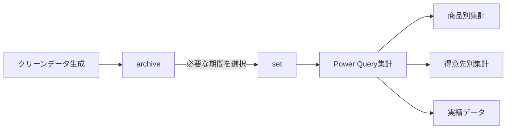
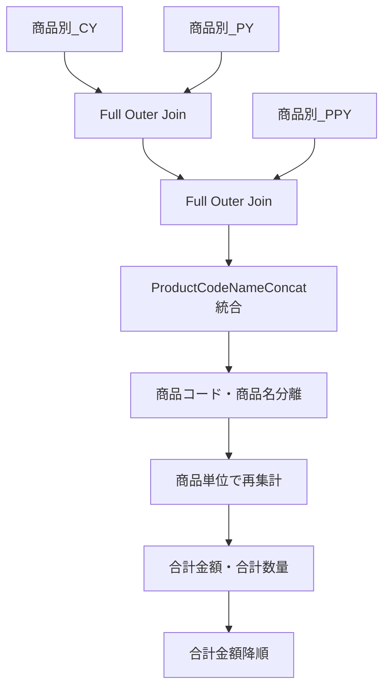
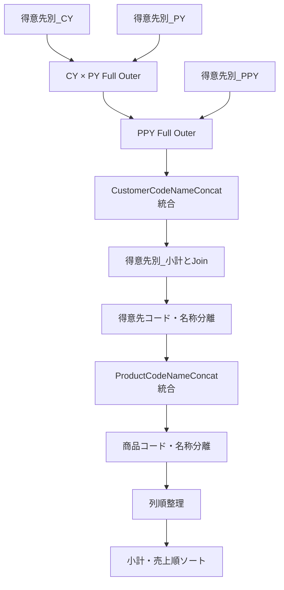
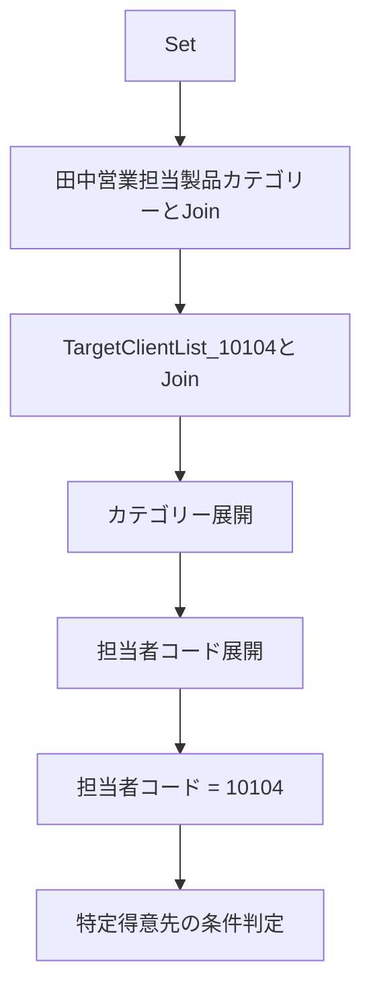
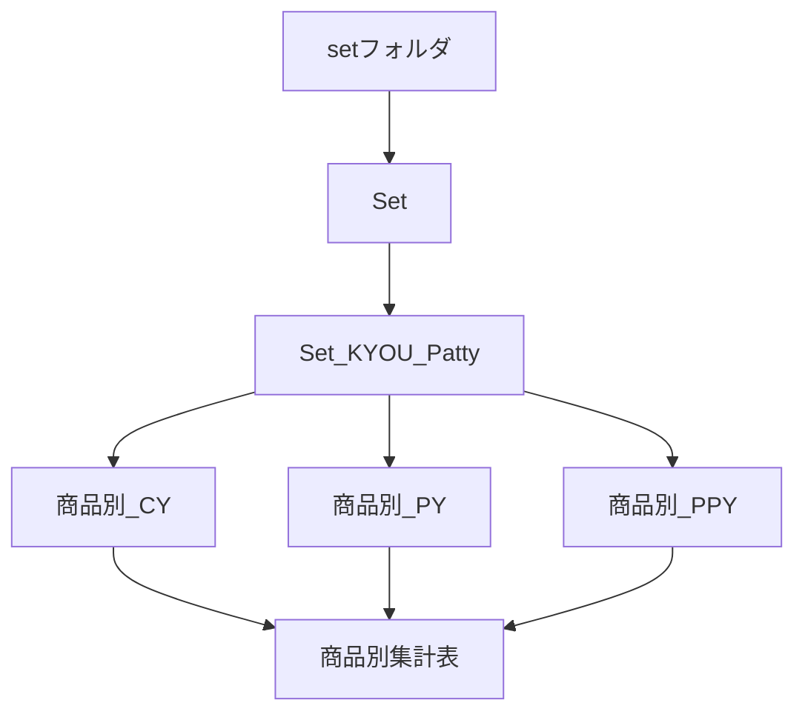
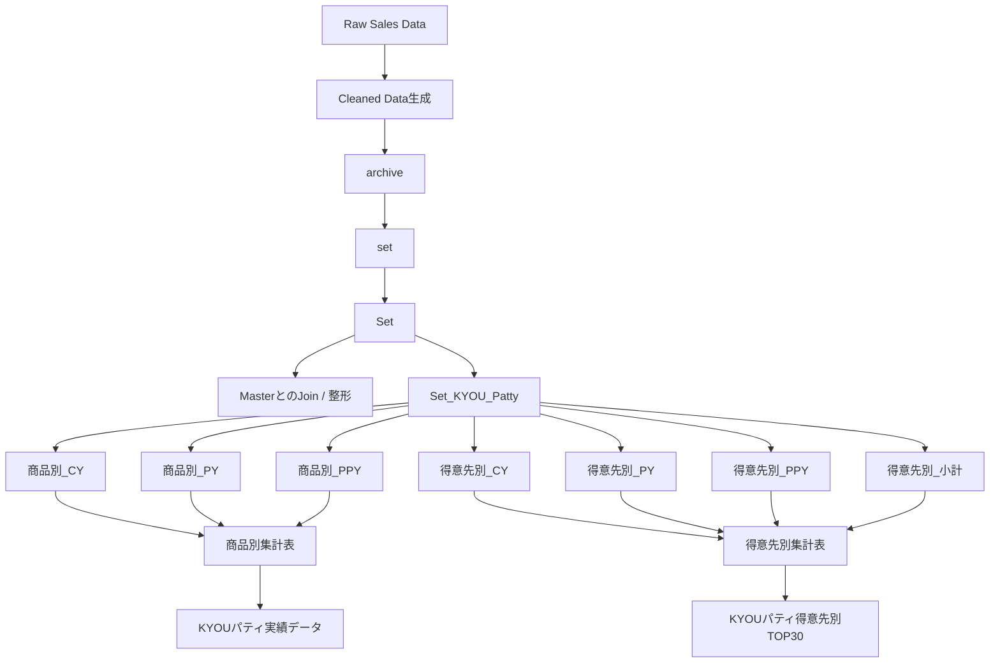

今回のチャットでは、主に以下の3点を整理・調整した。

1. **クリーンデータの保存フォルダ構成**
2. **Power Queryコードの視認性向上リファクタリング**
3. **Power Queryのグループ構成・処理順・命名方針**

全体として、処理ロジックそのものを大きく変えるのではなく、**既存の売上分析フローを維持したまま、保存構造・命名・コードの可読性を改善する**方向で進めた。

---

## 1. クリーンデータの保存構造

売上分析では、集計データを作成する前段階としてクリーンデータを生成している。

作業対象のルートは以下。

```text
C:\Users\kyoupatty029\projects\kpm\analysis_inspection\sales_analysis\cleaned_data\general_enhanced\
```

クリーンデータのファイル名は、例えば以下の形式。

```text
general_enhanced_cleaned_data_202411.xlsx
general_enhanced_cleaned_data_2023.xlsx
```

年月・年度は**ファイル名で管理する**ため、年月ごとにサブフォルダを増やす方式ではなく、1つのフォルダへ集約する方針。

### 既存の `set` フォルダ

集計処理では複数年度・複数期間のクリーンデータを同時に使用するため、すでに以下のフォルダを利用している。

```text
general_enhanced\
└── set\
```

`set` は、CY / PY / PPY など、**集計処理で現在使用するファイル群をまとめる作業用フォルダ**という位置づけ。

一方、それとは別に、作成済みのクリーンデータをすべて一元管理する保管用フォルダが必要になった。

---

## 2. `logs` / `archive` などのフォルダ名の検討

最初の候補として `logs` が挙がったが、用途を整理すると適切ではないと判断した。

|候補|一般的な意味|今回との適合度|評価|
|---|---|--:|---|
|`logs`|実行履歴、エラー、監査ログ|低い|不採用推奨|
|`cleaned_data`|クリーンデータ|内容は合う|親階層と重複|
|`cleaned_files`|クリーン済みファイル|内容は合う|冗長|
|`processed_data`|処理済みデータ|やや広義|親階層と意味重複|
|`data_archive`|データ保管庫|高い|少し冗長|
|`archive`|保存済み・過去データの保管庫|高い|最も簡潔|
|`staging`|中間処理・一時置き場|低い|用途が違う|

特に現在の階層自体が、

```text
cleaned_data\general_enhanced\
```

となっているため、

```text
cleaned_data\general_enhanced\cleaned_data\
```

や

```text
cleaned_data\general_enhanced\processed_data\
```

は意味が重複して冗長になる。

したがって、今回の用途では **`archive` が最も自然**という結論になった。

### 推奨構成

```text
sales_analysis\
└── cleaned_data\
    └── general_enhanced\
        ├── archive\
        │   ├── general_enhanced_cleaned_data_2023.xlsx
        │   ├── general_enhanced_cleaned_data_2024.xlsx
        │   ├── general_enhanced_cleaned_data_202411.xlsx
        │   └── ...
        │
        └── set\
            ├── 集計対象PPY
            ├── 集計対象PY
            └── 集計対象CY
```

役割は明確に分かれる。



- `archive`：生成済みクリーンデータの保管
- `set`：今回の集計で使用するファイルの集合

という分離になる。

---

## 3. Power Query のコード整形方針

複数のPower Queryコードについて、**「プログラムそのものは変更せず、視認性のみ改善する」**という条件でリファクタリングを行った。

基本方針は以下。

- 処理ロジックは変更しない
- `Table.*` 関数の引数を複数行に分ける
- ステップごとの役割をコメントで示す
- 自動生成された分かりにくいステップ名を、人間が理解しやすい名称へ整理
- `#"Expanded {0}"` などの自動生成名を、意味のある名前へ変更
- `let` ～ `in` の流れを縦方向に追いやすくする

例として、

```powerquery
#"Expanded {0}"
```

ではなく、

```powerquery
ExpandedPY
ExpandedPPY
ExpandedCategory
ExpandedTargetClient
```

などへ整理した。

同様に、

```powerquery
#"Filtered Rows"
#"Filtered Rows1"
```

についても、処理内容をコメントで明示した。

---

## 4. `Set` クエリ

`Set` は以下のフォルダを読み込む中核クエリ。

```text
C:\Users\kyoupatty029\projects\kpm\analysis_inspection\sales_analysis\cleaned_data\general_enhanced\set
```

主な処理は以下。

1. `Folder.Files` で `set` 内のファイル取得
2. `Content` / `Name` を保持
3. Index追加
4. Indexから `AnalysisPeriod` を設定
5. ファイル変換関数を呼び出す
6. 各ファイルを展開
7. データ型を設定
8. `ProductCodeNameConcat` を生成

期間割当は以下。

```text
Index = 0 → PPY
Index = 1 → PY
その他   → CY
```

つまり、`Set` が後続集計の基礎データになっている。

---

## 5. `IMPORTED_FILES` / 年度情報取得

`set` フォルダ内のファイル名一覧を取得し、ファイル名から年度を抽出するクエリも整形した。

処理は以下。

```text
Folder.Files
    ↓
Nameのみ取得
    ↓
Name → FileName
    ↓
FileNameからFiscalYear抽出
    ↓
FiscalYear降順ソート
```

`FiscalYear` は、

```powerquery
Text.BetweenDelimiters([FileName], "_", ".", 3, 0)
```

によって抽出している。

---

## 6. `Target_Month`

`Set` の `売上日付` から月一覧を生成するクエリ。

処理は以下。

```text
Set
 ↓
売上日付のみ取得
 ↓
Date.MonthName
 ↓
Monthへリネーム
 ↓
重複削除
 ↓
日付順ソート
 ↓
id追加
 ↓
売上日付削除
```

結果として、

```text
id | Month
```

という月マスタ的なテーブルを生成する。

---

# 商品別集計

## 7. `商品別_CY` / PY / PPY

`Set_KYOU_Patty` から期間ごとの商品集計を生成する。

CYの例では、

```text
Set_KYOU_Patty
 ↓
AnalysisPeriod = CY
 ↓
商品コード・商品名・ProductCodeNameConcatでGroup
 ↓
売上金額合計
売上数量合計
 ↓
ProductCodeNameConcat_CY
```

となる。

代表的な集計列は以下。

```text
売上金額_CY
売上数量_CY
```

同様に、

```text
商品別_PY
商品別_PPY
```

を作成している。

---

## 8. `商品別集計表`

CY / PY / PPY の商品集計を統合する。

構造は概ね以下。



### キーの統合

CY / PY / PPY のうち最初に値があるものを採用する。

```powerquery
if [ProductCodeNameConcat_CY] <> null then [ProductCodeNameConcat_CY]
else if [ProductCodeNameConcat_PY] <> null then [ProductCodeNameConcat_PY]
else [ProductCodeNameConcat_PPY]
```

その後、

```text
商品コード_商品名
```

という連結キーから、

```text
商品コード
商品名
```

を再生成する。

### 最終列

```text
商品コード
商品名
合計金額
合計数量
売上金額_CY
売上数量_CY
売上金額_PY
売上数量_PY
売上金額_PPY
売上数量_PPY
```

合計金額の降順で並べる。

---

## 9. 商品実績用クエリ

`商品別集計表` から必要列のみ取得する実績用クエリも作成している。

保持する列。

```text
商品名
売上金額_CY
売上金額_PY
売上金額_PPY
```

並べ替え優先順位。

```text
1. 売上金額_CY
2. 売上金額_PY
3. 売上金額_PPY
```

すべて降順。

---

# 得意先別集計

## 10. `得意先別_小計`

CYの売上金額を得意先単位で集計する。

```text
Set_KYOU_Patty
 ↓
AnalysisPeriod = CY
 ↓
得意先コード・得意先名称でGroup
 ↓
小計
 ↓
小計降順
 ↓
CustomerCodeNameConcat追加
```

連結キーは、

```text
得意先コード_得意先名称
```

で作成。

---

## 11. `得意先別_CY` / PY / PPY

得意先と商品の組み合わせ単位で売上を集計する。

CYの場合は、

```text
得意先コード
得意先名称
ProductCodeNameConcat
```

でグループ化。

計算する値。

```text
売上金額_CY
売上数量_CY
```

さらに、

```text
CustomerCodeNameConcat_CY
ProductCodeNameConcat_CY
```

を作成する。

最終的には必要な4列だけに絞る。

```text
CustomerCodeNameConcat_CY
ProductCodeNameConcat_CY
売上金額_CY
売上数量_CY
```

PY / PPY も同じ構造。

---

## 12. `得意先別集計表`

CY / PY / PPY の得意先×商品集計を統合するクエリ。

基本構造。



### 得意先キーの統合

```text
CY
↓ nullなら
PY
↓ nullなら
PPY
```

### 商品キーも同じロジック

```text
ProductCodeNameConcat_CY
ProductCodeNameConcat_PY
ProductCodeNameConcat_PPY
```

から1つに統合する。

### 最終列

```text
得意先コード
得意先名
商品コード
商品名
小計
売上金額_CY
売上数量_CY
売上金額_PY
売上数量_PY
売上金額_PPY
売上数量_PPY
```

### ソート順

```text
1. 小計
2. 売上金額_CY
3. 売上金額_PY
4. 売上金額_PPY
```

すべて降順。

---

## 13. 得意先TOP30

`得意先別集計表` をさらに得意先名単位で再集計し、TOP30を生成。

```text
得意先別集計表
 ↓
得意先名でGroup
 ↓
CY / PY / PPY 売上金額合計
 ↓
売上金額で降順
 ↓
上位30件
```

保持する値。

```text
得意先名
売上金額_CY
売上金額_PY
売上金額_PPY
```

---

# KYOUパティ関連

## 14. `Set_KYOU_Patty`

当初は、`Set` と `田中営業担当製品カテゴリー` を結合し、

```text
カテゴリー = KYOUパティ
```

だけを抽出するクエリとして整理した。

その後、担当者別得意先リストも利用する形へ拡張した。

### 現在の処理イメージ



### 商品カテゴリとの結合

キー。

```text
Set[ProductCodeNameConcat]
          ↓
田中営業担当製品カテゴリー[コード付き商品名]
```

Left Outer Join。

### 得意先リストとの結合

キー。

```text
CustomerCodeNameConcat
        ↓
TargetClientList_10104[コード付き_得意先名称]
```

こちらもLeft Outer Join。

### 担当者条件

展開後の、

```text
担当者コード.1
```

が、

```text
10104
```

のものを抽出。

### 特定得意先の例外条件

特定得意先、

```text
301083_株式会社　AAAA
```

については、

```text
カテゴリー = KYOUパティ
```

の場合のみ残す条件になっている。

論理的には、

```text
通常得意先
OR
特定得意先 AND KYOUパティ
```

という構造。

---

# Power Queryのグループ構成

画面上では、おおむね以下のグループ構造だった。

```text
Master
setからファイルを変換する
商品別
    商品別_CY
    商品別_PY
    商品別_PPY
    商品別集計表

得意先別
    得意先別_小計
    得意先別_CY
    得意先別_PY
    得意先別_PPY
    得意先別集計表

実績
    KYOUパティ実績データ
    KYOUパティ得意先別TOP30

その他のクエリ
    Set
    Set_KYOU_Patty
    Target_Month
    IMPORTED_FILES
```

---

## 15. Power Queryの実行順

重要な点として、**Power Queryは画面の上から順に実行されるわけではない**。

グループ順も処理順には影響しない。

例えば、

```text
商品別集計表
```

が、

```text
商品別_CY
商品別_PY
商品別_PPY
```

を参照している場合、Power Queryは依存関係を解決して必要な処理を実行する。

概念的には、



したがって、

```text
Power Query画面で上にある
```

ことと、

```text
先に処理される
```

ことは別物。

### グループの役割

Power Queryのグループは基本的に、

> 人間がクエリを整理するためのUI上の分類

であり、実行制御には使われない。

---

# グループ名・クエリ名についての検討

現在の命名でも運用可能だが、より分かりやすくするなら、**データ処理の段階ごとに整理する方法**もある。

例えば、

```text
Master
Import
Base
Product
Customer
Output
```

のような分類。

ただし、現在は日本語名と英語名が混在しているため、無理に全面変更する必要はない。

現状の構造なら、

|現在|役割|
|---|---|
|Master|マスタ|
|setからファイルを変換する|Excel自動生成クエリ|
|商品別|商品分析|
|得意先別|顧客分析|
|実績|最終出力|
|その他のクエリ|基礎・補助クエリ|

となっている。

特に `その他のクエリ` には、

```text
Set
Set_KYOU_Patty
Target_Month
IMPORTED_FILES
```

という重要な基礎クエリが入っているため、将来的には、

```text
Base
基礎データ
共通
```

などへ変更する余地がある。

`その他` という名前よりも、その役割を明示できる。

---

# 現在の売上分析フロー全体

今回の内容を一本の処理フローとしてまとめると以下。



---

# 今回の主要な判断

今回のチャットで固まった方針をまとめると、次のようになる。

- クリーンデータは年月別フォルダへ分割せず、**1フォルダへ一元管理する**
- 年月・年度はファイル名で識別する
- 集計用のファイル集合は既存の **`set`** に置く
- 保存済みクリーンデータの保管先としては **`archive` が最も適切**
- `logs` は実行履歴・システムログの意味が強いため不適
- Power Queryのグループ順は処理順には影響しない
- 実行順は**クエリ間の依存関係によって決まる**
- Power Queryコードはロジックを変えず、
    - インデント
    - 改行
    - コメント
    - ステップ名  
        を整理して可読性を高める
- `#"Expanded {0}"` などの自動生成ステップ名は、意味のある英語名に整理する
- 商品別、得意先別、実績という分類は現状でも理解しやすい
- `その他のクエリ` は、将来的には `Base` / `基礎データ` / `共通` などへ変える余地がある

現時点のフォルダ構造としては、次の形が最も整理されている。

```text
sales_analysis\
└── cleaned_data\
    └── general_enhanced\
        ├── archive\
        └── set\
```

そしてPower Query側では、

```text
Set
    ↓
Set_KYOU_Patty
    ↓
CY / PY / PPY
    ↓
商品別・得意先別集計
    ↓
実績出力
```

という依存構造が、この分析処理の中核になっている。