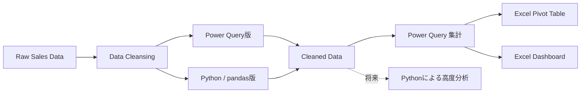
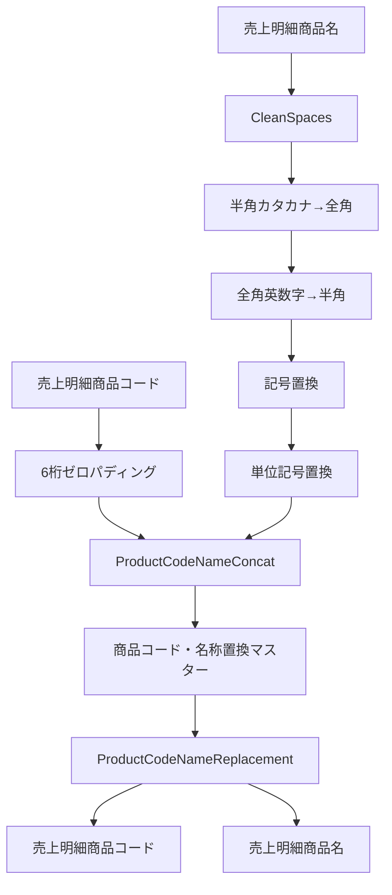
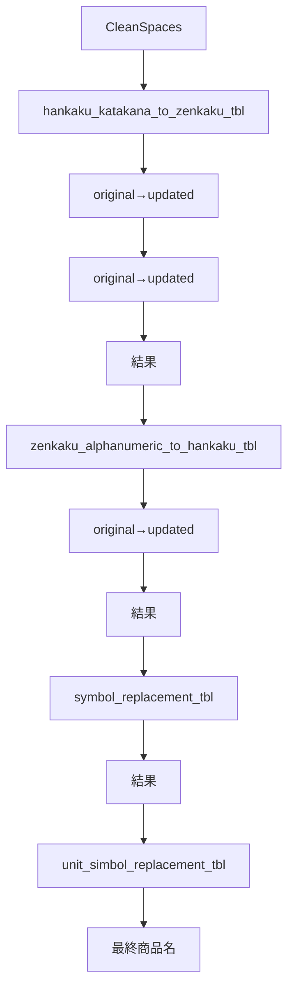
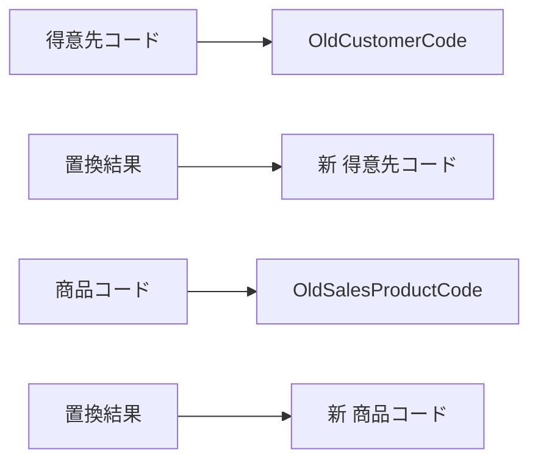
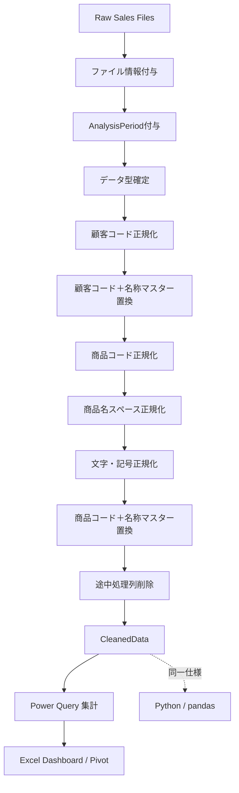

# 売上分析用 Power Query／Python データクレンジング設計の整理

## 1. このチャットで検討してきた全体像

今回の中心テーマは、**売上分析に入る前段として行うデータクレンジング処理の設計・命名・Power Queryコードの整理**です。

売上分析では、まず元データに対して以下の前処理を実施します。

- マスターファイルを参照した置換処理
- コード類のゼロパディング
- 商品名などの文字列正規化
- 分析に必要な補助列の追加
    - `AnalysisPeriod`
    - `FileName`
    - 年度関連列
- ファイル情報の管理
- 最終的な分析用データへの整形

このデータクレンジング処理については、

> **Power QueryとPython（pandas）で同一の処理を再現できるようにする**

という方針が確定しています。

ただし、Pythonへ全面移行するわけではありません。

現在の役割分担は次のように整理されました。

|領域|主なツール|位置づけ|
|---|---|---|
|データクレンジング|Power Query / Python|同じ処理を両方で実装|
|Python側の目的|pandas|学習＋クレンジング高速化|
|売上集計|Power Query|現在のメイン|
|ダッシュボード|Excel|Power Query結果を利用|
|ピボットテーブル|Excel|集計・分析用途|
|高度・厳密な分析|Python|将来的に利用する可能性あり|

したがって構造としては、



という位置づけです。

---

## 2. 命名規則について検討した内容

### snake_case と PascalCase

最初に、

- `analysis_period`
- `file_name`
- `cleaned_data`
- `imported`

などを snake_case にするか、

- `AnalysisPeriod`
- `FileName`
- `CleanedData`
- `ImportedFiles`

など PascalCase にするかを検討しました。

Pythonでは一般にsnake_caseとの親和性が高い一方、今回のプロジェクトでは**最終的な集計処理の中心がPower Query**であるため、Power Query側の命名に寄せる考え方を採用する方向になりました。

ただし、途中で確認した重要な点として、

> **Excelそのものに「PascalCaseが標準」という正式な命名規則があるわけではない**

という整理もしています。

つまり、

- ExcelだからPascalCaseにしなければならないわけではない
- Power QueryだからPascalCaseが公式標準というわけでもない
- プロジェクト内での一貫性を優先すべき

という考え方です。

今回のプロジェクトでは、Power Queryのステップ名などもPascalCaseで整理しているため、

```text
SourceFiles
SortedRows
WithIndex
WithAnalysisPeriod
FinalTable
ChangedType
```

のような形式との統一性があります。

---

## 3. シート名・テーブル名・複数形

シート名やテーブル名についても検討しました。

候補としては、

```text
cleaned_data
imported
```

から、

```text
CleanedData
ImportedFiles
```

のような形式へ整理する考え方です。

特に`import`フォルダ内のCSVファイル一覧を扱うテーブルについては、

```text
ImportedFilesTbl
```

が適切と判断しました。

理由は、このテーブルが「ある1ファイル」を表すものではなく、

> **importフォルダから読み込んだ複数のファイル情報の集合**

だからです。

そのため、

```text
ImportedFileTbl
```

より

```text
ImportedFilesTbl
```

の方が意味的に自然です。

一方、

```text
CleanedDataTbl
```

のような名称は、`Data`自体が集合的な意味を持つため複数形にする必要はありません。

---

## 4. ImportedFilesTbl の設計

`ImportedFilesTbl`のコードとして、以下の構成を確認しました。

```powerquery
let
    // ディレクトリからファイルを取得
    SourceFiles = Folder.Files(
        "C:\Users\kyoupatty029\projects\kpm\analysis_inspection\sales_analysis\import\general\monthly"
    ),
    // 必要な列のみを選択し、行を並べ替え
    FilteredColumns = Table.SelectColumns(SourceFiles, {"Name"}),
    SortedRows = Table.Sort(FilteredColumns, {{"Name", Order.Ascending}}),
    // インデックス列を追加し、条件列を作成
    WithIndex = Table.AddIndexColumn(
        SortedRows,
        "Index",
        0,
        1,
        Int64.Type
    ),

    WithAnalysisPeriod = Table.AddColumn(
        WithIndex,
        "AnalysisPeriod",
        each if [Index] = 0 then "PY" else "CY",
        type text
    ),
    // カラム名を変更
    RenamedColumns = Table.RenameColumns(
        WithAnalysisPeriod,
        {{"Name", "FileName"}}
    ),
    // 必要な列のみを選択
    FinalTable = Table.SelectColumns(
        RenamedColumns,
        {"AnalysisPeriod", "FileName"}
    )
in
    FinalTable
```

役割は明確です。


ここで、

```text
Index = 0 → PY
それ以外 → CY
```

という分類を行っています。

---

## 5. AnalysisPeriod付きファイル読み込み処理のリファクタリング

複数回、Power Queryで自動生成されたステップ名を整理しました。

たとえば、

```text
#"Removed Other Columns1"
#"Sorted Rows"
#"Added Index"
#"Added Conditional Column"
```

などを、

```text
SortedFiles
WithAnalysisPeriod
FilteredHiddenFiles
InvokedFunction
ExpandedFiles
ChangedType
```

のように変更しました。

方針としては、

> **Power Query GUIが自動生成した「操作名」ではなく、「結果として何になったか」をステップ名で表現する**

方向です。

たとえば、

```text
#"Added Conditional Column"
```

より、

```text
WithAnalysisPeriod
```

の方が後から読んだときに意味を理解しやすくなります。

---

## 6. Attributes列を残す理由

途中で、

```powerquery
Table.SelectColumns(
    Source,
    {"Content", "Name", "Attributes"}
)
```

の`Attributes`がなぜ必要なのか確認しました。

理由は後続の、

```powerquery
Table.SelectRows(
    ...,
    each [Attributes]?[Hidden]? <> true
)
```

で使用しているからです。

つまり、

```text
Attributes
    ↓
Hidden属性を確認
    ↓
隠しファイルを除外
```

という依存関係があります。

したがって、

```powerquery
{"Content", "Name"}
```

だけにしてしまうと、

```powerquery
[Attributes]?[Hidden]?
```

を参照できなくなります。

隠しファイルを除外しないのであれば`Attributes`は不要ですが、除外処理を残すのであれば必要です。

---

## 7. FiscalYearIdについて

会計年度を算出する処理も検討しました。

当初、

```powerquery
Date.Month([売上日付]) = (11 or 12)
```

と書いてエラーになりました。

Power Queryではこの書き方はできないため、

```powerquery
Date.Month([売上日付]) = 11
or
Date.Month([売上日付]) = 12
```

と条件を個別に記述する必要があります。

正しい形は、

```powerquery
= Table.AddColumn(
    #"Kept First Rows",
    "カスタム",
    each
        if Date.Month([売上日付]) = 11
            or Date.Month([売上日付]) = 12
        then Date.Year([売上日付]) + 1
        else Date.Year([売上日付])
)
```

です。

結果をテキスト型にする方法としては、

```powerquery
Text.From(Date.Year([売上日付]) + 1)
```

のように条件式内部で変換する方法と、

後段で、

```powerquery
Table.TransformColumnTypes(...)
```

する方法を検討しました。

また年度カラム名については、

```text
FiscalId
```

より、

```text
FiscalYearId
```

を推奨しました。

`FiscalId`では何のIDなのか曖昧ですが、

```text
FiscalYearId
```

なら「会計年度を表す識別子」であることが明確だからです。

---

## 8. Power QueryのIntelliSenseについて

Excel 2019を使用しており、

> Power Queryでメソッド・関数を入力しても補完されない

という問題も確認しました。

Excel 2019ではPower Queryそのものは利用できますが、Microsoft 365版と比較するとM言語編集時の補完機能や編集支援が限定的です。

そのため、

> Excel 2019でPower Queryの関数補完が十分に出ないこと自体は不自然ではない

という整理になりました。

---

## 9. Power Query全体構成の評価

Power Queryエディタのスクリーンショットも確認しました。

構造としては大きく、

- データ本体
    - `CleanedDataTbl`
    - `ImportedFilesTbl`
- Master
    - 顧客コード・名称置換
    - 商品コード・名称置換
    - 半角→全角
    - 全角英数字→半角
    - 記号置換
    - 単位記号置換
- Function
    - `CleanSpaces`
- Excelのフォルダー結合によって生成される補助クエリ
    - `ファイルの変換`
    - `サンプル ファイル`
    - など

という構造になっていました。

この構成は、

> **データ本体・マスター・関数を分離している**

という点で、Power Queryとして良い整理になっています。

特に、

```text
Master
Function
Main Query
```

を分けているのは、将来的な保守や再利用を考えても合理的です。

---

# 10. 顧客コード・顧客名の置換処理

得意先については、

```text
得意先コード
得意先名称
```

を連結してからマスターに基づいて置換する方式です。

基本的な流れは、


です。

具体的には、

```powerquery
ConcatenatedCustomer =
    Table.AddColumn(
        ChangedType,
        "CodeNameConcat",
        each [得意先コード] & "_" & [得意先名称],
        type text
    )
```

として、

```text
000123_株式会社○○
```

のような値を作ります。

その後、

```powerquery
List.Accumulate(
    Table.ToRows(customer_code_name_replacement_tbl),
    [CodeNameConcat],
    (state, current) =>
        Replacer.ReplaceValue(
            state,
            current{0},
            current{1}
        )
)
```

でマスターの、

|original|updated|
|---|---|
|置換前|置換後|

を順番に適用します。

---

## 11. OldCustomerCode方式

新しい、

```text
得意先コード
得意先名称
```

を追加しようとした際、既存列が同じ名前で残っているため、

> 「その列はすでに存在します」

というエラーが発生しました。

この問題への対応として、

```text
得意先コード → OldCustomerCode
得意先名称 → OldCustomerName
```

と事前に変更する方式を採用しました。

その後、

```powerquery
Text.BeforeDelimiter(...)
```

と、

```powerquery
Text.AfterDelimiter(...)
```

によって新しい、

```text
得意先コード
得意先名称
```

を生成します。

この方法には、単に旧列を削除する方式に比べて、

- 処理途中の値を確認できる
- 新旧比較ができる
- デバッグしやすい
- 変換の意味が明確

という利点があります。

そのため、

> **処理途中ではOld〜へリネームし、最終段階で不要になったら削除する**

という設計が適しています。

---

# 12. 商品コード・商品名のクレンジング

商品側では処理がさらに多くなっています。

大きく分けると、

1. 商品コードのゼロパディング
2. 商品名のスペースクレンジング
3. 半角カタカナ → 全角
4. 全角英数字 → 半角
5. 記号置換
6. 単位記号置換
7. 商品コード＋商品名を連結
8. 商品コード・商品名マスターによる置換
9. 最終商品コード・商品名を再生成

という流れです。



---

# 13. 4種類の文字置換マスター

商品名については、

```text
hankaku_katakana_to_zenkaku_tbl
zenkaku_alphanumeric_to_hankaku_tbl
symbol_replacement_tbl
unit_simbol_replacement_tbl
```

の4テーブルを利用しています。

すべて共通して、

```text
original
updated
```

という2列を持っています。

つまり構造は、

|original|updated|
|---|---|
|置換前文字列|置換後文字列|

です。

各テーブルについて、

```powerquery
Table.ToRows(tbl)
```

によって、

```text
{
    {original1, updated1},
    {original2, updated2},
    ...
}
```

というリストに変換し、

```powerquery
Text.Replace(
    state,
    current{0},
    current{1}
)
```

で部分一致置換しています。

したがって、

```text
original = "ABC"
updated  = "XYZ"
```

なら、

```text
商品ABC123
```

は、

```text
商品XYZ123
```

になります。

完全一致ではなく、

> **文字列中にoriginalが含まれていれば、その部分をupdatedへ置換する**

処理です。

---

# 14. List.Accumulateの二重構造

今回特に詳しく検討したのが、

```powerquery
CharacterReplacedProductName =
    List.Accumulate(
        {
            hankaku_katakana_to_zenkaku_tbl,
            zenkaku_alphanumeric_to_hankaku_tbl,
            symbol_replacement_tbl,
            unit_simbol_replacement_tbl
        },
        CleanedProductName,
        (state, tbl) =>
            Table.TransformColumns(
                state,
                {
                    {
                        "CleanSpaces",
                        each List.Accumulate(
                            Table.ToRows(tbl),
                            _,
                            (s, current) =>
                                Text.Replace(
                                    s,
                                    current{0},
                                    current{1}
                                )
                        )
                    }
                }
            )
    )
```

です。

このコードでは`List.Accumulate`が二重に使われています。

### 外側のList.Accumulate

外側は、

```text
4つの置換マスター
```

を順番に処理します。

```text
CleanedProductName
↓
半角カタカナ置換
↓
全角英数字置換
↓
記号置換
↓
単位記号置換
↓
最終結果
```

です。

### 内側のList.Accumulate

内側は、それぞれのマスター内にある、

```text
original → updated
```

を1行ずつ適用します。

したがって処理構造は、



です。

---

# 15. 「original列はすでにあります」エラー

当初、各置換テーブルについて、

```powerquery
Table.AddColumn(
    state,
    Table.ColumnNames(tbl){0},
    ...
)
```

という方式を試しました。

しかし各マスターの先頭カラム名がすべて、

```text
original
```

で共通していたため、

```text
original
original
original
...
```

という同名列を追加しようとしてエラーになりました。

そこで、

```powerquery
Table.TransformColumns
```

を使って既存の`CleanSpaces`列を直接変換する方式へ変更しました。

この方式なら、置換マスターのカラム名が、

```text
original
updated
```

で共通でも問題ありません。

---

# 16. CleanSpacesという列名の問題

`Table.TransformColumns`に変更したことで、4種類の文字置換が完了しても、カラム名自体は、

```text
CleanSpaces
```

のまま残ります。

これは処理内容を正しく表現していません。

`CleanSpaces`という名前から読み取れるのは、

> スペース処理が終わった

ということだけだからです。

実際には、

- スペースクレンジング
- 半角カタカナ
- 全角英数字
- 記号
- 単位記号

まで処理されています。

そこで、最終結果を、

```text
CharacterReplacedProductName
```

へ変更する案を検討しました。

処理としては、

```powerquery
CharacterReplacedProductName =
    List.Accumulate(...),

RenamedProductName =
    Table.RenameColumns(
        CharacterReplacedProductName,
        {
            {
                "CleanSpaces",
                "CharacterReplacedProductName"
            }
        }
    )
```

という形です。

---

# 17. 「ステップ名」と「カラム名」は別物

ここで重要なのは、

```powerquery
CharacterReplacedProductName =
    List.Accumulate(...)
```

と書いても、

> **`CharacterReplacedProductName`はステップ名であり、カラム名ではない**

という点です。

そのため、処理結果のテーブル内には依然として、

```text
CleanSpaces
```

列が存在します。

したがって別途、

```powerquery
Table.RenameColumns
```

を実施しない限り、カラム名は変わりません。

この点はPower Queryで混同しやすい部分です。

---

# 18. 一括処理型とステップ分割型

商品名の文字置換について、2つの設計を比較しました。

### 一括処理型

```powerquery
List.Accumulate(
    {
        tbl1,
        tbl2,
        tbl3,
        tbl4
    },
    CleanedProductName,
    ...
)
```

という構造です。

メリットは、

- コードが短い
- 同じロジックを繰り返さない
- マスターを増減しやすい
- 「複数マスターを順番に適用する」という抽象化ができている

ことです。

一方、

- 処理途中をPower Query画面から確認しづらい
- `List.Accumulate`に慣れていない人には読みにくい

というデメリットがあります。

### ステップ分割型

こちらは、

```text
CleanedProductName
↓
ReplacedHankakuKatakana
↓
ReplacedZenkakuAlphanumeric
↓
ReplacedSymbols
↓
ReplacedUnitSymbols
```

という形です。

メリットは、

- Power Queryの各ステップで中間結果を確認できる
- デバッグがしやすい
- 初見でも処理内容が分かりやすい

ことです。

一方、

- 同じ`List.Accumulate`コードを何度も書く
- 長くなる
- マスター追加時にコード変更箇所が増える

というデメリットがあります。

---

# 19. エンジニアとしてどちらを目指すか

途中では「ステップ分割型の方が一般的に保守しやすい」という話もしましたが、その後さらに検討すると、単純に、

> 分割型＝良い  
> 一括型＝悪い

ではありません。

今回の処理の本質は、

> **同じ構造を持つ複数の置換マスターを、決められた順番で同じ方法により適用する**

ことです。

そのためソフトウェア設計としては、本来かなり抽象化しやすい処理です。

理想形に近づけるなら、

```text
ReplaceWithTable
```

のような汎用関数を作り、

```text
ReplacementTables
```

の一覧を渡して処理する設計が候補になります。

たとえば概念的には、

```powerquery
ReplaceWithTable =
    (inputText as text, replaceTable as table) as text =>
        List.Accumulate(
            Table.ToRows(replaceTable),
            inputText,
            (state, current) =>
                Text.Replace(
                    state,
                    current{0},
                    current{1}
                )
        )
```

のような関数です。

さらに、

```powerquery
ReplacementTables = {
    hankaku_katakana_to_zenkaku_tbl,
    zenkaku_alphanumeric_to_hankaku_tbl,
    symbol_replacement_tbl,
    unit_simbol_replacement_tbl
}
```

とすれば、

> 置換マスターを順番に適用する

という仕様そのものをコードで表現できます。

エンジニアリング上は、


という方向が自然です。

ただし、Power Queryの場合はGUIで中間ステップを確認できること自体がデバッグ手段になるため、

> **抽象化しすぎず、Power Query上で追跡可能な粒度を残す**

ことも重要です。

したがって今回なら、

- `CleanSpaces`
- 文字置換一式
- 商品コード＋商品名連結
- 商品マスター置換

くらいの大きな単位でステップを分け、その内部の反復処理を関数化するのがバランスのよい方向です。

---

# 20. 古い列の扱いについて

顧客・商品の両方で、新しい列を同名で生成する前に既存列との競合が発生しました。

採用した考え方は、

|元列|一時列|
|---|---|
|得意先コード|`OldCustomerCode`|
|得意先名称|`OldCustomerName`|
|売上明細商品コード|`OldSalesProductCode`|
|売上明細商品名|`OldSalesProductName`|

です。

最終的に、

```text
Old...
```

列は出力対象から除外します。

この方法により、



と、新旧を明確に区別できます。

---

# 21. ゼロパディングについて

得意先コードと商品コードについては、以前、

```powerquery
each "0" & _
```

や、

```powerquery
each "00" & _
```

を行った後、

```powerquery
Text.End(_, 6)
```

で6桁にしていました。

リファクタリングでは、

```powerquery
Text.PadStart(_, 6, "0")
```

を使う案を提示しました。

こちらの方が、

> **6桁になるまで左側を0で埋める**

という意図をそのままコードで表現できるため、可読性は高くなります。

---

# 22. 最終出力列

クレンジング完了後は、途中処理に使った、

```text
OldCustomerCode
OldCustomerName
CodeNameConcat
ReplacementCustomData
CleanSpaces
CharacterReplacedProductName
OldSalesProductCode
OldSalesProductName
ProductCodeNameConcat
ProductCodeNameReplacement
```

などを出力せず、分析に必要な正式列だけを、

```powerquery
Table.SelectColumns(...)
```

で残す設計です。

これにより、

> **途中処理用カラムは処理内部だけに存在し、CleanedDataには正式データだけを出力する**

という境界を作っています。

これはクレンジング処理として適切な構成です。

---

# 23. このチャットで固まってきた設計方針

全体を通じて、現在の方針は次のように整理できます。

- Power Queryを売上集計の中心とする。
- Python/pandasでも同一のデータクレンジング処理を再現する。
- Pythonはまず高速化と学習が主目的。
- Excelのダッシュボード・ピボットは引き続き利用する。
- Power Query側はPascalCase中心の命名を採用する。
- `ImportedFilesTbl`は複数ファイルを扱うため名称として適切。
- 分析補助列として`AnalysisPeriod`、`FileName`などを使用する。
- 年度IDは`FiscalYearId`の方が意味が明確。
- マスターは`original`／`updated`構造で統一する。
- 文字列置換は部分一致で`original → updated`を適用する。
- 置換順序自体がデータクレンジング仕様の一部。
- 古い顧客・商品列は`Old...`へ一時的にリネームする。
- 最終出力では途中処理列を除外する。
- 同じロジックの反復は、将来的にはカスタム関数への抽象化を検討する。
- ただしPower Queryではデバッグ性も重要なため、過度な一括化は避ける。

---

## 24. 現時点で残っている検討事項

いくつか未確定・未完了の部分もあります。

1つ目は、**商品名など日本語文字列内のスペースを全角・半角のどちらに統一するか**です。この質問は途中で出ましたが、その直後にPower Queryコードのリファクタリングへ移ったため、このチャット内では結論まで詰めていません。

2つ目は、文字列置換処理について、

```text
一括List.Accumulate
```

をそのまま使うか、

```text
ReplaceWithTable
ApplyReplacements
```

のような**カスタム関数へ正式に切り出すか**です。

方向性としては関数化に価値がありますが、実際のコード構成までは確定していません。

3つ目は、Power QueryとPythonで、

```text
同じ入力
↓
同じマスター
↓
同じ置換順序
↓
同じCleanedData
```

を保証するための**共通仕様書**です。今後Python版を本格化するなら、Power Queryコードそのものを仕様とするより、

|順番|対象|処理|マスター|
|--:|---|---|---|
|1|商品名|スペース正規化|`CleanSpaces`|
|2|商品名|半角カナ→全角|`hankaku_katakana_to_zenkaku_tbl`|
|3|商品名|全角英数字→半角|`zenkaku_alphanumeric_to_hankaku_tbl`|
|4|商品名|記号置換|`symbol_replacement_tbl`|
|5|商品名|単位記号置換|`unit_simbol_replacement_tbl`|
|6|商品コード＋商品名|正式名称置換|`own_product_code_name_replacement_tbl`|

のように**処理仕様をツール非依存で定義する**方が、Power Query/Python双方を維持しやすくなります。

---

## 25. 現在の到達点

今回の一連の検討によって、単なるPower Queryコードの整理から一歩進み、

> **Power QueryとPythonの両方から利用できる「売上データクレンジング仕様」を設計している**

状態まで来ています。

特に重要なのは、クレンジングを単発の操作ではなく、



というパイプラインとして整理できるようになった点です。

### セッション引き継ぎ

**行ったこと:** Power Queryによる売上データクレンジングの命名、ファイル管理、年度付与、顧客・商品マスター置換、文字正規化、コードのリファクタリング方針を整理しました。特に複数の`original`/`updated`マスターを`List.Accumulate`で連続適用する構造と、旧カラムを`Old...`へ退避する方式を確認しました。

**次の具体的なアクション:** 日本語商品名のスペース統一ルールを決めること、文字置換処理をカスタム関数化するか判断すること、Power Query/Python共通のクレンジング仕様を処理順序として明文化することです。

**主要な判断:** Power Queryを売上集計の主軸としつつ、Pythonでも同一クレンジングを再現する。途中列は意味の分かる名称を使い、最終出力時に除去する。単純なコード短縮より、処理意図・デバッグ性・再利用性のバランスを優先する方針です。

必要であれば、このまとめを次に **「売上データクレンジング設計仕様書」形式へ再構成して、Power Query版とPython版の共通仕様として使える形**にできます。