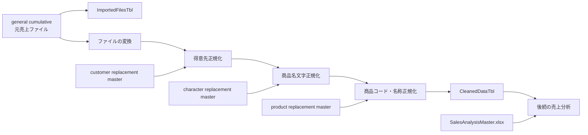
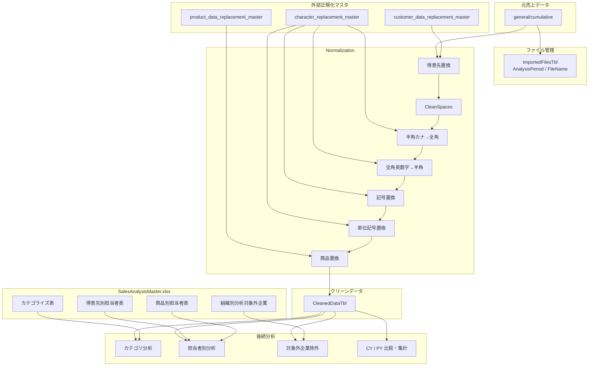

# 売上分析用 Power Query／マスタ構成の整理

## 1. このチャットで確認した内容

このチャットでは、売上分析で使用している Power Query の構成について、実際のMコード・クエリ一覧・Excelマスタのテーブル構成・最終的なクリーンデータのカラムまで順番に確認した。

中心となるファイルは次のとおり。

|区分|ファイル|
|---|---|
|クリーンデータ出力|`general_cumulative_cleaned_data.xlsx`|
|得意先置換マスタ|`customer_data_replacement_master.xlsx`|
|文字置換マスタ|`character_replacement_master.xlsx`|
|商品置換マスタ|`product_data_replacement_master.xlsx`|
|売上分析マスタ|`SalesAnalysisMaster.xlsx`|

Power Query 全体としては、大きく次の役割に分かれている。

1. 売上元ファイルをフォルダから取得する
2. ファイルに `PY` / `CY` の分析期間を付与する
3. 得意先コード・名称を正規化する
4. 商品名のスペース・文字種・記号・単位表記を正規化する
5. 商品コード・名称を置換マスタで補正する
6. 分析に必要な列のみを残して `CleanedDataTbl` を生成する
7. 別途 `ImportedFilesTbl` で対象ファイルと `AnalysisPeriod` を管理する
8. `SalesAnalysisMaster.xlsx` に、カテゴリー・担当者・分析除外などの分析用マスタを保持する



---

# 2. メインクエリ `CleanedDataTbl`

対象ファイルとして示されたのは、

`general_cumulative_cleaned_data.xlsx`

であり、その中心となるクエリでは次のフォルダを読み込んでいる。

```text
C:\Users\kyoupatty029\projects\kpm\analysis_inspection\sales_analysis\import\general\cumulative
```

## 処理フロー

### ファイル取得と AnalysisPeriod の設定

最初に `Folder.Files` で対象ディレクトリ以下のファイルを取得する。

```m
Source = Folder.Files("...\general\cumulative")
```

その後、

- `Content`
- `Name`
- `Attributes`

だけを残し、ファイル名を昇順に並べる。

さらに0始まりの `Index` を追加し、

```m
if [Index] = 0 then "PY" else "CY"
```

によって `AnalysisPeriod` を設定する。

したがって、現在のロジックは、

|Index|AnalysisPeriod|
|--:|---|
|0|PY|
|1以降|CY|

となっている。

これは「ファイル名の昇順で最初に来るファイルをPY、それ以外をCYとする」という設計であり、ファイル名の命名規則と並び順が重要になる。

なお、`Folder.Files` は指定フォルダだけでなく**サブフォルダ内のファイルも再帰的に取得する**関数である。直下だけに限定したい場合は `Folder.Contents` などとは挙動が異なる点に注意が必要。

### 隠しファイルの除外

`Attributes[Hidden]` を確認し、

```m
each [Attributes]?[Hidden]? <> true
```

として隠しファイルを除外している。

その後、Power Query がフォルダ結合時に生成した関数、

```m
ファイルの変換([Content])
```

を各ファイルに適用している。

展開する列構成は、

```m
Table.ColumnNames(ファイルの変換(#"サンプル ファイル"))
```

から取得しているため、「サンプル ファイル」の構造を基準としている。

---

# 3. 得意先データの正規化

まず次の4列を `text` 型へ変換している。

- `得意先コード`
- `得意先名称`
- `売上明細商品コード`
- `売上明細商品名`

その後、得意先について、

```m
[得意先コード] & "_" & [得意先名称]
```

でコードと名称を結合し、

`CodeNameConcat`

を作成する。

## 得意先置換マスタ

参照しているマスタは、

`customer_data_replacement_master.xlsx`

内の

`customer_code_name_replacement_tbl`

である。

読み込み後に残す列は次の2つ。

|カラム|用途|
|---|---|
|`original_code_name_concat`|置換前の「コード_名称」|
|`updated_code_name_concat`|置換後の「コード_名称」|

メイン処理では、

```m
List.Accumulate(
    Table.ToRows(customer_code_name_replacement_tbl),
    [CodeNameConcat],
    (state, current) =>
        Replacer.ReplaceValue(state, current{0}, current{1})
)
```

を使い、置換マスタの内容を順番に適用している。

置換結果は `ReplacementCustomData` に格納する。

その後、元の列を、

- `得意先コード` → `OldCustomerCode`
- `得意先名称` → `OldCustomerName`

へ変更し、置換済み文字列を `_` で分割して、

- 新しい `得意先コード`
- 新しい `得意先名称`

を再生成している。

ただし、後述する最終列選択では `OldCustomerCode` / `OldCustomerName` は残していない。

---

# 4. 商品名の文字正規化

得意先正規化の次に、商品名称そのものを複数段階でクレンジングしている。

処理順序は次のとおり。


## `CleanSpaces` 関数

独自関数として次のコードを使用している。

```m
(CleanColumn as text) as text =>
let
    TrimmedText = Text.Trim(CleanColumn),
    ReplacedFullWidthSpaces = Text.Replace(TrimmedText, "　", " "),
    SplitTextBySpace = Text.Split(ReplacedFullWidthSpaces, " "),
    RemoveEmptyEntries = List.Select(SplitTextBySpace, each _ <> ""),
    ResultText = Text.Combine(RemoveEmptyEntries, " ")
in
    ResultText
```

役割は、商品名に含まれるスペース表現の統一である。

処理は、

1. 前後のトリム
2. 全角スペースを半角スペースへ変換
3. 半角スペースで文字列を分割
4. 空要素を削除
5. 半角スペース1個で再結合

という流れ。

例えば、

```text
"  商品　　名称   ABC  "
```

のようなデータを、おおむね

```text
"商品 名称 ABC"
```

のような形へ統一する。

---

# 5. `character_replacement_master.xlsx`

文字表記の正規化ルールは、

```text
C:\Users\kyoupatty029\projects\kpm\analysis_inspection\shared_master\normalization\character_replacement_master.xlsx
```

に集約されている。

現在確認したテーブルは4種類。

|Power Query|Excelテーブル|用途|
|---|---|---|
|`hankaku_katakana_to_zenkaku_tbl`|同名|半角カタカナ → 全角カタカナ|
|`zenkaku_alphanumeric_to_hankaku_tbl`|同名|全角英数字 → 半角英数字|
|`symbol_replacement_tbl`|同名|記号表記の統一|
|`unit_symbol_replacement_tbl`|同名|単位・単位記号の統一|

各マスタの基本構造は、

|id|original|updated|
|---|---|---|

となっている。

最終的には `original` と `updated` の2列だけをMコード側で使用する。

## 半角カタカナ → 全角

```m
Table.Sort(..., {{"id", Order.Ascending}})
```

で `id` 順にソートした後、

```text
original
updated
```

だけを残している。

メインクエリ側では、

```m
List.Accumulate(
    Table.ToRows(hankaku_katakana_to_zenkaku_tbl),
    [CleanSpaces],
    (state, current) =>
        Text.Replace(state, current{0}, current{1})
)
```

で商品名称へ順次適用する。

## 全角英数字 → 半角英数字

こちらも同じ構造で、

`zenkaku_alphanumeric_to_hankaku_tbl`

を読み込み、`id` 順にソートする。

前工程の

`HankakuKatakanaToZenkaku`

を入力として置換する。

## 記号置換

`symbol_replacement_tbl`

については、提示されたMコードでは `id` によるソートを行わず、

- `original`
- `updated`

のみを取得している。

メイン側では、

`ZenkakuAlphanumericToHankaku`

の結果を入力として `Text.Replace` を順次実行する。

ここは他の文字置換マスタとは「ソートの有無」が異なる。

## 単位記号置換

`unit_symbol_replacement_tbl`

は `id` 昇順にソートした後、

- `original`
- `updated`

のみを残す。

記号置換後の商品名に適用し、最終結果を、

`CharacterReplacedProductName`

に格納している。

---

# 6. 商品コード・商品名称の最終正規化

文字レベルの正規化終了後、

```m
[売上明細商品コード] & "_" & [CharacterReplacedProductName]
```

で、

`ProductCodeNameConcat`

を作成する。

## 商品置換マスタ

参照ファイルは、

`product_data_replacement_master.xlsx`

である。

Excelテーブルは、

`product_code_name_replacement_tbl`

。

構造は得意先置換マスタと同じ。

|カラム|用途|
|---|---|
|`original_code_name_concat`|元の商品コード＋商品名|
|`updated_code_name_concat`|正規化後の商品コード＋商品名|

メインクエリでは `List.Accumulate` と `Replacer.ReplaceValue` によって置換を行う。

その結果を、

`ProductCodeNameReplacement`

へ格納する。

元のカラムは、

- `売上明細商品コード` → `OldSalesProductCode`
- `売上明細商品名` → `OldSalesProductName`

へ変更する。

置換済み文字列を `_` で分割して、

- 新しい `売上明細商品コード`
- 新しい `売上明細商品名`

を作り直す。

このため最終データには、

```text
正規化済み商品コード
正規化済み商品名
旧商品コード
旧商品名
```

を同時に保持している。

これは商品置換前後を追跡できる構成になっている。

---

# 7. `CleanedDataTbl` の最終カラム

`FinalColumns` では、最終的に以下の列を保持している。

|分類|カラム|
|---|---|
|日付・部門|`売上日付`|
||`売上発生部門コード`|
||`発生部門M部門名`|
|伝票|`売上伝票番号`|
||`売上明細伝票行番号`|
||`売上伝票区分`|
|得意先付随情報|`得意先名称２`|
||`得意先住所１`|
||`得意先住所２`|
||`得意先住所３`|
|納入先|`納入先コード`|
||`納入先名称`|
||`納入先名称２`|
||`納入先住所１`|
||`納入先住所２`|
||`納入先住所３`|
|数量・荷姿|`売上明細荷姿区分`|
||`売上明細入数`|
||`売上明細入数単位`|
||`売上明細荷姿数符号付`|
||`売上明細荷姿単位`|
||`売上明細バラ総数符号付`|
|金額・税|`売上明細単価`|
||`売上明細金額符号付`|
||`売上明細外税消費税符号付`|
||`税率`|
|分析期間|`AnalysisPeriod`|
|正規化得意先|`得意先コード`|
||`得意先名称`|
|正規化商品|`売上明細商品コード`|
||`売上明細商品名`|
|商品履歴|`OldSalesProductCode`|
||`OldSalesProductName`|

つまり `CleanedDataTbl` は、単なる元売上データではなく、

**売上明細 ＋ AnalysisPeriod ＋ 正規化済み得意先 ＋ 正規化済み商品 ＋ 商品の旧値**

を持つ分析用クリーンデータになっている。

---

# 8. `ImportedFilesTbl`

別クエリとして、同じ cumulative ディレクトリからファイル名一覧を取得している。

処理は非常に単純で、


最終テーブルは2列。

|AnalysisPeriod|FileName|
|---|---|
|PY / CY|元ファイル名|

したがって役割は、

**どのファイルがどの分析期間として読み込まれているかを確認する管理テーブル**

と整理できる。

`CleanedDataTbl` と `ImportedFilesTbl` の `AnalysisPeriod` は、それぞれ独立して生成しているものの、同じファイル名ソート＋Indexルールを使用している。

---

# 9. Power Query エディター内のクエリ構成

提示されたクエリペインでは、13クエリが次のように整理されていた。

```text
CleanedDataTbl からファイルを変換する...
├─ ヘルパー クエリ
│  ├─ サンプル ファイル
│  ├─ パラメーター1 (サンプル ファイル)
│  ├─ ファイルの変換
│  └─ サンプル ファイルの変換
│
├─ ReplacementMaster
│  ├─ customer_code_name_replacement_tbl
│  ├─ hankaku_katakana_to_zenkaku_tbl
│  ├─ zenkaku_alphanumeric_to_hankaku_tbl
│  ├─ symbol_replacement_tbl
│  ├─ unit_symbol_replacement_tbl
│  └─ product_code_name_replacement_tbl
│
├─ ReplacementFunction
│  └─ CleanSpaces
│
└─ その他のクエリ
   ├─ ImportedFilesTbl
   └─ CleanedDataTbl
```

役割分離としては、

- Power Query 自動生成ヘルパー
- 外部置換マスタ
- 独自関数
- 実際の出力／管理クエリ

という4階層になっている。

---

# 10. `SalesAnalysisMaster.xlsx`

クレンジングとは別に、売上分析用の補助マスタとして `SalesAnalysisMaster.xlsx` が存在する。

提示された内容では、大きく4種類の表がある。

なお、画像・テキスト上では2列目と3列目の英語名称がどちらも `ProductSalesRepList` となっている。この点は実ファイル上でも同名なのか、転記上の重複なのかは未確認のため、ここでは用途を基準に「得意先別担当者表」「商品別担当者表」と区別する。

## ProductCategoriesList ― カテゴライズ表

確認されたカラムは、

|カラム|
|---|
|`id`|
|`得意先コード`|
|`得意先名`|
|`商品コード`|
|`商品名`|
|`大まかにグループ別けしたものです`|
|`コード付き_商品名`|
|`基本分類`|
|`基本カテゴリー`|
|`category_10104`|
|`category_10101`|
|`更新日`|

商品だけではなく得意先コード・得意先名も含んでいるため、単純な商品マスタというより、売上分析に使用する**分類・カテゴライズ用テーブル**と見るのが適切。

特に、

- 基本分類
- 基本カテゴリー
- 担当者等に対応すると考えられる `category_10104`
- `category_10101`

など、分析軸を付加するための情報が含まれている。

## 得意先別担当者表

カラムは、

|カラム|
|---|
|`client_code`|
|`client_name`|
|`client_code_name_concat`|
|`division_code`|
|`sales_rep_code`|
|`updated_date`|

得意先単位で、

**どの部門・営業担当者に紐づくか**

を管理する構造になっている。

`client_code_name_concat` があるため、コードだけでなくコード＋名称の組み合わせをキーとして扱う設計も考慮されている。

## 商品別担当者表

カラムは、

|カラム|
|---|
|`product_code`|
|`product_name`|
|`division_code`|
|`sales_rep_code`|
|`updated_date`|
|`重複`|

商品単位で担当部門・営業担当者を管理する。

`重複` 列が存在しているが、このチャットでは値の定義や用途までは確認していない。

## OrgExcludedClientList ― 組織別分析対象外企業

カラムは、

|カラム|
|---|
|`client_code`|
|`client_name`|
|`client_code_name_concat`|
|`analysis_target`|
|`updated_date`|

分析対象／対象外の判定を得意先単位で管理するためのマスタ。

`analysis_target` の具体的な値の仕様は、このチャットでは提示されていないため、「0/1」「TRUE/FALSE」などの形式までは確定していない。

---

# 11. 全体のデータ設計

ここまでの内容を統合すると、現在の構成は次のように整理できる。



設計思想としては、

**Normalization と Analysis Master を分離している**

ことが重要である。

たとえば、

- 「同じ商品なのに商品名が違う」
- 「旧商品コードと新商品コードが混在する」
- 「半角／全角表記が混在する」

といった**データ品質問題**は `CleanedDataTbl` を作る段階で解決する。

一方、

- どのカテゴリーか
- 誰の担当か
- 分析対象に含めるか

という**分析上の意味付け**は `SalesAnalysisMaster.xlsx` で管理する構成になっている。

この分離は、現在のシステムを理解するうえでかなり重要。

---

# 12. このチャットで明らかになった設計上のポイント

現在の仕組みを短く表現すると、

> **売上元データを正規化して一意性・表記を整え、その後に分析用マスタを付与して売上分析へ利用する構成**

となる。

特に次の点が明確になった。

- `CleanedDataTbl` が売上分析の基礎となる正規化済み明細データ。
- `ImportedFilesTbl` は読み込み対象ファイルと `PY/CY` の関係を確認する管理用テーブル。
- 得意先は「コード＋名称」をセットにして置換する。
- 商品はまず文字レベルで正規化し、その後「商品コード＋商品名」のセットで最終置換する。
- 文字置換ルールをMコードに直接大量記述せず、Excelマスタとして外部管理している。
- 商品については `OldSalesProductCode` / `OldSalesProductName` を最終データに残しており、変更前後を追跡できる。
- Power Query 内では `ReplacementMaster` と `ReplacementFunction` をグループ分けしている。
- `SalesAnalysisMaster.xlsx` は正規化用マスタではなく、カテゴリ・担当者・分析対象判定などを管理する**分析用マスタ群**。
- 将来的な後工程では、`CleanedDataTbl` に `SalesAnalysisMaster.xlsx` の情報をキーで紐付けて分析データを構築する流れが想定される。

また、今後確認したほうがよい未確定事項も残っている。

- `PY/CY` を「ファイル名昇順＋Index」だけで判定し続ける設計でよいか。
- `symbol_replacement_tbl` だけ `id` ソートを行っていない理由。
- `SalesAnalysisMaster.xlsx` 内で、得意先別担当者表と商品別担当者表の英語テーブル名が本当に双方 `ProductSalesRepList` なのか。
- `商品別担当者表` の `重複` 列の定義。
- `OrgExcludedClientList.analysis_target` の値と判定仕様。
- `ProductCategoriesList` の `category_10104` / `category_10101` が具体的に何を表すか。
- `SalesAnalysisMaster.xlsx` の各マスタと `CleanedDataTbl` を、最終的にどのキー・優先順位で結合するか。

以上が、このチャットで確認したMコード、Power Query構成、正規化マスタ、クリーンデータ、分析用マスタの全体像である。