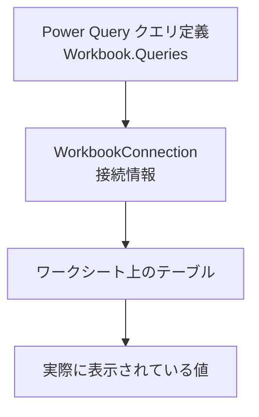
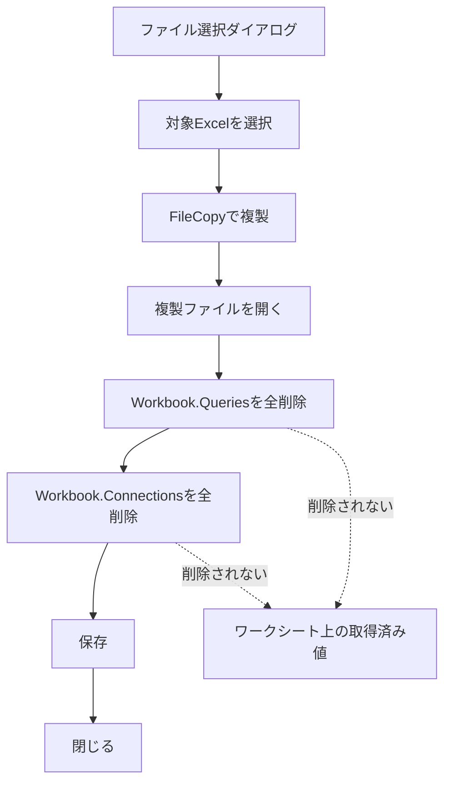
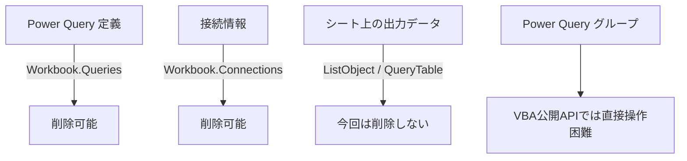

# Excelファイル複製後にPower Queryを削除し、シート上の出力データを保持するVBA検討まとめ

このチャットでは、**ファイルダイアログでExcelファイルを選択して複製し、その複製ファイルからPower Query関連情報を削除しつつ、ワークシート上に既に出力されているデータは残す**という処理について検討した。

最終的には、`Workbook.Queries` を使ってPower Queryそのものを削除し、その後 `Workbook.Connections` を削除することで、希望する状態を実現できた。

---

## 1. 最初の要件：Excelファイルを選択して複製する

最初の要件は単純で、ファイルダイアログからExcelファイルを1つ選択し、そのファイルを複製するというものだった。

基本処理は次の流れ。


複製ファイル名は、元ファイル名に「コピー」を追加する形とした。

例：

|元ファイル|複製後|
|---|---|
|`Sales.xlsx`|`Salesコピー.xlsx`|
|`Inventory.xlsm`|`Inventoryコピー.xlsm`|

基本的には `FileCopy` を使用する。

---

## 2. 次の要件：複製したExcelからPower Queryを削除したい

次に追加された要件は、複製したExcelファイル内に存在するPower Queryをすべて削除することだった。

ここで最初に検討したのが、

```vba
Workbook.Connections
```

を削除する方法。

例えば、

```vba
Dim conn As WorkbookConnection

For Each conn In wb.Connections
    conn.Delete
Next conn
```

という処理だった。

しかし、この方法では**Power Queryそのものは削除されなかった**。

Power Queryエディターを開くと、クエリ一覧がそのまま残っていた。

---

## 3. 「接続」と「Power Queryそのもの」は別物

ここで重要になったのが、Excel内部では次のものが別々に管理されているという点。

|対象|VBA上の主なオブジェクト|意味|
|---|---|---|
|Power Queryそのもの|`Workbook.Queries`|Power Queryエディターに表示されるクエリ定義|
|外部接続|`Workbook.Connections`|外部データやPower Queryとの接続情報|
|シート上のクエリ出力|`QueryTable` / `ListObject`|ワークシート上にロードされた表|

つまり、

```text
Power Query = WorkbookConnection
```

ではない。

両者は関連しているものの、別オブジェクトとして存在している。

概念的には次のようになる。



そのため、`Connections.Delete` だけ実行しても、Power Queryエディター内のクエリ定義が残る場合がある。

---

## 4. QueryTable.Delete の検討

途中で、

```vba
QueryTable.Delete
```

を使用して内部クエリを削除できないか、という検討を行った。

例えば、

```vba
For Each ws In wb.Worksheets
    For Each qryTbl In ws.QueryTables
        qryTbl.Delete
    Next qryTbl
Next ws
```

という方法。

しかし、これは今回の目的とは異なる。

`QueryTable` は基本的に**シート上にロードされている外部データテーブル**を表すオブジェクトであり、Power Queryエディター内のクエリ定義そのものではない。

さらに、`QueryTable.Delete` や `ListObject.Delete` は、場合によってはシート上のテーブルそのものを削除するため、

> シート上の出力済みデータは残したい

という要件と相性が悪い。

したがって、この方法は最終的には採用しなかった。

---

## 5. ListObjectを削除する方法も不適切だった

次に、Power Queryからロードされたテーブルを、

```vba
ListObject
```

として判定する方法も検討した。

例えば、

```vba
If qry.SourceType = xlSrcQuery Then
    qry.Delete
End If
```

という処理。

これもPower Query定義を消すのではなく、**ワークシート上のExcelテーブルそのものを削除する処理**になる。

したがって今回の希望、

> Power Queryは消す  
> ただし、シート上に出力されているデータは残す

とは異なる。

---

# 6. 最終的に成功した方法

最終的に希望どおり動作したのは、

1. `Workbook.Queries` を削除
2. `Workbook.Connections` を削除

という方法だった。

Power Queryそのものを削除する処理は次の部分。

```vba
Dim pq As Object

For Each pq In wb.Queries
    wb.Queries(pq.Name).Delete
Next pq
```

これにより、Power Queryエディターの左側に表示されているクエリそのものが削除される。

その後、接続情報も削除する。

```vba
Dim conn As WorkbookConnection

For Each conn In wb.Connections
    conn.Delete
Next conn
```

結果として、

- Power Queryエディター → クエリなし
- Workbook Connections → 不要な接続なし
- ワークシート上 → 取得済みデータは残る

という状態になった。

---

# 7. 完成時の処理フロー

最終的なマクロの流れは次のとおり。



最終コードの中心部分は次の形になった。

```vba
Sub DeleteAllQueriesAndKeepData()

    Dim fd As FileDialog
    Dim selectedFilePath As String
    Dim destinationFilePath As String
    Dim wb As Workbook
    Dim conn As WorkbookConnection
    Dim pq As Object

    Set fd = Application.FileDialog(msoFileDialogFilePicker)

    fd.Title = "エクセルファイルを選択してください"
    fd.Filters.Clear
    fd.Filters.Add "Excelファイル", "*.xls; *.xlsx"

    If fd.Show = -1 Then

        selectedFilePath = fd.SelectedItems(1)

        destinationFilePath = _
            Left(selectedFilePath, InStrRev(selectedFilePath, ".")) & _
            "コピー" & _
            Mid(selectedFilePath, InStrRev(selectedFilePath, "."))

        FileCopy selectedFilePath, destinationFilePath

        Set wb = Workbooks.Open(destinationFilePath)

        ' Power Queryそのものを削除
        On Error Resume Next

        For Each pq In wb.Queries
            wb.Queries(pq.Name).Delete
        Next pq

        On Error GoTo 0

        ' 接続を削除
        On Error Resume Next

        For Each conn In wb.Connections
            conn.Delete
        Next conn

        On Error GoTo 0

        wb.Close SaveChanges:=True

        MsgBox _
            "クエリと接続を削除し、シートのデータを保持してファイルを複製しました：" & _
            vbCrLf & destinationFilePath

    Else

        MsgBox "ファイルが選択されませんでした。"

    End If

    Set fd = Nothing

End Sub
```

---

# 8. 「クエリ→接続」の削除順序について検証したこと

一時的に、

> クエリそのものを先に削除してから接続を削除するから、シートのデータが残るのではないか

という仮説を立てた。

その仮説に基づき、

```text
Workbook.Queries.Delete
↓
Workbook.Connections.Delete
```

という順番が重要なのではないか、と説明した。

しかし、その後ユーザー側で処理順序を逆にして実験したところ、

```text
Workbook.Connections.Delete
↓
Workbook.Queries.Delete
```

でも問題なくシート上のデータが残ることが確認された。

したがって、

> シート上のデータが残る理由は「削除順序」にある

という仮説は否定された。

---

## 実験結果から分かったこと

今回のケースでは、


となった。

つまり、少なくとも対象ブックでは、削除順序はシート上の取得済みデータ保持に影響しなかった。

より正確には、

> Power Queryや接続を削除しても、既にワークシートへロードされている値はExcelシート上のデータとして残る

という挙動だった。

したがって、重要なのは削除順序より、

```vba
QueryTable.Delete
```

や

```vba
ListObject.Delete
```

のような**シート上のオブジェクト自体を消す処理を行わないこと**である。

---

# 9. 各削除方法と結果の整理

今回試した／検討した方法を整理すると次のとおり。

|操作|Power Query定義|接続|シート上のデータ|今回の採用|
|---|--:|--:|--:|--:|
|`Connections.Delete`|残る|消える|残る|単独では不十分|
|`Workbook.Queries.Delete`|消える|残る可能性あり|残る|採用|
|`QueryTable.Delete`|目的と異なる|状況依存|消える可能性あり|不採用|
|`ListObject.Delete`|目的と異なる|状況依存|テーブルごと消える|不採用|
|`Queries.Delete` + `Connections.Delete`|消える|消える|残る|**採用**|

最終的な考え方は、

> **定義と接続は消す。シート上の表には触らない。**

というものになる。

---

# 10. Power Queryのグループ／フォルダが残る問題

最後に残った課題が、Power Queryエディター内でクエリ整理用に作成している**グループ（フォルダ）**だった。

Power Queryでは例えば、

```text
売上
├─ Raw
├─ Cleaned
└─ Aggregated
```

のようにクエリをグループ化できる。

`Workbook.Queries.Delete` ですべてのクエリを削除しても、この空になったグループが残る場合がある。

状態としては、

```text
売上
Raw
Cleaned
Aggregated
```

という空フォルダだけが残る。

---

## VBAからグループを削除できるか

この時点での結論は、

> 通常のExcel VBAの公開オブジェクトモデルには、Power Queryの「クエリグループ」を直接列挙・削除するAPIが用意されていない

というものだった。

`Workbook.Queries` ではクエリは取得できるが、

```vba
Workbook.QueryGroups
```

のような標準VBAオブジェクトは存在しない。

したがって、

```vba
wb.Queries(...)
```

でクエリ自体は削除できても、クエリグループを同じようには操作できない。

現状では、空になったクエリグループについては**Power Queryエディター上で手動削除する必要がある**、という整理になった。

---

# 11. 最終的に確定した考え方

今回の検討から、Power Query関連では次の3階層を分けて考える必要がある。



今回の目的に対する処理方針は以下で確定した。

- 元ファイルには触らない。
- ファイルダイアログで対象Excelを選ぶ。
- `FileCopy` で複製を作る。
- 複製ファイルだけを編集する。
- `Workbook.Queries` を削除する。
- `Workbook.Connections` を削除する。
- `QueryTable.Delete` は使用しない。
- `ListObject.Delete` も使用しない。
- シートに既に出力済みの値は残す。
- `Queries` と `Connections` の削除順序は、今回の検証では本質的ではなかった。
- Power Queryの空グループ／フォルダは残る場合がある。
- Power Queryグループを直接削除する標準VBA APIは確認できず、手動削除が必要という整理になった。

---

## 結論

今回実現したかった状態は次のものだった。

|項目|最終状態|
|---|---|
|元Excelファイル|変更なし|
|複製Excelファイル|作成|
|Power Queryクエリ|削除|
|外部データ接続|削除|
|シート上の取得済みデータ|**保持**|
|QueryTable/ListObject|削除しない|
|Power Queryグループ|空のものが残る場合あり|

つまり最終的には、**「Power Query機能を除去して、現在シートに表示されている結果だけを静的なExcelデータとして残した複製ブックを作る」VBA**として成立した。