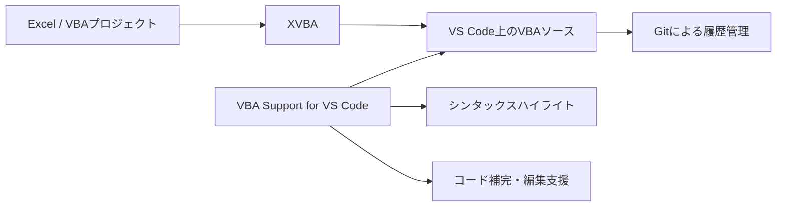
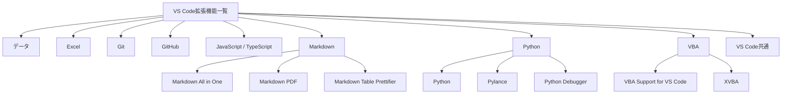
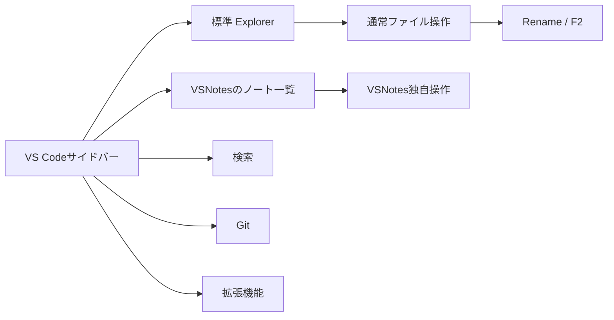

# VS Code拡張機能・Markdown表・VSNotesに関する整理

このチャットでは、主に **VS CodeでVBAやMarkdownを扱うための拡張機能の整理**、**Markdown表の改善と並び替え**、**VSNotesでのファイル名変更**について検討した。

全体として、単に拡張機能を列挙するのではなく、「何のための拡張機能なのか」「どのサービス・言語に対応しているのか」を表形式で見やすく整理する方向に進んだ。

## 1. VBA関連拡張機能「VBA」と「XVBA」

最初に、VS CodeでVBAを扱うための拡張機能として、主に以下の2つを確認した。

|拡張機能|主な役割|
|---|---|
|VBA Support for VS Code|VBAコードの編集支援|
|XVBA|VBAプロジェクトをVS Code側で管理するための支援|

### VBA Support for VS Code

VBAコードそのものをVS Codeで読み書きしやすくする方向の拡張機能として整理した。

説明文としては、以下の内容を採用した。

> VBAコードのシンタックスハイライトやコード補完、Linting、スニペットなどを提供し、VS Code上でVBA開発を効率的にサポートする拡張機能です。

主な用途として挙げたものは次のとおり。

- VBAのシンタックスハイライト
- コード補完
- Linting
- スニペット
- VS Code上でのVBAコード編集支援

### XVBA

XVBAについては、単なるVBAコード表示ではなく、**Excelなどに格納されているVBAプロジェクトとVS Code上のソースコードを連携・管理する用途**として整理した。

最終的に表へ入れた説明は次の形になった。

> VS Code内でVBAを編集可能とする。VBAプロジェクトのエクスポート/インポート機能を提供し、プロジェクト全体の管理を効率化する拡張機能です。特にVBAコードのバージョン管理やマクロの自動化に役立ちます。

特に想定している用途は次のとおり。

- VBAモジュールのエクスポート
- VBAモジュールのインポート
- VS Code上でのソースコード管理
- Gitなどによるバージョン管理
- VBAプロジェクト単位での管理

概念的には以下のような役割分担として整理できる。



つまり、

- **VBA Support for VS Code** = VBAコードを書く・読むための支援
- **XVBA** = VBAプロジェクトをVS Code側へ持ち出し、管理するための支援

という違いで整理した。

---

## 2. VS Code拡張機能一覧へのVBA・XVBA追加

もともと管理していたVS Code拡張機能一覧には、VBA Support for VS CodeとXVBAの説明が誤ってPython Debuggerと同じ内容になっていた。

そのため、それぞれの説明文を修正した。

追加した内容は次のとおり。

```markdown
| VBA Support for VS Code | VBAコードのシンタックスハイライトやコード補完、Linting、スニペットなどを提供し、VS Code上でVBA開発を効率的にサポートする拡張機能です。 | ◯ |
| XVBA | VS Code内でVBAを編集可能とする。VBAプロジェクトのエクスポート/インポート機能を提供し、プロジェクト全体の管理を効率化する拡張機能です。特にVBAコードのバージョン管理やマクロの自動化に役立ちます。 | ◯ |
```

既存表の文章量・文体に合わせて、長すぎない説明へ調整した。

---

## 3. Markdown表のソート方法

Markdownで作成した表について、

> 表を効率的に並び替える良い方法はないか

という話題になった。

候補として次の方法を挙げた。

- 手作業で行を移動
- VS Code拡張機能を使用
- Pythonなどのスクリプトで処理
- 外部のMarkdownテーブル編集ツールを使用

特にVS Code上で完結させる方法として、Markdownテーブル用拡張機能を利用する方向を検討した。

### Markdown Table Prettifier

候補として挙げたのが、

**Markdown Table Prettifier**

である。

Markdownテーブルを整形し、列幅などを揃える用途として表へ追加した。

チャット内では次の説明文を採用した。

> Markdownのテーブルを自動で整形し、アルファベット順や数値順にソートすることができます。

ただし、ここについては補足が必要である。

Markdown Table Prettifierの主用途は基本的に**テーブル整形**であり、拡張機能のバージョンや実装によってソート機能の扱いは異なる可能性がある。そのため、「Markdown表そのものを列指定で自由にソートしたい」という用途では、専用のテーブル編集機能やスクリプトのほうが確実な場合がある。

---

## 4. 「サービス/言語」カラムの追加

拡張機能一覧を見たときに、

> 何のサービスや言語向けの拡張機能なのか一目で判断したい

という目的から、新しいカラムを追加した。

元の構造：

```text
拡張機能名 | 説明 | インストール
```

から、

```text
サービス/言語 | 拡張機能名 | 説明 | インストール
```

へ変更した。

分類例は次のようになった。

|サービス/言語|拡張機能例|
|---|---|
|Excel|Excel Viewer|
|Git|Git Graph、Git History、GitLens|
|GitHub|GitHub Actions、GitHub Pull Requests and Issues|
|JavaScript/TypeScript|ESLint|
|Markdown|Markdown All in One、Markdown PDF、Markdown Table Prettifier|
|Python|Python、Pylance、Python Debugger|
|VBA|VBA Support for VS Code、XVBA|
|VS Code|Bookmarks、Bracket Lens、Peacockなど|
|データ|Data Preview|
|コードフォーマッティング|Prettier|

この分類により、拡張機能名だけを見たときよりも用途を把握しやすくなった。

---

## 5. 拡張機能一覧の並び替え

追加した「サービス/言語」カラムを基準に、表全体をグループ化して並び替えた。

最終的な大まかな並び順は次のようになった。

```text
データ
Excel
Git
GitHub
JavaScript/TypeScript
Markdown
コードフォーマッティング
Python
VBA
VS Code
```

同一カテゴリ内では、概ね拡張機能名順に並べる形にした。

分類後の構造は次のように整理できる。



この構成によって、「どの技術向けの拡張機能なのか」を先に見てから、具体的な拡張機能を確認できる形になった。

---

## 6. VSNotesについて

VSNotesについては、VS Code内でMarkdownノートを管理する拡張機能として扱った。

一覧表では次の説明になっている。

> VS Code内でノートを作成、管理するための拡張機能です。Markdown形式でノートを簡単に作成でき、タグ付けや検索、ノート間のリンク作成など、ノート管理に必要な機能が充実しています。

その後、VSNotesで作成・管理しているMarkdownファイルについて、

> エクスプローラー上でファイル名を変更したい

という話になった。

---

## 7. VSNotesのファイル名変更問題

当初は、VS Codeの通常のエクスプローラーであれば、

- ファイルを右クリック
- 「名前の変更」
- または `F2`

で変更できると案内した。

しかし、実際のユーザー環境では、

> 「名前を付けて保存」はあるが、「名前の変更」はない

という状況だった。

そのため、右クリックメニューにRenameがないケースを前提として、代替方法として以下を提示した。

### F2キー

対象ファイルをエクスプローラー上で選択した状態で、

```text
F2
```

を押す。

通常のVS Codeエクスプローラーであれば、これによってファイル名編集モードへ入れる。

### ターミナルから変更

UI側で変更できない場合は、ターミナルからファイル名を変更する方法も提示した。

例：

```bash
mv old_filename.md new_filename.md
```

ただしWindows環境でPowerShellを利用している場合は、より自然には次のように書ける。

```powershell
Rename-Item "old_filename.md" "new_filename.md"
```

または、

```powershell
ren old_filename.md new_filename.md
```

でもよい。

---

## 8. 「名前の変更」が見つからない理由として考えられる点

このチャットでは完全には切り分けていないが、重要なのは、**VSNotes独自ビューとVS Code標準エクスプローラーを混同しないこと**である。

VS Codeには左サイドバーに複数のビューが存在する。



標準のExplorerではファイルシステムを直接操作できるが、VSNotes独自のビューでは右クリックメニューに同じ操作が表示されない可能性がある。

そのため、VSNotesで作成したノートであっても、ファイルそのものをリネームする場合は、

**VS Code標準のExplorerから対象Markdownファイルを探す**

のが基本的な考え方になる。

---

## 9. 現時点の拡張機能管理方針

今回のやり取りを踏まえると、VS Code拡張機能一覧は以下の4列構成で管理する形が適している。

|カラム|役割|
|---|---|
|サービス/言語|何に関連する拡張機能なのか|
|拡張機能名|VS Code Marketplace上の名称|
|説明|主な機能・用途|
|インストール|現在利用しているか|

特に「サービス/言語」を入れたことで、単なる拡張機能のインベントリではなく、**開発環境全体の構成表**として使いやすくなった。

将来的には、必要であればさらに次のようなカラムを追加する余地がある。

- 用途
- 必須 / 任意
- 利用頻度
- 代替候補
- Publisher
- Extension ID
- 備考

ただし、現在の目的が「何を入れているかを分かりやすく記録すること」であれば、現状の4列で十分に実用的である。

## まとめ

このチャットで行ったことをまとめると、以下の流れになる。

1. VBA Support for VS CodeとXVBAの役割を整理した。
2. VS Code拡張機能一覧に、それぞれ適切な説明を追加した。
3. Markdownテーブルの並び替え方法を検討した。
4. 拡張機能一覧へ「サービス/言語」カラムを追加した。
5. Excel、Git、GitHub、Markdown、Python、VBA、VS Codeなどに分類した。
6. 「サービス/言語」を基準に表を並び替えた。
7. Markdown Table PrettifierをMarkdown関連拡張機能として追加した。
8. VSNotesで管理しているMarkdownファイルのリネーム方法を検討した。
9. 「名前の変更」が表示されないケースでは、`F2`やターミナルからのリネームを代替手段として提示した。
10. VSNotes独自ビューとVS Code標準Explorerでは、利用できるファイル操作が異なる可能性がある点が重要な論点として残った。

現状の未解決点は、**実際に「名前の変更」が表示されていない場所がVS Code標準Explorerなのか、VSNotes独自ビューなのか**という点である。ここを確認すれば、VSNotes環境での正確なリネーム手順をさらに詰められる。