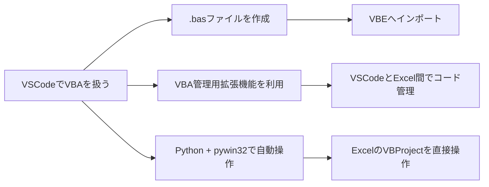
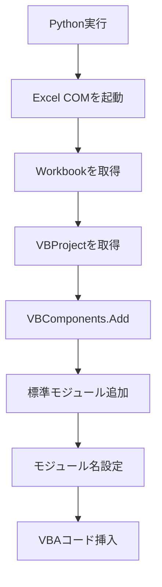

# VSCode上でVBAの新しいモジュールを作成する方法 ― チャットまとめ

このチャットでは、**VSCode上でVBAの新しいモジュールを作成・管理する方法**について確認した。

## 1. 質問内容

最初の質問は次の内容だった。

> XVBAを使用して、VSCode上で新しいVBAモジュールを作成するにはどうすればよいか。

これに対して、VSCodeでVBAを扱う方法として、主に以下の3つの方法を説明した。



## 2. `.bas` ファイルとして新しいモジュールを作る方法

最も基本的な方法として、VSCode上で**標準モジュールに相当する `.bas` ファイルを新規作成する**方法を説明した。

例えば、

```text
Module1.bas
```

というファイルを作成し、内容を次のようにする。

```vba
Attribute VB_Name = "Module1"
Option Explicit

Sub HelloWorld()

    MsgBox "Hello, VBA!"

End Sub
```

ここで、

```vba
Attribute VB_Name = "Module1"
```

は、VBAプロジェクトにインポートした際の**モジュール名**を表す。

VSCodeで作成した `.bas` ファイルをExcel側で使用する場合は、VBE（Visual Basic Editor）からインポートできる。

基本的な流れは次の通り。


## 3. VSCodeのVBA管理用拡張機能を使う方法

次に、VSCode側でVBAコードを管理するための拡張機能を利用する方法を紹介した。

この方式では、

- Excel側のVBAコードをVSCodeへ取り出す
- VSCodeで編集する
- 編集したコードをExcel側へ戻す

といった運用を行う。

つまり、単純に `.bas` をテキストファイルとして編集するだけでなく、

```text
Excel VBAプロジェクト
        ↓ Export
VSCode上のソースコード
        ↓ 編集
Excel VBAプロジェクト
        ↑ Import
```

という形で、VBAコードを通常のソースコードに近い形で管理できる。

### XVBAを使用する場合の考え方

今回の質問では「XVBA」と指定されていたため、本来の主題はこちらになる。

XVBAのようなVSCode向けVBA管理ツールを使用する場合でも、標準モジュールの実体は基本的に、

```text
*.bas
```

として管理される。

したがって、概念的には、

```text
新しい標準モジュール
    ↓
新しい .bas ファイル
    ↓
XVBAによってExcel VBAプロジェクトへ同期
```

という構造になる。

ただし、**前回の回答ではXVBA固有のコマンドや設定方法までは確認せず、一般的なVBA管理方法として説明していた**。そのため、実際に使用しているXVBA拡張機能の仕様に基づいた具体的な操作手順については、別途確認する必要がある。

## 4. Python + `pywin32` で新規モジュールを作る方法

VBAモジュールを手動ではなくプログラムから生成する方法として、WindowsのCOMオートメーションを利用する方法も紹介した。

Pythonの`pywin32`を使うと、ExcelのVBAプロジェクトに対して、

```python
vb_module = wb.VBProject.VBComponents.Add(1)
```

のように標準モジュールを追加できる。

例として紹介したコードは次のようなもの。

```python
import win32com.client

excel = win32com.client.Dispatch("Excel.Application")
excel.Visible = True

wb = excel.Workbooks.Add()

vb_module = wb.VBProject.VBComponents.Add(1)
vb_module.Name = "Module1"

vb_module.CodeModule.AddFromString("""
Sub HelloWorld()
    MsgBox "Hello from Python!"
End Sub
""")

wb.SaveAs(r"C:\path\to\your\file.xlsm")

wb.Close()
excel.Quit()
```

処理構造は以下になる。



この方法は、XVBAとは異なり、**ExcelのVBProjectそのものを外部プログラムから操作する方法**となる。

なお、この方式ではExcel側のセキュリティ設定として、VBAプロジェクトへのプログラムによるアクセスを許可する必要がある場合がある。

## 5. 3方式の違い

|方法|新規モジュールの実体|Excelへの反映|特徴|
|---|---|---|---|
|`.bas`を直接作成|`.bas`|VBEからインポート|最も単純|
|XVBA等のVSCode拡張|`.bas`等|拡張機能による同期|VSCode中心でVBAを管理しやすい|
|Python + `pywin32`|Excel内の`VBComponent`|COM経由で直接追加|自動化向け|

VBAを継続的にVSCode上で管理するのであれば、基本的な考え方は、

> **VBAモジュールを`.bas`などのソースファイルとして外部管理し、XVBAを利用してExcelブックと同期する**

という形になる。

## 6. 今回のチャットで残っている重要な点

今回の回答では、VSCodeとVBAの一般的な関係については整理できた一方で、最初の質問で指定されていた**XVBAそのものの操作方法**については十分に踏み込めていない。

特に確認すべきなのは次の部分。

- XVBAプロジェクト内で新しい標準モジュールを作成する正式な操作
- VSCodeのエクスプローラーから単純に`.bas`を追加すればよいのか
- XVBA専用コマンドからモジュールを追加するのか
- `.bas`追加後にExcelへ反映するためのXVBAのImport／Sync操作
- `Attribute VB_Name`を手動で記述する必要があるか
- XVBAプロジェクトのフォルダ構造に命名上の制約があるか

したがって、今回の内容を一言で整理すると、

> **VBAの標準モジュール自体は`.bas`としてVSCode上で作成できる。ただし、XVBAを利用しているのであれば、XVBA固有のプロジェクト構成・同期方法に従ってExcel側へ反映する必要があり、その具体的操作は今回まだ確認していない。**

という状態になっている。

### 現時点の整理

- **決定済み:** VSCode上では標準モジュールを`.bas`として扱える。
- **代替手段:** VBEへの手動インポート、Python/COMによる自動追加も可能。
- **未解決:** XVBA固有の「新規モジュール作成 → Excelへの同期」の正確な操作方法。
- **次に確認すべきこと:** 使用中のXVBA拡張機能の現行仕様に基づいて、新規`.bas`作成からExcelへの反映までを整理する。