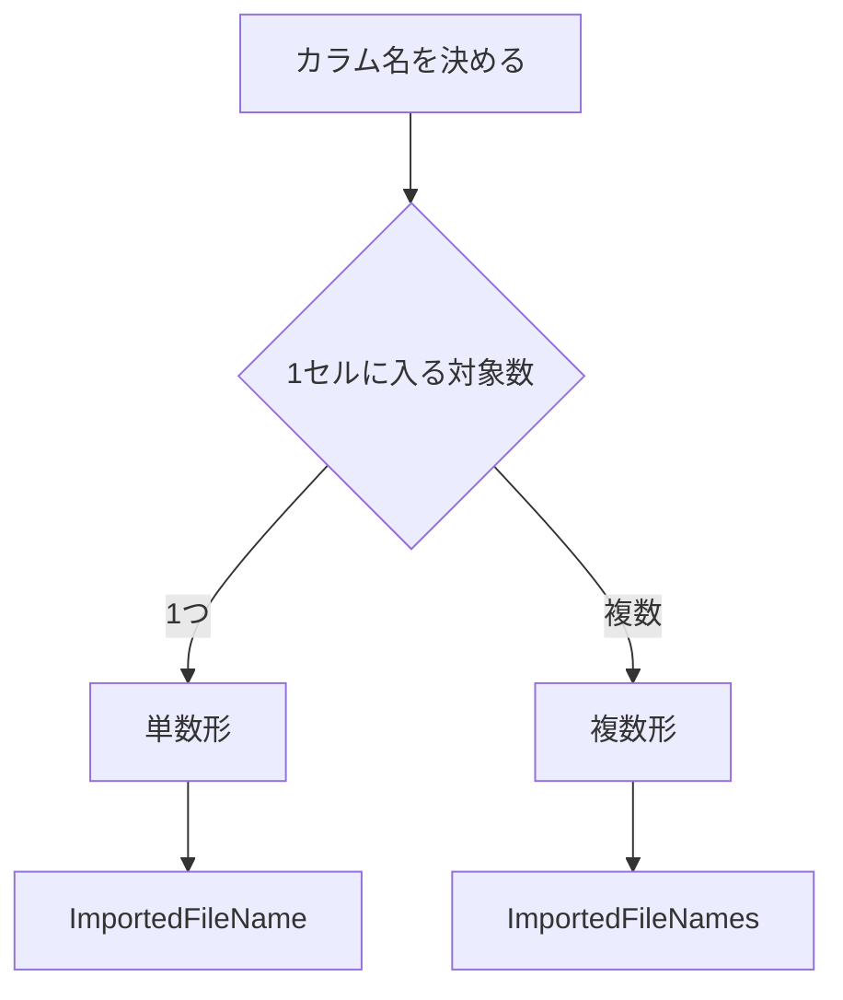
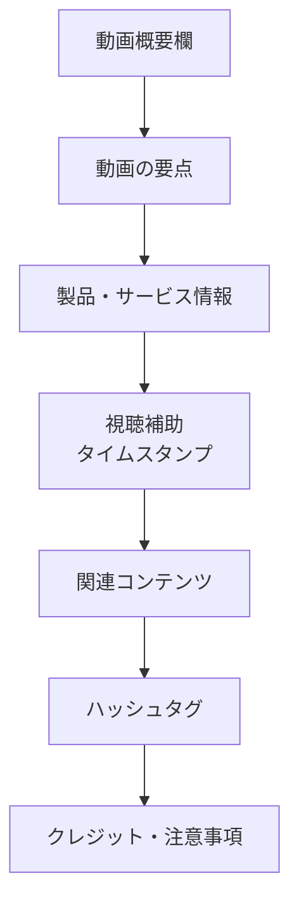

# チャット全体まとめ：命名規則・YouTubeハッシュタグ・概要欄デザイン

このチャットでは、大きく分けて次の3つのテーマを扱いました。

1. **データベース／Power Queryにおけるカラム命名**
2. **YouTubeハッシュタグの付け方と表示仕様**
3. **YouTube概要欄の構成・デザイン**

全体として、「名称や構造をどう設計すれば、意味が明確で一貫性があり、見る側にも使う側にも分かりやすいか」という共通テーマで進んでいます。

## 1. データベースのカラム名は単数形か複数形か

最初に、データベースのカラム名について、単数形・複数形のどちらを使うべきか確認しました。

基本的な考え方としては、**カラム名は単数形にするのが自然**です。

理由は、カラムが「各レコードの1つの属性」を表すためです。

|対象|一般的な命名|例|
|---|---|---|
|テーブル|複数形にすることが多い|`Users`, `Orders`, `Products`|
|カラム|単数形にすることが多い|`Name`, `Price`, `OrderDate`|

例えば、ユーザーテーブルに名前を保存するなら、

```text
Users
 ├─ UserId
 ├─ Name
 └─ Email
```

のように、テーブルは複数のユーザーを保持する集合なので `Users`、一方で各行には1人分の `Name` や `Email` が入るため、カラムは単数形になります。

ただし、これは絶対的な規則ではなく、最終的には**プロジェクト全体で命名規則を統一することが最重要**という整理になりました。

## 2. Power Queryの `ImportedFileName` は単数形でよいか

次に、Power Queryで複数ファイルを読み込み、それぞれの元ファイル名を保存するカラムを、

```text
ImportedFileName
```

とする場合に、`File` を複数形の `Files` にするべきかを確認しました。

結論は、**`ImportedFileName` のまま単数形が適切**です。

重要なのは、「クエリ全体で複数ファイルを扱っているか」ではなく、**そのカラムの1セルに何が入るか**です。

例えば次のようなテーブルの場合です。

|SalesDate|Amount|ImportedFileName|
|---|--:|---|
|2026-08-01|10000|sales_20260801.xlsx|
|2026-08-02|15000|sales_20260802.xlsx|
|2026-08-03|8000|sales_20260803.xlsx|

Power Query自体では複数ファイルを読み込んでいますが、各行の `ImportedFileName` には**1つのファイル名だけ**が格納されています。

そのため、

```text
ImportedFileName
```

が自然です。

一方、1セルの中に複数ファイル名をまとめて保存するような設計なら、

```text
ImportedFileNames
```

という複数形も考えられます。

この考え方は次のように整理できます。



つまり、**データ元の数ではなく、各フィールドが表現する概念の単位で命名する**のが基本です。

## 3. YouTubeハッシュタグの数と表示仕様

その後、話題をYouTubeへ移し、ハッシュタグについて確認しました。

使用していた例は次の5つです。

```text
#最強パテ #型枠補修 #金属補修 #補修剤 #エポキシパテ
```

ここでは、

- ハッシュタグは5個程度入れればよいのか
- そのうち3個までが目立つ位置に表示されるのか
- 実際には「後ろ3つ」が表示されたように見えたが、それが仕様なのか

という点を検討しました。

一般的には、説明欄などに設定したハッシュタグの一部が動画ページ上部に表示される仕組みがあります。

当初の整理では、基本的には**先頭側のハッシュタグが優先される想定**としました。

つまり、

```text
#最強パテ #型枠補修 #金属補修 #補修剤 #エポキシパテ
```

であれば、意図としては、

```text
#最強パテ
#型枠補修
#金属補修
```

を優先表示させたい並びになります。

ただし、実際に後ろ側の3つが表示されたのであれば、YouTube側の表示ロジックやUI、タイトル側のハッシュタグ、仕様変更などの影響があり得る、という整理でした。

ここで重要なのは、**必ずしも「5つ入力したら任意の先頭3つが確実にそのまま表示される」と断言できる仕様として扱わない方がよい**という点です。

実運用では、最も重要なタグを前に置いておくのが安全です。

今回の候補で優先度をつけるなら、例えば、

```text
#最強パテ #型枠補修 #エポキシパテ #金属補修 #補修剤
```

のように、ブランド名・用途・製品カテゴリを前方に配置する考え方ができます。

## 4. YouTube概要欄のデザイン案

最後に、YouTube動画の概要欄そのものをどのように設計するかを検討しました。

提案した構成は、単なる説明文ではなく、視聴者が必要な情報へすぐ移動できるよう、概要欄をいくつかの情報ブロックに分ける方式です。

基本構成は以下です。

|順番|セクション|役割|
|--:|---|---|
|1|キャッチフレーズ|最初の数行で動画内容を伝える|
|2|動画内容|何が分かる動画なのか説明|
|3|使用製品・リンク|商品情報や購入先へ誘導|
|4|タイムスタンプ|長い動画の目次|
|5|ハッシュタグ|検索・分類用途|
|6|関連動画・SNS|他コンテンツへの導線|
|7|クレジット・注意事項|素材表記や免責事項|

概要欄全体の情報導線は次のような構造です。



## 5. 提案した概要欄の具体例

最強パテのような製品紹介・施工動画を想定し、次のようなデザインを提案しました。

### 冒頭

最初の1〜2行では、長い説明をせず、動画を見るメリットを簡潔に示します。

例：

> プロの技術をあなたの手に。  
> 最強パテを使った型枠補修の方法を分かりやすく解説します。

YouTube概要欄は最初の数行しか最初から見えない場合があるため、ここには会社説明ではなく**動画の核心**を置く方が適しています。

### 動画内容

動画で分かることを短く整理します。

```text
この動画では、
・型枠補修の基本
・使用する補修材
・施工手順
・作業時のポイント

について紹介します。
```

文章だけよりも、この程度の短い箇条書きの方が視認性を高められます。

### 製品情報

製品紹介動画であれば、概要欄の重要な導線になります。

```text
【使用製品】
最強パテ
型枠・金属補修に使用できるエポキシ系補修材

製品詳細：
https://...
```

重要なのは、製品名だけで終わらず、

- 何の商品か
- 何に使えるのか
- 詳細を見る場所

をセットにすることです。

### タイムスタンプ

動画が長い場合には目次を入れます。

```text
【目次】
00:00 オープニング
01:30 型枠補修について
05:45 使用する材料
10:15 補修作業
15:00 まとめ
```

特に施工動画・解説動画とは相性がよい構成です。

### 関連情報

他の動画やWebサイトへの導線をまとめます。

```text
【関連情報】
公式サイト
https://...

関連動画
https://...
```

SNSを運用している場合は同じ場所にまとめてもよいですが、リンクが多すぎると概要欄が散漫になるため、必要なものだけに絞る考え方です。

### ハッシュタグ

最後にハッシュタグをまとめます。

```text
#最強パテ #型枠補修 #エポキシパテ #金属補修 #補修剤
```

本文の途中に散らすより、末尾にまとめる方が概要欄として整って見えます。

## 6. このチャットで整理された命名・設計の共通原則

一見するとPower QueryとYouTubeという別の話題ですが、今回の相談には共通した設計思想があります。

### 「対象全体」ではなく「その項目が何を表すか」で決める

Power Queryでは、

```text
複数ファイルを読み込む
↓
だから Files にする
```

ではありません。

各行には1ファイル名しか入らないので、

```text
ImportedFileName
```

とします。

YouTubeの概要欄でも同様で、情報を大量に並べるのではなく、

```text
動画の説明
製品情報
目次
関連情報
ハッシュタグ
```

のように、各ブロックが担う役割を明確にします。

### 一貫性を優先する

命名規則も概要欄も、単発で「正解の名前・正解の配置」を探すより、

> 同じ種類のものは同じ原則で設計する

ことが重要です。

今回の内容を簡略化すると、次の設計原則になります。


## 7. 現時点での結論

今回のチャットでの判断をまとめると、以下の通りです。

- データベース／Power Queryの**カラム名は基本的に単数形**と考える。
- 複数ファイルを読み込んでいても、各セルに1つのファイル名が入るなら **`ImportedFileName` が適切**。
- `ImportedFileNames` は、1つのフィールド自体が複数ファイル名を表す場合に使う。
- YouTubeのハッシュタグは多数入れすぎず、**重要なものを数個に絞る**運用が分かりやすい。
- 最重要タグは前方に配置しておく。
- 最強パテ動画なら、ブランド名・用途・製品カテゴリの優先度を考えて並べる。
- YouTube概要欄は文章を連続させるより、**動画概要 → 製品 → 目次 → 関連情報 → ハッシュタグ**のように情報ブロックとして設計する。
- 概要欄冒頭には会社説明よりも、**動画を見ることで何が分かるか**を置く。
- 全体を通して、「情報量を増やすこと」よりも「意味・役割・優先順位が一目で分かる構造」にすることを重視する。

今回の内容を今後の基準として使うなら、特に **Power Queryの命名規則** と **最強パテ用YouTube概要欄テンプレート** は、それぞれ独立したルールとして整理しておくと再利用しやすいです。