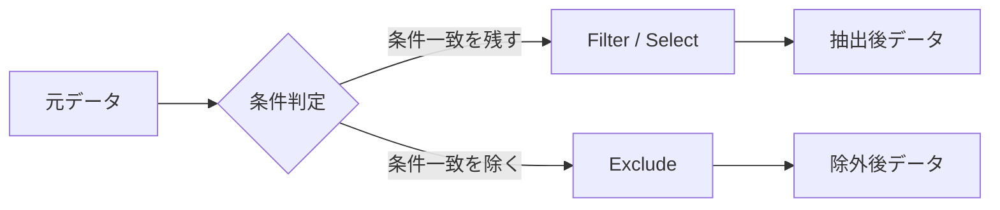

# フィルタリングにおける「抽出」と「除外」の意味・ネーミング整理

このチャットでは、「フィルタリング」という言葉が一般的に何を意味するのかを確認したうえで、プログラムや処理ステップの命名において、**条件に該当するものを残す処理**と**条件に該当するものを除く処理**をどう区別するか整理した。

## 1. 「フィルタリング」の一般的な意味

「フィルタリング（filtering）」は、厳密には**一定の条件に基づいてデータを選別する処理全体**を指す。

したがって、

- 条件に該当するものを**残す・抽出する**
- 条件に該当するものを**取り除く・除外する**

のどちらも、広い意味ではフィルタリングに含まれる。

ただし一般的な用法としては、どちらかといえば、

> **条件に一致したデータだけを残す・取り出す**

という意味で使われることが多い。

例えば、

```text
売上100万円以上をフィルタリングする
```

という表現なら、通常は

```text
売上 >= 1,000,000
```

に該当するデータを残す、つまり**抽出する**意味に理解されやすい。

一方、

```text
エラーのデータをフィルタリングする
```

という表現では、文脈次第で

- エラーデータを抽出する
- エラーデータを除外する

のどちらにも解釈できるため、処理名としては曖昧になりやすい。

## 2. 抽出と除外は名前を分けたほうがよい

プログラム、Power Query、VBAなどで処理名を付ける場合、単に `Filter` とすると、**条件一致データを残したのか、捨てたのかが名前だけでは分からない**。

そのため、処理方向を明示する名前を使うほうがよい。

|処理|意味|推奨する語|ニュアンス|
|---|---|---|---|
|抽出|条件に一致するものを残す|`Filter`|一般的なフィルタ|
|抽出|条件に一致するものを選択|`Select`|選択する意味が強い|
|抽出|条件に一致するものを取得|`Get`|取得結果を返す処理向け|
|除外|条件に一致するものを除く|`Exclude`|最も意味が明確|
|除外|条件に一致するものを取り除く|`Remove`|削除・除去の意味が強い|
|除外|条件に一致するものを省く|`Omit`|省略・対象外にするニュアンス|

## 3. 抽出するときのネーミング

条件に該当するデータを**残す**処理なら、以下の名前が候補になる。

### `FilterBy...`

最も標準的。

```text
FilterByStatus
FilterByDepartment
FilterByDateRange
```

例えば、

```text
FilterByStatus("Active")
```

なら、

> `Status = Active` のデータだけを残す

という意味に読める。

### `SelectBy...`

「選択する」という意味を明示したい場合。

```text
SelectByCategory
SelectByDepartment
SelectByProductCode
```

`Filter` よりも、「該当するものを選び出す」という意味が直接的。

### `GetBy...`

データを取得する関数として使う場合。

```text
GetByCustomerCode
GetByDateRange
GetByDepartment
```

例えば関数がテーブルや値を返すなら自然。

ただし、Power Queryのステップ名などでは `Get` より `Filter` や `Select` のほうが処理内容を表しやすい。

## 4. 除外するときのネーミング

条件に一致するデータを**取り除く**場合は、`Filter` 単独よりも `Exclude` などを使ったほうが明確。

### `ExcludeBy...`

最も推奨しやすい。

```text
ExcludeByStatus
ExcludeByCategory
ExcludeByDepartment
```

例えば、

```text
ExcludeByStatus("Inactive")
```

なら、

> `Inactive` のレコードを除外する

ことが名前だけで分かる。

### `RemoveBy...`

```text
RemoveByFlag
RemoveByStatus
RemoveByCondition
```

こちらも除外処理だと明確。

ただし `Remove` は、単なるフィルタというより、

> データそのものを削除する

という印象がやや強い。

そのため、元データを変更せず一時的に除外したテーブルを作るようなPower Queryでは、`Exclude` のほうが意味として自然な場合が多い。

### `OmitBy...`

```text
OmitByType
OmitByCategory
```

意味としては正しいが、プログラム上の命名では `Exclude` や `Remove` より使用頻度は低め。

「処理対象から省く」というニュアンス。

## 5. 推奨する基本ルール

今回の目的であれば、名称を増やしすぎず、次の2系統に統一するのが分かりやすい。



特にシンプルに統一するなら、

|処理|推奨|
|---|---|
|条件一致を残す|`FilterBy...`|
|条件一致を除外する|`ExcludeBy...`|

という組み合わせが最も対称的で分かりやすい。

例えば、

```text
FilterByDepartment
ExcludeByDepartment
```

とすれば、同じ「部署」を条件としていても処理方向が明確になる。

## 6. Power Queryのステップ名として考える場合

Power Queryでは、M言語上では抽出も除外も最終的には `Table.SelectRows` を使うことが多い。

例えば抽出なら、

```powerquery
Table.SelectRows(Source, each [Status] = "Active")
```

除外なら、

```powerquery
Table.SelectRows(Source, each [Status] <> "Inactive")
```

となる。

つまり、**使用している関数自体は同じでも、処理の意図は異なる**。

そのためステップ名では、

```text
FilteredActiveRows
```

と

```text
ExcludedInactiveRows
```

のように区別すると分かりやすい。

PascalCaseで統一するなら、

```text
FilterByStatus
ExcludeByStatus
```

あるいは結果を表すステップ名として、

```text
FilteredRows
ExcludedRows
```

などが扱いやすい。

## 結論

「フィルタリング」は本来、**条件に基づく選別処理全般**を意味するため、抽出にも除外にも使える。ただし日常的・一般的な理解としては、**条件一致データを残す＝抽出**の意味がやや強い。

そのため、プログラム上で曖昧さを避けるなら、

```text
抽出 → FilterBy...
除外 → ExcludeBy...
```

という命名ルールが最も分かりやすい。

`Select`、`Get`、`Remove`、`Omit` も用途によって使えるが、処理名の統一性を優先するなら、**Filter / Exclude の対**を基本とするのが適切。