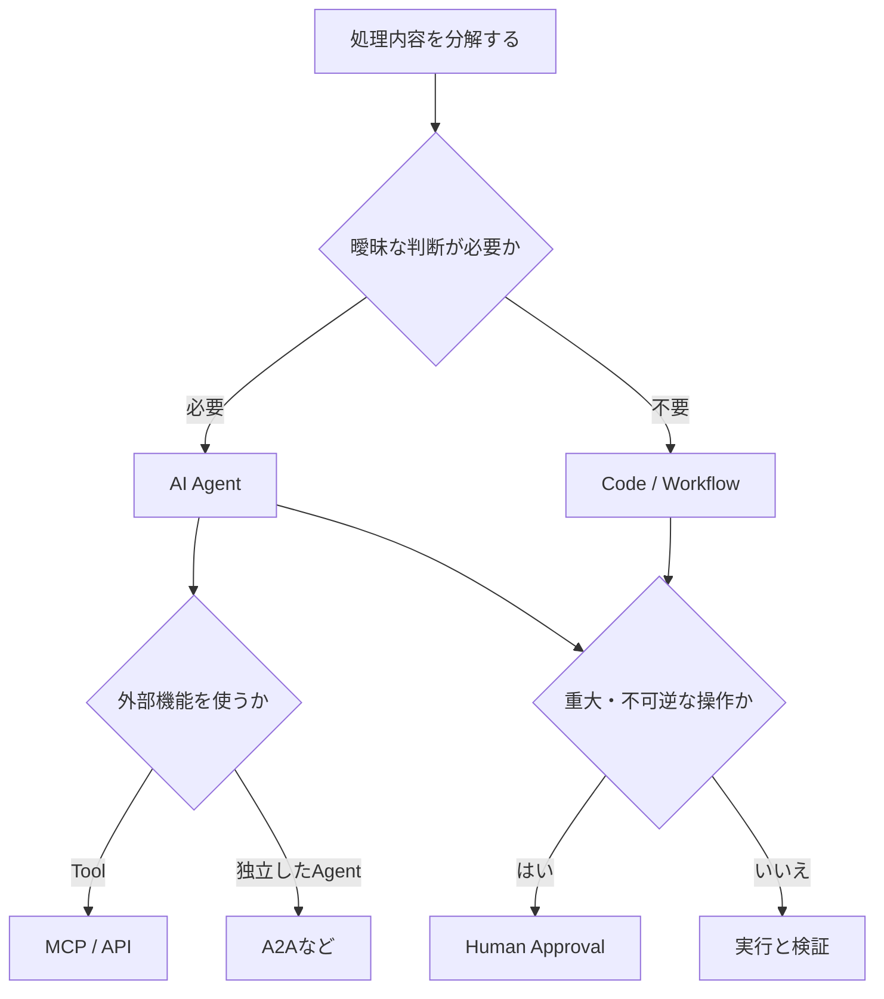

# AIサービス × 外部ツール連携・AIエージェント構築事例 Deep Research

> 調査基準日：2026年9月2日

このノートは、AIサービス、外部ツール、自動化、AIエージェントを組み合わせた実装事例を調べるための**調査設計書**である。調査結果や現行の推奨構成を記録したノートではない。目的は「AIでできそうなこと」を集めることではなく、実際に構築・検証された仕組みを比較し、個人または小規模環境へ転用できる設計パターンと技術選択の基準を得ることである。

調査では、接続した対象、使用したAI・モデル・API・SDK・プロトコル・ツール、構成、AIが担う処理、コードや設定の有無、現在の再現可能性、転用可能性を確認する。単に機能を紹介する記事やアイデア集ではなく、実装・検証の痕跡がある事例を優先する。

## 調査対象と比較の視点

対象は、次の領域を横断する。サービスや名称を並べること自体が目的ではなく、各事例を同じ比較軸で読めるようにする。

| 領域 | 主な対象 | 確認すること |
| --- | --- | --- |
| API直接連携 | OpenAI、Claude、Gemini、オープンウェイトLLM、Ollama、REST、Webhook、WebSocket、Serverless | アプリ・業務処理・自動化へどう組み込んだか |
| Agentと実行基盤 | Agents SDK、Claude Code、Google ADK、Microsoft Agent Framework、LangGraph、LangChain、CrewAI、LlamaIndex、Pydantic AI、Mastra | 判断、Tool選択、委譲、並列化、再開、ログ、権限をどう設計したか |
| 外部連携プロトコル | MCP、A2A、API、Plugin、Connector | Agent→ToolとAgent→Agentを混同せず、接続方式を選んだ理由を確認する |
| WorkflowとGUI操作 | n8n、Dify、Make、Zapier、Pipedream、Activepieces、Playwright、Selenium、Puppeteer、Computer Use、RPA | 定型処理をWorkflowやコードで担い、AIをどこに限定したか |
| 知識・ファイル連携 | Obsidian、Notion、Google Drive、Microsoft 365、Dropbox、GitHub、PDF、Office、RAG、File Search、Semantic Search | Source of Truthを保ったまま、検索・分類・更新・重複検出をどう行ったか |
| 開発・業務・個人運用 | Codex、Cursor、VS Code、GitHub Actions、Google Workspace、Slack、Notion、Jira、Linear、個人の情報管理 | ファイル編集、テスト、レビュー、文書生成、継続利用の運用負荷は何か |

特に、Skills／`SKILL.md`、`AGENTS.md`、Hooks、Plugins、Subagents、Background Task、Scheduled Agent、Checkpoint、Session Memory、Sandboxなど、長時間・反復的なAgent作業を安全に続けるための実行基盤を重視する。MCPについてはClientとServer、LocalとRemote、transport、認証、OAuth、Token、Scope、互換性、旧方式かどうかを確認する。

## 技術を選ぶための基本原則

Agentを使っていること自体を評価しない。曖昧な判断はAIへ委ねられるが、決定済みの処理は通常コードやWorkflowで扱う方がよい場合がある。重大または不可逆な操作には、人間による確認を残す。

この図は、すべての構成をAgent化するための手順ではない。各事例では、LLMが判断する部分、通常コード・決定的なWorkflowの部分、MCPやAPIで接続する部分、人間が承認する部分を分け、AgentやA2Aを使う必然性を評価する。失敗・撤去・簡素化の事例も対象に含める。

調べる失敗事例の例は、MCPからAPI直接接続への回帰、Multi-AgentからSingle Agentへの回帰、AgentからWorkflowへの回帰、RAGやベクトルデータベースの撤去、Browser Agentの不安定さ、自動化コストの増大、Tool増加による精度低下である。各事例について、当初の構成、導入理由、問題、最終構成、簡素な方式が優れた理由、他者への教訓を整理する。

## 情報源・鮮度・証拠の扱い

日本語圏ではQiita、Zenn、note、個人・企業技術ブログ、技術コミュニティ資料を起点とし、不足する領域は英語圏も調べる。情報源は、原則として次の順で扱う。

1. 公開コード、GitHubリポジトリ、README、Examples、Discussions
2. 詳細な構築手順、設定、構成図、実行結果を含む記事
3. 提供元の公式ドキュメント、公式サンプル
4. 実際に検証した技術ブログ、発表資料
5. Xなどの短文投稿。単独では根拠にせず、可能ならリンク先や公式情報で裏付ける

2026年の情報を最優先し、2025年を優先する。2024年は起点や現在も有効な代表事例に限り、2023年以前は原則として低優先とする。古い事例を扱う場合は、当時の実装、調査基準日時点で変わった点、現在の推奨構成を区別する。公開日だけでなく、最終更新日、リポジトリの最終commit、SDK・ライブラリの版、公式情報との整合も確認する。

終了・非推奨のAPI、旧SDK、旧Framework、旧MCP transport、後継へ統合された仕組みは、現行方式と混同しない。たとえば終了済み方式を事例として取り上げる場合は、歴史的な構成として位置付け、再現候補とは扱わない。

## 事例ごとに記録する項目

| 区分 | 記録する項目 |
| --- | --- |
| 出典と時点 | タイトル、情報源、URL、公開日、最終更新日、調査基準日時点の有効性 |
| 技術構成 | 使用AI・モデル、Agent／Framework、ツール、接続方式、使用技術、コードまたは設定の有無 |
| 実装内容 | 構築概要、システム構成、AIの役割、決定的処理、人間の判断・承認、自動化範囲、認証・権限 |
| 実用性 | 成果物、再現性、難易度、運用コスト、実際に起きた問題、別用途への応用可能性 |

再現性は、手順の具体性、ソースコードの有無、特殊な企業環境への依存、現行API・SDKの利用、個人での試行可能性で評価する。手順とコードが揃い個人でも試せるものを「高」、一部の設定や有料契約が必要なものを「中」、社内専用・コード非公開・旧API・詳細不明のものを「低」とする。

## 調査の進め方

1. 検索語をAPI、Agent、MCP、A2A、Workflow、Browser、Knowledge Management、Coding Agent、個人自動化に分けて探索する。起点には、`OpenAI Responses API`、`Claude Agent SDK`、`Google ADK`、`MCP Server`、`Streamable HTTP MCP`、`n8n AI Agent`、`Playwright MCP`、`Obsidian MCP`、`Codex automation`などを用いるが、この一覧に限定しない。
2. 候補を発見したら、実装の存在、技術構成、更新状況、個人・小規模環境での再現条件を確認する。同一プロジェクトの転載や派生記事は一つの事例へまとめる。
3. 事例を上の記録項目で比較し、Agent、Workflow、MCP、API、A2Aのどれが妥当かを評価する。料金、Token消費、Rate Limit、Retry、Timeout、Idempotency、Checkpoint、Queue、並列処理、観測可能性、Secret管理、Prompt Injection対策、外部通信制限も確認対象に含める。
4. 有力事例30〜50件程度を目安にしつつ、件数よりも質、再現性、実装価値を優先する。コードや設定例は、仕組みの理解に必要な最小限だけを示し、原文を大量に転載しない。

## 最終成果物の構成

最終成果物は情報源別の一覧ではなく、実装方式・用途別の設計パターン集とする。冒頭では2025〜2026年の変化と主要技術の関係を要約し、必要ならMermaidで技術マップを示す。本文では、API直接連携、MCP、Agent SDK／Harness、Multi-Agent／A2A、Workflow、Browser／Computer Use、Knowledge連携、Coding Agent、業務ツール連携、個人向け生産性システムを比較する。

そのうえで、失敗・撤去・簡素化事例、陳腐化した技術と後継、実現したいこと別の比較表、Agent／Workflow／MCP／API／A2A／Human Approvalの選択基準を独立して扱う。最後に、個人・小規模環境で再現価値が高い事例、複数技術を組み合わせた有望な構成、さらに深掘りするテーマ、情報源一覧を示す。

最終的に得たいのは、単なるAI事例集ではない。実際に検証された構成を材料に、どの処理にAIを使い、どこをコード・Workflow・MCP・API・A2A・人間の承認へ分けるべきかを判断できる、AI連携システムの設計パターン集・技術選択ガイドである。
